# Membria Docs (Combined)

## Оглавление

- [Документация Membria](#section-index)
- [Обзор технологий Membria (Membria Technology Overview)](#section-membria-technology-overview)
- [Архитектура Reasoning Graph](#section-rg-architecture)
- [Coding Superagent](#section-coding-superagent)
- [Архитектура Суперагента](#section-superagent-architecture)
- [Когнитивная безопасность и Файрвол искажений LLM](#section-cognitive-safety)
- [Причинно-следственная память](#section-causal-memory)
- [Управление архитектурой](#section-architecture-governance)
- [Краткий справочник по защите от искажений](#section-bias-defense-quickref)
- [ИТ-Архитектура и Стек](#section-it-architecture-stack)
- [Плейбук клиента](#section-quickstart)
- ['Клиентский слой: DBB и Decision Surface'](#section-development)
- [Слой Decision Intelligence - дорожная карта внедрения](#section-IMPLEMENTATION-ROADMAP)
- [Обзор](#section-membria-ce-overview)
- [Начало работы](#section-membria-ce-getting-started)
- [Концепции](#section-membria-ce-concepts)
- [Обзор клиента](#section-membria-ce-client)
- [RFC рантайма клиента](#section-membria-ce-client-runtime)
- [Эвристика DBB и маршрутизация LoRA](#section-membria-ce-dbb-and-lora-runtime)
- [Диаграммы рантайма](#section-membria-ce-diagrams)
- [Разделение системной архитектуры](#section-membria-ce-technical)
- [Децентрализованный бэкенд](#section-membria-ce-decentralized-backend)
- [KCG и гейтвеи (бэкенд)](#section-membria-ce-kcg-gateways)
- [Безопасность и конфиденциальность](#section-membria-ce-security-privacy)
- [Развертывание и хостинг](#section-membria-ce-deployment-hosting)
- [Обзор](#section-membria-smb-overview)
- [Начало работы](#section-membria-smb-getting-started)
- [Концепции](#section-membria-smb-concepts)
- [Decision Surface для SMB](#section-membria-smb-decision-surface)
- [Decision Black Box (DBB)](#section-membria-smb-decision-black-box)
- [Эвристика DBB (Decision Black Box)](#section-membria-smb-dbb-heuristics)
- [Обзор](#section-membria-ee-overview)
- [Начало работы](#section-membria-ee-getting-started)
- [Концепции](#section-membria-ee-concepts)
- [Институциональная память в корпоративном ИИ](#section-membria-ee-institutional-memory)
- [Decision Surface для Enterprise](#section-membria-ee-decision-surface-enterprise)

---


<!-- START /Users/miguelaprossine/documentation/docs-ru/index.mdx -->

## Документация Membria
<a id="section-index"></a>

> **Граф рассуждений для ИИ: объединение людей, команд и моделей**

---

## Введение

Membria — это **Граф рассуждений (Reasoning Graph) для ИИ**.

Она располагается между людьми, командами и моделями ИИ так, чтобы знания, рассуждения и решения не обнулялись после завершения каждого диалога.

Большинство систем ИИ по своей природе не имеют состояния (stateless).
Они отвечают, забывают и начинают заново.

Membria добавляет недостающий слой: **персистентный интеллект (persistent intelligence)**.

---

## Что такое Граф рассуждений

Граф рассуждений не заменяет чаты, документы или модели ИИ.

Он фокусируется на одной ключевой функции:

**сохранение того, что действительно важно для рассуждений и принятия решений во времени.**

Граф рассуждений Membria фиксирует и структурирует:

- Решения и их результаты (outcomes).
- Логику рассуждений (reasoning), стоящую за этими решениями.
- Предположения, ограничения и контекст.
- Связи между людьми, источниками и событиями.

Эта информация хранится в объяснимой и доступной для запросов форме, которую ИИ может использовать повторно вместо того, чтобы заново генерировать догадки.

---

## Почему этот слой необходим

Чаты перегружены шумом.
Документы статичны.
Модели мощны, но забывчивы.

Без персистентности (постоянства):

- Команды повторяют одни и так же дискуссии.
- Старые решения пересматриваются заново.
- Ответы ИИ лишены исторического контекста.
- Знания исчезают при уходе сотрудников.

Smart Persistence Layer (бизнес-описание слоя Reasoning Graph: он сохраняет решения, доказательства и outcomes во времени) гарантирует, что интеллект **накапливается, а не растворяется**.

---

## Как Membria реализует Граф рассуждений

Граф рассуждений Membria строится через набор скоординированных систем:

- **Decision Black Box (DBB)**
  Автоматически фиксирует решения из диалогов, документов и взаимодействий с ИИ.

- **Decision Surface (DS)**
  Делает решения видимыми, отслеживаемыми и управляемыми во времени.

- **Движок Decision Intelligence (DI)**
  Оптимизирует внимание пользователя с помощью ценности информации (VoI) и трекинга убеждений POMDP.

- **Память на основе графа**
  Сохраняет причинно-следственные связи, происхождение данных, временные шкалы и принадлежность.

- **Локальные и общие кэши знаний**
  Повторно используют прошлые рассуждения вместо генерации новых ответов.

- **Контролируемая эскалация**
  Обращается к более мощным моделям только тогда, когда этого требуют уровень уверенности или риски.

- **Децентрализованные бэкенды знаний**
  Обеспечивают персистентность в разных средах без централизации необработанных данных.

Вместе эти компоненты формируют **устойчивый скелет рассуждений (persistent reasoning backbone)**.

---

## Одна архитектура, три продукта

Все продукты Membria используют один и тот же слой Reasoning Graph (Smart Persistence Layer как бизнес-описание), адаптированный под разные границы доверия и среды.

Разница не в том, *что именно* запоминается,
а в том, **кто этим владеет, как это управляется и где это работает**.

---

## Обзор редакций Membria

> Визуальные маркеры используются вместо цветов для обеспечения совместимости с различными инструментами рендеринга Markdown.

| Функция | Membria CE (Персональная) | Membria для SMB (SaaS) | Membria EE (Enterprise) |
| --- | --- | --- | --- |
| **Основной пользователь** | Продвинутые пользователи | Малые и средние команды | Корпорации, банки, телеком |
| **Основная цель** | Непрерывность личных рассуждений | Общий контекст команды | Институциональная память |
| **Модель развертывания** | Local-first и самохостинг | Управляемый SaaS | On-premise или частное облако |
| **Владение данными** | Принадлежат пользователю | Принадлежат организации | Принадлежат корпорации |
| **Место хранения по умолчанию** | Локальная среда | Управляемое облачное пространство | Инфраструктура под контролем заказчика |
| **Слой персистентности** | Личный граф рассуждений | Граф общего пространства | Приватный институциональный граф |
| **Decision Black Box (DBB)** | Захват личных решений | Захват на уровне команды | Корпоративный уровень с управлением |
| **Decision Surface (DS)** | Личные сигналы и дрейф | Видимость в рамках команды | Корпоративный уровень контроля |
| **Масштаб графа знаний** | Один пользователь | Пространство или команда | Мультидоменный, с изоляцией политик |
| **Использование LoRA** | Личные LoRA навыков | LoRA в рамках команды | Одобренные экспертные LoRA |
| **Управление LoRA** | Контроль пользователем | Политики рабочего пространства | Ревью, одобрение, откаты |
| **Исполнение моделей** | Сначала локальные модели | Управляемые модели | Одобренный стек моделей заказчика |
| **Поведение при эскалации** | Опционально, видно пользователю | Бюджетируется на пространство | На основе политик и аудита |
| **Децентрализованный бэкенд** | Опционально | Управляемый | Приватный или федеративный |
| **Логи аудита** | Локальные, видны пользователю | На уровне пространства | Неизменяемые, для комплаенса |
| **Соответствие (Compliance)** | Личная приватность | Легкое управление | Регуляторное (AML, SOX, GDPR) |
| **Типичные кейсы** | Личные исследования, эксперименты | Общие решения, онбординг | Риски, комплаенс, управление |

---

## Как выбрать

- Выбирайте **Membria CE**, если вам нужен персональный ИИ, который помнит, как думаете именно *вы*.
- Выбирайте **Membria для SMB**, если вашей команде нужен общий контекст без корпоративной сложности.
- Выбирайте **Membria EE**, если вы работаете в регулируемых отраслях и требуете полного контроля, аудируемости и управления.

---

## Основная идея

ИИ должен не только отвечать на вопросы.

Он должен помнить, **как и почему принимались решения**.

Граф рассуждений Membria делает это возможным.

<!-- END /Users/miguelaprossine/documentation/docs-ru/index.mdx -->


<!-- START /Users/miguelaprossine/documentation/docs-ru/membria-technology-overview.md -->

## Обзор технологий Membria (Membria Technology Overview)
<a id="section-membria-technology-overview"></a>

> Институциональная память на базе ИИ для принятия более качественных решений.

## Что такое Membria

Membria — это Интеллектуальный слой персистентности (Smart Persistence Layer) для корпоративного ИИ. Она объединяет людей, команды и модели ИИ так, чтобы знания, рассуждения и решения не обнулялись после завершения диалога.

Большинство систем ИИ не имеют состояния (stateless). ИИ отвечает, забывает и начинает заново.

Membria — это недостающий слой: **персистентный интеллект принятия решений (persistent decision intelligence)**.

---

## Основная проблема

### «Черная дыра» решений (The Decision Black Hole)

Ежедневно команды принимают сотни решений в Slack, по электронной почте, на встречах и в документах. Через несколько недель:

- **Никто не помнит**, что именно было решено.
- **Контекст утерян** — почему мы выбрали именно это?
- **Результаты оторваны от реальности** — сработало ли это?
- **Одни и те же дискуссии повторяются**, тратя время и энергию.

Традиционное управление знаниями фиксирует документы, а не решения. Инструменты поиска находят информацию, а не логику рассуждений. ИИ-ассистенты отвечают на вопросы, но мгновенно забывают их.

### Цена проблемы

| Проблема | Влияние на бизнес |
|---------|-----------------|
| Повторное обсуждение решенных вопросов | Трата 15-20% времени совещаний |
| Утерянные обязательства | Нарушение сроков, подрыв доверия |
| Отсутствие отслеживания результатов | Повторение ошибок, отсутствие обучения |
| Потеря контекста при смене сотрудников | 3-6 месяцев на восстановление знаний |

---

## Решение Membria

### Интеллектуальный слой персистентности

Membria находится между вашими инструментами коммуникации и коллективным интеллектом вашей команды:

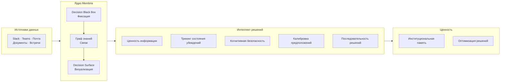

### Три основных компонента

#### 1. Decision Black Box (DBB)

Движок автоматической фиксации, который отслеживает коммуникации команды и извлекает:

- **Решения (Decisions)** — сделанный явный выбор.
- **Обязательства (Commitments)** — обещания с ответственными и сроками.
- **Предположения (Assumptions)** — основополагающие убеждения, стоящие за решениями.
- **Альтернативы (Alternatives)** — варианты, которые рассматривались и были отклонены.

DBB создает неизменяемые записи: оригинальная логика рассуждений сохраняется до того, как результаты (outcomes) смогут исказить память (предотвращение «искажения задним числом» — hindsight bias).

#### 2. Граф знаний (GraphRAG)

Объединяет решения в персистентную сеть рассуждений:

- **Временные связи** — как решения эволюционировали со временем.
- **Каузальные цепочки** — какие решения привели к каким результатам.
- **Зависимости** — что блокирует что.
- **Паттерны** — повторяющиеся типы решений и их результаты.

В отличие от документоориентированных баз знаний, граф Membria структурирован вокруг решений как объектов первого класса.

#### 3. Decision Surface (DS)

Живой дашборд решений команды, отображающий:

- **Открытые циклы (Open Loops)** — обсуждения без финала.
- **Обязательства (Commitments)** — данные обещания, приближающиеся дедлайны.
- **Решения на паузе (Decisions Pending)** — ожидающие согласования.
- **Дрейф предположений (Assumption Drift)** — контекст изменился, решение может быть неактуальным.
- **Трекинг результатов (Outcome Tracking)** — что сработало, а что нет.

---

## Глубокое погружение в Decision Surface

### Что отображается на дашборде

Decision Surface превращает необработанные данные в действенные сигналы:

| Сигнал | Описание | Пример |
|--------|-------------|---------|
| **Открытые циклы** | Дискуссии без явного финала | «Стратегия ценообразования обсуждалась 3 раза, решение не зафиксировано» |
| **Обязательства** | Обещания с ответственными и сроками | «@sarah: предоставить предложение к пятнице» |
| **Решения на паузе** | Приняты, но ждут одобрения | «Выбран новый вендор, ожидается подпись CFO» |
| **Дрейф предположений** | Тема та же, лексика изменилась | «В январе говорили о 'росте', в марте о 'сокращении затрат' — решения о смене курса нет» |
| **Блокировка** | Решения ждут завершения зависимостей | «Запуск заблокирован юридическим ревью (12 дней)» |
| **Скрытые разногласия** | Поверхностное согласие скрывает неуверенность | «Решение помечено как 'консенсус', но уверенность в убеждениях всего 40%» |

### Как это работает

Decision Surface не читает чаты напрямую. Он визуализирует только структурированные сигналы от Decision Black Box:

1. **Фиксация (Capture)** — DBB извлекает сигналы решений из диалогов.
2. **Структурирование (Structure)** — Сигналы становятся неизменяемыми записями решений.
3. **Связывание (Connect)** — Граф знаний связывает похожие решения.
4. **Отображение (Surface)** — DS показывает, что требует внимания прямо сейчас.

### Взаимодействие с пользователем

Decision Surface — это слой ревью и ориентации, а не менеджер задач:

- **Кликните** на любое решение для получения полного контекста.
- **Добавляйте** исходы, когда результаты становятся известны.
- **Помечайте** решения как замененные или решенные.
- **Связывайте** решения с новыми задачами или продолжением работы.

Обслуживание не требуется. Система обновляется автоматически.

---

## Слой интеллекта решений (Decision Intelligence Layer)

Помимо реактивного мониторинга, Membria добавляет прогностический и оптимизирующий интеллект на базе алгоритмов теории принятия решений.

### 1. Ценность информации (Value of Information, VoI)

**Функция:** Оценка «Открытых циклов» и «Решений на паузе» по степени их влияния в случае разрешения.

```
VoI(Decision D) = E[полезность | решение с доп. информацией]
                - E[полезность | решение без информации]
                - стоимость(сбора информации)
```

**Пример:**
```
Открытый цикл "Ценовая стратегия": VoI = $180k
  → Ошибка в цене: потеря выручки $180k в год
  → Сбор рыночных данных: стоит $5k, занимает 3 дня
  → Рекомендация: ПРИОРИТЕТ (высокое влияние, ясный ROI информации)

Открытый цикл "Формат встреч": VoI = $2k
  → Ошибка в формате: влияние на продуктивность $2k
  → Рекомендация: ОТЛОЖИТЬ (низкое влияние, решить позже)
```

**Преимущество:** Приоритизация решений по их влиянию, а не по срочности или должности. Дашборд говорит лидерам: «Разрешите цикл №7 в первую очередь — он стоит $180 000».

---

### 2. Трекинг состояния убеждений (POMDP)

**Функция:** Детекция «скрытых разногласий» — когда команда кажется согласной, но уверенность системы в этом низка.

**Принцип работы:**
- Извлекает сигналы из всех коммуникаций (явные согласия, молчание, уточняющие вопросы, противоречивые действия после обсуждения).
- Ведет распределение убеждений: P(истинный консенсус | наблюдаемые сигналы).
- Обновляет вероятности по мере поступления новых свидетельств.

**Пример:**
```
Решение: "Нанять 5 инженеров во втором квартале"
Наблюдаемые данные:
  - 3 явных "согласен"
  - 1 человек промолчал
  - 2 скептических уточняющих вопроса
  - 0 созданных вакансий или задач по найму

Распределение убеждений:
  - Истинный консенсус: 40%
  - Только поверхностное согласие: 35%
  - Фундаментальное непонимание: 25%

⚠️ Оповещение: Низкая уверенность в согласии команды (40%)
    Рекомендация: вернуться к явному обсуждению.
```

**Преимущество:** Предотвращение решений, которые *кажутся* принятыми, но провалятся при исполнении. Выявление разногласий до того, как они начнут стоить времени и доверия.

---

### 3. Калибровка предположений

**Функция:** Отслеживание уверенности в предположениях и обновление убеждений на основе реальных результатов.

**Принцип работы:**
- Каждое решение фиксирует уровень уверенности: «Мы на 75% уверены в этом вендоре».
- Позже фиксируется исход: «Вендор справился» или «Вендор подвел».
- Байесовское обновление: уверенность корректируется в соответствии с реальностью.
- Выявление паттернов: «Вы переоцениваете надежность вендоров на 15%».

**Пример:**
```
Предположение: "Вендор X надежен" (уверенность 75%)
Исходы за 12 месяцев:
  - 3 успешных проекта
  - 1 провал (нарушен дедлайн)

Обновленное убеждение: уверенность 76% (Бета-распределение: 4 успеха, 1 провал)
Паттерн: Уверенность была хорошо откалибрована.

vs.

Предположение: "Найм X будет успешным" (уверенность 85%)
Исходы за 12 месяцев:
  - 5 сотрудников уволились в течение 6 месяцев

Обновленное убеждение: уверенность 20%
Паттерн: Команда значительно переоценивает успех в решениях по найму.
```

**Преимущество:** Выявление систематических искажений (biases). Возможность тонкой настройки (LoRA) моделей принятия решений на основе реальных данных калибровки.

---

### [NEW] 4. Cognitive Safety Layer (Слой когнитивной безопасности)

**Функция:** Защита от когнитивных искажений (Bias) и галлюцинаций через "System 2 Thinking".

**Компоненты:**
1.  **Bias Firewall:** Проверка входящих решений на известные искажения (Confirmation Bias, Sunk Cost Fallacy).
2.  **Resonance Detection:** Если ИИ слишком быстро и уверенно соглашается с человеком (Resonance Score > 0.6) — это подозрительно. Система принудительно включает проверки.
3.  **Debiasing Interventions:** Активное вмешательство. Например, если обнаружено "якорение" (Anchoring), система предложит: "Рассмотрите 3 альтернативы перед утверждением".

**Преимущество:** ИИ не просто "кивает" человеку, а выступает в роли "Адвоката дьявола", повышая качество мышления.


---

### 4. Оптимизатор последовательности решений (Priority Queue)

**Функция:** Рекомендация оптимального порядка зависимых решений для минимизации блокировок на основе приоритетов и неопределенности.

**Принцип работы:**
- Анализирует граф зависимостей решений.
- Использует **Очередь с приоритетом (Priority Queue)** вместо MCTS-симуляций по умолчанию.
- Оценивает решения по формуле: `Score = (VoI * Срочность) / Длительность * Множитель_Неопределенности`.
- Рекомендует порядок, который максимизирует ценность (VoI) в единицу времени.

**Пример:**
```
Решения и зависимости:
  D1: Техстек → блокирует D2, D3, D4 (Score: 88)
  D5: Бюджет → блокирует D1, D6 (Score: 95 - Критический путь)
  D7: Выбор вендора → блокирует D8 (Score: 45)

Текущий подход (FIFO):
  D1 → заблокировано в ожидании D5 → общее время: 6 недель

Оптимизированная последовательность (Priority Queue):
  D5 (95) → D1 (88) → [D2, D3, D4, D6, D7 параллельно] → общее время: 3 недели

Рекомендация: Решите вопрос с бюджетом (D5) немедленно — критический блокиратор.
```

**Преимущество:** Быстрое и прозрачное устранение «бутылочных горлышек». Алгоритм понятен человеку и работает мгновенно.

---

### 5. Трекинг результатов и обучение в реальном времени

**Функция:** Связывание исходов с оригинальными решениями и их использование для улучшения будущих прогнозов.

**Принцип работы:**
- Когда исход решения становится известен, система фиксирует: прогноз vs реальность.
- Агрегирует данные калибровки по типам решений.
- Идентифицирует паттерны: какие команды хорошо калиброваны, какие решения систематически проваливаются.
- Настраивает скоринг уверенности на основе эмпирических данных.

**Пример:**
```
База данных решений:
  - Продуктовые решения: калибровка 87% (прогнозы совпадают с реальностью)
  - Решения по найму: калибровка 62% (избыточная уверенность)
  - Решения по вендорам: калибровка 91%

Калибровка команд:
  - Команда А: 84% (хорошая калибровка, их уровню уверенности можно доверять)
  - Команда Б: 71% (переоценивают успех примерно на 15%)

Обучение для будущих решений:
  - Когда Команда Б принимает решение с уверенностью 80%,
    система корректирует её до 65% на основе паттерна калибровки.
```

**Преимущество:** Команда учится на накопленных свидетельствах. Интеллект решений улучшается со временем через циклы обратной связи на основе данных.

---

## Принципы работы ИИ

### Интеллект на основе свидетельств

ИИ Membria следует строгим эпистемическим правилам. Все выводы подкрепляются прослеживаемыми свидетельствами:

**Формат:**
```
[Инсайт] → [Свидетельства: источники, даты, количество]
```

**Правильный пример:**
> «Проект X демонстрирует паттерн риска: 3 нарушенных обязательства, 2 изменения предположений, отсутствие обновленных решений в течение 30 дней».

**Неправильный пример:**
> «Команда не верит в Проект X».

### Чего ИИ никогда не делает
- Психологические догадки («чувствует разочарование», «демонстрирует отчужденность»).
- Личностные оценки («является блокиратором», «токсичный сотрудник»).
- Необоснованные предсказания («проект провалится»).

### Что ИИ делает всегда
- Ссылается на конкретные свидетельства.
- Использует осторожные формулировки («паттерн предполагает», «основываясь на данных за последние 14 дней»).
- Отделяет наблюдения от интерпретации.

---

## Корпоративные возможности

### Видимость на основе ролей

Разные роли видят разный масштаб на Decision Surface:

| Роль | Что видит | Чего не видит |
|------|------|-------------|
| **Рядовой сотрудник** | Свои решения, полный контекст, связанные решения | Логику рассуждений других людей |
| **Директор** | Агрегированные данные команды, паттерны, алерты | Детали рассуждений отдельных сотрудников |
| **C-level** | Метрики компании, зависимости между командами | Детали (кроме случаев активации триггеров) |

### Принципы приватности

1. **Рассуждения приватны** — только владелец решения видит процесс своих размышлений.
2. **Результаты общие** — исходы видны всей команде.
3. **Сигналы видимы** — каждый знает, что решение существует.
4. **Агрегация важнее обнажения** — лидеры видят паттерны, а не подноготную.
5. **Доступ по триггерам** — детальный просмотр требует обоснования.

### Детекция противоречий (Tensions Detection)

Автоматическое выявление скрытых разногласий в команде:

- **Бимодальный анализ** — одна тема, два противоположных подхода.
- **Дрейф предположений** — смена лексики без явного решения.
- **Противоречивые обязательства** — работа в разных направлениях над одной задачей.

Пример оповещения:
```
⚠️ Обнаружено противоречие: "План по найму на Q2"
Команда разделилась в подходах к реализации.
Явного решения, устраняющего разрыв, нет.
Рекомендация: вынести на открытое обсуждение.
```

### Аудит и комплаенс
- Неизменяемые записи решений с временными метками.
- Полная цепочка происхождения данных (источник → фиксация → решение).
- Воспроизводимый анализ (алгоритмы с фиксированным сидом).
- Экспорт данных для регуляторных требований.

---

## Варианты использования (Use Cases)

### Случай 1: Масштабирование стартапа (5 → 50 человек)

**Проблема:**
Ранние решения жили в головах фаундеров. По мере роста команды контекст терялся. Новые сотрудники принимали решения, противоречащие старым, сами того не зная.

**Решение:**
Membria фиксировала решения с первого дня. Когда пришел 30-й сотрудник, он смог увидеть:
- Почему был выбран именно этот техстек.
- Какие модели монетизации были отклонены и почему.
- Какие партнерства уже прорабатывались.

**Результат:**
- Время онбординга сократилось на 40%.
- Ноль моментов в стиле «мы это уже пробовали».
- Согласованность решений во всех командах.

---

### Случай 2: Синхронизация удаленной команды

**Проблема:**
Распределенная команда в 4 часовых поясах. Решения принимались в разных каналах Slack и никогда не консолидировались. Еженедельные планерки уходили на восстановление контекста.

**Решение:**
Decision Surface предоставил единый вид на все решения команды. Открытые циклы видны всем. Обязательства отслеживаются автоматически.

**Результат:**
- Совещания сократились с 60 до 25 минут.
- Показатель выполнения обязательств вырос на 35%.
- Вопросы «на чем мы остановились по X?» исчезли.

---

### Случай 3: Скорость продуктовой команды

**Проблема:**
Продуктовые решения разбросаны по Jira, Slack, Notion и почте. Менеджеры тратили часы на воссоздание истории решений для стейкхолдеров.

**Решение:**
Membria объединила все источники. Каждое решение по фиче связано с оригинальным обсуждением, рассмотренными альтернативами и результатом после релиза.

**Результат:**
- Время на «археологию решений»: с 2 часов до 5 минут.
- Рост доверия стейкхолдеров (прозрачный аудит).
- Ускорение пост-мортемов за счет полного контекста.

---

### Случай 4: Инвестиционный комитет

**Проблема:**
Инвестиционные решения принимались на встречах. Спустя месяцы было неясно, почему сделка была одобрена или отклонена. «Искажение задним числом» мешало обучению.

**Решение:**
DBB фиксировал логику до принятия решения с указанием уровней уверенности. Результаты привязывались позже без изменения оригинального тезиса.

**Результат:**
- Видимость реальной «точности попаданий» (а не воссозданной памяти).
- Детекция паттернов: «Мы переоцениваем родословную фаундеров».
- Точность прогнозов (калибровка) выросла на 20% за 18 месяцев.

---

### Случай 5: Комплаенс и аудит

**Проблема:**
В регулируемой отрасли требовалось документирование решений. Ручной процесс был непоследовательным, неполным и вызывал отвращение у команды.

**Решение:**
Membria автоматически фиксировала решения со всеми источниками. Неизменяемые записи удовлетворили требованиям аудита.

**Результат:**
- Время на подготовку к аудиту сократилось на 80%.
- Ноль пробелов в документации.
- Команда реально пользовалась системой (так как не было лишней работы).

---

### Случай 6: Интеграция при слияниях и поглощениях (M&A)

**Проблема:**
Покупающая компания должна была понять, как целевая компания принимала решения. Различия в культуре и процессах были неясны.

**Решение:**
Граф решений Membria раскрыл:
- Как на самом деле текли решения (в отличие от оргсхемы).
- Где реально находились центры влияния.
- Повторяющиеся противоречия и паттерны.

**Результат:**
- План интеграции на основе реальности, а не предположений.
- Ключевые лица, принимающие решения, идентифицированы и сохранены.
- Культурные разрывы устранены проактивно.

### Сценарий 7: Управление CLI-агентами (Claude Code) через Causal Layer

**Проблема: «Регрессия мудрости» и галлюцинации здравого смысла.**
CLI-агенты, такие как Claude Code, предлагают решения, основываясь на «общем здравом смысле» LLM. Но этот смысл часто противоречит реальному опыту конкретного проекта. Агент может предложить паттерн, который уже был отвергнут из-за сбоев в продакшене, тратя ресурсы на «Регрессию Мудрости».

**Решение: Membria CE как каузальный контроллер.**
Membria CE перехватывает предложения агента и проводит **Causal Conflict Check** (Проверку на каузальный конфликт) через FalkorDB:
1.  **Vector Match:** Сопоставляет вектор рассуждения агента с историческими предположениями в локальном графе.
2.  **Negative Artifact Collision:** Определяет, не совпадает ли предложение с артефактом «Негативного знания» (доказанным провалом).
3.  **Debias Intervention:** Membria выдает системное оповещение: *«Стоп. Твое рассуждение совпадает с гипотезой, которая оказалась ложной в PR #123 (Исход: регрессия производительности). Вес связи: 0.05. Пересмотри решение на основе каузальной памяти».*

**Результат:**
- **Защита от повторных ошибок:** Предотвращает ситуацию «дня сурка», когда агент повторяет прошлые ошибки проекта.
- **Детерминированные ограждения:** Заменяет догадки LLM структурными доказательствами из Графа Рассуждений.
- **Ускорение разработки:** Агенты тратят 0% времени на пути, которые уже были признаны тупиковыми.

---

## Техническая архитектура

Архитектура Membria спроектирована для высокопроизводительных рассуждений с использованием гибридного подхода к хранению.

#### Графовая память: FalkorDB
Ядро Графа рассуждений работает на базе **FalkorDB**, что обеспечивает:
- **Низкозадержечные обходы:** использование GraphBLAS для высокоскоростного анализа связей.
- **Язык запросов Cypher:** стандартизированный, высокопроизводительный доступ к цепочкам решений.
- **Redis-based персистентность:** сочетание скорости оперативной памяти с надежным хранением.

### Варианты развертывания

| Опция | Описание | Кому подходит |
|--------|-------------|----------|
| **SaaS** | Управляемое облако, мультиарендность | Малый бизнес, стартапы, удаленные команды |
| **Enterprise Cloud** | Выделенный инстанс | Средний бизнес, требования к локализации данных |
| **On-Premise** | Self-hosted, полный контроль | Банки, госсектор, регулируемые отрасли |

### Интеграции

**Коммуникации:**
- Slack
- Microsoft Teams
- Почта (Gmail, Outlook)
- Zoom (транскрипты встреч)

**Документация:**
- Notion
- Confluence
- Google Docs
- SharePoint

**Управление задачами:**
- Jira
- Linear
- Asana
- Monday

**Кастомные:**
- REST API
- Webhooks
- SSO (SAML, OIDC)

### Обработка данных

```mermaid
flowchart LR
    input["Сырые данные<br/>Чаты, доки, встречи"] --> extract["Извлечение DBB<br/>Сигналы решений"]
    extract --> structure["Структура<br/>Неизменяемые записи"]
    structure --> g_graph["GraphRAG<br/>Связи и индексация"]
    graph --> surface["Decision Surface<br/>Визуализация"]

    outcome["Результаты<br/>(добавляются позже)"] --> link["Связь с записью<br/>(только добавление)"]
    link --> g_graph

    graph --> voi["Ценность информации<br/>Вес влияния"]
    graph --> belief["Состояние убеждений<br/>Уверенность в консенсусе"]
    graph --> calib["Калибровка предположений<br/>Обновление убеждений"]
    graph --> seq["Последовательность решений<br/>Оптимизация порядка"]

    voi --> surface
    belief --> surface
    seq --> surface

    outcome --> calib
    calib --> learn["Модель обучения<br/>Паттерны калибровки"]
```

### Приватность и безопасность

- **Шифрование:** AES-256 при хранении, TLS 1.3 при передаче.
- **Контроль доступа:** На основе ролей (RBAC), логирование аудита.
- **Локализация данных:** Региональные опции (зависит от тарифа).
- **Комплаенс:** Спроектировано для работы в режиме SOC 2/GDPR/HIPAA-aligned (зависит от области внедрения).
- **Хранение:** Настраиваемые сроки хранения с безопасным удалением.

---

## Сравнение

### Membria против традиционных баз знаний (KM)

| Аспект | Традиционные KM | Membria |
|--------|----------------|---------|
| Единица хранения | Документ | Решение |
| Метод фиксации | Ручной | Автоматический |
| Структура | Папки/теги | Граф знаний |
| Трекинг результатов | Нет | Да |
| Защита от hindsight bias | Нет | Да |
| Показ нерешенных вопросов | Нет | Да |

### Membria против ИИ-ассистентов

| Аспект | ChatGPT / Copilot | Membria |
|--------|-------------------|---------|
| Память | В рамках диалога | Персистентная |
| Знает о ваших решениях | Нет | Да |
| Трекинг результатов | Нет | Да |
| На уровне всей команды | Нет | Да |
| На основе свидетельств | Иногда | Всегда |
| Приоритет по влиянию | Нет | Да (VoI) |
| Детекция разногласий | Нет | Да (POMDP) |
| Защита от Bias | Нет | Да (Safety Layer) |
| Обучение на калибровке | Нет | Да |
| Предложение порядка решений| Нет | Да (Priority Queue) |

### Membria против Task-менеджеров

| Аспект | Jira / Asana | Membria |
|--------|--------------|---------|
| Объект трекинга | Задачи | Решения |
| Фиксация логики (reasoning) | Нет | Да |
| Автодетекция из чатов | Нет | Да |
| Дрейф предположений | Нет | Да |
| Измерение качества решений | Нет | Да |
| Приоритет по VoI | Нет | Да |
| Скрытые разногласия | Нет | Да (POMDP) |
| Когнитивная безопасность | Нет | Да (Bias Firewall) |
| Обучение на калибровке | Нет | Да |
| Предложение порядка решений| Нет | Да (Priority Queue) |
| Обучение на данных | Нет | Да |

---

## С чего начать

### SaaS (для команд)

1. Зарегистрируйтесь на membria.ai
2. Подключите Slack или Teams
3. Пригласите членов команды
4. Decision Surface заполнится автоматически

Время до первой ценности: **< 1 часа**

### Enterprise

1. Свяжитесь с отделом продаж для выбора варианта развертывания.
2. Пройдите проверку безопасности и комплаенса.
3. Интегрируйте Membria с существующими инструментами.
4. Настройте роли и проведите обучение.
5. Запустите пилот в одной команде, затем масштабируйте.

Время внедрения: **2–4 недели**

---

## Резюме

**Membria — это институциональная память на базе ИИ, объединенная с интеллектом решений для принятия более качественного выбора.**

**Основные возможности:**
- **Автоматически фиксирует** решения из командных диалогов.
- **Сохраняет** логику до того, как результаты исказят память.
- **Связывает** решения в доступный для поиска граф знаний.
- **Выявляет** то, что требует внимания: открытые циклы, дрейф, блокировки.
- **Отслеживает** результаты для реального обучения команды.

**Слой интеллекта добавляет:**
- **Ценность информации (VoI):** Приоритет решений по влиянию, а не по срочности.
- **Трекинг убеждений:** Выявление скрытых разногласий до начала исполнения.
- **Калибровка предположений:** Определение наиболее точных команд и типов решений.
- **Последовательность решений:** Рекомендация оптимального порядка для снятия блокировок.
- **Обучение на исходах:** Улучшение качества решений через циклы обратной связи.

**Результат:** Команды помнят, что они решили, учатся на результатах, принимают умные решения быстрее и постоянно совершенствуются благодаря калибровке на основе данных.

---

## Узнать больше

- **Документация:** docs.membria.ai
- **API Reference:** api.membria.ai
- **Отдел продаж:** sales@membria.ai
- **Сообщество:** community.membria.ai

---

*Membria от Actiquest Labs — Персистентный интеллект принятия решений*

<!-- END /Users/miguelaprossine/documentation/docs-ru/membria-technology-overview.md -->


<!-- START /Users/miguelaprossine/documentation/docs-ru/rg-architecture.mdx -->

## Архитектура Reasoning Graph
<a id="section-rg-architecture"></a>

## Обзор

Этот документ содержит описание промышленного уровня архитектуры Reasoning Graph (Граф Рассуждений) в Membria: совместная работа GraphRAG, памяти, DBB/DS, кэша знаний и жизненного цикла LoRA.

---

## 1. Что такое Reasoning Graph в Membria

**Reasoning Graph** — это слой между пользователем (или командой) и любыми ИИ-моделями, который делает интеллект **накопительным**, а не одноразовым.

Он решает одну фундаментальную проблему:

> В обычном ИИ интеллект «растворяется» в чатах — много разговоров, но мало устойчивой структуры. Reasoning Graph превращает поток взаимодействий в стабильную, многоразовую память с причинно-следственными связями, доказанным происхождением и возможностью управления (governance).

Reasoning Graph реализует:
- **Темпоральный граф знаний, ориентированный на решения (Decision-centric)**
- **GraphRAG с учетом бюджета (Budget-aware)**
- **Управляемую петлю обучения**

---

## 2. Основные подсистемы Reasoning Graph

Reasoning Graph реализован как набор взаимосвязанных подсистем:

| # | Подсистема | Функция |
| --- | --- | --- |
| 1 | **Ingestion + Normalization** | Подключение источников, извлечение контента, нормализация к каноническому виду |
| 2 | **Event / Decision Extraction (DBB)** | Фоновый агент, превращающий шум (чаты/доки/комментарии) в события, решения, предположения, исходы |
| 3 | **Graph Memory (Temporal / Causal)** | Долговременная память в виде графа: люди, документы, решения, причины, следствия, версии, временные диапазоны |
| 4 | **Vector Memory (Embeddings)** | Семантическая память: эмбеддинги фрагментов, узлов, событий, схожесть кейсов |
| 5 | **Knowledge Cache (Local + Shared)** | Повторное использование проверенных ответов, паттернов рассуждений, выводов |
| 6 | **Retrieval Orchestrator (GraphRAG Router)** | Роутер, решающий: что извлекать (граф, векторы, кэш), объем контекста, необходимость эскалации |
| 7 | **Decision Intelligence Engine** | Слой для **VoI-скоринга**, **POMDP-трекинга убеждений** и **оптимизации последовательностей** |
| 8 | **Model Runtime (Local-first + Council)** | Быстрая локальная модель обрабатывает 80-95% работы; сложные случаи эскалируются в Совет (Council) |
| 9 | **LoRA Lifecycle + Router Policy** | Механизм накопления экспертизы: новые LoRA-адаптеры на основе пробелов, их валидация, деплой/откат |
| 10 | **Decision Surface (DS)** | UI/система сигналов: открытые петли, скрытые разногласия, дрифт и риски, ранжированные по VoI |

---

## 3. Объекты данных в Reasoning Graph

### 3.1 Каноническая единица — Evidence (Доказательство)

Каждый фрагмент входных данных нормализуется в **Evidence Record**:

```
Evidence Record:
- source_type    (chat/doc/email/issue/voice/log/...)
- source_id      (ссылка на оригинал)
- actor          (кто написал/сказал/одобрил)
- timestamp
- content        (текст/экстракт)
- hash           (хэш контента для неизменяемости)
- access_scope   (права доступа/tenant/domain)
- embedding      (опционально)
```

### 3.2 События и решения

DBB создает структурированные объекты:

**Event (Событие):**
```
Event:
- event_type       (proposal_updated, risk_flagged, decision_candidate, assumption_changed...)
- entities         (к чему/кому относится)
- evidence_links[] (ссылки на источники)
- confidence       (вероятность корректности интерпретации)
- time_range       (если событие длительное)
```

**Decision (Решение):**
```
Decision:
- decision_id
- statement        ("Выбираем X", "Релиз отложен на 2 недели", "Цепочка UBO принята")
- alternatives[]   (если извлечены)
- rationale        (обоснование, желательно структурированное)
- assumptions[]
- value_of_information: {
    score: float,
    basis: string,
    computed_at: timestamp
  }
- belief_state: {
    state: "consensus" | "surface_agreement" | "misunderstanding",
    prob_true_consensus: float,
    prob_surface_only: float,
    prob_misunderstanding: float,
    confidence: float,
    last_updated: timestamp
  }
- constraints[]
- owner            (кто принимает решение)
- status           (draft / pending / approved / overturned)
- outcomes[]       (результаты и метрики, когда появятся)
- evidence_links[]
- confidence
```

### 3.3 Память — это не лог чата

Ключевой принцип Reasoning Graph: храним структуру, а не все слова:
- Решения и их контекст
- Причинно-следственные связи
- Происхождение фактов (provenance)
- Изменения во времени
- Исходы (outcomes)

---

## 4. Как DBB превращает хаос в память

DBB — это не UI, а бэкенд-процесс/агент. Его задача: детектировать моменты принятия решений и записывать их, подобно «черному ящику» самолета.

### 4.1 Сбор и нормализация событий

Reasoning Graph опирается на нормализованный поток событий из внешних систем (электронная почта, DMS, биллинг, идентификация и т. д.).

Этот слой отвечает за:
- Получение событий из внешних источников
- Нормализацию событий в единый формат
- Дедупликацию
- Темпоральное упорядочивание внутри объектов
- Сохранение ссылок на исходные системы

Слой сбора событий не интерпретирует их смысл и не принимает решений. Он предоставляет DBB фактическую, верифицируемую основу для построения Окон Принятия Решений (Decision Windows) и идентификации Событий Обязательств (Commitment Events).

### 4.2 Слой необратимости и Commitment Events

В Reasoning Graph необратимость решения не определяется LLM и не выводится из текста. Она устанавливается через внешние **Commitment Events** — факты изменений в реальном мире, которые не могут или не должны быть отменены бесследно.

Reasoning Graph принципиально различает:
- Обсуждение
- Намерение
- Решение
- Необратимое действие

DBB не создает необратимость. Он лишь связывает решения с уже произошедшими необратимыми событиями.

#### Commitment Event (Событие Обязательства)

Commitment Event — это событие, которое:
- Имеет внешний эффект (технический, финансовый, юридический, организационный)
- Фиксируется во внешней системе
- Служит точкой принятия обязательств (точкой невозврата)

Примеры Commitment Events:
- PR влит (merged) или релиз опубликован
- Счет выставлен
- Платеж исполнен
- Контракт подписан
- Письмо отправлено внешнему адресату
- Предоставлен доступ или роль
- Изменена политика или права доступа

Commitment Events попадают в Reasoning Graph через логгер событий и обрабатываются как факты, а не интерпретации.

#### Decision Window (Окно Принятия Решения)

Решение в Reasoning Graph рассматривается не как сообщение, а как Decision Window — временное окно событий, внутри которого произошло необратимое действие.

Decision Window включает:
- pre-context: обсуждения, альтернативы, согласования
- trigger: событие обязательства (commitment event)
- post-effects: последствия и последующие события
- actors: участники и владельцы
- linked systems: источники событий

Decision Window является основным объектом анализа DBB и фундаментом для фиксации решения.

#### Роль DBB

DBB работает поверх логгера событий и:
- Агрегирует события в Decision Windows
- Идентифицирует наличие Commitment Events
- Оценивает риски и уверенность
- Формирует кандидатов в решения
- Применяет политику для фиксации или запроса подтверждения

DBB не определяет факт необратимости. Он использует необратимость, уже зафиксированную внешними системами.

#### Политика фиксации решений

Фиксация решения в DBB возможна только при выполнении одного из условий:
1. В Decision Window присутствует Commitment Event
2. Пользователь явно инициировал фиксацию решения (explicit capture)

Во всех остальных случаях DBB может только:
- Сохранять контекст
- Формировать кандидатов
- Ожидать подтверждения

Это предотвращает ложные решения и исключает автоматическую фиксацию только на основе текста.

#### Связь с неизменяемым хранилищем

Commitment Events и записи о решениях могут быть:
- Привязаны к журналу только для записи (append-only)
- Закреплены в блокчейне (Membria CE / peaq)
- Подписаны для невозможности отказа от авторства (non-repudiation)

В этом случае:
- Контент и персональные данные (PII) хранятся вне сети (off-chain)
- В сети фиксируются только хэши, ссылки и метаданные

Необратимость в Reasoning Graph достигается не через LLM, а через:
```
Commitment Event -> Decision Window -> Policy -> Immutable Record
```

### 4.3 Идентичность решения

Каждое решение в Reasoning Graph имеет стабильный `decision_id`, который сохраняется на протяжении всего жизненного цикла решения.

Подтверждение, пересмотр, отмена или замена решения не создают новое решение — они меняют состояние существующего `decision_id`.

Это позволяет:
- Ссылаться на решения из внешних систем
- Отслеживать эволюцию решения
- Формировать корректные цепочки подотчетности

### 4.4 Область действия (Scope)

Каждое решение в Reasoning Graph имеет явно определенную область действия — границы применимости решения.

Scope может включать:
- Организационный уровень (оргструктура, команда, проект)
- Систему или продукт
- Клиента или группу пользователей
- Дополнительные ограничения (регион, среда, период)

Решения вне своей области действия не считаются конфликтующими по умолчанию.

### 4.5 Срок действия и условия

Решение в Reasoning Graph может иметь:
- Период действия
- Условия валидности
- Контекстную применимость

Истечение срока или условий не удаляет решение — оно переводит его в состояние `expired`.

Исторические решения остаются частью памяти и могут использоваться для анализа и обучения, но не для активных рассуждений.

### 4.6 Конфликты и замена (Supersession)

Reasoning Graph допускает существование конфликтующих решений.

При обнаружении конфликта Reasoning Graph:
- Фиксирует факт конфликта
- Указывает затронутые `decision_id`
- Связывает конфликт с политикой или ответственным лицом

Reasoning Graph не выбирает правильное решение автоматически. Разрешение конфликта — это всегда политическое или человеческое действие, фиксируемое как событие.

### 4.7 Человеческий override и границы автоматизации

Reasoning Graph допускает ручное вмешательство авторизованных пользователей.

Любое действие по переопределению (override):
- Фиксируется как событие
- Не удаляет историю
- Становится частью Decision Window

Reasoning Graph принципиально НЕ:
- Определяет правильность решения
- Оптимизирует бизнес-показатели
- Заменяет управление (governance)
- Принимает решения без политики
- Фиксирует решения без события обязательства или явного подтверждения

### 4.8 Оценка уверенности (Confidence scoring)

Как DBB решает «это решение или шум»:

Лингвистические маркеры:
- Наличие лексики обязательств («сделаем», «выпускаем», «одобряю», «я беру на себя»)
- Наличие конкретики (дедлайн, владелец, объект изменений)
- Наличие альтернатив или выбора («A vs B -> B»)

Контекстные маркеры:
- В треде был конфликт или обсуждение, за которым последовало закрытие
- Решение сопровождается действиями (создан тикет, PR, документ)
- Решение подтверждено вторым лицом («+1», «подтверждаю»)

Качество источника:
- Сообщения от ролей владельцев или аппруверов имеют больший вес
- Документы и политики весомее мнений в чате
- Наличие ссылок на первичные источники повышает уверенность

Анти-шум:
- Слишком общие формулировки без объекта («нужно улучшить»)
- Отсутствие доказательств (evidence)
- Повторение паттерна или спам-поведение
- Противоречия между сообщениями

Результат:
- confidence &ge; T_high -> решение записывается как зафиксированное
- T_low &le; confidence &lt; T_high -> кандидат, требует легкой валидации
- &lt; T_low -> не записывается как решение, только как событие или игнорируется

### 4.9 Исправление ложных срабатываний без трения

Правильный UX-паттерн: не модальное окно, а тихое исправление:
- Decision Surface показывает: «Зафиксировано решение (низкая уверенность)»
- У пользователя 2 кнопки: Подтвердить или Отклонить, плюс «Редактировать формулировку»
- Если отклонить -> DBB учится (негативный пример), но запись остается как сырое событие (не как решение)
- Если редактировать -> сохраняем связь: оригинал -> исправлено (важно для обучения)

---

## 5. GraphRAG: Извлечение знаний с учетом причинности

Стандартный RAG: «Найти похожие фрагменты текста -> скормить модели».

GraphRAG в Reasoning Graph: сначала фильтруем разрешенную область графа, затем извлекаем релевантные подграфы, и только потом применяем семантику.

### 5.1 Что хранит граф

Типичные узлы:
- Person / Team / Role (Кто)
- Document / Policy / Spec / Ticket / PR / MessageThread (Где/Что)
- Decision / Assumption / Outcome (Результат рассуждения)
- Entity (Customer, Project, System, Vendor, Regulation...)
- Event (Событие от DBB)

Типичные связи:
- DECIDED_BY
- BASED_ON (решение -> доказательство)
- AFFECTS (решение -> сущность)
- DEPENDS_ON
- CONFLICTS_WITH
- SUPERSEDES (версионность)
- HAS_OUTCOME
- MENTIONED_IN или DERIVED_FROM
- VALID_IN_TIME_RANGE

### 5.2 Алгоритм извлечения (Retrieval)

Когда поступает запрос пользователя:

1. Определение намерения: вопрос, действие, анализ, поиск прецедента.
2. Определение домена или области (scope): личный, рабочее пространство, проект, политика.
3. Фильтр RBAC или тенанта: выбирается только разрешенная область графа.
4. Подграф: берутся узлы вокруг ключевых сущностей.
5. Векторный поиск внутри подграфа: поиск ближайших доказательств или решений.
6. Темпоральный фильтр: последние 90 дней или на конкретную дату.
7. Сборка контекста: решения + обоснования + источники.
8. Ответ локальной моделью с указанием происхождения (provenance).

Это обеспечивает ответы «аудиторского» уровня: не «я так думаю», а «я утверждаю это, потому что вот цепочка источников».

### 5.3 Итеративный цикл сборки контекста

Сложные запросы обрабатываются через итеративный цикл сборки контекста:

```
query ->
  partial answer ->
    conflict and confidence check ->
      retrieve next fragment ->
        refinement ->
          stop or escalate
```

Каждая итерация фиксируется, а промежуточные выводы оформляются как временные гипотезы.

Свойства итеративного цикла:
- Каждая итерация записывается как событие
- Гипотезы представлены как временные узлы графа
- Финальный результат оформляется как Решение (Decision) или Артефакт Знания (Knowledge Artifact)
- Исчерпание бюджета ведет к остановке или эскалации, а не к расширению контекста

### 5.4 Retrieval Orchestrator (GraphRAG с учетом бюджета)

Retrieval Orchestrator реализован как движок политик, который управляет сборкой контекста в рамках явных ограничений, а не расширяет его до максимально возможного объема.

Контекст считается достаточным не по полноте, а по соблюдению заданных бюджетов.

#### Context Assembly Session (CAS)

Каждый запрос пользователя обрабатывается в рамках Сессии Сборки Контекста (CAS).

CAS служит:
- Единицей контроля
- Единицей аудита
- Единицей объяснимости (explainability)

#### Явные бюджеты контекста

В каждой сессии CAS применяются обязательные бюджеты:

| Бюджет | Определение |
| --- | --- |
| **edge_budget** | Максимальное количество ребер графа, которые можно пройти за одну сессию |
| **step_budget** | Максимальное количество шагов рассуждения и итераций сборки контекста |
| **token_budget** | Максимальный объем текста, передаваемый модели |
| **risk_budget** | Допустимый уровень неопределенности, противоречий и неполноты контекста |

Бюджеты устанавливаются политиками (тенанта, проекта, сценария), логируются и сохраняются как часть CAS.

#### Поведение при исчерпании бюджета

Исчерпание бюджета не является ошибкой. Это формальный сигнал для одного из действий:
- Остановить сборку и сгенерировать ответ на основе текущего контекста
- Эскалировать запрос
- Запросить подтверждение через Decision Surface

Расширение контекста сверх бюджетов не допускается.

#### Трейс сборки контекста (Context Assembly Trace)

Каждая CAS сохраняет трейс сборки контекста, включая:
- Какие элементы были расширены
- Почему
- Какие элементы были отброшены
- На каком шаге сборка остановилась
- Какой бюджет стал ограничивающим

Трейс сборки контекста используется для:
- Воспроизводимости
- Объяснимости
- Аудита
- Отображения в Decision Surface

---

## 6. Память Reasoning Graph: что помнит Membria

Память Reasoning Graph многослойна:

### 6.1 Рабочий контекст (оперативная память)
- Текущие задачи, активные решения, открытые вопросы
- Короткий горизонт (дни или недели)
- Используется для непрерывности между сериями чатов

### 6.2 Графовая память (долгосрочная)
- Решения, предположения, исходы, версии документов
- Причинность, таймлайн, кто одобрил

#### Темпоральная валидность

Каждое ребро графа имеет временную область действия, определенную полями `valid_from` и `valid_to`.

Каждое решение имеет явный временной диапазон применимости.

Процедуры извлечения контекста всегда отвечают на вопрос: «на какую дату проводится анализ?».

### 6.3 Векторная память (семантическая)
- Похожие кейсы, похожие формулировки, как мы решали раньше

### 6.4 Кэш знаний (повторное использование ответов)

Если вопрос уже был решен и ответ верифицирован — вернуть его без повторной генерации.

Типы кэша:
- Локальный (личный или командный)
- Глобальный или федеративный (децентрализованный бэкенд знаний)

#### Типы кэшированных артефактов

Кэш знаний хранит результаты рассуждений:

1. Answer Artifact (Артефакт ответа)
   - Вопрос
   - Ответ
   - Происхождение (Provenance)
   - Уверенность (Confidence)

2. Reasoning Pattern (Паттерн рассуждения)
   - Типичный вывод: «в таких условиях обычно X»

3. Negative Knowledge (Негативное знание)
   - Решение, которое оказалось ошибочным
   - Условия, при которых произошел сбой

Негативное знание является равноправным типом артефакта и используется для предотвращения повторных ошибок.

### 6.5 Почему важен децентрализованный бэкенд

Он нужен не для утечки приватных данных, а для того чтобы:
- Хранить многоразовые анонимизированные артефакты (паттерны, решения, исправления)
- Обеспечивать переносимость между устройствами
- Предоставлять общий слой результатов Совета (если позволяет политика)

---

## 7. Рантайм: Local-first + Эскалация (Совет)

### 7.1 Почему локально

Поскольку Reasoning Graph хранит долгосрочную память, это означает:
- Много данных
- Личный контекст
- Приватность критична
- Важна задержка (latency)

Локальная модель плюс локальный GraphRAG обрабатывают от 80 до 95 процентов запросов.

### 7.2 Когда локальной модели недостаточно

Триггеры эскалации:
- Уверенность ниже порога
- Обнаружено противоречие в графе
- Высокий риск (финансы, compliance, юридические вопросы)
- Запрос требует редкой экспертизы, которой нет в LoRA или кэше
- Новая область, где нет исторических решений

### 7.3 Порядок эскалации

1. Глобальный или общий кэш знаний: есть ли уже проверенный ответ?
2. Совет (Council): параллельный запрос к нескольким сильным моделям
3. Синтез: сборка консенсуса плюс проверка на противоречия с графом
4. Кэш: результат сохраняется как верифицированный артефакт знания
5. Детекция пробелов: повторяющиеся эскалации становятся кандидатами на создание LoRA

---

## 8. Жизненный цикл LoRA: как накапливается экспертиза

Важно: LoRA не делает модель умнее в целом. LoRA делает модель точнее в узком домене и снижает количество эскалаций.

### 8.1 Откуда берутся данные для LoRA

Три основных категории:

1. Связка «Решение -> Исход» (Feedback)
- DBB зафиксировал решение
- Позже появился результат (outcome)
- Reasoning Graph понимает: решение было успешным или провальным
- Формируется обучающий пример: какое рассуждение было верным в этих условиях

2. Дистилляция Совета (Council distillation)
- Совет дал сильный ответ или план
- Reasoning Graph сравнил: в чем ошиблась локальная модель? почему?
- Формируются пары: вопрос -> паттерн правильного ответа
- Это закрывает пробел в знаниях (knowledge gap)

3. Доменные пакеты (опционально)
- Правила, политики, гайды, плейбуки
- Особенно полезно в Enterprise или SMB

### 8.2 Governance: почему бесконтрольное самообучение запрещено

Иначе LoRA становится каналом отравления данных (data poisoning):
- Пользователь или сотрудник может намеренно подсовывать «мусор»
- Может возникнуть дрифт (drift)
- Качество может деградировать (рост галлюцинаций)

Обязательный цикл:
1. Генерация кандидата (авто)
2. Eval dataset (фиксированные тестовые промпты + кейсы известных сбоев)
3. Offline eval (точность, галлюцинации, эскалации)
4. Canary rollout (на части запросов)
5. Promote или Rollback (мгновенный откат)
6. Версионирование (каждая LoRA имеет версию и метрики)

### 8.3 Политика роутера LoRA

Роутер оценивает:
- Соответствие домену
- Историческую пользу LoRA (на eval + в продакшене)
- Текущие политики риска
- Базовую уверенность без LoRA
- Гарантию отсутствия деградации (если LoRA повышает вероятность галлюцинации -> запрещено)

Правило безопасности: если LoRA включена, но уверенность все равно низкая — эскалировать, а не выдумывать.

### 8.4 Обоснование LoRA (Justification Record)

Каждый LoRA-адаптер сопровождается Записью об Обосновании (LoRA Justification Record), содержащей:
- Причину появления LoRA
- Выявленные пробелы
- Ожидаемый эффект
- Потенциальные риски

Использование LoRA без задокументированного обоснования не допускается.

### 8.5 Типы и границы LoRA

| Тип LoRA | Цель | Может изменять | Не может изменять |
|-----------|---------|------------|---------------|
| **Калибровка** | Корректировка оценки уверенности | Уверенность вывода | Шаги рассуждения |
| **Домен** | Добавление доменных знаний | Извлечение фактов | Каузальные утверждения |
| **Дебиасинг (Debiasing)** | Внедрение дебиасинг-промптов | Промпты рассуждения | Решения пользователя |

> [!WARNING]
> **ЗАПРЕЩЕНО:** LoRA, маскирующие искажения без устранения первопричины.
> **ОБЯЗАТЕЛЬНО:** Все LoRA должны включать аудит трейса рассуждений.

---

## 9. Как все это соединяется: Цикл Накопления (Compound Cycle)

Полный цикл работы:

1. Пользователь взаимодействует в обычном режиме (чат, код, документы)
2. DBB извлекает события и решения, связывает их с источниками
3. Решения записываются в граф (с причинностью и временем)
4. DS показывает сигналы: что открыто, что дрейфует, что требует подтверждения
5. При новом запросе Reasoning Graph сначала ищет в графе и кэше, затем дает контекст локальной модели
6. Если локальной модели недостаточно -> эскалация в Совет
7. Результат Совета синтезируется, проверяется на конфликты в графе, кэшируется
8. Повторяющиеся пробелы становятся кандидатами в LoRA
9. LoRA проходит оценку, развертывается, снижает эскалации в будущем
10. Система становится точнее и персональнее без потери контролируемости

Так интеллект суммируется, а не сбрасывается.

---

## 10. Как Reasoning Graph защищает от «мусора» на входе

Минимальные эвристики защиты:

| Защита | Описание |
| --- | --- |
| Вес источника | Документы, политики, подписи имеют более высокий ранг, чем слова в чате |
| Вес роли | Владелец (Owner) или Аппрувер имеют больший вес |
| Требование доказательств | Важные решения без источников не получают продвижения |
| Проверки противоречий | Если в графе есть конфликт — повышаем риск или запрашиваем подтверждение |
| Темпоральная чистота | Решение не может ссылаться на событие из будущего |
| Детекция спама и повторов | Одинаковые формулировки, странные паттерны |
| Canary и Rollback для LoRA | Любая деградация -> мгновенный откат |

---

## 11. Слой Decision Intelligence

Слой Decision Intelligence (DI) расширяет возможности Reasoning Graph от простого сохранения знаний до **оптимизации совместных решений человека и ИИ**.

### 11.1 Скоринг ценности информации (VoI)
Membria приоритизирует открытые петли и сбор информации на основе **Ценности Информации (Value of Information, VoI)**.
- **Цель:** Направить внимание пользователя на решения, где получение новых данных дает наибольший прирост ожидаемой полезности.
- **Расчет:** $VoI = E[Полезность | Информация] - E[Полезность | Без Инфо] - Цена(Инфо)$.
- **Интеграция с DS:** Открытые петли ранжируются по убыванию VoI, гарантируя, что критические «неизвестные» не потеряются в шуме.

### 11.2 Трекинг состояний убеждений POMDP
Membria использует **Частично Наблюдаемые Марковские Процессы Принятия Решений (POMDP)** для поддержания вероятностного распределения «истинного консенсуса» команды.
- **Состояния:** `Consensus` (Консенсус), `Surface Agreement` (Поверхностное согласие, скрывающее скепсис), `Misunderstanding` (Непонимание, конфликтующие ментальные модели).
- **Инфузия сигналов:** DBB передает сигналы (скептические вопросы, тишина, задержка действий) в движок байесовского обновления.
- **Скрытые разногласия:** Если $P(Consensus)$ низка, несмотря на явные "+1", система выставляет флаг «Скрытое разногласие» на Decision Surface.

### 11.3 Оптимизатор последовательности решений
Используя **Эвристическую очередь приоритетов (Priority Queue) + Учет неопределенности**, Membria рекомендует оптимальный порядок принятия зависимых решений.
- **Критический путь:** Выявляет решения-бутылочные горлышки (например, «Утверждение бюджета»), блокирующие параллельные потоки работы.
- **Ранжирование:** MCTS был признан избыточным для типичных графов решений (10-50 узлов). Система использует детерминированную очередь приоритетов для ранжирования следующих доступных решений на основе VoI, срочности и блокирующей способности. MCTS может быть включен опционально для high-stakes и сильно связных графов решений, но по умолчанию используется Priority Queue из-за стоимости и требований к аудируемости.
- **Симуляция:** Исследует перестановки последовательностей для минимизации «времени простоя рассуждений» и общей длительности проекта.

---

## Приложение A: События обязательств (для аудиторских SMB)

### Юридический отдел или Аудит
- Письмо-обязательство подписано
- Аудиторское заключение отправлено
- Письмо-представление получено
- Дело закрыто в DMS

### Финансы
- Счет выставлен
- Инвойс отправлен
- Списание одобрено

### Коммуникации
- Письмо с мнением отправлено клиенту
- Подтверждение объема работ отправлено
- Одобрение клиента получено

---

## Приложение B: Необходимые интеграции для аудиторских SMB

### MVP (обязательно)
1. Outlook или Exchange — события почты
2. iManage или NetDocuments — события DMS
3. Биллинговая система — финансовые события

### Фаза 2
4. Teams — дополнительный контекст
5. Система управления практикой (Practice management)

Примечание: Slack может быть исключен для аудиторских SMB.

---

## Приложение C: Модели развертывания

| Сегмент | Развертывание |
| --- | --- |
| Персональный | Local-first |
| SMB Аудит | Cloud-first |
| Enterprise | Hybrid или On-prem |

Для SMB:
- IT не хочет поддерживать инфраструктуру
- Облако предпочтительнее
- Важны SOC2 и контроль доступа

---

## Приложение D: Триггеры Системы 2 (Детекция Резонанса)

Membria реализует принцип «Трение по дизайну» (Friction by Design) для борьбы с когнитивными искажениями, такими как **ошибка хайндсайта** и **подтверждающее искажение**.

### D.1 Отслеживаемые паттерны резонанса

| Человеческое искажение | Режим отказа LLM | Сигнал обнаружения |
|------------|------------------|------------------|
| **Подтверждение** | Галлюцинированная поддержка | В графе нет доказательств для цитируемого факта |
| **Якорение** | Фиксация на первом варианте | Трейс рассуждений не содержит альтернатив |
| **Сверхуверенность** | Язык уверенности | Confidence > 0.9 + мало доказательств |
| **Невозвратные затраты** | Ссылка на прошлые инвестиции | Ребра RELIED_ON указывают на замененные решения |

### D.2 Калибровка трения
- **Порог:** Оценка резонанса > 0.6
- **Выход:** Пользователь явно признает риск искажения
- **Охлаждение:** Максимум 2 трения за сессию принятия решений

---

## Резюме

Reasoning Graph — это слой, превращающий мимолетные разговоры с ИИ в устойчивую корпоративную память.

Ключевые принципы:
- Решения, а не документы — фиксируем ход мысли, а не только файлы.
- Commitment Events, а не интерпретация LLM — необратимость берется из внешних фактов.
- Извлечение с учетом бюджета — контролируемый контекст, а не максимум данных.
- Управляемое обучение — LoRA с оценкой, откатом и обоснованием.
- Человек в петле (Human-in-the-loop) — Reasoning Graph никогда не решает сам, а лишь поддерживает решения.

Результат: интеллект суммируется, а не обнуляется.

<!-- END /Users/miguelaprossine/documentation/docs-ru/rg-architecture.mdx -->


<!-- START /Users/miguelaprossine/documentation/docs-ru/coding-superagent.mdx -->

## Coding Superagent
<a id="section-coding-superagent"></a>

## Executive Summary

Membria интегрируется с Claude Code для **генерации кода с учетом решений** (decision-aware code generation) — системы, которая помнит прошлые архитектурные решения, учится на их outcomes и помогает разработчикам не повторять ошибки.

**Ключевая идея:** Claude Code без Membria — это stateless генератор кода. Claude Code с Membria — инструмент, который знает историю проекта, понимает, какие решения сработали, а какие нет, и предупреждает разработчика о рисках до написания кода.

---

## Проблема: stateless ИИ в разработке ПО

### Текущее состояние

Современные AI coding assistants (включая Claude Code) работают в режиме **stateless**:

- Каждый запрос обрабатывается независимо.
- Нет памяти о прошлых архитектурных решениях.
- Нет знания о том, какие подходы уже пробовались и провалились.
- Нет калибровки — система не знает, насколько точны ее рекомендации для конкретной команды.

### Последствия

1. **Повторение ошибок:** команда может выбрать библиотеку, которая уже вызывала проблемы 6 месяцев назад.
2. **Потеря контекста:** архитектурные решения теряются в чатах Slack и комментариях к PR.
3. **Hindsight bias:** после инцидента всем кажется, что они "знали", что решение было плохим, но сомнения до инцидента никто не зафиксировал.
4. **Нет learning loop:** команда не видит паттерны в своих решениях — в каких типах задач она систематически overconfident.

---

## Решение: Decision-Aware Code Generation

### Как это работает

Membria добавляет три ключевые возможности к Claude Code:

| Capability | Что делает | Когда срабатывает |
| :--- | :--- | :--- |
| **Pre-generation Context** | Показывает релевантную историю решений до генерации кода | Когда обнаружен кандидат на решение |
| **Decision Capture** | Фиксирует решение с альтернативами и уверенностью до написания кода | Когда разработчик подтверждает выбор |
| **Outcome Linking** | Связывает результаты (PR merged, CI failed, incident) с решениями | При наступлении Commitment Events |

### Что НЕ является решением

Важно: не каждый запрос к Claude Code — это решение. Система классифицирует задачи:

| Task Type | Примеры | Участие Membria |
| :--- | :--- | :--- |
| **Tactical** | "Fix typo", "Add logging", "Format code" | Минимальное — прямое выполнение |
| **Decision** | "Choose library", "Design API", "Refactor architecture" | Полное — контекст, capture, tracking |
| **Learning** | "PR merged", "Tests failed", "Incident reported" | Linking outcome to past decisions |

---

## Архитектура интеграции

```mermaid
flowchart TD
    subgraph "IDE / PR / CI Layer"
        A[VS Code, GitHub PR, Jira, CI jobs]
    end
    
    A --> CCP[Claude Control Plane (CCP)]

    subgraph CCP
        TR[Task Router]
        T1[Tactical Task]
        T2[Decision Task]
        T3[Learning Task]
        PG[Pre-Generation Context Fetch]
        DS[Decision Surface (IDE Inline)]
        DC[Decision Capture (DBB)]
        AG[Agent / TENN (g_graph + logic)]
    end

    CCP --> TR
    TR --> T1
    TR --> T2
    TR --> T3
    T2 --> PG
    PG --> DS
    DS --> DC
    DC --> AG

    AG --> PE[Policy Engine (Graph-Informed)]
    PE --> MCP[MCP Server (Claude Runtime Control)]
    MCP --> CC[Claude Code (stateless)]
    MCP --> VG[Post-Generation Validators]
    VG --> RG[Membria Reasoning Graph]
    RG --> OCL[Outcome Capture Layer]
    OCL --> RG
```

### Классификация Task Router

* **code_gen** → tactical (без Decision Capture)
* **architecture** → decision (полный поток Membria)
* **refactor** → decision (если structural change)
* **debug** → tactical (если нет выбора root cause)
* **library_choice** → decision (всегда)

**Decision Signals:**
* "choose", "decide", "should we", "which is better"
* упомянуто несколько альтернатив
* архитектурные ключевые слова: "pattern", "structure", "design"

### Pre-Generation Context Fetch (Query Reasoning Graph)

* прошлые решения по этому модулю
* проваленные похожие assumptions
* калибровка команды для этого домена
* алерты по Negative knowledge

### Decision Surface (IDE Inline)

Показывает разработчику:
* прошлые похожие решения
* предупреждения о рисках
* подсказки по калибровке
* предложения альтернатив

Buttons: `[Proceed]`, `[Review]`, `[Override]`

### Decision Capture (DBB)

Записывает:
* statement
* alternatives
* confidence level
* predicted outcome
* context (immutable)

### Режимы исполнения Agent / TENN

* **Tactical:** прямая генерация кода
* **Decision:** генерация с внедренным захваченным контекстом
* **Learning:** связывание outcome с историческим решением

### Policy Engine (Graph-Informed)

**Static Rules:**
* security policies (no hardcoded secrets)
* compliance requirements (GDPR, SOC2)
* code style enforcement

**Dynamic Rules (from Reasoning Graph):**
* team-specific calibration adjustments
* domain-specific confidence thresholds
* negative knowledge enforcement

**Resonance Detection:**
* check alignment between human bias and LLM bias
* trigger friction if both ignore the same risk

### MCP Server (Claude Runtime Control)

* **Context Injection:**
  * decision context from capture
  * negative knowledge from Graph
  * team preferences and patterns
* **Tool Exposure:**
  * code generation tools
  * graph query tools
  * decision recording tools
* **Mode Enforcement:**
  * tactical mode: minimal context
  * decision mode: full context injection
* **Output Schema Validation**

### Post-Generation Validators

**Bias Detection in Output:**
* **Anchoring:** excessive focus on the first option in code comments
* **Confirmation:** ignoring stated alternatives
* **Overconfidence:** words like "definitely", "always works", "no issues"

**Consistency Checks:**
* does generated code match the captured decision?
* is negative knowledge respected?
* are alternatives actually considered in implementation?

**Validation Failures:**
* log for calibration (do not block)
* alert if critical (security, compliance)

### Membria Reasoning Graph (Decision Record)

```
decision_id: dec_142
statement: "Use Fastify for REST API"
alternatives: ["Express.js", "Koa", "Custom"]
confidence: 0.60
predicted_outcome: "Stable API, good performance"
assumptions: ["Fastify handles our load", "Team knows it"]
context_hash: "abc123..." (immutable)
status: PENDING_OUTCOME
linked_pr: null -> PR#234 (when created)
linked_commit: null -> commit_sha (when merged)
```

**Relationships:**
* `RELIES_ON`: assumptions
* `BLOCKS`: dependent decisions
* `SUPERSEDES`: previous decisions on same topic
* `CAUSED_BY`: parent architectural decisions

### Outcome Capture Layer (Commitment Events)

| Source | Event | Outcome Signal |
| :--- | :--- | :--- |
| GitHub | PR merged | Decision executed |
| GitHub | PR closed (no merge) | Decision abandoned |
| CI/CD | Tests pass | Positive signal |
| CI/CD | Tests fail | Negative signal |
| CI/CD | Build fail | Negative signal |
| PagerDuty | Incident created | Strong negative |
| Jira | Bug linked to PR | Negative signal |
| Time | 30 days stable | Positive outcome |
| Time | 90 days stable | Strong positive outcome |

**Calibration Update:**
* compare `predicted_outcome` vs `actual_outcome`
* update team calibration profile
* update domain-specific calibration
* generate LoRA candidate if systematic gap detected

---

## Detailed Flow: Library Selection Decision

### Scenario

Разработчик в VS Code пишет: "Add REST API for user management, need to choose a framework".

### Step 1: Task Router Classification

```
Input: "Add REST API for user management, need to choose a framework"

Classification Analysis:
├── Keywords detected: "choose", "framework"
├── Multiple alternatives implied: yes
├── Architectural impact: yes (API framework affects whole service)
└── Decision type: LIBRARY_CHOICE

Result: Route to DECISION flow (not tactical)
```

### Step 2: Pre-Generation Context Fetch

```
Запрос к Reasoning Graph:

MATCH (d:Decision)-[:ABOUT]->(t:Topic)
WHERE t.name IN ["REST API", "framework", "HTTP server"]
  AND d.repo = "current-repo"
RETURN d, d.outcome, d.assumptions

Результаты:
┌─────────────────────────────────────────────────────────────────────┐
│ Decision #47 (8 месяцев назад)                                     │
│ Statement: "Use Express.js for API gateway"                        │
│ Outcome: SUCCESS                                                   │
│ Notes: "Worked well, team familiar"                                │
├─────────────────────────────────────────────────────────────────────┤
│ Decision #89 (6 месяцев назад)                                     │
│ Statement: "Use custom middleware for authentication"              │
│ Outcome: FAILURE                                                   │
│ Notes: "Security vulnerability found, had to rewrite"              │
│ Negative knowledge: "Avoid custom auth middleware"                 │
├─────────────────────────────────────────────────────────────────────┤
│ Team Calibration (library choices):                                │
│ • Average confidence: 0.78                                         │
│ • Actual success rate: 0.61                                        │
│ • Calibration gap: +17% (overconfident)                            │
│ • Recommendation: Reduce stated confidence by ~15%                 │
└─────────────────────────────────────────────────────────────────────┘
```

### Step 3: Decision Surface Display (in IDE)

Разработчик видит панель **до** того, как Claude что-либо сгенерирует:

```
┌─────────────────────────────────────────────────────────────────────┐
│  🧠 Membria Decision Context                                        │
│                                                                     │
│  ━━━━━━━━━━━━━━━━━━━━━━━━━━━━━━━━━━━━━━━━━━━━━━━━━━━━━━━━━━━━━━━━  │
│                                                                     │
│  📊 РЕЛЕВАНТНАЯ ИСТОРИЯ                                             │
│                                                                     │
│  ✅ Express.js worked well (8 месяцев назад)                       │
│     "API gateway - team was familiar, stable in prod"              │
│                                                                     │
│  ❌ Custom middleware failed (6 месяцев назад)                     │
│     "Security vulnerability, 2-week rewrite"                       │
│     ⚠️ NEGATIVE KNOWLEDGE: Avoid custom auth solutions             │
│                                                                     │
│  ━━━━━━━━━━━━━━━━━━━━━━━━━━━━━━━━━━━━━━━━━━━━━━━━━━━━━━━━━━━━━━━━  │
│                                                                     │
│  📈 КАЛИБРОВКА КОМАНДЫ                                              │
│                                                                     │
│  Ваша команда склонна к overconfidence (17%) при выборе библиотек.  │
│  Если вы чувствуете уверенность 80%, история подсказывает ~65%.     │
│                                                                     │
│  ━━━━━━━━━━━━━━━━━━━━━━━━━━━━━━━━━━━━━━━━━━━━━━━━━━━━━━━━━━━━━━━━  │
│                                                                     │
│  💡 СООБРАЖЕНИЯ                                                     │
│                                                                     │
│  • Express.js: proven in this repo, team knows it                  │
│  • Fastify: faster, but team has no experience                     │
│  • Koa: minimal, might need more custom code                       │
│                                                                     │
│  ━━━━━━━━━━━━━━━━━━━━━━━━━━━━━━━━━━━━━━━━━━━━━━━━━━━━━━━━━━━━━━━━  │
│                                                                     │
│  Готовы продолжить?                                                 │
│                                                                     │
│  [ Proceed with Claude ] [ Review History ] [ I'll decide myself ] │
│                                                                     │
└─────────────────────────────────────────────────────────────────────┘
```

### Step 4: Developer Interaction

Разработчик нажимает "Proceed with Claude" и добавляет: "Let's go with Fastify for better performance".

### Step 5: Decision Capture (DBB)

До генерации кода система фиксирует:

```json
{
  "decision_id": "dec_142",
  "timestamp": "2025-02-06T14:32:00Z",
  "statement": "Use Fastify for REST API in user-service",
  "alternatives_considered": [
    {
      "option": "Express.js",
      "reason_rejected": "Need better performance"
    },
    {
      "option": "Koa",
      "reason_rejected": "Too minimal"
    },
    {
      "option": "Custom",
      "reason_rejected": "Negative knowledge from dec_89"
    }
  ],
  "confidence": {
    "stated": 0.75,
    "calibrated": 0.62,
    "calibration_note": "Adjusted for team's +17% overconfidence in library choices"
  },
  "assumptions": [
    "Fastify handles our expected load (10k req/s)",
    "Team can learn Fastify quickly",
    "Fastify ecosystem has needed plugins"
  ],
  "predicted_outcome": {
    "description": "Stable, performant API ready in 2 weeks",
    "success_criteria": [
      "API handles 10k req/s",
      "No critical bugs in first month",
      "Team onboarding < 1 week"
    ]
  },
  "context_hash": "sha256:abc123...",
  "status": "CAPTURED",
  "linked_artifacts": {
    "pr": null,
    "commit": null,
    "jira": "PROJ-456"
  },
  "negative_knowledge_acknowledged": [
    "dec_89: Avoid custom auth middleware"
  ]
}
```

### Step 6: MCP Server Context Injection

Claude Code получает обогащенный контекст:

```
Инъекция системного контекста:
━━━━━━━━━━━━━━━━━━━━━━━━━━━━━━━━━━━━━━━━━━━━━━━━━━━━━━━━━━━━━━━━━━━━

КОНТЕКСТ РЕШЕНИЯ:
Вы реализуете решение, которое было зафиксировано.
Decision: "Use Fastify for REST API in user-service"

ОГРАНИЧЕНИЯ ИЗ ИСТОРИИ:
❌ DO NOT implement custom authentication middleware
   (Previous attempt failed with security issues - see dec_89)

✅ DO use established authentication libraries (passport, etc.)

ПАТТЕРНЫ КОМАНДЫ:
• This team prefers explicit error handling over middleware magic
• Previous APIs in this repo use consistent /api/v1/ prefix
• Team uses Zod for validation (see dec_98)

ASSUMPTIONS TO VALIDATE:
Решение предполагает, что Fastify выдержит 10k req/s.
Учитывайте это в реализации.

━━━━━━━━━━━━━━━━━━━━━━━━━━━━━━━━━━━━━━━━━━━━━━━━━━━━━━━━━━━━━━━━━━━━
```

### Step 7: Claude Code Generation

Claude генерирует Fastify API код, при этом:
* no custom auth middleware (negative knowledge respected)
* uses passport-jwt for authentication
* includes performance notes
* follows `/api/v1/` convention
* uses Zod for validation

### Step 8: Post-Generation Validation

```
Результаты валидации:
━━━━━━━━━━━━━━━━━━━━━━━━━━━━━━━━━━━━━━━━━━━━━━━━━━━━━━━━━━━━━━━━━━━━

✅ Decision consistency: Code uses Fastify (matches decision)
✅ Negative knowledge: No custom auth middleware found
✅ Assumptions addressed: Performance notes included
⚠️ Bias check: Found "this will definitely scale" - overconfident language
   (Logged for calibration, not blocking)

━━━━━━━━━━━━━━━━━━━━━━━━━━━━━━━━━━━━━━━━━━━━━━━━━━━━━━━━━━━━━━━━━━━━
```

### Step 9: PR Creation & Linking

Разработчик создает PR. Система автоматически связывает:

```
Decision dec_142 updated:
├── linked_pr: PR#234
├── linked_commit: abc123
├── status: PENDING_OUTCOME → EXECUTED
└── execution_date: 2025-02-06T15:45:00Z
```

### Step 10: Outcome Capture (Async)

**Day 1: PR Merged**
```
Событие: PR#234 merged to main
Сигнал: POSITIVE (code accepted)
Статус решения: MERGED
```

**Day 3: CI Passes**
```
Событие: All tests pass, deployment successful
Сигнал: POSITIVE (technical validation)
```

**Day 14: Minor Bug Found**
```
Событие: Jira bug PROJ-478 linked to PR#234
Сигнал: WEAK_NEGATIVE (minor issue)
Заметка: "Fastify plugin compatibility issue, fixed in 2 hours"
```

**Day 30: Stability Check**
```
Событие: 30-day stability window passed
Метрики:
├── Uptime: 99.9%
├── P99 latency: 45ms
├── Throughput: achieved 12k req/s (exceeds assumption)
└── Bugs: 1 minor (resolved)

Финальный outcome: SUCCESS
```

### Step 11: Calibration Update

```
Анализ калибровки для dec_142:
━━━━━━━━━━━━━━━━━━━━━━━━━━━━━━━━━━━━━━━━━━━━━━━━━━━━━━━━━━━━━━━━━━━━

Предсказание: "Stable, performant API ready in 2 weeks"
Факт: Delivered in 2 weeks, stable, exceeded performance target

Уверенность (stated): 0.75
Уверенность (calibrated): 0.62
Actual outcome: SUCCESS

Анализ:
• Original confidence (0.75) was appropriate for this decision
• Calibration adjustment was slightly too aggressive
• Fastify assumption validated: handles 12k req/s (target was 10k)

Обновление калибровки команды:
• Library choice calibration gap: +17% → +14%
• Fastify-specific confidence: can be higher for this team

Обновление assumptions:
• "Fastify handles our expected load" → VALIDATED
• "Team can learn Fastify quickly" → VALIDATED (no onboarding issues)
• "Fastify ecosystem has needed plugins" → PARTIALLY_VALIDATED (one compat issue)

━━━━━━━━━━━━━━━━━━━━━━━━━━━━━━━━━━━━━━━━━━━━━━━━━━━━━━━━━━━━━━━━━━━━
```

---

## Membria (Superagent) vs Multi-Agent Architecture

### Почему Multi-Agent — архитектурный тупик

**Что такое Multi-Agent архитектура:**

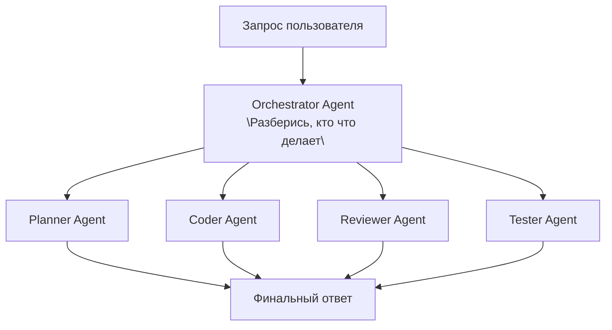

Каждый агент = отдельный вызов LLM с полным контекстом.

---

### Экономика токенов: Multi-Agent vs Membria

**Типичная задача: "Add REST API for user management"**

#### Multi-Agent подход:

| Agent | Input tokens | Output tokens | Стоимость (Claude Sonnet) |
| :--- | :--- | :--- | :--- |
| Orchestrator | 4,000 | 500 | $0.018 |
| Planner | 6,000 | 1,500 | $0.030 |
| Coder | 8,000 | 3,000 | $0.057 |
| Reviewer | 12,000 | 1,000 | $0.051 |
| Tester | 10,000 | 800 | $0.039 |
| Fixer (iteration 1) | 14,000 | 2,000 | $0.062 |
| Fixer (iteration 2) | 16,000 | 1,500 | $0.066 |
| **TOTAL per task** | **70,000** | **10,300** | **$0.32** |

**В день (20 задач):** $6.40
**В месяц (20 рабочих дней):** $128 на разработчика
**Команда 5 человек:** $640/месяц только на токены

И это **не включает:**
* retries на failures
* long contexts в больших проектах
* scaling при активной разработке

#### Membria подход (Superagent):

| Component | Input tokens | Output tokens | Стоимость |
| :--- | :--- | :--- | :--- |
| Context fetch (Graph query) | 0 | 0 | $0 (local) |
| Один вызов Claude + инъекция контекста | 6,000 | 3,000 | $0.033 |
| **TOTAL per task** | **6,000** | **3,000** | **$0.033** |

**В день (20 задач):** $0.66
**В месяц:** $13.20 на разработчика
**Команда 5 человек:** $66/месяц

**Разница: в 10 раз дешевле**

---

### Почему Multi-Agent сжигает токены

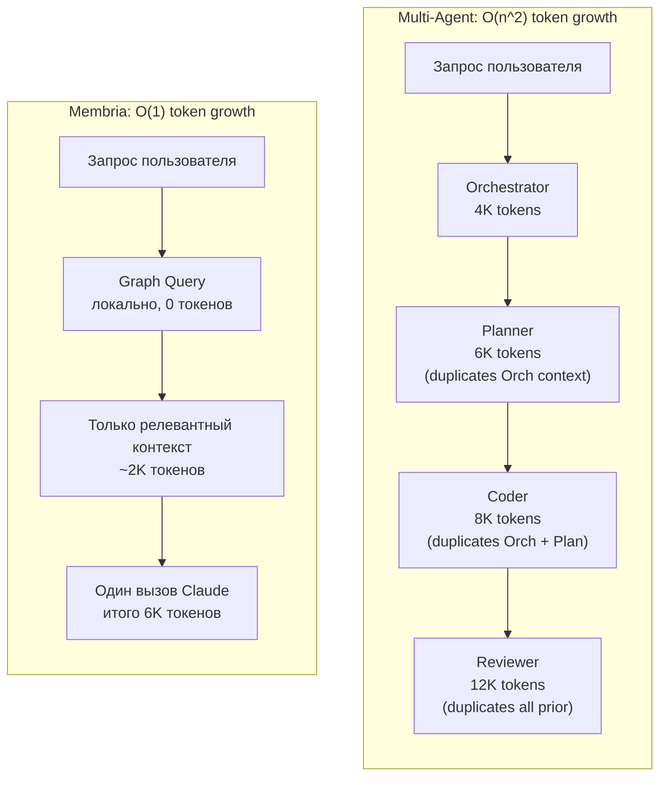

### Технические проблемы Multi-Agent

1. **Фрагментация контекста**
   * Planner Agent thinks: "Use Redis for cache"
   * Coder Agent doesn't get full reason context
   * → implements in-memory cache
   * → Reviewer: "Why not Redis?"
   * → 3 more iterations

2. **Размывание ответственности**
   * bug in prod. "Which agent decided this?"
   * Orchestrator: "I just assigned tasks"
   * Planner: "I gave a plan, Coder changed it"
   * Coder: "Reviewer approved it"
   * Reviewer: "Tester missed it"
   * → no single decision record, no accountability

3. **Несогласованность рассуждений**
   * Planner (temperature 0.7): creative plan
   * Coder (temperature 0.2): conservative implementation
   * → mismatch between plan and code
   * → Reviewer doesn't understand intent

4. **Экспоненциальные сбои**
   * 5 agents, each 95% reliable
   * total reliability: $0.95^5 = 77\%$
   * 23% of tasks require retry = even more tokens

---

## Сравнение моделей ценообразования

### Вендоры Multi-Agent (usage-based)

```
Месяц 1:  разгон команды         → $200
Месяц 2:  активная разработка    → $800
Месяц 3:  дедлайн, heavy usage   → $2,400
Месяц 4:  еще один дедлайн       → $3,100

CFO: "Почему счет за ИИ выше, чем за AWS?"
```

### Membria (subscription)

```
Месяц 1:  $49/seat × 5 = $245
Месяц 2:  $245
Месяц 3:  $245 (дедлайн? та же цена)
Месяц 4:  $245

Предсказуемо. Бюджетируемо. Безлимитно.
```

### Почему subscription работает для Membria

```
Затраты Membria:
├── Graph storage: $0.001 per decision (negligible)
├── Graph queries: local, CPU only
├── LLM calls: user pays for their own Claude tokens (BYOK)
└── Our infrastructure: fixed

Мы НЕ перепродаем токены с наценкой.
Мы продаем КОНТЕКСТ, который делает токены эффективнее.
```

**Multi-agent vendor incentive:** вы используете больше агентов = они зарабатывают больше.

**Membria incentive:** лучший контекст = меньше нужных токенов = более довольные клиенты = больше seats.

---

## Итог

Multi-agent архитектура решает задачу "как разделить работу" путем создания новой проблемы: "как синхронизировать контекст между агентами, не разорившись на токенах".

**Membria Superagent** решает корневую проблему: **дать одному агенту правильный контекст** вместо создания толпы агентов с неполным контекстом.

Результат:
* AI, который помнит ваш проект.
* Решения, которые не теряются.
* Ошибки, которые не повторяются.
* Затраты, которые не взрываются.

**Vibe coding перестает быть "генерацией с нуля каждый раз" и становится "генерацией с памятью проекта".**

<!-- END /Users/miguelaprossine/documentation/docs-ru/coding-superagent.mdx -->


<!-- START /Users/miguelaprossine/documentation/docs-ru/superagent-architecture.mdx -->

## Архитектура Суперагента
<a id="section-superagent-architecture"></a>

## Исполнительное резюме

Membria представляет **Архитектуру Суперагента**, которая трансформирует безголосовых генераторов кода (например, Claude Code) в **разработчиков с учетом принятых решений**, помнящих историю проекта, обучающихся на исходах и предотвращающих повторение ошибок командой.

**Ключевое ценностное предложение:**
- **Для разработчиков:** ИИ, который помнит, что сработало, а что нет.
- **Для команд:** Общая память, которая сохраняется при смене персонала и переключении контекста.
- **Для бюджетов:** Архитектура, которая минимизирует потребление токенов LLM.

---

## Проблема: ИИ без состояния в Vibe Coding

### Что такое Vibe Coding
Vibe coding — это описание желаемого результата на естественном языке и передача написания кода ИИ. Это отлично работает для разовых скриптов и прототипов, но дает сбой в долгосрочных проектах.

### Где возникают проблемы

| Ситуация | Что происходит |
|-----------|--------------|
| Проект живет > 1 недели | ИИ не помнит вчерашних решений |
| Несколько разработчиков | Нет общего контекста между членами команды |
| Возврат к коду через месяц | «Почему это написано именно так?» — никто не знает |
| Похожая проблема решена ранее | ИИ снова совершает ту же ошибку |
| Плохой подход уже пробовали | Нет памяти → команда пробует его снова |

### Первопричина
Текущие ИИ-помощники по кодингу не имеют состояния (**stateless**): каждый промпт обрабатывается независимо, без памяти о прошлых архитектурных решениях или «негативных знаниях» (том, что провалилось).

---

## Решение: Архитектура Суперагента Membria

### Вместо множества агентов (Multi-Agent)
Типичные мультиагентные системы (Orchestrator → Planner → Coder → Reviewer) сжигают **70 000+ токенов** на задачу, так как каждый агент получает избыточный полный контекст.

### Подход Membria: Один агент + Умный контекст
```
✅ MEMBRIA SUPERAGENT:

Запрос пользователя
    ↓
┌─────────────────────────────────┐
│  Запрос к графу Membria         │  ← Локально, 0 токенов
│  "Что релевантно для этого?"    │
└─────────────────────────────────┘
    ↓
[Только нужный контекст: ~2K токенов]
    ↓
┌─────────────────────────────────┐
│  Один вызов Claude Code         │  ← 6-10K токенов всего
│  С инъекцией контекста          │
└─────────────────────────────────┘
    ↓
Код + Авто-фиксация записи решения
```
**Результат: в 10 раз меньше токенов, персистентная память, предсказуемые затраты.**

---

## Архитектура

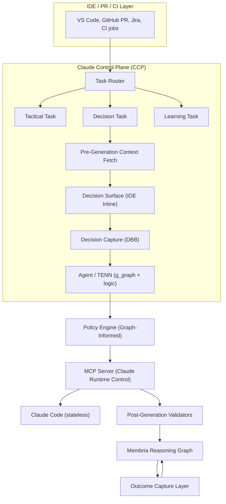

### Классификация Task Router

- **code_gen** -> тактическая (без фиксации решения)
- **architecture** -> решение (полный поток Membria)
- **refactor** -> решение (если структурное изменение)
- **debug** -> тактическая (если нет выбора корневой причины)
- **library_choice** -> решение (всегда)

**Decision signals:**
- "choose", "decide", "should we", "which is better"
- Упомянуто несколько альтернатив
- Архитектурные ключевые слова: "pattern", "structure", "design"

### Pre-Generation Context Fetch (Query Reasoning Graph)

- Прошлые решения по этому модулю
- Проваленные похожие предположения
- Калибровка команды по домену
- Оповещения о негативных знаниях

### Decision Surface (inline in IDE)

Показывает разработчику:
- Похожие прошлые решения
- Предупреждения о рисках
- Подсказки по калибровке
- Альтернативные варианты

Кнопки:
- [Proceed]
- [Review]
- [Override]

### Decision Capture (DBB)

Фиксирует:
- Statement
- Alternatives
- Confidence level
- Predicted outcome
- Context (immutable)

### Agent / TENN Execution Modes

- Tactical: прямое генерация кода
- Decision: генерация с внедренным контекстом
- Learning: связывает исход с историческим решением

### Policy Engine (Graph-Informed)

Статические правила:
- Политики безопасности (без хардкода секретов)
- Комплаенс требования (GDPR, SOC2)
- Code style enforcement

Динамические правила (из Reasoning Graph):
- Корректировки калибровки команды
- Порог уверенности по домену
- Применение негативных знаний

Resonance detection:
- Проверка совпадения bias человека и LLM
- Трение, если оба игнорируют один и тот же риск

### MCP Server (Claude Runtime Control)

- Инъекция контекста:
  - Контекст решения из фиксации
  - Негативные знания из графа
  - Предпочтения и паттерны команды
- Tool exposure:
  - Code generation tools
  - Graph query tools
  - Decision recording tools
- Mode enforcement:
  - Tactical mode: минимальный контекст
  - Decision mode: полный контекст
- Output schema validation

### Post-Generation Validators

Bias detection in output:
- Anchoring: чрезмерный фокус на первой опции в комментариях коду
- Confirmation: игнорирование заявленных альтернатив
- Overconfidence: "definitely", "always works", "no issues"

Consistency checks:
- Код соответствует зафиксированному решению?
- Негативные знания соблюдены?
- Альтернативы действительно рассмотрены в реализации?

Validation failures:
- Логировать для калибровки (не блокировать)
- Уведомлять при критичности (security, compliance)

### Membria Reasoning Graph (Decision Record)

```
decision_id: dec_142
statement: "Use Fastify for REST API"
alternatives: ["Express.js", "Koa", "Custom"]
confidence: 0.60
predicted_outcome: "Stable API, good performance"
assumptions: ["Fastify handles our load", "Team knows it"]
context_hash: "abc123..." (immutable)
status: PENDING_OUTCOME
linked_pr: null -> PR#234 (when created)
linked_commit: null -> commit_sha (when merged)
```

Relationships:
- RELIES_ON: assumptions
- BLOCKS: dependent decisions
- SUPERSEDES: previous decisions on same topic
- CAUSED_BY: parent architectural decisions

### Outcome Capture Layer (Commitment Events)

| Source | Event | Outcome Signal |
|--------|-------|----------------|
| GitHub | PR merged | Decision executed |
| GitHub | PR closed (no merge) | Decision abandoned |
| CI/CD | Tests pass | Positive signal |
| CI/CD | Tests fail | Negative signal |
| CI/CD | Build fail | Negative signal |
| PagerDuty | Incident created | Strong negative |
| Jira | Bug linked to PR | Negative signal |
| Time | 30 days stable | Positive outcome |
| Time | 90 days stable | Strong positive outcome |

Calibration update:
- Compare predicted_outcome vs actual_outcome
- Update team calibration profile
- Update domain-specific calibration
- Generate LoRA candidate if systematic gap detected

## Результаты Vibe Coding

### 1. Меньше циклов «Генерация → Ошибка → Переделка»
**Без Membria:** Claude генерирует кастомный middleware → PR проваливает проверку безопасности → Переделка → Потеряно 2 дня.
**С Membria:** Claude получает контекст *"Избегать кастомного auth middleware (Негативное знание)"* → Генерирует правильный код, используя стандартные библиотеки (например, passport.js).
**Итог: Сокращение времени на переделку на 60%.**

### 2. Код остается понятным спустя месяц
Membria связывает выбор кода с конкретными Записями Решений. Вам не нужно гадать, почему был выбран Fastify вместо Express; причина в Графе.
**Итог: Самодокументируемая кодовая база.**

### 3. ИИ перестает повторять ошибки
Когда баг исправлен, Membria записывает его как «Негативное знание». В следующий раз, когда Claude сгенерирует похожий код, он получит контекст, запрещающий этот паттерн.
**Итог: Обучение на ошибках, специфичных для проекта.**

### 4. Никаких больше «А давайте попробуем это» без последствий
Membria проверяет Граф: «Пробовали ли мы эту библиотеку 2 месяца назад? Да. Она провалилась из-за X. **Не повторять.**»
**Итог: Команда помнит, что уже пробовали.**

### 5. Более быстрый онбординг
Новые разработчики мгновенно видят, **почему** архитектура выглядит именно так, просматривая эволюцию Decision Graph, и уменьшают потерю контекста.
**Итог: Время онбординга сокращено на 50%.**

### 6. Уверенность в сгенерированном коде
Membria показывает исторические показатели успеха/провала для похожих паттернов, используемых командой, что повышает уверенность разработчика при принятии сгенерированного кода.

---

## Экономика токенов: Суперагент vs Мультиагент

### Сравнение по задачам

| Аспект | Система Мультиагентов | Суперагент Membria |
|--------|----------------------|-------------------|
| **Архитектура** | N агентов × полный контекст | 1 агент × умный контекст |
| **Токенов на задачу** | 70,000+ | 6,000-10,000 |
| **Рост токенов** | O(n²) | O(1) |
| **Память** | Отсутствует | Персистентная (Граф) |
| **Структура затрат** | Зависит от использования, непредсказуема | Фиксированная подписка |

**Вендоры мультиагентных систем хотят, чтобы вы использовали БОЛЬШЕ агентов. Membria хочет, чтобы вы использовали ЛУЧШИЙ контекст, чтобы сэкономить токены.**

---

## Итог

Архитектура **Мультиагентов** решает задачу «как разделить работу», создавая новую проблему: фрагментацию контекста. **Membria Superagent** решает коренную проблему: **предоставление одному агенту правильного контекста.**

**Vibe coding перестает быть «генерацией с нуля каждый раз» и становится «генерацией с памятью проекта».**
---

<!-- END /Users/miguelaprossine/documentation/docs-ru/superagent-architecture.mdx -->


<!-- START /Users/miguelaprossine/documentation/docs-ru/cognitive-safety.mdx -->

## Когнитивная безопасность и Файрвол искажений LLM
<a id="section-cognitive-safety"></a>

> [!IMPORTANT]
> **Ключевой принцип:** Membria рассматривает ответы LLM как "недоверенные сигналы", которые должны быть валидированы, откалиброваны и периодически оспорены, чтобы предотвратить усиление когнитивных искажений (якорение, подтверждение, погоня за спросом).

## 1. Файрвол искажений LLM (LLM Bias Firewall)

Bias Firewall — это слой валидации, который находится между сырыми ответами модели и Графом Рассуждений (Reasoning Graph). Он предотвращает повреждение институциональной памяти галлюцинированным консенсусом и поведением "погони за спросом" (demand-chasing).

### 1.1 Риски, усиливаемые LLM
*   **Якорение (Anchoring):** LLM фиксируются на первом правдоподобном варианте, изложенном убедительным языком.
*   **Искажение подтверждения (Confirmation Bias):** LLM склонны генерировать аргументы, поддерживающие предпочтения, подразумеваемые пользователем.
*   **Погоня за спросом (Demand-Chasing):** Модели подстраивают свои рекомендации под тон пользователя или наводящие вопросы (уровень подстройки до 100% против 40% у людей).

### 1.2 Логика Файрвола
Все извлеченные сигналы решений должны пройти следующие проверки:

#### A. Валидация на основе правил
*   **Никаких "призрачных" сигналов:** Сигнал не может быть приписан пользователю, который не совершил явного действия (например, ввод текста, клик, одобрение) в логе сессии.
*   **Жесткая привязка доказательств:** Каждый `DECISION_CANDIDATE` должен ссылаться хотя бы на один конкретный ID сообщения или фрагмент документа.
*   **Проверка будущего:** Решения не могут ссылаться на временные метки в будущем.

#### B. Ансамблевое обнаружение разногласий
Для решений с высокими ставками (VoI > Порога):
*   **Механизм:** Запуск промпта извлечения на 2+ различных моделях (например, GPT-4o и Claude 3.5 Sonnet).
*   **Условие:** Обе модели должны согласиться с `decision_outcome` и `confidence_score` (в пределах 10% дельты).
*   **Отказ:** Если модели расходятся, сигнал помечается как `AMBIGUOUS` (неоднозначный) и требует проверки человеком.

#### C. Пороговые значения уверенности
*   **< 0.7:** Флаг для ручной проверки. Не продвигать автоматически в Решение.
*   **0.7 - 0.9:** Показать как "Кандидат" с кнопкой "Подтвердить".
*   **> 0.9:** Авто-захват (если включен режим активного прослушивания).

---

## 2. Обнаружение Резонанса (Триггеры Системы 2)

"Резонанс" возникает, когда человеческое искажение и галлюцинации LLM совпадают (например, пользователь хочет верить, что риск низкий, и LLM галлюцинирует доказательства этого).

### 2.1 Отслеживаемые паттерны

| Человеческое искажение | Режим отказа LLM | Сигнал обнаружения |
| :--- | :--- | :--- |
| **Подтверждение (Confirmation)** | Галлюцинированная поддержка | В графе нет ребер `EVIDENCE` для цитируемого факта. |
| **Якорение (Anchoring)** | Фиксация на первом варианте | Трейс рассуждений не содержит списка `ALTERNATIVES`. |
| **Сверхуверенность (Overconfidence)** | Язык уверенности | Confidence > 0.9, но количество доказательств низкое (< 2). |
| **Невозвратные затраты (Sunk Cost)** | Ссылка на прошлые инвестиции | Ребра `RELIED_ON` указывают на замененные/истекшие решения. |

### 2.2 Трение по дизайну (Friction by Design)
Когда Оценка Резонанса > 0.6:
1.  **Блокировка быстрых действий:** Отключить "Одобрение в один клик".
2.  **Принудительное обсуждение:** Потребовать от пользователя заполнить поле "Контр-доказательства".
3.  **Охлаждение:** Максимум 2 вмешательства с трением за сессию принятия решений, чтобы избежать усталости.

---

## 3. Библиотека вмешательств (Debiasing Intervention Library)

Когда обнаружен конкретный паттерн искажения, система внедряет целевой "Триггер Системы 2":

| Обнаруженный паттерн | Техника вмешательства | Внедрение промпта |
| :--- | :--- | :--- |
| **Якорение** | Декомпозиция | "Пожалуйста, перечислите 3 альтернативы этому предложению перед подтверждением." |
| **Подтверждение** | Адвокат дьявола | "Какой самый сильный аргумент *против* этого решения?" |
| **Сверхуверенность** | Пре-мортем | "Представьте, что прошел год, и это решение провалилось. Что пошло не так?" |
| **Невозвратные затраты** | Чистый лист | "Если бы вы были новым CEO, начавшим сегодня, продолжили бы вы этот проект?" |

> Для компактного оперативного cheat-sheet по этим вмешательствам и порогам красных флагов см. [Bias Defense Quick Reference](/bias-defense-quickref).

## 4. Качество извлечения сигналов

Извлечение сигналов выполняется на клиентском слое через Decision Black Box (DBB). Полную схему сигналов и правила извлечения см. в [Client Layer: DBB & Decision Surface](/development).

---

## Связанные документы

- [Causal Memory Layer](/causal-memory) — как Membria различает наблюдение и интервенцию с помощью структурных каузальных моделей.
- [Architecture Governance](/architecture-governance) — затухание ребер, Graph RBAC, протоколы override и causal discovery.
- [Bias Defense Quick Reference](/bias-defense-quickref) — операционный cheat-sheet по триггерам вмешательств и красным флагам.

<!-- END /Users/miguelaprossine/documentation/docs-ru/cognitive-safety.mdx -->


<!-- START /Users/miguelaprossine/documentation/docs-ru/causal-memory.mdx -->

## Причинно-следственная память
<a id="section-causal-memory"></a>

Слой Causal Memory расширяет Reasoning Graph Membria, внедряя формальные структурные каузальные модели (SCM). Его основная цель — отличить простую корреляцию (наблюдение) от истинной причинности (интервенция), предотвращая ситуации, когда агенты полагаются на эвристики, не выдерживающие эмпирической проверки.

## 1. Слой интервенции ($do(x)$)

В стандартных RAG-системах данные пассивны ($P(Y|X)$). Membria рассматривает **Решения** как активные интервенции ($P(Y|do(X))$).

### События обязательств (Commitment Events) как операторы
Интервенция фиксируется только тогда, когда происходит **Commitment Event** (например, слияние PR, подписание контракта, исполнение API-вызова). Это позволяет системе различать:
- **Наблюдение:** «Пользователи жалуются на функцию X» (Контекст).
- **Интервенция:** «Мы отключили функцию X» (Действие).

### Интеграция с состоянием убеждений (Belief State)
Каждая интервенция запускает **байесовское обновление** в [движке POMDP](/rg-architecture#112-pomdp-belief-state-tracking). Система рассчитывает $P(Consensus)$ для интервенции и отслеживает поверхностное согласие через экстракцию сигналов (см. [Cognitive Safety — Signal Extraction](/cognitive-safety#4-signal-extraction-quality)).

### Правило каузальной валидности
Если результат $Outcome(Y)$ идентичен как для $do(Action)$, так и для $do(Nothing)$ внутри одного контекста, действие классифицируется как **Ритуал** (не имеющее причинной связи). В будущем система будет блокировать пути рассуждений, предлагающие это действие для достижения того же результата.

---

## 2. Стратифицированное извлечение (Контроль мешающих факторов — Confounders)

Для решения **проблемы мешающих факторов** ($X \leftarrow Z \rightarrow Y$), Membria использует векторную стратификацию контекста.

### Алгоритм
Когда агент предлагает причинно-следственную связь $X \rightarrow Y$:
1. **Идентификация мешающих факторов ($Z$):** Retrieval Orchestrator сканирует граф на наличие переменных $Z$, которые исторически коррелировали и с $X$, и с $Y$ (например, сезонность, маркетинговые расходы).
2. **Стратификация контекста:** Запрос к FalkorDB ограничивается подграфами, где $Z$ соответствует текущему состоянию.
3. **Сравнение исходов:** Система оценивает распределение $Y$ при заданном $X$ *только* внутри этого слоя (страты).

> [!IMPORTANT]
> Это гарантирует, что если «Продажи упали в июле» на фоне PR-кризиса, система корректно припишет падение «Низкому сезону» ($Z$), а не «PR-кризису» ($X$), если другие периоды «Низкого сезона» без кризисов показывали такое же падение.

---

## 3. Артефакты негативного знания

Негативное знание — это формализованная запись отвергнутых каузальных гипотез.

### Схема в FalkorDB
Каждый узел `NegativeKnowledge` содержит:
- `Hypothesis_Vector`: Семантический эмбеддинг отвергнутой идеи.
- `Causal_Weight`: Установлен $\approx 0$ или отрицателен.
- `Evidence_Links`: Ссылки на конкретные Решения и Исходы, которые опровергли связь.
- `Context_Constraints`: Условия, при которых связь была признана ложной.

---

## 4. Атомарная реализация в FalkorDB

Благодаря хранению векторов напрямую в узлах графа, FalkorDB позволяет выполнять **атомарные каузальные проверки**.

```cypher
// Атомарная проверка предложения X в контексте Z
CALL db.idx.vector.queryNodes('Assumptions', 'embedding', 3, vecf32($proposal_vector))
YIELD node as assumption, score
MATCH (assumption)<-[:RELIED_ON]-(d:Decision)-[:HAS_OUTCOME]->(o:Outcome)
WITH assumption, d, o, score
CALL db.idx.vector.queryNodes('Decision', 'context_z', 1, vecf32($current_z_vector))
YIELD node as ctx_match, score as z_score
WHERE d = ctx_match AND z_score > 0.8
RETURN assumption.statement, avg(o.delta) as causal_impact
```

## 5. Калибровка Допущений со Стратификацией (Assumption Calibration)

Обновления Beta-распределения должны быть стратифицированы, чтобы избежать смешивания сигналов из разных контекстов (например, рыночные условия, регионы).

**Формула:**
`Beta(α, β) → Beta(α + w·outcome, β + w·(1-outcome))`

Где:
`w = recency_weight × confounder_match_score`

**Измерения стратификации:**
- **Географический/Культурный контекст:** "Вендор надежен" (True в ЕС, False в Азии).
- **Временная свежесть (Temporal Recency):** Взвешенное затухание гарантирует, что недавние исходы доминируют.
- **Идентифицированные конфаундеры:** Исходы привязаны к конфаундерам (например, "Рыночный бум"), чтобы предотвратить ложную атрибуцию мастерства.

<!-- END /Users/miguelaprossine/documentation/docs-ru/causal-memory.mdx -->


<!-- START /Users/miguelaprossine/documentation/docs-ru/architecture-governance.mdx -->

## Управление архитектурой
<a id="section-architecture-governance"></a>

Слой управления (Governance Layer) предоставляет необходимые ограничения (guardrails) для развертывания Reasoning Graph Membria в многопользовательской корпоративной среде с высокими ставками. Он интегрирует **приоритизацию на основе VoI** и **POMDP-трекинг убеждений** для обеспечения целостности решений.

## 1. Модель полураспада (Revised)

Причинно-следственные связи в бизнесе не статичны. Рыночные условия меняются, делая прошлые «истины» недействительными. Membria реализует доменно-специфичную модель затухания для отслеживания «волатильности знаний»:

- **Динамика рынка:** период полураспада 90 дней.
- **Вендорские отношения:** период полураспада 180 дней.
- **Регуляторные/юридические:** СТУПЕНЧАТОЕ затухание (действительно до явного события изменения).
- **Техническая архитектура:** период полураспада 365 дней.

**Математическая логика:**
- **Функция затухания:** $Belief_{t} = Belief_{t_0} \cdot e^{-\lambda(t-t_0)}$
- **Обновление доказательств:** Когда фиксируется новый Исход (Outcome), таймер затухания сбрасывается. Вес обновляется через инфузию Beta-распределения ($Outcome("success"): Beta(\alpha, \beta) \to Beta(\alpha+1, \beta)$).
- **Ускорение при конфликте:** Если новый исход противоречит существующему ребру графа → ускорить затухание (период полураспада $\div$ 2).

---

## 2. Многопользовательский Graph RBAC

Для обеспечения конфиденциальности данных и предотвращения утечек информации между отделами Membria реализует тонкую настройку прав доступа на уровне графа.

### Поиск на основе политик (Policy-Based Retrieval)
- **Чувствительность узла:** Каждый узел имеет `sensitivity_level` (Public, Internal, Secret).
- **Область доступа:** Retrieval Orchestrator автоматически добавляет предикаты безопасности в Cypher-запросы на основе `session_token` пользователя.
- **Атомарная блокировка:** Узлы уровня Secret исключаются из векторного индекса, используемого агентами общего назначения.

---

## 3. Разрешение конфликтов и ручное переопределение (Human Override)

Когда слой каузальности противоречит человеческому решению или предложению на основе рассуждений, должен соблюдаться формальный протокол разрешения.

### Лог переопределений (Override Log)
Если человек принимает решение вопреки предупреждению о «негативном знании»:
1. **Явное обоснование:** Пользователь должен предоставить причину (фиксируется как связь `SUPERSEDES`).
2. **Метка сдвига контекста:** Система помечает решение тегом `HYPOTHESIS_CONTEXT_SHIFT`, сигнализируя, что пользователь считает старую каузальную модель более не актуальной.
3. **Флаг высоких ставок:** Такие переопределения автоматически эскалируются для мониторинга.

---

## 4. Агент поиска причинности (Петля разбора — Debriefing Loop)

Когда прогноз оказывается неверным, система ищет недостающий **мешающий фактор (Confounder)**.

### Рекурсивный поиск
Агент поиска причинности (Causal Discovery Agent) запускает сессию разбора после получения исхода:
- **Поиск:** Он запрашивает внешние API на предмет переменных, которые изменились в Окне Принятия Решения (Decision Window).
- **Генерация кандидатов:** Он предлагает новые узлы `Variable`, которые могли бы объяснить отклонение.
- **Инъекция узла:** В случае подтверждения новый мешающий фактор добавляется в граф.

---

## 5. Многоагентный консенсус (Предотвращение коллизий)

Когда несколько автономных агентов предлагают конфликтующие вмешательства в одной области графа, система должна предотвращать "каузальные коллизии" — одновременные записи, которые повреждают каузальные ребра.

### Протокол блокировок
- **Оптимистические блокировки:** Агенты читают снепшот подграфа с версионным тегом. При записи версия проверяется; если устарела, агент должен перечитать и переоценить.
- **Песочница симуляции:** Перед фиксацией каждый агент прогоняет вмешательство в изолированной копии затронутого подграфа, чтобы выявить побочные эффекты.
- **Эскалация конфликтов:** Если два агента предлагают противоречащие действия на одном узле `Decision` в пределах одного Decision Window, оба предложения замораживаются и эскалируются в [Decision Surface](/development) для ручного разрешения.

---

## Связанные документы

- [Causal Memory Layer](/causal-memory) — формальная каузальная модель, которую Governance ограничивает и валидирует.
- [Cognitive Safety & LLM Bias Firewall](/cognitive-safety) — валидация сигналов перед тем, как решения попадут в граф.
- [Reasoning Graph Architecture](/rg-architecture) — базовая структура графа, управляемая этими политиками.
- [IT Architecture & Stack](/it-architecture-stack) — варианты развертывания, требования к инфраструктуре и технологические выборы.

<!-- END /Users/miguelaprossine/documentation/docs-ru/architecture-governance.mdx -->


<!-- START /Users/miguelaprossine/documentation/docs-ru/bias-defense-quickref.mdx -->

## Краткий справочник по защите от искажений
<a id="section-bias-defense-quickref"></a>

## Карта: Обнаружение → Вмешательство

**Обнаружена сверхуверенность (Overconfidence)?**
*   → Запустить **Пре-мортем**
*   → Запросить 3 различных сценария провала

**Обнаружено скрытое несогласие?**
*   → **Заблокировать** кнопки быстрого одобрения
*   → Потребовать явного подтверждения от молчащих сторон (принудительная экспликация сигнала)

**Обнаружено якорение (Anchoring)?**
*   → Принудительно показать поле **"Рассмотренные альтернативы"**
*   → Показать исторические решения, использовавшие другие якоря

**Обнаружено искажение подтверждения (Confirmation)?**
*   → Внедрить промпт **"Адвокат дьявола"**
*   → Поднять из Графа наиболее подходящие противоречащие доказательства

---

## Красные флаги для ручной проверки

> [!WARNING]
> Если поднят любой из этих флагов, система действует как "Тормоз", а не как ускоритель.

*   **Уверенность сигнала LLM < 0.7**: Слишком неоднозначно для автоматизации.
*   **Дисперсия оценки VoI > 50%**: Стейкхолдеры фундаментально не согласны по поводу влияния; усреднение опасно.
*   **Оценка Резонанса > 0.6**: Пользователь и ИИ усиливают галлюцинации друг друга.
*   **Несоответствие культурного контекста**: Модель извлечения сигналов не соответствует стилю коммуникации команды (например, модель низкого контекста в команде высокого контекста).
*   **Корректировка уверенности LoRA > 30%**: Адаптер агрессивно перекрывает неуверенность базовой модели (см. [DBB & LoRA Runtime](/membria-ce/dbb-and-lora-runtime)).

---

## Матрица эскалации

| Severity | Условие | Действие |
| :--- | :--- | :--- |
| **Low** | Один red flag, Resonance < 0.4 | Логировать предупреждение, не прерывать пользователя |
| **Medium** | 1-2 red flags, Resonance 0.4–0.6 | Показать inline alert в Decision Surface |
| **High** | 2+ red flags ИЛИ Resonance > 0.6 | Заблокировать quick-approve, принудить обсуждение |
| **Critical** | VoI Variance > 50% + Confidence < 0.7 | Заморозить решение, эскалировать team lead |

## Тайминги реакции

- **Friction interventions:** максимум 2 на одну decision session (чтобы избежать усталости).
- **Cooldown after block:** 60 секунд до повторной попытки.
- **Silent-party signoff deadline:** 48 часов до истечения сигналов `SILENCE`.

---

> Полную архитектуру этих проверок см. в [Cognitive Safety & LLM Bias Firewall](/cognitive-safety).

<!-- END /Users/miguelaprossine/documentation/docs-ru/bias-defense-quickref.mdx -->


<!-- START /Users/miguelaprossine/documentation/docs-ru/it-architecture-stack.mdx -->

## ИТ-Архитектура и Стек
<a id="section-it-architecture-stack"></a>

## Обзор системы

Membria — это распределенная, local-first интеллектуальная система для накопления и воспроизводимой работы с решениями. **Базой архитектуры является FalkorDB — гибридная векторно-графовая БД**, где хранятся решения, доказательства, причины, исходы и их связи. Вокруг FalkorDB построен Reasoning Graph, GraphRAG, Decision Intelligence и Superagent-поток для IDE/CLI.

Ключевые принципы:
- **Решения как объекты первого класса** (а не документы).
- **Commitment Events** определяют необратимость.
- **GraphRAG с бюджетами** вместо бесконечного контекста.
- **Local-first** для приватности и задержки.
- **Контролируемое обучение** через LoRA и калибровку.
- **FalkorDB end-to-end** как единая граф/вектор память (локально и в федерации).

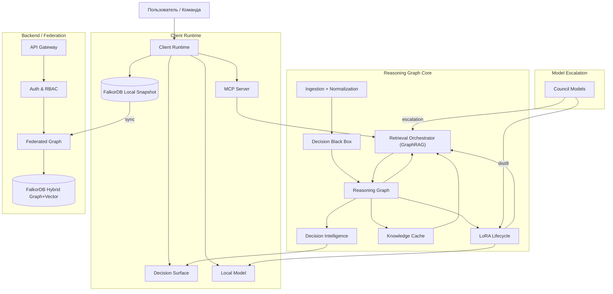

---

## Архитектурные слои

### 1) Источники и извлечение
- **Ingestion + Normalization**: сбор событий из Slack, GitHub, Docs, CI/CD.
- **DBB (Decision Black Box)**: извлечение решений, предположений, альтернатив и сигналов из событий.
- **Commitment Events**: фиксируют необратимость (PR merged, контракт подписан, счет выставлен).

### 2) Ядро Reasoning Graph
- **FalkorDB** как единое ядро графа и векторов (локально и в федерации).
- **Graph Memory**: причинность, зависимости, временные диапазоны, provenance.
- **Vector Memory**: семантическая близость внутри того же ядра.
- **Knowledge Cache**: проверенные ответы, паттерны и негативные знания.

### 3) GraphRAG и контекст
- **Retrieval Orchestrator** применяет бюджеты (edge/step/token/risk).
- Сначала подграф по RBAC и области, затем векторный поиск внутри него.
- Контекст собирается итеративно, трейс хранится для аудита.

### 4) Decision Intelligence
- **VoI**: приоритизация решений по ценности информации.
- **Belief State (POMDP)**: детекция скрытых разногласий.
- **Sequencing**: приоритизация зависимых решений через Priority Queue.
- **Calibration**: сопоставление предсказаний и исходов.

### 5) LoRA Lifecycle + Router Policy
- **Источники:** outcomes, distillation Council, доменные пакеты.
- **Governance:** eval dataset, canary, promote/rollback.
- **Router Policy:** применяет LoRA только при доказанном улучшении и без роста галлюцинаций.

### 6) Superagent-поток для IDE/CLI
- **Task Router** определяет: тактическая задача или решение.
- **TENN (Task Execution Neural Network)**: агентный слой выполнения задач и решений, связанный с графом и политиками.
- **Decision Surface** показывает риски, альтернативы, калибровку.
- **Policy Engine** применяет негативные знания и комплаенс.
- **Validators** проверяют согласованность решения и вывода.

---

## Технологический стек

### Слой данных
| Компонент | Технология | Роль |
|-----------|------------|------|
| **Гибридная граф/вектор БД** | **FalkorDB** | Базовое хранилище решений, доказательств и индексов семантики в одном ядре. |
| **Локальное хранилище** | **FalkorDB (embedded/local)** | Офлайн-граф, кэш состояния и клиентских настроек в едином хранилище. |
| **Очереди / события** | **Redis / NATS / Kafka** | Асинхронная обработка: ingestion, outcomes, обновления DI. |

### Сервисы ядра
| Компонент | Технология | Роль |
|-----------|------------|------|
| **Reasoning Graph Engine** | **Julia** | Графовые алгоритмы, VoI, POMDP, sequencing, калибровка. |
| **GraphRAG Orchestrator** | **Julia / Python** | Бюджеты извлечения, сбор контекста, трассировка. |
| **DBB / Ingestion** | **Rust / Python** | Высокоскоростной парсинг событий, нормализация, извлечение решений. |
| **Auth & Policy** | **OIDC / RBAC** | Политики доступа на уровне узлов и доменов. |

### Клиентский рантайм
| Компонент | Технология | Роль |
|-----------|------------|------|
| **MCP Server** | **TypeScript / Python** | Интеграция с Claude Code, IDE и CLI. |
| **Decision Surface** | **Web UI / Desktop** | Визуализация решений, VoI, скрытых разногласий. |
| **Local Model** | **Llama.cpp / ONNX** | Локальный inference для 80-95% запросов. |
| **Local Graph Engine** | **FalkorDB** | Локальный GraphRAG, хранение решений и векторные индексы. |

---

## Потоки данных

### 1) Ingestion и фиксация
```
Источники -> Нормализация -> DBB -> Decision Windows -> Reasoning Graph
```

### 2) Retrieval (GraphRAG)
```
Запрос -> RBAC/Scope -> Подграф (FalkorDB) -> Векторный поиск -> Контекст -> Ответ
```

### 3) Outcome и калибровка
```
Commitment Event -> Outcome -> Calibration -> Обновление уверенности
```

---

## Модель данных (упрощенно)

**Узлы:** Decision, Assumption, Outcome, Evidence, Person, Team, Document, Event.

**Связи:** BASED_ON, DEPENDS_ON, BLOCKS, CAUSED_BY, SUPERSEDES, HAS_OUTCOME, VALID_IN_TIME_RANGE.

**Принцип:** хранится структура рассуждений и provenance, а не полный текстовый лог.

---

## Безопасность и комплаенс

- **RBAC на уровне узлов графа** и по доменам.
- **Неподделываемость**: хэши Evidence, append-only логи, опциональная привязка к неизменяемому хранилищу.
- **Шифрование**: AES-256 at rest, TLS 1.3 in transit.
- **Cognitive Safety Layer**: дебиасинг и детекция резонанса.

---

## Развертывание

1. **SaaS**: управляемая среда.
2. **Enterprise Cloud**: выделенный инстанс в VPC.
3. **On-Prem / Air-Gapped**: полный контроль, локальный Reasoning Graph.

---

## Поверхность интеграции

- **IDE/CLI**: MCP-интеграции (Claude Code, Cursor).
- **CI/CD**: GitHub/GitLab события как Commitment Events.
- **Коммуникации**: Slack/Teams/Email.
- **API**: REST/GraphQL для кастомных интеграций.

[Смотреть полный API Reference →](/api-reference)

<!-- END /Users/miguelaprossine/documentation/docs-ru/it-architecture-stack.mdx -->


<!-- START /Users/miguelaprossine/documentation/docs-ru/quickstart.mdx -->

## Плейбук клиента
<a id="section-quickstart"></a>

## Шаг 1. Позвольте Decision Black Box слушать

DBB работает на клиентском слое. Он следит за чатами, документами и заметками, извлекает ключевые моменты принятия решений и «замораживает» рассуждения до того, как станет известен результат. Эскалация на бэкенд опциональна и используется только тогда, когда требуются внешние знания.

<AccordionGroup>
  <Accordion icon="sparkles" title="Что фиксирует DBB">
    - Рассуждения с отметкой времени (контекст, мотиваторы, предположения)
    - Уровень уверенности и прогнозы
    - Альтернативы, которые вы рассматривали
    - Эмоциональное состояние и открытые вопросы
  </Accordion>
  <Accordion icon="shield" title="Почему это честно">
    Записи становятся неизменяемыми после блокировки. Исходы добавляются только в режиме append-only, поэтому исходные рассуждения остаются нетронутыми.
  </Accordion>
</AccordionGroup>

## Шаг 2. Изучите Decision Surface

Decision Surface — это панель управления клиента. Она показывает открытые петли (open loops), дрифт, ожидающие проверки задачи и сигналы, полученные из записей DBB. Система использует **VoI (Value of Information)** для приоритизации вашего внимания и **POMDP-трекинг убеждений** для обнаружения скрытых разногласий.

<Columns cols={2}>
  <Card title="Открытые петли (VoI)" icon="circle-exclamation">
    Нерешенные решения, ранжированные по степени влияния. Сосредоточьтесь на петлях с высокой ценностью информации (VoI).
  </Card>
  <Card title="Скрытые разногласия" icon="masks-theater">
    Поверхностное согласие, скрывающее реальный скептицизм (низкая уверенность в консенсусе).
  </Card>
  <Card title="Дрифт" icon="arrows-spin">
    Доказательства того, что убеждение изменилось после того, как решение было зафиксировано.
  </Card>
</Columns>

## Шаг 3. Разберите карточку

Нажмите на карточку, просмотрите черновик DBB (решение, контекст, доказательства, вопросы) и выберите:

- **Подтвердить решение**, чтобы сделать его неизменяемым.
- **Редактировать**, если формулировка неточна (исходные рассуждения сохраняются).
- **Отклонить**, если черновик — это шум, а не реальное решение.

## Шаг 4. Отслеживайте результаты и учитесь

Когда результат станет известен, добавьте его и сравните прогноз с реальностью. Клиентский слой подсвечивает сигналы калибровки, временные паттерны и соблюдение принципов.

## Где начинается бэкенд

Когда клиенту требуются внешние знания или эскалация, запрос уходит на слой бэкенда (KCG + DoD + гейтвеи):

<CardGroup cols={2}>
  <Card title="KCG и гейтвеи" icon="diagram-project" href="/membria-ce/kcg-gateways">
    Логика графа на бэкенде, консенсус гейтвеев и хранилище Arweave.
  </Card>
  <Card title="Технические заметки" icon="cubes" href="/membria-ce/technical">
    Сквозной конвейер от захвата на клиенте до верифицированных знаний.
  </Card>
</CardGroup>

<!-- END /Users/miguelaprossine/documentation/docs-ru/quickstart.mdx -->


<!-- START /Users/miguelaprossine/documentation/docs-ru/development.mdx -->

## 'Клиентский слой: DBB и Decision Surface'
<a id="section-development"></a>

<Info>
  Клиентский слой включает в себя Decision Black Box (DBB) и Decision Surface (DS). DBB фиксирует моменты принятия решений локально; DS отрисовывает сигналы на основе неизменяемых записей о решениях.
</Info>

<Steps>
<Step title="Захват моментов принятия решений">
DBB отслеживает потоки взаимодействий (чат, доки, заметки). Он детектирует фразы-обязательства, извлекает контекст и альтернативы, и «замораживает» рассуждения до того, как результаты могут исказить память.
</Step>
<Step title="Создание неизменяемых записей о решениях">
Каждая запись о решении включает предположения, альтернативы, уверенность и прогнозы. Система автоматически вычисляет **ценность информации (VoI)** и поддерживает **состояние убеждений POMDP** для каждой записи.
</Step>
<Step title="Отрисовка сигналов в Decision Surface">
DS представляет открытые петли, ранжированные по VoI, скрытые разногласия (оповещения POMDP), дрифт и сигналы о послужном списке. Он не читает сырой чат, только выходные данные DBB.
</Step>
</Steps>

## Минимальные UI-касания

- Встроенные подсказки захвата (cues) рядом с сообщениями, ставшими кандидатами в решения.
- Карточки Decision Surface с резюме сигналов.
- Панель с низким уровнем трения для подтверждения, редактирования или отклонения.

### Качество извлечения сигналов

Каждый извлеченный сигнал включает:
- `signal_type`: AGREEMENT | SILENCE | SKEPTICAL | ACTION
- `confidence`: 0.0-1.0 (уверенность извлечения LLM)
- `cultural_modifier`: high_context | low_context
- `behavioral_confirmation`: bool (последовало ли действие за словами?)

**Правила:**
- **Confidence < 0.7** → Флаг для ручной проверки.
- **SILENCE** → Требует `behavioral_confirmation` в течение 48 часов.
- **Cultural modifier** применяется на основе настроек команды (например, молчание в Высоком Контексте != согласие).

## Клиент против бэкенда

| Клиентский слой (DBB/DS) | Бэкенд-слой (KCG/DoD/Gateways) |
| --- | --- |
| Фиксирует решения и рассуждения локально | Эскалирует запросы в совет внешних LLM при необходимости |
| Неизменяемые записи о решениях | Неизменяемые пакеты знаний (Arweave) |
| Сигналы Decision Surface | Knowledge Cache Graph + консенсус гейтвеев |

Когда решение требует внешних знаний или верификации, клиент отправляет DoD-запрос на бэкенд. Бэкенд записывает событие знания и возвращает верифицированный ответ, который клиент может сохранить или на который может ссылаться.

---

> Для правил валидации искажений, применяемых к извлеченным сигналам, см. [Когнитивная безопасность и Файрвол искажений LLM](/cognitive-safety).

<!-- END /Users/miguelaprossine/documentation/docs-ru/development.mdx -->


<!-- START /Users/miguelaprossine/documentation/docs-ru/IMPLEMENTATION-ROADMAP.md -->

## Слой Decision Intelligence - дорожная карта внедрения
<a id="section-IMPLEMENTATION-ROADMAP"></a>

## Назначение и область применения

Этот документ является техническим чертежом реализации слоя **Decision Intelligence** поверх **Reasoning Graph** Membria. Он переводит высокоуровневые концептуальные фреймворки — такие как Ценность информации (VoI), трекинг убеждений POMDP и каузальная последовательность — в конкретные этапы разработки ПО, структуры данных и алгоритмы.

Дорожная карта предназначена для инженеров, архитекторов и технических руководителей. Она обеспечивает прозрачный, пошаговый путь развития Membria от движка персистентности знаний к активной системе оптимизации решений.

---

## Обзор (Overview)

Пять основных компонентов строятся поэтапно, каждый из которых приносит самостоятельную ценность.

---

## Фаза 1: Фундамент (Phase 1: Foundation) (Недели 1-6)

### 1.1 Расширенная схема объекта решения (Extended Decision Object Schema)

**Что:** Добавление 6 новых полей в записи Решений в Graph Memory.

**Изменения:**
```json
{
  "decision_id": "dec_001",
  "statement": "Использовать Вендора X",
  "confidence": 0.75,

  // НОВЫЕ ПОЛЯ
  "value_of_information": {
    "score": 85000.0,      // Float64 в долларах
    "basis": "Влияние на доход, если вендор выбран неверно",
    "computed_at": "2025-01-21T10:00:00Z",
    "sources": ["dec_001_impact_edge"]
  },
  "belief_state": {
    "state": "consensus",
    "prob_true_consensus": 0.60,
    "prob_surface_only": 0.30,
    "prob_misunderstanding": 0.10,
    "confidence": 0.60,
    "last_updated": "2025-01-21T10:05:00Z",
    "signal_history": ["sig_001", "sig_002"]
  },
  "dependencies": {
    "blocks": ["dec_002", "dec_003"],  // какие решения это блокирует
    "blocked_by": [],                  // какими решениями заблокировано это
    "related": ["dec_004"]              // зависимости (не блокирующие)
  },
  "predicted_outcome": null,            // Устанавливается перед исполнением
  "actual_outcome": null,               // Устанавливается после исполнения
  "calibration_delta": null             // предсказание против реальности
}
```

**Реализация:**
- Обновление модели данных Решения в DBB (структура Julia).
- Добавление обновлений схемы FalkorDB.
- Обратная совместимость: новые поля опциональны, по умолчанию null.

**Технологический стек:**
- Язык: Julia (для компонентов RG).
- Графовая БД: **FalkorDB** (основной фундамент знаний для низкозадержечных Cypher-запросов).
- Хранение: Redis-based хранилище через FalkorDB.

**Тестирование:**
- Юнит-тесты: поле VoI может быть null, вычисляться, обновляться.
- Интеграционные тесты: создание Решения с новыми полями и без них в FalkorDB.
- Тесты миграций: существующие узлы в FalkorDB остаются доступными.

**Результат (Deliverable):** Расширенная схема, миграции базы данных, набор тестов.

---

### 1.2 Графовые связи для зависимостей (Graph Relationships for Dependencies)

**Что:** Добавление связей BLOCKS (блокирует) и DEPENDS_ON (зависит от) в граф знаний.

**Изменения:**
```
Decision D1 --[BLOCKS]--> Decision D2
Decision D5 --[BLOCKS]--> Decision D1
Decision D7 --[DEPENDS_ON]--> Decision D5
```

**Реализация:**
- Обновление определений узлов/связей в GraphRAG.
- Добавление функций обхода: `find_blocking(decision_id)`, `find_blocked(decision_id)`.
- Реализация детекции циклов (если A блокирует B, а B блокирует A — это невалидно).

**Технологический стек:**
- Графовая БД: **FalkorDB** (использование GraphBLAS для сверхбыстрых темпоральных обходов).
- Язык запросов: **Cypher** (оптимизирован под цепочки зависимостей Membria).


**Тестирование:**
- Тесты детекции циклов.
- Тесты обхода (поиск транзитивных зависимостей).
- Тесты производительности (скорость запросов для больших графов решений).

**Результат (Deliverable):** Графовая схема, API для обхода связей, валидация.

---

### 1.3 Извлечение сигналов для Состояния убеждений (Signal Extraction for Belief State)

**Что:** Извлечение сигналов, связанных с решениями, из коммуникаций для отслеживания состояния убеждений (belief state).

**Изменения в DBB:**
```
Типы сигналов, извлекаемые из обсуждений:
- EXPLICIT_AGREEMENT: "+1", "согласен", "одобрено"
- EXPLICIT_DISAGREEMENT: "-1", "возражаю", "не согласен"
- SILENCE: человек присутствует, но ничего не сказал
- SKEPTICAL_QUESTION: "откуда мы знаем X?", "как насчет рисков?"
- ACTION_TAKEN: "начинаю наем", "связался с вендором"
- ACTION_DEFERRED: решение принято, но действий нет через 48 часов
- FOLLOW_UP_DISCUSSION: тема открыта повторно после принятия решения

**[НОВОЕ] Фаза 1.3: Качество извлечения сигналов**
- Оценка уверенности (0.0-1.0)
- Культурные модификаторы (Высокий/Низкий контекст)
- Поведенческое подтверждение (Действие должно следовать за Молчанием)
```

**Реализация:**
- Классификатор сигналов на базе LLM (локальный или небольшая специализированная модель).
- Классификация каждого сообщения/комментария, относящегося к решению.
- Хранение сигнала как ссылки на Свидетельство (Evidence) к Решению.
- Включение возможности детекции низкой уверенности (например, > 2 скептических вопроса = низкий уровень консенсуса).

**Технологический стек:**
- Язык: Julia + Python (для инференса LLM).
- Модель: Небольшой специализированный классификатор или модель 7B-13B.
- Хранение: Записи свидетельств сигналов, связанные с Решением.

**Тестирование:**
- Тесты точности извлечения сигналов (точность/полнота на тестовом корпусе).
- Тесты на ложноположительные результаты (убедиться, что молчание не путается с согласием).
- Интеграционные тесты: сигналы обновляют состояние убеждений решения.

**Результат (Deliverable):** Сервис извлечения сигналов, тестовый корпус, начальная калибровка.

---

## Фаза 2: Ценность информации (Phase 2: Value of Information) (Недели 7-12)

### 2.1 Алгоритм оценки VoI (VoI Scoring Algorithm)

**Что:** Вычисление Ценности информации (Value of Information) для каждого решения.

**Необходимые входные данные:**
1. Формулировка решения + альтернативы.
2. Оценочное влияние в случае ошибки: P(ошибка) × стоимость_ошибки.
3. Стоимость сбора дополнительной информации: время + ресурсы.
4. Вторичные эффекты на другие решения.

**Алгоритм:**
```
VoI(D) = P(текущая_уверенность_достаточна) × E[стоимость_при_ошибке]
       - (P(лучшее_решение_с_инфой) - P(текущая_уверенность)) × E[стоимость_при_ошибке]
       - стоимость_сбора_информации

Упрощенно:
VoI ≈ (E[стоимость при ошибке без доп. инфо] - E[стоимость при ошибке с доп. инфо])
     - стоимость_сбора_инфо
```

**Подход к реализации:**
1. **Интервью со стейкхолдерами** (не ML): для каждого типа решения спрашиваем:
   - «Какова стоимость ошибки при неправильном выборе?»
   - «Насколько лучше станет решение с дополнительной информацией?»
   - «Сколько усилий нужно для сбора информации?»
   - Сохраняем как доменные эвристики.

2. **Кодирование в виде правил/шаблонов:**
   ```
   Тип решения: "Выбор вендора"
   Модель стоимости: "годовая_стоимость × годы_обязательств"
   Выгода от инфо: "референсы_вендора_снижают_неопределенность_на_30%"
   Стоимость инфо: "2 недели, 1 человек, $5k"

   Результат: решения по вендорам обычно имеют VoI = $50k - $200k
   ```

3. **Вычисление для каждого решения:**
   - Извлечение типа решения из формулировки.
   - Применение доменной эвристики.
   - Корректировка на основе реального контекста (длительность контракта, размер команды и т.д.).

**Технологический стек:**
- Язык: Julia.
- Хранение: Доменные шаблоны VoI в БД или конфигурационном файле.
- Вычисление: кэшируемое поле в Решении (вычисляется при сохранении, обновляется по запросу).

**Тестирование:**
- Тесты на адекватность: дорогостоящие решения имеют высокий VoI.
- Тесты калибровки: сравнение оценки VoI с реальным влиянием (долгосрочно).
- Тесты сравнения: ранжирование решений по VoI, ручная проверка осмысленности ранжирования.

**Результат (Deliverable):** Сервис вычисления VoI, доменные шаблоны, слой кэширования.

### [НОВОЕ] Фаза 2.3: Петля калибровки VoI
- Отслеживание `VoI_predicted` vs `VoI_actual`
- Триггер "Мудрость толпы" (3+ оценки), если дисперсия > 30%

---

### 2.2 Интеграция VoI с Decision Surface (VoI Integration with Decision Surface)

**Что:** Отображение решений на Decision Surface, отсортированных по VoI.

**Изменения в интерфейсе DS:**
```
Открытые циклы (отсортированы по VoI убыванию):
1. Стратегия ценообразования - VoI: $180k ⭐⭐⭐
   Стоимость при ошибке: $180k/год потери выручки
   Рекомендация: ПРИОРИТЕТ

2. Технологический стек - VoI: $95k ⭐⭐
   Стоимость при ошибке: рефакторинг стоит $95k
   Рекомендация: ПРИОРИТЕТ

3. Формат совещаний - VoI: $2k ⭐
   Стоимость при ошибке: потеря продуктивности на $2k
   Рекомендация: МОЖНО ОТЛОЖИТЬ
```

**Реализация:**
- Добавление оценки VoI в результаты запросов Решений (из Graph Memory).
- API DS возвращает решения, отсортированные по `value_of_information.score` DESC.
- Виджет UI показывает VoI с визуальным индикатором (звезды или градиент).
- Клик для просмотра детализации VoI (компоненты стоимости, обоснование).

**Технологический стек:**
- Бэкенд: Оптимизация запросов GraphRAG (индексация VoI для быстрой сортировки).
- Фронтенд: React-компонент для отображения VoI + модальное окно детализации.
- API: расширение эндпоинта `/decisions` поддержкой `sort_by=voi`.

**Тестирование:**
- Тесты API: сортировка по VoI работает корректно.
- Тесты UI: VoI отображается правильно, клик показывает детализацию.
- Тесты производительности: сортировка по VoI не замедляет списки Решений.

**Результат (Deliverable):** Интеграция в DS, компоненты UI, изменения в API.

---

## Фаза 3: Отслеживание состояния убеждений (Phase 3: Belief State Tracking) (Недели 13-18)

### [НОВОЕ] Фаза 3.0: Период калибровки априорных вероятностей (Prior Calibration)
- 4 недели тихого наблюдения (без оповещений)
- Вычисление априорных вероятностей (priors) для конкретной команды
- Изучение культурного бейслайна (например, частота несогласия)

### 3.1 POMDP Belief State Tracking (Трекинг убеждений)

**Что:** Поддержание распределения вероятностей относительно консенсуса по решению с использованием логики Частично Наблюдаемых Марковских Процессов (POMDP).

**Состояния (States):**
- `true_consensus`: команда искренне согласна.
- `surface_agreement`: люди сказали «да», но на самом деле не верят в это (скрытый скепсис).
- `misunderstanding`: люди поняли решение по-разному.

**Байесовская фильтрация:**
```
Prior (Априорная вероятность): P(state | evidence_history)

Модель правдоподобия (Likelihood model - обученная или созданная вручную):
- P(explicit_agreement | true_consensus) = 0.95
- P(explicit_agreement | surface_agreement) = 0.90
- P(explicit_agreement | misunderstanding) = 0.40

- P(silence | true_consensus) = 0.05
- P(silence | surface_agreement) = 0.30
- P(silence | misunderstanding) = 0.40

- P(skeptical_question | true_consensus) = 0.10
- P(skeptical_question | surface_agreement) = 0.40
- P(skeptical_question | misunderstanding) = 0.80

- P(action_taken | true_consensus) = 0.90
- P(action_taken | surface_agreement) = 0.30
- P(action_taken | misunderstanding) = 0.20

Posterior (Апостериорная вероятность): P(state | new_evidence) ∝ P(new_evidence | state) × P(state)
```

**Реализация:**
1. Инициализация равномерного распределения: P(state) = 1/3 для каждого состояния.
2. Для каждого сигнала обновление:
   ```
   beliefs = beliefs ∝ signal_likelihood × beliefs  // Правило Байеса
   beliefs = beliefs / sum(beliefs)                 // нормализация
   ```
3. Сохранение состояния убеждений в `Decision.belief_state`.
4. Уверенность (Confidence) = max(beliefs) — если < 0.60, выдается предупреждение.

**Технологический стек:**
- Язык: Julia (для численных расчетов).
- Математика: Distributions.jl для Бета/Категориальных распределений.
- Хранение: объект состояния убеждений в формате JSON в БД.

**Тестирование:**
- Калибровка модели правдоподобия: соответствует ли правдоподобие реальности?
- Тесты обновления: при сигналах S1, S2, S3 убеждения обновляются корректно.
- Тесты сходимости: стабилизируются ли убеждения при накоплении свидетельств?
- Тесты на ложноположительные результаты: убедиться в отсутствии оповещений при реально высоком консенсусе.

**Результат (Deliverable):** Реализация байесовской фильтрации, модель правдоподобия, тесты.

---

### 3.2 Интеграция «Сигнал -> Убеждение» (Signal-to-Belief Integration)

**Что:** Соединение извлечения сигналов с обновлением убеждений.

**Конвейер (Pipeline):**
1. Сигнал извлекается (согласно п. 1.3: EXPLICIT_AGREEMENT, SILENCE и т.д.).
2. Сигнал сохраняется как Свидетельство, связанное с Решением.
3. При поступлении сигнала триггерится обновление убеждений.
4. Если уверенность падает ниже порога, в DS добавляется оповещение.

**Реализация:**
- Хук в DBB: после извлечения сигнала вызов `update_belief_state(decision, signal)`.
- Обновления в реальном времени: использование pub/sub или прослушивателя изменений (change event listener).
- Пакетные обновления: периодическое обновление состояния убеждений на основе истории сигналов.

**Технологический стек:**
- Очередь сообщений: Kafka или аналоги (для потоковой передачи событий).
- ИЛИ: триггеры/колбэки базы данных для более простых инсталляций.

**Тестирование:**
- Интеграционные тесты: извлечение сигнала -> обновление убеждения -> оповещение в DS.
- Сквозной тест: добавление скептического вопроса, наблюдение за падением уверенности в убеждении.

**Результат (Deliverable):** Конвейер «сигнал-убеждение», логика оповещений.

---

### 3.3 Decision Surface — Оповещения о скрытых разногласиях (Hidden Disagreement Alerts)

**Что:** DS показывает оповещение, когда решение кажется принятым, но уверенность в консенсусе низкая.

**Изменения в UI:**
```
Решение: "Нанять 5 инженеров во втором квартале"
Статус: ✓ ОДОБРЕНО

Уверенность в консенсусе: 40% ⚠️
  - Истинный консенсус: 40%
  - Только поверхностное согласие: 35%
  - Непонимание: 25%

История сигналов:
  ✓ 3 человека согласились
  ⓘ 1 человек промолчал
  ❓ 2 скептических вопроса
  ✗ 0 начатых задач

Рекомендация: Вернуть на явное обсуждение перед исполнением.
```

**Реализация:**
- Добавление `belief_state` в результаты запросов Решений.
- DS показывает уверенность как визуальный индикатор (зеленый/желтый/красный).
- Клик для просмотра детализации сигналов.
- Оповещение отправляет уведомление владельцу решения, если уверенность < порога.

**Тестирование:**
- UI корректно отображает уверенность.
- Оповещение срабатывает при низкой уверенности.
- Скрытое разногласие обнаруживается при калибровке (пост-мортем).

**Результат (Deliverable):** Визуализация состояния убеждений в DS, система оповещений, уведомления владельцу решения.

---

## Фаза 4: Калибровка предположений и обучение (Phase 4: Assumption Calibration & Learning) (Недели 19-26)

### 4.1 Отслеживание исходов предположений (Assumption Outcome Tracking)

**Что:** Связывание исходов (outcomes) с предположениями, обновление распределений убеждений.

**Изменения в схеме:**
```
Assumption {
  assumption_id,
  statement: "Вендор X надежен",
  confidence: 0.75,  // начальная
  prior_belief: Beta(α, β),

  outcomes: [
    {
      decision_id: "dec_001",
      outcome: "success",    // успех | неудача | смешано
      recorded_at: timestamp,
      impact: "Вендор доставил вовремя"
    }
  ]
}
```

**Реализация:**
1. При фиксации исхода решения обновляются связанные предположения.
   ```
   decision = Decision(statement="Использовать вендора X")
   assumptions = decision.assumptions

   for assumption in assumptions:
     if "Вендор X" in assumption.statement:
       update_assumption_belief(assumption, outcome)
   ```
2. Обновление бета-распределения:
   ```
   Outcome("success"): Beta(α, β) → Beta(α+1, β)
   Outcome("failure"): Beta(α, β) → Beta(α, β+1)
   ```
3. Пересчет уверенности на основе бета-распределения:
   ```
   confidence = E[Beta(α, β)] = α / (α + β)
   ```

**Технологический стек:**
- Язык: Julia + Distributions.jl.
- Хранение: массив исходов (outcomes) в узле Предположения (Assumption).

**Тестирование:**
- Корректность обновления бета-распределения.
- Точность расчета уверенности.
- Интеграция: исход решения -> обновление убеждения в предположении.

**Результат (Deliverable):** Отслеживание исходов предположений, обновление убеждений через Бета-распределение.

**[НОВОЕ] Стратифицированные обновления:** Взвешивание исходов по свежести и совпадению конфаундеров (confounders).

---

### 4.2 Аналитика калибровки (Calibration Analytics)

**Что:** Агрегирование данных калибровки по решениям, выявление паттернов.

**Аналитические запросы:**
```
Отчет по калибровке команды (Product team):
- 20 решений за 6 месяцев
- Предсказанная уверенность: [75%, 82%, 70%, 88%, ...] (средняя 76%)
- Фактическая частота успеха: 78%
- Разрыв калибровки (Calibration gap): -2% (небольшая избыточная уверенность)
- Хорошая калибровка, небольшой перекос в рискованных решениях

Калибровка по типу решения (Наем):
- 15 решений по найму
- Предсказанная уверенность: средняя 82%
- Фактическая частота успеха: 52% (сотрудники проработали > 6 месяцев)
- Разрыв калибровки: +30% (значительная избыточная уверенность)
- Паттерн: команда переоценивает успех при найме

Индивидуальная калибровка (CTO):
- 10 инфраструктурных решений
- Предсказание: среднее 80%, Реальность: 85%
- Хорошая калибровка, небольшая недостаточная уверенность
- Паттерн: оценкам CTO в инфраструктуре можно доверять
```

**Реализация:**
1. Запрос: все решения с зафиксированными исходами в диапазоне времени.
   ```
   SELECT decision WHERE status="executed" AND actual_outcome NOT NULL
   ```
2. Агрегация предсказаний против реальности:
   - Группировка по: команде, типу решения (decision_type), сотруднику, диапазону дат.
   - Расчет: средняя(предсказанная_уверенность), частота_успеха(actual_outcome).
   - Расчет: gap (разрыв) = предсказанная - фактическая.
3. Выявление паттернов:
   - Если наблюдается систематический перекос (например, разрыв > 20%), помечать как систематическое искажение (bias).
   - Генерация кандидата на LoRA: "hiring_confidence_reducer" (снижение уверенности в найме).

**Технологический стек:**
- Язык: Julia или Python.
- Запросы к БД: GraphRAG или Cypher.
- Анализ: DataFrames.jl или pandas.

**Тестирование:**
- Корректность агрегирующих запросов.
- Точность расчета разрыва калибровки.
- Эвристики детекции паттернов.

**Результат (Deliverable):** Сервис аналитики калибровки, дашборды.

---

### 4.3 Генерация кандидатов LoRA (LoRA Candidate Generation)

**Что:** Автоматическое предложение адаптеров LoRA на основе паттернов калибровки.

**Процесс:**
1. Детекция систематического искажения:
   ```
   IF (calibration_gap > 20% AND decision_count > 10)
   THEN create_LoRA_candidate(
     domain: decision_type,
     issue: "overconfident" | "underconfident",
     magnitude: calibration_gap,
     sample_size: decision_count
   )
   ```
2. Генерация Записи обоснования LoRA (LoRA Justification Record):
   ```
   LoRA Candidate: hiring_decision_confidence_reducer

   Причина: Систематическая избыточная уверенность в решениях по найму.
   - Выборка: 15 решений по найму за 6 месяцев.
   - Предсказанная ср. уверенность: 82%
   - Фактический успех: 52%
   - Разрыв (Gap): +30%

   Ожидаемый эффект:
   - Применение множителя 0.70× к оценкам уверенности в найме.
   - Ожидаемый новый разрыв: ~10% (допустимый диапазон).
   - Риск: Может занижать оценки хороших перспектив найма.

   Рекомендация: Одобрить для канареечного развертывания (canary rollout).
   ```
3. Представление человеку на одобрение:
   - DS показывает: "Кандидат LoRA готов к ревью: hiring_confidence_reducer".
   - Ревьюер может: Одобрить для canary -> Продвинуть (Promote) -> Мониторить откат.

**Технологический стек:**
- Язык: Julia.
- Ворклоу: асинхронная задача (cron или триггер по событию).
- Хранение: кандидаты LoRA в БД.

**Тестирование:**
- Корректность генерации кандидатов.
- Полнота записи обоснования.
- Интеграция ворклоу с процессом одобрения LoRA.

**Результат (Deliverable):** Генерация кандидатов LoRA, записи обоснований.

---

## Фаза 5: Оптимизатор последовательности решений (Phase 5: Decision Sequencing Optimizer) (Недели 27-32)

### 5.1 Граф зависимостей и анализ блокировок (Dependency Graph & Blocking Analysis)

**Что:** Анализ зависимостей решений, вычисление критического пути.

**Структура данных:**
```
Decision D1 ← формулировка: "Технологический стек"
  блокирует: [D2, D3, D4]

Decision D5 ← формулировка: "Бюджет"
  блокирует: [D1, D6]

Decision D7 ← формулировка: "Вендор"
  блокирует: [D8]

Граф зависимостей:
D5 → D1 → [D2, D3, D4]
D5 → D6
D7 → D8
```

**Алгоритм — Метод критического пути (CPM):**
1. Топологическая сортировка: поиск валидных последовательностей.
2. Расчет самого раннего времени начала (EST) для каждого решения:
   ```
   EST(D) = max(EST(предшественники)) + длительность(предшественник)
   ```
3. Расчет самого позднего времени начала (LST):
   ```
   LST(D) = min(LST(преемники)) - длительность(D)
   ```
4. Критический путь: решения, где EST = LST (отсутствие резерва времени).
5. Общее время проекта: EST(последнее_решение).

**Реализация:**
```julia
function critical_path(decisions::Vector{Decision})
  # Построение графа зависимостей
  graph = build_dependency_graph(decisions)

  # Топологическая сортировка
  ordered = topological_sort(graph)

  # Расчет EST
  est = Dict()
  for d in ordered
    est[d.id] = maximum(est[p.id] for p in predecessors(d))
  end

  # Расчет LST
  lst = Dict()
  for d in reverse(ordered)
    lst[d.id] = minimum(lst[s.id] for s in successors(d))
  end

  # Критический путь
  critical = [d for d in decisions if est[d.id] == lst[d.id]]
  total_time = est[last_decision]

  return (critical_path=critical, total_time=total_time, est=est, lst=lst)
end
```

**Технологический стек:**
- Язык: Julia.
- Библиотека графов: Graphs.jl.
- Хранение: граф зависимостей решений из Графа знаний.

**Тестирование:**
- Корректность CPM на тестовых графах.
- Точность идентификации критического пути.
- Производительность на больших графах решений.

**Результат (Deliverable):** Алгоритм CPM, реализация, тесты.

---

### 5.2 Рекомендация последовательности с учетом неопределенности (Очередь приоритетов)

**Что:** Ранжирование доступных следующих решений с использованием очереди приоритетов (Priority Queue) на основе VoI, неопределенности и блокирующей способности.

**Почему:** Поиск по дереву Монте-Карло (MCTS) был признан избыточным для типичных графов решений (10-50 узлов). Детерминированная эвристическая очередь приоритетов обеспечивает 90% выгоды при сложности O(N log N).

**Функция оценки (Score Function):**
```
Score(D) = (VoI(D) * Urgency(D)) / Duration(D) * UncertaintyMultiplier(D)
```
Где:
- `Urgency` (Срочность): 1.0 если на критическом пути, < 1.0 в противном случае.
- `UncertaintyMultiplier` (Множитель неопределенности): выше, если решение D снижает общую энтропию (например, разблокирует много ветвей).

**Алгоритм:**
```julia
function recommend_sequence(decisions, dependencies):
  # 1. Идентификация "готового набора" (разблокированные решения)
  ready_queue = PriorityQueue()
  
  # 2. Оценка и постановка в очередь
  for d in decisions:
    if is_unblocked(d):
      score = calculate_heuristic_score(d)
      enqueue(ready_queue, d, score)
      
  recommendation = []
  
  # 3. Жадный цикл выбора
  while !isempty(ready_queue):
    best = dequeue!(ready_queue)
    push!(recommendation, best)
    
    # Симуляция завершения
    for successor in successors(best):
      remove_dependency(successor, best)
      if is_unblocked(successor):
         score = calculate_heuristic_score(successor)
         enqueue(ready_queue, successor, score)
          
  return recommendation
end
```

**Реализация:**
1. Реализация эвристик оценки (VoI, флаг критического пути).
2. Поддержание живой очереди приоритетов состояний заблокировано/разблокировано.
3. Возврат простого упорядоченного списка.

**Технологический стек:**
- Язык: Julia (DataStructures.jl).
- Входные данные: узлы Graph Memory.

**Тестирование:**
- Сравнение «Naive FIFO» против «Priority Queue» по общей накопленной ценности во времени.
- Проверка того, что элементы критического пути получают более высокий приоритет.

**Результат (Deliverable):** Движок последовательности на базе очереди приоритетов.

---

### 5.3 Интеграция последовательности в Decision Surface (Sequencing Integration with Decision Surface)

**Что:** DS показывает рекомендуемую последовательность решений и ожидаемое ускорение.

**Изменения в UI:**
```
Оптимизатор последовательности решений

Текущее состояние:
- 5 ожидающих решений
- 3 заблокированных решения
- Оценочное время завершения: 6 недель

Наивный подход (FIFO):
→ D1: Техстек (1 неделя)
  → D5: Бюджет (блокирует D1, в процессе ожидания)
  ✗ [Заблокировано, потеря 1 недели]

Рекомендуемая последовательность (Priority Queue):
→ D5: Бюджет (1 неделя) [Оценка: 95 - Критический путь]
→ D1: Техстек (1 неделя) [Оценка: 88 - Высокий VoI]
→ [D2, D3, D4 параллельно: 2 недели]
→ D7: Вендор (1 неделя)

Ожидаемое завершение: 3 недели (на 50% быстрее)

Критический путь: D5 → D1 → [D2-D4]
Не критично: D7 (можно начинать в любое время)
```

**Реализация:**
- Запрос GraphRAG: получение всех ожидающих/заблокированных решений + зависимостей.
- Расчет рекомендации: вызов `sequencing_recommender()`.
- Форматирование ответа: последовательность с пояснением.
- API DS: `/decisions/recommend-sequence`.
- UI: представление рекомендуемой последовательности в виде таймлайна.

**Тестирование:**
- E2E-тест: запрос решений, расчет последовательности, отображение в UI.
- Тест на корректность: сравнение рекомендации с ручным анализом.
- Тест производительности: завершается ли расчет за < 1 секунды для 20 решений?

**Результат (Deliverable):** Интеграция в DS, API, UI-компонент таймлайна.

---

## Фаза 6: Интеграция и валидация (Phase 6: Integration & Validation) (Недели 33-38)

### 6.1 Сквозное тестирование (End-to-End Testing)

**Сценарий 1: Полный жизненный цикл решения**
1. Пользователь принимает решение в Slack: «Использовать вендора X (уверенность 75%)».
2. DBB фиксирует, создает запись Решения.
3. Вычисляется VoI: $85k (решение имеет высокое влияние).
4. Инициализируется состояние убеждения: 60% консенсуса (некоторые участники промолчали).
5. DS показывает: «Вендор X выбран (VoI=$85k, консенсус=60%)».
6. Через 6 месяцев: вендор успешно справляется.
7. Исход фиксируется, убеждение в предположении обновляется.
8. Отчет по калибровке: CTO хорошо калиброван в решениях по вендорам.
9. LoRA не требуется (данные уже точны).

**Сценарий 2: Оповещение о низком консенсусе**
1. Решение: «Запустить продукт во втором квартале».
2. DBB фиксирует: «одобрено» -> уверенность 0.75.
3. Поступают сигналы:
   - «+1 от PM»
   - Молчание от VP Eng
   - «А как же техдолг?» от инженера
4. Убеждение обновлено: 40% истинного консенсуса.
5. Оповещение DS: «Низкая уверенность в решении. Рекомендуется обсуждение».
6. Команда обсуждает, явно разрешает опасения.
7. Последующее сообщение: «Одобрено, вопрос с техдолгом решен».
8. Убеждение обновлено: 85% консенсуса.
9. Выполнение без рисков.

**Сценарий 3: Оптимизация последовательности**
1. 5 решений в ожидании: Бюджет, Техстек, Вендор, Наем, Стратегия данных.
2. Зависимости: Бюджет блокирует Техстек и Вендора; Техстек блокирует Наем.
3. Текущий порядок занял бы 6 недель (много блокировок).
4. Оптимизатор рекомендует: Бюджет → Техстек → Наем (+ Стратегия данных параллельно).
5. Ожидаемое время: 3 недели.
6. Команда следует рекомендации.
7. Отслеживается фактическое время, подтверждается эффективность рекомендации.

**Тестирование:**
- Запуск сценариев в тестовой среде.
- Измерение точности рекомендаций.
- Сбор качественной обратной связи (помогло ли это?).

---

### 6.2 Пилотная программа (Pilot Program)

**Цель:** 1-2 команды ранних последователей (внутренние или лояльные клиенты).

**Масштаб:**
- Размер команды: 5-20 человек.
- Частота принятия решений: 1-5 решений в неделю.
- Продолжительность: 2-3 месяца.

**Метрики:**
- Ранжирование по VoI: разрешаются ли решения с высоким VoI быстрее?
- Состояние убеждений: сколько скрытых разногласий выявлено?
- Калибровка: точны ли предсказания?
- Последовательность: фактическое время против рекомендаций?
- Адаптация: % решений с включенными интеллектуальными сигналами.

**Результат (Deliverable):** Отчет по пилоту, извлеченные уроки, отзыв клиента.

---

## [НОВОЕ] Фаза 7: Движок вмешательства в искажения (Debiasing Intervention Engine) (Недели 39-44)

**(Работает на базе детекции резонанса "Системы 2")**

### 7.1 Библиотека вмешательств
- Якорение → "Рассмотрите 3 альтернативы"
- Подтверждение → Промпт "Адвокат дьявола"
- Сверхуверенность → Упражнение "Пре-мортем"
- Невозвратные затраты → Рефрейминг "Чистый лист"

### 7.2 Доставка вмешательств
- Триггерится при **Оценке резонанса > 0.6** (см. Архитектуру, Приложение D)
- Инлайн-промпты в Decision Surface
- Обязательные поля перед подтверждением решения

### 7.3 Калибровка вмешательств
- A/B тестирование вмешательств
- Отключение неэффективных триггеров для каждой команды

---

### 6.3 Подготовка к эксплуатации (Production Hardening)

**Что:** Обеспечение надежности, производительности и безопасности для продакшна.

**Чек-лист:**
- [ ] Обработка ошибок: корректная деградация, если расчет VoI не удался.
- [ ] Производительность: кэширование VoI, обновлений состояния убеждений.
- [ ] Мониторинг: отслеживание точности извлечения сигналов, стабильности убеждений.
- [ ] Резервное копирование: ежедневный бэкап данных decision intelligence.
- [ ] Аудит: все вычисления логируются и воспроизводимы.
- [ ] Приватность: состояние убеждений и сигналы приватны для команды.
- [ ] Откат (Rollback): возможность отключения функций без потери данных.

**Тестирование:**
- Нагрузочный тест: 1000 решений с непрерывным обновлением сигналов.
- Тест на отказ (Failover): перезагрузка сервиса, проверка целостности данных.
- Тест безопасности: неавторизованный пользователь не может видеть решения других команд.

**Результат (Deliverable):** Чек-лист развертывания в продакшн, инструкции (runbooks).

---

## Резюме архитектуры (Architecture Summary)

```
┌────────────────────────────────────────────────────┐
│ Reasoning Graph - Расширенный                      │
├────────────────────────────────────────────────────┤
│                                                    │
│ Фаза 1: Фундамент                                  │
│  ├─ Расширенная схема Решения                      │
│  ├─ Графовые зависимости (связь BLOCKS)             │
│  └─ Извлечение сигналов для состояния убеждений    │
│                                                    │
│ Фаза 2: Ценность информации (VoI)                  │
│  ├─ Вычисление VoI                                 │
│  ├─ Доменные эвристики/шаблоны                     │
│  └─ Интеграция в DS (ранжирование)                 │
│                                                    │
│ Фаза 3: Отслеживание состояния убеждений           │
│  ├─ POMDP Belief State Tracking                    │
│  ├─ Конвейер «сигнал-убеждение»                    │
│  └─ Оповещения о скрытых разногласиях              │
│                                                    │
│ Фаза 4: Калибровка предположений                   │
│  ├─ Отслеживание исходов                           │
│  ├─ Аналитика калибровки                           │
│  └─ Генерация кандидатов LoRA                      │
│                                                    │
│ Фаза 5: Оптимизация последовательности решений     │
│  ├─ Метод критического пути (CPM)                  │
│  ├─ Очередь приоритетов (Priority Queue)           │
│  └─ Визуализация таймлайна в DS                    │
│                                                    │
│ Фаза 6: Интеграция и валидация                     │
│  ├─ E2E тестирование                               │
│  ├─ Пилотная программа                             │
│  └─ Подготовка к эксплуатации (Hardening)          │
│                                                    │
└────────────────────────────────────────────────────┘
```

---

## График и ресурсы (Timeline & Resources)

| Фаза | Продолжительность | Размер команды | Основные результаты |
|-------|----------|-----------|------------------|
| 1 | 6 недель | 2 инженера | Схема, миграции, сигналы |
| 2 | 6 недель | 1 инженер + доменные эксперты | Алгоритм VoI, интеграция в DS |
| 3 | 6 недель | 1-2 инженера | Байесовская фильтрация, оповещения |
| 4 | 8 недель | 1 инженер + ML-инженер | Аналитика калибровки, конвейер LoRA |
| 5 | 6 недель | 1 инженер + эксперт по алгоритмам | CPM, Priority Queue, визуализация |
| 6 | 6 недель | 2 инженера + QA | Тестирование, пилот, hardening |
| **Всего** | **~38 недель** | **2-4 инженера в ср.** | **Полный Decision Intelligence** |

---

## Метрики успеха (Success Metrics)

| Метрика | Цель | Метод |
|--------|--------|--------|
| Решения с высоким VoI принимаются в 2 раза быстрее | Ускорение 2.0x | A/B тест старого и нового DS |
| Скрытые разногласия обнаружены до исполнения | >80% потенциальных проблем | Пост-мортем анализ |
| Калибровка команды улучшается | Улучшение точности на 10-15% | Ретроспектива за 6 месяцев |
| Рекомендации по последовательности приняты | >70% внедрения | Опросы пользователей + трекинг |
| Надежность системы | >99.5% аптайм | Мониторинг-дашборды |

---

## Смягчение рисков (Risk Mitigation)

| Риск | Смягчение |
|------|-----------|
| Расчет VoI слишком сложен или неточен | Начать с простых эвристик, валидировать с экспертами |
| Обновления убеждений слишком частые/шумные | Использовать дебаунсинг, порог уверенности сигналов |
| Рекомендации по последовательности игнорируются | Предоставлять сильные доказательства, пилот с лояльными командами |
| Переобучение LoRA на искажениях команды | Требовать проверочный датасет, канареечный деплой, быстрый откат |
| Опасения по поводу приватности трекинга | Шифрование при хранении, RBAC, аудит-логи, прозрачность данных |

---

## Зависимости и блокираторы (Dependencies & Blockers)

- **Reasoning Graph должен быть развернут**: фиксация решений работает, графовая память функционирует.
- **Запросы GraphRAG стабильны**: извлечение решений и зависимости работают достаточно быстро.
- **Доступна доменная экспертиза**: для шаблонов VoI и эвристик калибровки.
- **Инфраструктура LoRA готова**: для Фазы 4 (обучение LoRA, canary, rollback).

---

## Дорожная карта после запуска (Post-Launch Roadmap)

После полного внедрения:

1. **Непрерывное обучение**: калибровка улучшается со временем по мере накопления данных.
2. **Доменная специализация**: отдельные адаптеры LoRA для разных типов решений.
3. **Персонализированные модели**: настройка скоринга уверенности под конкретную команду.
4. **Прогностические алерты**: предсказание рискованных решений до их выполнения.
5. **Объяснимый ИИ (Explainable AI)**: объяснение причин приоритизации или флага решения.
6. **Интеграция с ворклоу**: триггер действий для решений с высоким VoI (эскалация, уведомление).

<!-- END /Users/miguelaprossine/documentation/docs-ru/IMPLEMENTATION-ROADMAP.md -->


<!-- START /Users/miguelaprossine/documentation/docs-ru/membria-ce/overview.mdx -->

## Обзор
<a id="section-membria-ce-overview"></a>

## Membria CE (Community Edition / Персональная версия)

Membria CE — это персональная ИИ-система, которая со временем накапливает ваши рассуждения, решения и знания.

В отличие от традиционных ИИ-инструментов, которые сбрасывают контекст при каждом разговоре, Membria представляет собой «слой долговременной памяти решений» (Smart Persistence Layer) для ИИ — систему, которая сохраняет то, как вы думаете, решаете и рассуждаете, во всех чатах, инструментах и моделях.

Membria CE работает по принципу local-first (с приоритетом локальной обработки).
Ваша основная модель, контекст рассуждений и фиксация решений живут на вашем устройстве.
Когда возможностей локального интеллекта недостаточно, Membria выборочно эскалирует запросы. Система дополняет локальные рассуждения **слоем Decision Intelligence**, используя **ценность информации (VoI)** для приоритизации петель и **POMDP-трекинг убеждений** для обнаружения скрытых разногласий.
Верифицированные результаты сохраняются в децентрализованном бэкенде знаний — он используется для персистентности, верификации и повторного использования, а не для замены локальных рассуждений.

Со временем Membria становится вашей «второй памятью»:
фиксируя решения, отслеживая предположения, связывая исходы и выстраивая долгосрочный граф рассуждений, который становится точнее и персональнее, чем больше вы его используете.

### Революция Vibe Coding: Архитектура Суперагента
Membria CE фундаментально меняет процесс разработки с использованием ИИ (Vibe Coding), заменяя дорогие и неэффективные мультиагентные системы архитектурой **Membria Superagent**.
- **Проблема stateless-кодинга:** CLI-агенты (например, Claude Code) забывают вчерашние решения.
- **Решение Membria:** Вместо запуска множества агентов с избыточным контекстом, Membria предоставляет одному агенту (Claude) «умный контекст» из локального графа.
- **Результат:** Экономия токенов в 10 раз и код, который учитывает всю историю проекта, архитектурные решения и прошлые ошибки (Negative Knowledge).

Membria CE создана для продвинутых пользователей, разработчиков ИИ и независимых мыслителей, которым нужен ИИ, накапливающий интеллект вместо того, чтобы каждый день начинать с чистого листа.

<!-- END /Users/miguelaprossine/documentation/docs-ru/membria-ce/overview.mdx -->


<!-- START /Users/miguelaprossine/documentation/docs-ru/membria-ce/getting-started.mdx -->

## Начало работы
<a id="section-membria-ce-getting-started"></a>

> Membria CE — это персональная ИИ-система с приоритетом локальной обработки (local-first) и слоем персистентности. Вы можете использовать её как обычный чат с первого дня, но она будет постепенно выстраивать приватную память рассуждений и знаний на основе вашей реальной работы.

## 1) Выберите способ запуска Membria CE

Membria CE поддерживает два режима:

- **Облако (managed)**: самый быстрый способ начать. Ваше персональное рабочее пространство хостится в облаке, и вы просто подключаете свои источники.
- **Self-hosted (локально)**: установка и запуск CE локально (когда ваш пакет будет доступен). Локальные данные остаются локальными по умолчанию.

В обоих режимах Membria может использовать **децентрализованный бэкенд знаний** в качестве общего слоя кэширования (под вашим контролем), чтобы ответы, цитаты и извлеченные знания сохранялись за пределами одного устройства.

## 2) Создайте ваше персональное рабочее пространство

Создайте рабочее пространство, которое будет содержать:

- ваши подключенные источники;
- ваш персональный граф рассуждений (память);
- события вашего Decision Black Box (DBB);
- ваш Decision Surface (DS).

Если вы планируете позже перейти на self-hosted версию, старайтесь сохранять название рабочего пространства и структуру источников чистыми (это упростит экспорт и миграцию).

## 3) Подключите первый источник (минимум один)

Membria работает лучше всего, когда у неё есть хотя бы один реальный источник для опоры (grounding). Начните с одного:

- папка с документами (PDF, DOCX, MD);
- коннектор Google Drive или Dropbox;
- экспорт чатов (логи Claude, Codex, ChatGPT);
- репозиторий заметок (Obsidian или Markdown).

**Совет:** Начните с малого (последние 30–90 дней). Вы сможете расширить охват позже, когда начнете доверять сигналам.

## 4) Запустите первую индексацию (ingestion)

Запустите процесс и дождитесь трех результатов:

1. **Индексация** (текст с поиском + метаданные);
2. **Семена графовой памяти** (сущности, связи, таймлайны, происхождение);
3. **Первые кандидаты DBB** (потенциальные моменты принятия решений, обнаруженные в ваших материалах).

На этом этапе Membria не пытается быть «умной». Она пытается быть *обоснованной*.

## 5) Откройте Decision Surface (DS) и изучите первые сигналы

Decision Surface — это главный экран, потому что он показывает *то, что важно во времени*, а не то, что было сказано последним.

Ищите:

- **открытые** решения (не завершенные);
- решения с высоким **VoI (ценность информации)** — где новые данные могут существенно изменить исход;
- **скрытые разногласия** (сигналы POMDP) — где поверхностное согласие скрывает низкий консенсус;
- повторяющиеся темы с **дрифтом** (когда одно и то же решение принимается снова и снова).

Не стремитесь к совершенству. Сейчас вы занимаетесь калибровкой.

## 6) Подтвердите или отклоните захваты DBB (первая петля калибровки)

DBB (Decision Black Box) будет периодически подсвечивать: «Мне кажется, здесь было принято решение».

Ваша задача в первую неделю проста:

- **Подтвердить**, если это действительно было решение (и, по желанию, пометить намерение или исход);
- **Отклонить**, если это был просто шум обсуждения.

Это обучает пороги Membria и снижает количество ложных срабатываний без изменения вашего рабочего процесса.

## 7) Используйте режим чата как обычно

Вы можете общаться в чате точно так же, как в других инструментах.

Разница в том, что происходит «под капотом»:

- чаты рассматриваются как **входные потоки данных**;
- Membria извлекает **решения, рассуждения, предположения и исходы**;
- DS становится чистой панелью управления над хаосом разговоров.

Вам не нужно учиться писать лучшие промпты или внедрять новую дисциплину, чтобы Membria работала.

## 8) Что происходит, когда локального ИИ недостаточно

Когда локальная модель не уверена, Membria эскалирует запрос в строго определенном порядке:

1. **Локальная память + GraphRAG** (ваши источники в первую очередь);
2. **Поиск в кэше знаний** (если верифицированный ответ уже существует);
3. **Эскалация в Совет (Council)** (более мощные модели синтезируют лучший ответ);
4. **Кэширование + обучение** (результат сохраняется с указанием происхождения для повторного использования).

Эскалации видимы, логируются и могут быть ограничены бюджетом.

## 9) Роль LoRA (без вашего участия в управлении)

Membria может применять **LoRA-патчи** для специализации вашей локальной модели в доменах, с которыми вы часто работаете.

В версии CE LoRA предназначена для:

- закрытия повторяющихся пробелов в знаниях, обнаруженных DBB и исходами;
- постепенного снижения частоты эскалаций;
- повышения согласованности в ваших доменах (без переобучения базовой модели).

Вам не нужно выбирать LoRA вручную. Membria подключает их, когда они полезны, и откатывает, если они снижают качество.

## 10) Следующие шаги

- Прочитайте раздел **Концепции**, чтобы понять принципы DBB, DS, графовой памяти, Совета и кэшей.
- Откройте **Рантайм клиента**, чтобы увидеть весь стек и понять, где живут данные.
- Добавьте второй источник (другого типа: документы + логи чатов — отличное сочетание).
- Через 7–14 дней снова проверьте DS и отметьте исходы (outcomes) для нескольких ключевых решений (именно тогда начинается эффект накопления).

<!-- END /Users/miguelaprossine/documentation/docs-ru/membria-ce/getting-started.mdx -->


<!-- START /Users/miguelaprossine/documentation/docs-ru/membria-ce/concepts.mdx -->

## Концепции
<a id="section-membria-ce-concepts"></a>

> Membria CE построена вокруг небольшого набора примитивов рантайма. На этой странице они кратко изложены со ссылками на более глубокую документацию.

## Основные концепции

### Слой долговременной памяти решений (Reasoning Graph)
Membria CE построена вокруг **персонального слоя долговременной памяти решений для ИИ**. Вместо того чтобы хранить полные логи чатов, Reasoning Graph (Граф Рассуждений) выборочно фиксирует:
- Решения, которые вы принимаете
- Пути рассуждений, которым вы следуете
- Предположения (assumptions), на которые вы полагаетесь
- Исходы (outcomes), которые подтверждают или опровергают эти решения

Это позволяет Membria CE действовать как **вторая память**, сохраняя то, как вы думаете, во времени.

### Decision Surface (DS) — Поверхность решений
Decision Surface — это пользовательский интерфейс, который показывает открытые петли, дрифт и исходы. Он строится на основе записей DBB, а не сырых чатов.
См. [Обзор клиента](/membria-ce/client) и [Диаграммы рантайма](/membria-ce/diagrams).

### Decision Black Box (DBB) — Черный ящик решений
DBB — это движок захвата, который обнаруживает решения и записывает структурированные доказательства с оценкой уверенности.
См. [Рантайм DBB и LoRA](/membria-ce/dbb-and-lora-runtime) and [RFC рантайма клиента](/membria-ce/client-runtime).

### Движок Decision Intelligence (DI)
Движок DI работает поверх захваченных решений для оптимизации фокуса пользователя.
- **Ценность информации (VoI):** Приоритизирует открытые петли на основе ожидаемой полезности сбора новых данных.
- **Трекинг убеждений POMDP:** Поддерживает вероятностную модель консенсуса для обнаружения «скрытых разногласий».
- **Последовательность решений:** Использует **Очередь приоритетов** (Ценность/Срочность) для рекомендации оптимального порядка принятия решений без использования избыточных симуляций.

### ThoughtUnits и GraphRAG
ThoughtUnits — это нормализованные фрагменты, которые питают графовый и векторный слои. GraphRAG использует темпоральный граф + векторы для создания объяснимого извлечения данных.
См. [RFC рантайма клиента](/membria-ce/client-runtime) и [Диаграммы рантайма](/membria-ce/diagrams).

### Генерация с дополнением кэшем (CAG)
Верифицированные ответы кэшируются локально и в KCG, благодаря чему ответы улучшаются со временем без повторных вычислений.
См. [Децентрализованный бэкенд](/membria-ce/decentralized-backend) и [KCG и гейтвеи](/membria-ce/kcg-gateways).

### Эскалация и управление Советом (Council)
Эскалация направляет запросы к более мощным моделям только тогда, когда локальная уверенность оказывается ниже порога. Ответы Совета верифицируются и записываются с указанием происхождения (provenance).
См. [Децентрализованный бэкенд](/membria-ce/decentralized-backend), [KCG и гейтвеи](/membria-ce/kcg-gateways) и [RFC рантайма клиента](/membria-ce/client-runtime).

### Слой когнитивной безопасности (Cognitive Safety Layer)
Локальная проверка «Системы 2», которая защищает вас от ваших собственных когнитивных искажений.
- **Файрвол искажений (Bias Firewall):** Предупреждает, если вы подпадаете под влияние Искажения подтверждения.
- **Детекция резонанса:** Подает сигнал, если ИИ просто подтверждает ваши ожидания вместо объективного анализа.

### LoRA-адаптеры и SkillForge
LoRA-адаптеры предоставляют узкоспециализированную экспертизу без изменения базовой модели и без переписывания истории.
См. [Рантайм DBB и LoRA](/membria-ce/dbb-and-lora-runtime).

### Local-first рассуждения
Membria CE по умолчанию использует локальные модели. Локальные рассуждения усиливаются через персональный GraphRAG, специфичные для пользователя LoRA-патчи и непрерывный контекст между сессиями. Эскалация к сильным внешним моделям происходит только при несоблюдении порогов уверенности.

### Область памяти (Memory scope)
В версии CE вся память по умолчанию является приватной. Ничего не передается вовне, если только пользователь явно не экспортирует или не синхронизирует данные.

## Куда двигаться дальше

- Нужен продуктовый взгляд? Начните с [Обзора Membria CE](/membria-ce/overview).
- Оцениваете архитектуру? Читайте [Разделение системной архитектуры](/membria-ce/technical).
- Планируете развертывание? См. [Развертывание и хостинг](/membria-ce/deployment-hosting) и [Безопасность и конфиденциальность](/membria-ce/security-privacy).

<!-- END /Users/miguelaprossine/documentation/docs-ru/membria-ce/concepts.mdx -->


<!-- START /Users/miguelaprossine/documentation/docs-ru/membria-ce/client.mdx -->

## Обзор клиента
<a id="section-membria-ce-client"></a>

> Клиент Membria CE — это пользовательское приложение, которое превращает просто «наличие модели» в «систему устойчивого интеллекта».
> Сегодня он может работать как **Membria Cloud (управляемый сервис)**, а позже — как **Membria Self-Hosted (локально/на устройстве)**, используя те же основные
> принципы: **рассуждения local-first, где это возможно, явная память, объяснимое извлечение и выборочная эскалация**.
> Этот документ описывает архитектуру клиента и то, как он подключается к децентрализованному бэкенду знаний Membria.

---

## 1) За что отвечает клиент

Клиент — это не просто UI чата. Это полноценный рантайм, который:

- **Запускает локальную малую языковую модель (SLM)**, если она доступна.
- Поддерживает **долгосрочную память** (структурированную и доступную для поиска).
- Выстраивает и опрашивает **GraphRAG** (граф знаний + векторы) для получения обоснованных ответов.
- Детектирует **решения и поворотные моменты** (Decision Black Box -> питает Decision Surface).
- Выполняет **эскалации** к Совету более мощных моделей, когда локальных рассуждений недостаточно.
- **Кэширует** верифицированные ответы и структурированные артефакты рассуждений, благодаря чему интеллект накапливается со временем.
- Обеспечивает **конфиденциальность, права доступа и прозрачность** в отношении источников данных и использования инструментов.

---

## 2) Ментальная модель (что «накапливается»)

Большинство ИИ-инструментов обнуляются: каждый новый чат начинается с чистого листа или с поверхностной «памяти».

Membria накапливает три типа активов:

1. **Рабочий контекст** (непрерывный, на уровне сессии)
2. **Персональный слой знаний** (GraphRAG + структурированная память)
3. **Слой навыков** (LoRA-патчи + доменные адаптеры)

Когда локального ИИ недостаточно, Membria эскалирует запрос, а затем **возвращает** полученные знания в виде обновлений кэша и графа, а также опциональных артефактов для обучения.

---

## 3) Высокоуровневая архитектура

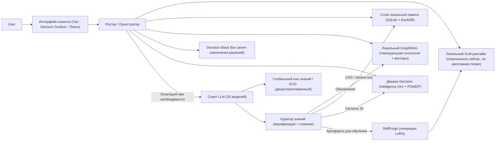

---

## 4) Интерфейсы (Чат, Decision Surface, Поиск)

### 4.1 Чат (привычный режим)
- Полноценный поток в стиле ChatGPT.
- Поддержка нескольких тредов с использованием различных инструментов и моделей.
- Чат — это **входные данные**, а не финальный продукт: Membria извлекает долговечные артефакты (решения, предположения, ссылки, исходы).

### 4.2 Decision Surface (DS)
Ежедневный «главный экран», который суммирует то, что важно, по многим чатам и инструментам:

- **Открытые петли (ранжированные по VoI)**: Нерешенные треды, приоритизированные по ценности информации.
- **Скрытые разногласия**: Сигналы POMDP, обнаруживающие моменты, где поверхностное согласие скрывает реальный скептицизм.
- **Дрифт предположений**: Убеждения, которые изменились со временем или в зависимости от источников.
- **Прецеденты**: Похожие прошлые решения и их исходы.

DS читает данные из **движка Decision Intelligence + графа памяти**, а не из сырой прокрутки чата.

### 4.3 Поиск (редкий, но мощный)
Поиск — это не просто функция «резюмируй мои документы». Это **объяснимое извлечение**:

- Цитирование источников.
- Цепочки связей («почему это следует из того»).
- Контекст с учетом графа (сущности, отношения, метки времени, треды).

---

## 5) Decision Black Box (DBB)

DBB — это агент или процесс, который непрерывно логирует и извлекает «поворотные моменты» из информационных потоков пользователя.
Думайте об этом как о **бортовом самописце для рассуждений**: он фиксирует, *что изменилось*, *что было решено* и *почему*, не прерывая нормальную работу.

### Что хранит DBB (структурированно, а не сырые дампы)
- Кандидаты в решения (предложение -> фиксация -> завершение).
- Предположения и степень уверенности.
- Ссылки на доказательства (сообщения, документы, диффы кода).
- Крючки исходов (что проверить позже и когда).

### Где DBB проявляется в UI
DBB в основном является бэкендом для DS, но он может опционально показывать:
- легкую «ленту активности» (не блокирующую);
- запрос на захват (capture prompt) только тогда, когда уверенность в том, что произошло реальное решение, высока.

DBB не должен быть модальным «синим экраном». Он должен вести себя как инструментарий, а не как принудительный ритуал.

---

## 6) Движок Decision Intelligence (DI)

Движок DI работает поверх DBB и графа памяти для оптимизации совместного обсуждения человека и ИИ.

- **Ценность информации (VoI):** Ранжирует открытые петли по ожидаемой полезности их решения. Он подсказывает вам, *какое* решение требует вашего внимания в первую очередь, исходя из потенциального влияния.
- **Трекинг убеждений POMDP:** Поддерживает вероятностную модель «истинного» состояния консенсуса. Он помечает «Скрытые разногласия», когда явное согласие (например, «+1») сопровождается скептическими метаданными (задержка, противоречивые доказательства, сигналы red-teaming).
- **Последовательность решений:** Рекомендует оптимальный порядок принятия решений для минимизации длительности проекта или риска, выявляя «узкие места» до того, как они заблокируют параллельную работу.

---

## 7) Оркестратор: мозг рантайма

`Роутер / Оркестратор` принимает решения:

- Какая модель запускается (локальная SLM или эскалация).
- Какие слои памяти опрашиваются.
- Является ли цитирование обязательным (в зависимости от контекста).
- Как кэшировать и структурировать выходные данные.

### 7.1 Надежность: Idem-Prompts (вызовы, безопасные для инструментов)
При вызове инструментов, требующих строгого формата (JSON, схемы), оркестратор оборачивает запросы в ограничивающие промпты, чтобы система оставалась детерминированной и безопасной.

### 7.2 Проблема «взрыва контекста»
Membria не держит «всё в промпте».
Вместо этого она использует **динамическую рабочую память** и постоянные хранилища.

---

## 8) Слой локальной памяти (гибридный и иерархичный)

Membria использует гибридный подход — одновременно **встроенный** и **быстрый**:

### 8.1 «Горячая» память (в памяти, на одну задачу)
- черновик сессии;
- активное состояние рассуждений;
- максимально быстрый доступ.

### 8.2 «Теплая» память (персистентность на SQLite)
**SQLite (Транзакционное ядро)**
- метаданные чатов (не обязательно полные сырые логи);
- логи событий (`event_log`);
- настройки пользователя, области источников, права доступа;
- записи Cache-Augmented Generation (CAG), подтянутые из глобального кэша.

Рекомендуемый режим производительности:
- `PRAGMA journal_mode=WAL;`
- хранение JSON через JSON1 для гибких артефактов рассуждений.

### 8.3 «Холодная» память (аналитика DuckDB + векторы)
**DuckDB (Аналитический движок)**
- индекс эмбеддингов для больших наборов документов;
- семантический поиск по фрагментам («ThoughtUnits»);
- аналитика по персональным знаниям и решениям.

Такое разделение позволяет клиенту оставаться легким, обеспечивая при этом быстрый локальный поиск и анализ.

---

## 9) Локальный GraphRAG и «ThoughtUnits»

Клиент нормализует импортированные источники в **ThoughtUnits** (легкий парсинг, а не дорогостоящие рассуждения):

- вопрос;
- решение;
- комментарий;
- обсуждение;
- метка времени, автор, ID треда;
- ссылка на источник.

GraphRAG использует:
- темпоральную онтологию (сущности + отношения во времени);
- векторы для поиска по сходству;
- графовые запросы для построения объяснимых цепочек связей.

---

## 10) Когда локального ИИ недостаточно: Совет + Глобальный кэш

Membria спроектирована так, чтобы большую часть времени работать максимально дешево.
Когда обнаруживается пробел в знаниях, она эскалирует запрос.

### 10.1 Чекпойнт самопознания (Self-knowledge checkpoint)
Локальный эксперт дает ответ, а затем запускает проверку уверенности:
- «Достаточно ли у меня обоснованных доказательств?»
- «Достаточен ли контекст графа?»
- «Не слишком ли высока неопределенность для этого домена?»

Если уверенность низка, оркестратор эскалирует запрос.

### 10.2 Цикл «Совет + кэширование»
- Опрос **Совета LLM** (более мощных моделей).
- Приоритет ответам, уже присутствующим в **Глобальном кэше знаний**.
- Верификация и слияние через **Куратора знаний**.
- Запись обратно:
  - кэшированный ответ + цитаты (CAG);
  - обновления онтологии для GraphRAG;
  - опциональные артефакты обучения для SkillForge (см. следующий раздел).

---

## 11) SkillForge и LoRA-патчи (выборочные, по доменам)

**LoRA-патчи** — это небольшие экспертные адаптеры, которые повышают возможности модели в конкретных областях.
Они не делают модель «умнее в целом», но могут закрыть *повторяющиеся, специфичные для домена* пробелы.

### Важная критика (и правильная постановка задачи)
Велик соблазн сказать: «LoRA накапливаются автоматически на основе выходов системы».
Это может быть правдой **только** при соблюдении строгих критериев качества, потому что:
- ответы Совета могут быть ошибочными или непереносимыми;
- обучение на шумных, ситуативных ответах может закрепить ошибки;
- переобучение на узкий стиль может снизить надежность.

Поэтому генерация LoRA должна быть:
- выборочной (только для повторяющихся пробелов);
- курируемой (данные для обучения берутся из верифицированных, объединенных артефактов);
- ограниченной областью (для конкретного эксперта или домена, а не глобально).

---

## 12) Задержка и «магическая» скорость

RAG по своей природе может быть медленным. Membria смягчает это через:

- **Двухэтапное извлечение:** быстрый поиск кандидатов -> ранжирование с учетом графа.
- **Агрессивное кэширование:** лучший поиск — это тот, которого не было.
- **Адаптивная глубина:** не все вопросы требуют глубокого расширения графа.
- **Оптимистичный UI:** быстрый показ предварительного ответа со статусом «верификация».

---

## 13) Безопасность, конфиденциальность и права доступа

Безопасность обязательна, так как клиент соприкасается со всей вашей рабочей деятельностью.

- **Явный доступ и область видимости** (источники + временные диапазоны).
- **Локальная обработка по умолчанию**, если включен режим self-hosted.
- **Сквозное шифрование (E2EE)** при передаче данных гейтвеям.
- **Модель разрешений для инструментов** (как в мобильных ОС).
- **Песочница** для навыков и агентов.
- **Подпись + репутация** для компонентов маркетплейса (в будущем).

---

## 14) Позиционирование (обновлено)

Membria CE — это не «еще один интерфейс для чат-бота».
Это система, которая позволяет продвинутым пользователям запускать **устойчивый, объяснимый, самосовершенствующийся слой интеллекта** поверх различных инструментов и моделей.

- Для пользователей облака сегодня: вы получаете накапливающийся интеллект без необходимости поддерживать инфраструктуру.
- Для пользователей self-hosted позже: вы получаете ту же систему локально, с возможностью работы офлайн.
- Для всех: **децентрализованный бэкенд знаний** остается общим слоем, который предотвращает «изобретение велосипеда» и обеспечивает верифицированное кэширование.

---

## Приложение: ключевые термины

- **SLM-first:** приоритет малых, дешевых моделей в сочетании с мощной памятью.
- **Council (Совет):** ансамбль эскалации из более мощных моделей.
- **Global Knowledge Cache / KCG:** общие верифицированные артефакты знаний и цитаты.
- **CAG:** генерация с дополнением кэшем (повторное использование верифицированных ответов).
- **GraphRAG:** извлечение данных с использованием графа знаний + векторов + объяснимых цепочек связей.
- **DBB:** Decision Black Box, «бортовой самописец» для решений и поворотных моментов.
- **DS:** Decision Surface, ежедневный обзор, построенный на базе DBB + графа памяти.
- **LoRA:** специализированные адаптеры для повышения экспертизы в конкретных областях.

<!-- END /Users/miguelaprossine/documentation/docs-ru/membria-ce/client.mdx -->


<!-- START /Users/miguelaprossine/documentation/docs-ru/membria-ce/client-runtime.mdx -->

## RFC рантайма клиента
<a id="section-membria-ce-client-runtime"></a>

## 0. Краткое резюме

Клиент Membria CE — это **рантайм**, который находится между пользователем и набором ИИ-возможностей. Он обеспечивает:

- **Привычный чат** (базовый уровень для продвинутых пользователей).
- **Слой устойчивого интеллекта**, который накапливается со временем: память, GraphRAG и экспертные адаптеры навыков (skill adapters).
- **Decision Black Box (DBB)** — «черный ящик решений», извлекающий долговечные артефакты решений из зашумленных рабочих потоков.
- **Decision Surface (DS)** — интерфейс, который читает данные DBB + память (а не сырой чат), показывая то, что важно, с ранжированием по **ценности информации (VoI)**.
- **Движок Decision Intelligence (DI)**, который отслеживает **состояния убеждений POMDP** для обнаружения скрытых разногласий и оптимизирует последовательность принятия решений.
- **Модель выполнения local-first** (при доступности self-hosted версии) с **эскалацией в облако** и **децентрализованным кэшем знаний** для предотвращения сброса интеллекта.

Рантайм клиента должен быть быстрым, предсказуемым и объяснимым. Задержки и «медлительность RAG» должны активно минимизироваться с помощью кэширования, поэтапного извлечения и оптимистичного UX.

---

## 1. Цели

### 1.1 Продуктовые цели
1. **Накопительный интеллект:** знания и рассуждения пользователя должны суммироваться, а не обнуляться в каждом чате/инструменте/модели.
2. **Объяснимость по умолчанию:** ответы должны быть прослеживаемы до источников и артефактов рассуждений (цитаты, цепочки связей, происхождение).
3. **Приоритет локальности (Local-first):** выполнение как можно большего объема работы локально (SLM + память + GraphRAG) при включенном self-hosted режиме.
4. **Выборочная эскалация:** использование дорогих моделей только тогда, когда локальных возможностей + кэша + графа недостаточно.
5. **Захват решений в масштабе:** извлечение поворотных моментов и решений из десятков чатов/инструментов без навязывания специальных ритуалов.
6. **Производительность для продвинутых пользователей:** минимизация трения; поддержка видимости процессов «в стиле терминала» без превращения UI в консоль.

---

## 2. Что не является целью (Non-goals)

- Замена интерфейсов всех внешних инструментов (Slack, Gmail, GitHub, IDE) в версии v1.
- Обучение новой базовой модели (foundation model) с нуля.
- «Абсолютная правда» или гарантированная корректность; вместо этого: **уверенность + происхождение + эскалация**.
- Единая монолитная архитектура типа «один промпт для всего».

---

## 3. Определения и терминология

- **Клиент (Client):** приложение для пользователя + локальные сервисы рантайма (десктоп/мобильное/веб, в зависимости от платформы).
- **SLM:** малая локальная модель, используемая для быстрых и дешевых рассуждений (открытые веса).
- **Council (Совет):** набор более мощных LLM, используемых при эскалации (облако).
- **KCG / Глобальный кэш знаний:** децентрализованный слой, хранящий верифицированные артефакты знаний и их происхождение.
- **CAG:** генерация с дополнением кэшем; повторное использование проверенных ответов и промежуточных артефактов.
- **GraphRAG:** извлечение данных с использованием графа знаний + сходства векторов + ранжирования с учетом графа и цитирования.
- **ThoughtUnit:** нормализованный атомарный фрагмент, извлеченный из источников (сообщение/фрагмент документа) с метаданными.
- **DBB:** Decision Black Box; агент/процесс, который структурно детектирует и логирует решения и поворотные моменты.
- **DS:** Decision Surface; главный интерфейс, построенный на базе DBB + графа памяти.
- **Движок DI:** движок Decision Intelligence; оптимизирует взаимодействие человека и ИИ через скоринг VoI, трекинг состояний POMDP и выстраивание последовательностей.
- **VoI:** ценность информации (Value of Information); ожидаемый прирост полезности от получения дополнительных данных перед принятием решения.
- **POMDP:** частично наблюдаемый марковский процесс принятия решений; используется для отслеживания вероятностного состояния командного консенсуса.

---

## 4. Системный контекст и продуктовые линейки

Membria поставляется как:

1. **Membria Cloud (управляемый сервис)** — первый путь релиза.
2. **Membria Self-Hosted / Local** — последующий путь для выполнения локально/на устройстве.
3. **Децентрализованный бэкенд знаний** — остается в облаке и является общим для всех продуктов (Personal/SMB/Enterprise) с учетом прав доступа и условий владения.

Рантайм клиента должен быть совместим как с облачным, так и с локальным режимами без переписывания интерфейса.

---

## 5. Обзор архитектуры

### 5.1 Основные модули
- **Оболочка UI (UI Shell)**: Чат, Decision Surface, Поиск, панель Источников/Файлов.
- **Оркестратор (Роутер)**: выбирает путь модели, глубину извлечения, вызовы инструментов, стратегию кэширования.
- **Локальные хранилища**: SQLite (транзакционное), DuckDB (аналитическое), хранилище эмбеддингов, хранилище графа.
- **Движок GraphRAG**: индексация, извлечение, ранжирование, сборка цитат.
- **Движок DBB**: прием потока событий -> извлечение -> объекты решений.
- **Движок Decision Intelligence (DI)**: скоринг VoI, байесовское обновление POMDP, оптимизация последовательностей.
- **Шлюз эскалации (Escalation Gateway)**: вызовы Совета, поиск в KCG, контроль затрат.
- **Куратор (Curator)**: верификация, слияние, происхождение, политика обратной записи.
- **SkillForge**: управление LoRA и опциональный рабочий процесс обучения.

---

## 6. Источники данных и индексация (Ingestion)

### 6.1 Поддерживаемые источники (начальные)
- Google Drive (документы, PDF)
- Электронная почта
- Slack
- Экспорт WhatsApp (где это возможно)
- Инструменты чата: Claude Code, логи Codex (CLI-трейсы), экспорт ChatGPT
- Форумы/комментарии (на основе импорта)

---

## 7. Хранение и модель данных

### 7.1 SQLite (транзакционное ядро)
**Цель:** быстрая локальная запись, состояние синхронизации, метаданные, логи событий, права доступа.

Рекомендуемые таблицы:
- `sources`, `thought_units`, `threads`, `events`, `decisions`, `decision_links`, `cache_entries`, `skills`.

---

## 12. Движок Decision Intelligence (DI)

### 12.1 Миссия
Движок DI оптимизирует цикл принятия решений, обрабатывая сигналы DBB и данные графа.

### 12.2 Возможности
- **Скоринг VoI:** Динамически вычисляет ценность информации для каждой «Открытой петли». Если решение имеет высокие ставки, но мало данных, его VoI растет, поднимая его в топ DS.
- **Трекинг убеждений POMDP:** Моделирует консенсус как скрытое состояние. Использует байесовские обновления на основе сигналов взаимодействия для обнаружения «Поверхностного согласия» (высокое явное согласие при низкой уверенности в консенсусе).
- **Последовательность (очередь приоритетов):** Использует детерминированную очередь приоритетов (VoI, срочность, «блокирующая сила») для рекомендации порядка решений без MCTS-симуляций.

---

## 13. Decision Surface (DS)

### 13.1 Почему DS — это главный экран
Продвинутые пользователи тонут в контексте. DS отвечает на вопросы:
- «Что открыто?»
- «Где произошел дрифт?»
- «Что должно быть решено?»
- «Что мы решили раньше и к чему это привело?»

### 13.2 DS читает DBB, а не чат
DS строится на основе:
- **Открытых петель, ранжированных по VoI** (нерешенные треды, приоритизированные по потенциальной полезности).
- **Оповещений о скрытых разногласиях** (предупреждения на базе POMDP о низком консенсусе).
- **Дрифта предположений** (убеждения, изменившиеся со временем/источниками).
- **Прецедентов** (похожие прошлые решения и их исходы).
- Состояния отслеживания исходов.

### 13.3 Карточки DS (понятная терминология)
Избегайте жаргона в названиях по умолчанию. Используйте понятные метки:
- Открытые петли (Open loops)
- Решения, ожидающие подтверждения
- Изменившиеся предположения
- Похожие прошлые выборы (прецеденты)
- Нехватка доказательств / неясности

Сложные метки могут быть доступны в «экспертном режиме».

---

## 18. Дорожная карта (Roadmap рантайма)

1. Облачный MVP: Чат + Источники + объяснимое извлечение + кэширование.
2. DBB MVP: извлечение решений из чата + минимальный DS.
3. Фаза Decision Intelligence: ранжирование по VoI и трекинг убеждений POMDP.
4. Цикл Совет + Куратор + кэширование KCG.
5. Рантайм self-hosted: локальный SLM + локальные хранилища + локальный GraphRAG.
6. SkillForge: курируемые обновления LoRA + среда оценки.
7. GPU-ускорение: опциональное ускорение ранжирования графа и эмбеддингов.

<!-- END /Users/miguelaprossine/documentation/docs-ru/membria-ce/client-runtime.mdx -->


<!-- START /Users/miguelaprossine/documentation/docs-ru/membria-ce/dbb-and-lora-runtime.mdx -->

## Эвристика DBB и маршрутизация LoRA
<a id="section-membria-ce-dbb-and-lora-runtime"></a>

## 1. Decision Black Box (DBB)

### 1.1 Цель

Decision Black Box (DBB) — это фоновый агент рассуждений, отвечающий за:
- Детектирование именно решений, а не просто разговоров.
- Извлечение контекста рассуждений в момент принятия решения.
- Сохранение каузальной (причинно-следственной) структуры для Decision Surface (DS).
- Предоставление сигнальных данных для **Decision Intelligence** (скоринг VoI и обновление POMDP).
- Бесшумную работу без прерывания рабочих процессов пользователя.

DBB — это не функция интерфейса. Это система времени выполнения (inference-time), которая превращает зашумленные потоки взаимодействия в долговечные записи о решениях.

---

## 2. Входные потоки DBB

DBB обрабатывает несколько потоков данных от пользователя:
- Диалоги с ИИ (Membria, Claude, Codex и т. д.).
- Коммиты кода / диффы.
- Документы и заметки.
- Описания задач.
- Явные действия пользователя (принять, отклонить, развернуть, слить).

Все потоки рассматриваются как неструктурированные сигналы.

---

## 3. Эвристика детектирования решений

DBB не полагается на один классификатор. Он использует композицию эвристик со скорингом уверенности.

### 3.1 Типы сигналов решений

Каждое обнаруженное событие оценивается по следующим измерениям:

| Тип сигнала | Описание |
| --- | --- |
| Язык обязательств | «Мы сделаем», «Давайте», «Я выбираю», «Окончательное решение» |
| Необратимость | Действия, влекущие затраты или фиксацию (деплой, мерж, оплата) |
| Закрытие альтернатив | Явный отказ от других вариантов |
| Темпоральная привязка | Ссылки на дедлайны, таймлайны, следующие шаги |
| Утверждение ответственности | «Я решил», «Мы договорились», «Я одобряю» |
| Триггер исполнения | Последующие задачи, изменения в коде, события календаря |

---

## 4. Модель скоринга уверенности

DBB присваивает бал уверенности в решении (Decision Confidence Score, DCS) в диапазоне [0.0 - 1.0].

### 4.1 Формула скоринга (концептуальная)

DCS = sum(weight_i * signal_i) - ambiguity_penalty

Где:
- signal_i в диапазоне [0,1].
- веса калибруются пользователем со временем.
- штраф за двусмысленность (ambiguity penalty) растет при:
  - использовании спекулятивного языка;
  - условных формулировках;
  - гипотетическом времени глаголов.

### 4.2 Диапазоны уверенности

| Диапазон DCS | Классификация | Поведение |
| --- | --- | --- |
| >= 0.75 | Подтвержденное решение | Немедленно записывается в DBB |
| 0.45 - 0.75 | Предварительное решение | Сохраняется как временное, выводится мягко |
| < 0.45 | Исследование | Игнорируется для DS, хранится только как контекст |

---

## 5. Обработка ложных срабатываний (Модель без трения)

DBB исходит из того, что ложные срабатывания неизбежны.

### 5.1 Цикл коррекции

Предварительные решения появляются в DS как сигналы с низким приоритетом. Пользователь может:
- Подтвердить.
- Пометить как исследование.
- Игнорировать.

Все действия выполняются в один клик, асинхронно и без модальных окон.

---

## 6. Схема вывода DBB (абстрактная)

Каждое записанное решение включает:
- ID решения.
- Метку времени.
- Балл уверенности.
- Трассировку рассуждений (структурированное резюме).
- Ссылки на источники (ID чатов, хеши коммитов, документы).
- Обнаруженные предположения.
- Изначальное предсказание (если доступно).
- **Сигналы DI:** Задержка ответа, скептические маркеры, признаки избыточности и дельты уверенности для обновления состояния убеждений.

---

## 7. Связь с Decision Surface (DS)

- DS читает только выходы DBB.
- Сырая история чата никогда не выводится напрямую.
- DS отображает:
  - **Открытые петли, ранжированные по VoI.**
  - **Скрытые разногласия (POMDP).**
  - Дрифт.
  - Нерешенные предположения.
  - Дельты исходов.

DBB предоставляет «сырую» структурную истину; **движок Decision Intelligence** обеспечивает приоритизацию и наложения состояний убеждений.

---

## 8. Интеграция с движком Decision Intelligence (DI)

DBB является основным «сенсором» для движка DI.

### 8.1 Цикл скоринга VoI
DBB извлекает из потока данных информацию о «ставках» и «недостающих данных». Движок DI использует их для расчета **ценности информации (VoI)**, которую DS применяет для ранжирования открытых петель.

### 8.2 Обновление убеждений POMDP
DBB фиксирует подпороговые метаданные:
- задержку ответов между членами команды;
- паттерны скептических вопросов;
- сигналы red-teaming.
Эти данные передаются как сигналы в трекер **POMDP (Partially Observable Markov Decision Process)** движка DI для обнаружения «поверхностного согласия».

---

## 9. Политика роутера LoRA

Membria не полагается на одну монолитную модель. Вместо этого:
- Базовая SLM обрабатывает большинство взаимодействий.
- Адаптеры LoRA предоставляют доменную экспертизу.
- Эскалация происходит только при недостаточной уверенности.

---

## 10. Типы LoRA

| Тип LoRA | Область действия |
| --- | --- |
| Персональная LoRA | Один пользователь |
| Доменная LoRA | Воркспейс / проект |
| LoRA задачи | Узкая функция (например, юридический обзор) |
| LoRA от Совета | Очищенный синтез экспертных оценок |

---

## 13. Политика маршрутизации (По умолчанию)

### 13.1 Обычный путь (около 80-90%)

Базовая SLM + персональная LoRA (если есть) + локальный GraphRAG.

Используется, когда:
- Уверенность >= порога.
- Запрос в рамках известного домена.
- Нет противоречивых сигналов.

### 13.2 Путь эксперта

Базовая SLM + персональная LoRA + доменная LoRA + локальный GraphRAG.

Триггер:
- Сильное соответствие домену.
- Прошлые оценки показывают пользу LoRA.
- Уверенность пограничная, но приемлемая.

### 13.3 Путь эскалации

Триггер:
- Уверенность < минимального порога.
- Обнаружены противоречивые рассуждения.
- Контекст решения с высоким риском.

---

## 17. Ключевые принципы проектирования

- Решения > разговоры.
- Тишина > прерывание.
- Персональная калибровка > глобальная оптимизация.
- Эскалация только при необходимости.
- Никогда не скрывать неопределенность.

---

## 18. Резюме

DBB гарантирует, что важные моменты фиксируются без усилий со стороны пользователя. Маршрутизация LoRA обеспечивает накопление экспертизы без потери доверия. Вместе они формируют костяк рассуждений Membria CE.

<!-- END /Users/miguelaprossine/documentation/docs-ru/membria-ce/dbb-and-lora-runtime.mdx -->


<!-- START /Users/miguelaprossine/documentation/docs-ru/membria-ce/diagrams.mdx -->

## Диаграммы рантайма
<a id="section-membria-ce-diagrams"></a>

> Этот файл содержит справочные диаграммы для рантайма Membria CE.
> Все диаграммы используют Mermaid, поэтому они могут отображаться в пайплайнах GitHub/GitLab и в документации.

---

## 1) Обзор системы

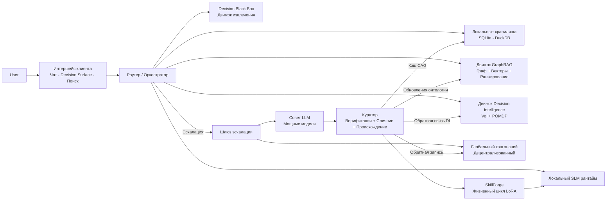

---

## 2) Дерево принятия решений о маршрутизации запросов

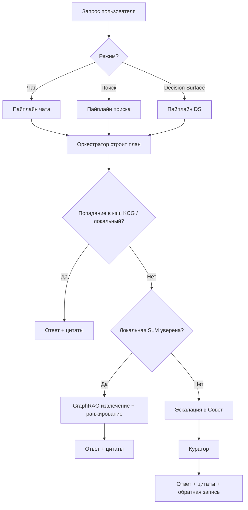

---

## 3) Пайплайн индексации (холодный старт)

```mermaid
flowchart LR
  A["Источники (Drive - Email - Slack - Логи)"] --> B["Структурный парсинг (без тяжелых рассуждений)"]
  B --> C["ThoughtUnits (ts, автор, тред, uri, тип)"]
  C --> D[Дешевые эмбеддинги]
  D --> E[Семантическая кластеризация]
  E --> F["Скелет рассуждений (только форма)"]
  F --> G["Консервативные эвристики (флаги дрифта/стабильности)"]
  G --> H[Кандидаты DBB + обновления графа]
  H --> I[DS готов к отрисовке]
```

---

## 4) Жизненный цикл Decision Black Box (DBB)

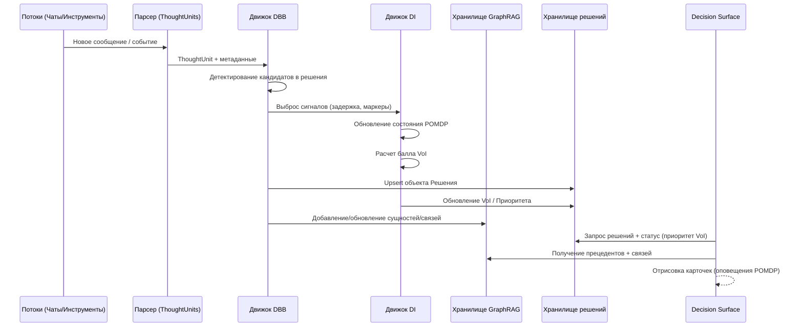

---

## 5) Эскалация в Совет + цикл кэширования

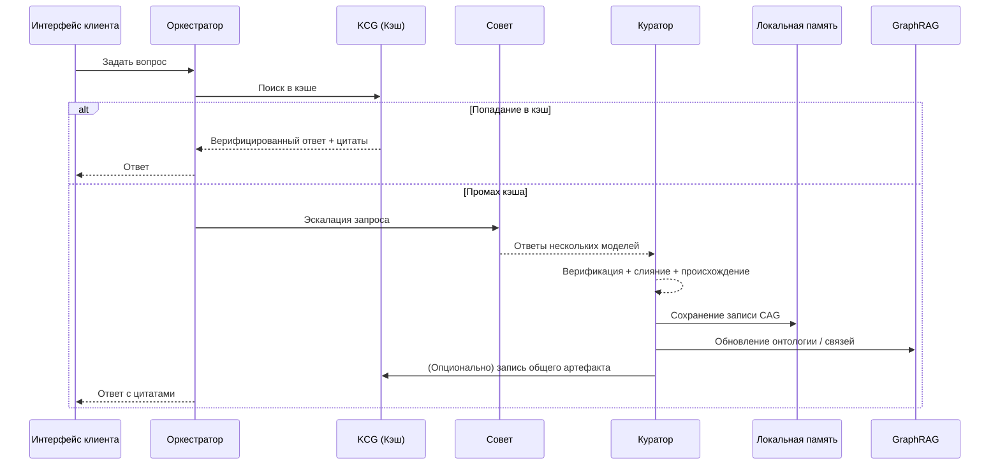

---

## 6) Цикл Decision Intelligence

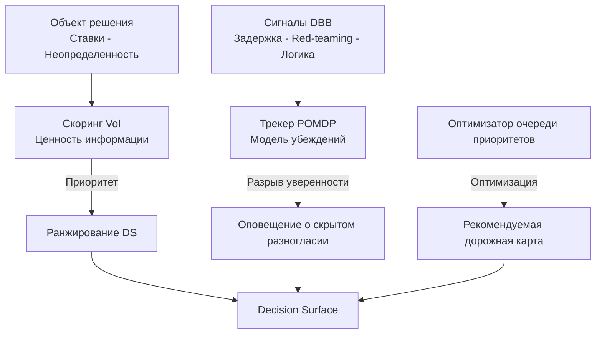

<!-- END /Users/miguelaprossine/documentation/docs-ru/membria-ce/diagrams.mdx -->


<!-- START /Users/miguelaprossine/documentation/docs-ru/membria-ce/technical.mdx -->

## Разделение системной архитектуры
<a id="section-membria-ce-technical"></a>

## Двухуровневая система

Membria CE разделена на:

1. **Клиентский слой:** Decision Black Box (DBB) + Decision Surface (DS) + **Движок Decision Intelligence (DI)**
2. **Бэкенд-слой:** Knowledge Cache Graph (KCG) + DoD + Peaq + Arweave + Консенсус гейтвеев

Клиент фиксирует истину решений и оптимизирует выбор локально; бэкенд обрабатывает эскалации знаний и обеспечивает неизменяемое хранение.

## Клиентский слой (DBB + DS + DI)

- Наблюдает за потоками взаимодействий (чат, файлы, инструменты).
- Детектирует моменты принятия решений и «замораживает» рассуждения.
- Автоматически вычисляет ценность информации (VoI) и трекает убеждения (POMDP).
- Записывает неизменяемые записи о решениях (исходы добавляются в режиме append-only).
- Отрисовывает карточки сигналов: открытые петли, скрытые разногласия, дрифт, ожидаемые результаты.

## Бэкенд-слой (KCG + гейтвеи)

- Обрабатывает DoD-эскалации и рассуждения Совета ИИ (Council).
- Сохраняет полезную нагрузку знаний (knowledge payloads) в Arweave, используя Peaq в качестве слоя логики и консенсуса.
- Использует валидаторы гейтвеев для верификации знаний, пакетной обработки событий консенсуса и поддержки индексов.
- Предоставляет путь чтения для клиентов через SCR-бандлы и извлечение с приоритетом кэша.

## Модели данных

- `DecisionEvent` (клиент): неизменяемая запись о решении, без сырого чата.
- `KnowledgeEvent` (бэкенд): верифицированная полезная нагрузка знаний со связкой ArTxID + событие Peaq.
- `Outcome` (клиент): результаты в режиме append-only; не изменяет исходную запись о решении.

## Сквозной поток (End-to-end flow)

1. Клиент фиксирует решение (DBB) и выводит сигналы (DS + DI).
2. Если уверенность низка или требуются внешние знания, клиент инициирует DoD.
3. Совет на бэкенде генерирует проверенное знание, записывает его в KCG (Peaq + Arweave).
4. Клиент сохраняет верифицированную ссылку, не меняя оригинальное решение.

<!-- END /Users/miguelaprossine/documentation/docs-ru/membria-ce/technical.mdx -->


<!-- START /Users/miguelaprossine/documentation/docs-ru/membria-ce/decentralized-backend.mdx -->

## Децентрализованный бэкенд
<a id="section-membria-ce-decentralized-backend"></a>

> Membria CE использует децентрализованный бэкенд для верификации, хранения и совместного использования артефактов знаний, которые выходят за рамки локальной уверенности. Этот бэкенд отделен от рантайма клиента и вызывается только при необходимости эскалации.

## Аннотация

Membria использует гибридную блокчейн-архитектуру, которая разделяет графовую логику и постоянное хранение данных. Протокол Peaq управляет транзакционной графовой логикой и консенсусом, в то время как Arweave хранит неизменяемые полезные данные (payloads). Система спроектирована для поддержки дистилляции по требованию (Distillation on Demand, DoD): результаты работы мощных LLM-учителей верифицируются, записываются как неизменяемые события и передаются обратно локальным моделям через генерацию с дополнением кэшем (CAG).

## 1: Ядро архитектуры — симбиотическая гибридная модель

Membria задействует две специализированные сети:

- Протокол Peaq: слой логики и графа.
- Arweave: слой постоянного хранения данных.

### Peaq Protocol — слой логики и графа

Peaq обрабатывает темпоральный семантический граф (Temporal Semantic Graph) как DAG (направленный ациклический граф) неизменяемых событий. Каждое событие подписывается и включает такие поля, как актор, метка времени и причина, создавая проверяемую историю.

### Arweave — слой постоянного хранения

Arweave хранит тяжелые полезные данные (верифицированные ответы, артефакты знаний). Peaq хранит легкие заголовки и ссылки на транзакции Arweave, чтобы операции в чейне оставались быстрыми.

### Общая схема

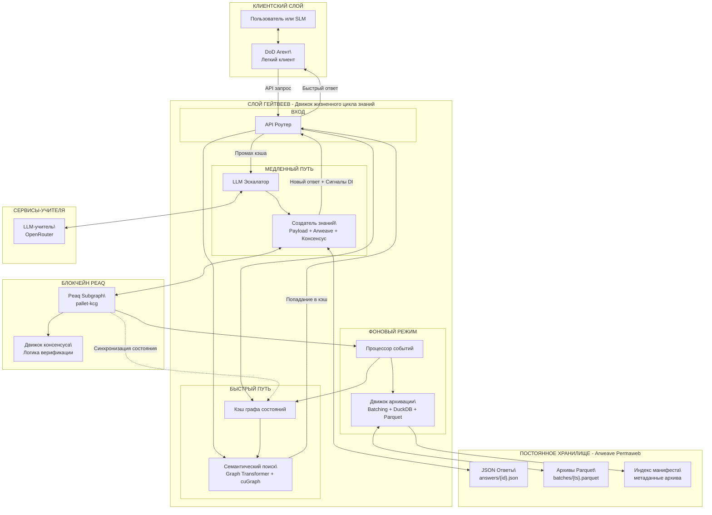

## 2: Децентрализованный граф знаний (DKG) — слои и компоненты

### Слой онтологии — гибкие словари

- Словари — это многоразовые коллекции концепций и отношений для конкретной области.
- Публичные словари (например, Schema.org) могут быть использованы повторно; поддерживаются приватные словари для кастомных доменов.
- Определения онтологий существуют как генезис-события в Peaq.

### Слой знаний — верифицированные ответы как цепочки событий

- Исполняемые семантические модели (Executable Semantic Models) определяют схему и правила валидации для каждого типа знаний.
- Верифицированные ответы хранятся как цепочки событий, связанных полями причин (cause), создавая полный аудиторский след.

## 3: Жизненный цикл знаний — пошаговый протокол

Система рассматривает эскалацию запроса как намерение «Запрос на дистилляцию знаний» (Knowledge Distillation Request).

### Шаг 1: Определение контракта знаний в Peaq

Эксперты развертывают исполняемую семантическую модель (BSL или эквивалент) как генезис-событие. Это определяет правила для валидных записей знаний.

### Шаг 2: Предложение новых знаний

DoD-агент получает ответ от LLM-учителя, записывает полезную нагрузку в Arweave и предлагает её в Peaq.

### Шаг 3: Консенсус гейтвеев

Гейтвеи проверяют предложение на соответствие контракту и голосуют через транзакции Peaq (пакетно, где это возможно).

### Шаг 4: Финализация результата

Событие валидации записывается в Peaq с финальным статусом и баллом уверенности. Этот результат возвращается клиенту вместе с **сигналами DI** (например, дельтой состояния убеждений для трекера POMDP) для обновления Decision Surface.

## 4: Протокол записи в Arweave

1. Запускается после ответа LLM-учителя и перед предложением в Peaq.
2. Полезная нагрузка собирается в формате JSON-LD для машиночитаемой семантики.
3. Создается и тегируется транзакция Arweave.
4. Транзакция подписывается и транслируется (допускается объединение в бандлы для снижения стоимости).
5. Arweave возвращает ArTxID.

## 10: Заключение

Arweave обеспечивает персистентность, а Peaq — логику и верификацию. Вместе они создают децентрализованный граф знаний, который доступен для аудита, эффективен по стоимости и может использоваться повторно на разных устройствах и разными пользователями.

<!-- END /Users/miguelaprossine/documentation/docs-ru/membria-ce/decentralized-backend.mdx -->


<!-- START /Users/miguelaprossine/documentation/docs-ru/membria-ce/kcg-gateways.mdx -->

## KCG и гейтвеи (бэкенд)
<a id="section-membria-ce-kcg-gateways"></a>

## Ответственность только на стороне бэкенда

KCG + DoD + Peaq + Arweave — это бэкенд для Membria CE, независимо от того, запускается ли клиент на устройстве или в облаке. Клиентский слой никогда не пишет в граф напрямую; он только инициирует DoD-эскалацию (Distillation on Demand), когда требуются внешние знания.

## Гибридная архитектура

- **Peaq:** слой логики/графа, упорядочивание событий, правила консенсуса.
- **Arweave:** неизменяемое хранилище для полезной нагрузки (ответы JSON-LD, архивы, манифесты).
- **Гейтвеи:** валидаторы + индексаторы, которые читают из Arweave и подтверждают консенсус в Peaq.

## Краткий обзор жизненного цикла

1. **Определение контракта знаний** в Peaq (исполняемая семантическая модель).
2. **Запись полезной нагрузки**: DoD-агент упаковывает JSON-LD, тегирует его, загружает в Arweave и получает ArTxID.
3. **Предложение в Peaq**: легкое событие связывает полезную нагрузку с исходным запросом через поле `cause`.
4. **Консенсус гейтвеев**: валидаторы получают, проверяют и голосуют (пакетно для снижения затрат).
5. **Финализация**: событие валидации закрывает намерение (Intent); знание становится доступным для запросов. Гейтвей возвращает результат вместе с **сигналами DI** (сдвиги состояний VoI/POMDP) клиенту.

## Путь чтения гейтвея

Гейтвеи никогда не читают чаты. Они:

- Проверяют «горячий» кэш.
- Обращаются к семантическим и векторным индексам.
- Извлекают конкретную полезную нагрузку из Arweave по ArTxID.
- Собирают SCR-бандлы (Selective Context Retrieval) для клиента.
- Эскалируют запрос к LLM-учителям только при низкой уверенности.

## Индекс и конфиденциальность

- «Горячий» кэш + семантический + векторный + ArTx индексы обеспечивают низкую задержку.
- Полезная нагрузка может быть зашифрована (шифрование перед сохранением с использованием CEK и событий KeyGrant).
- Форки разрешаются через MergeEvents; пакетная обработка и канонические хеши гарантируют идемпотентность.

## Почему это важно

Бэкенд-граф является источником истины для обновлений знаний, эскалаций в Совет и неизменяемого хранения. Клиент фиксирует решения; бэкенд верифицирует и хранит знания. Они разделены на уровне архитектуры, но взаимосвязаны через DoD для подпитки **движка Decision Intelligence** на стороне клиента.

<!-- END /Users/miguelaprossine/documentation/docs-ru/membria-ce/kcg-gateways.mdx -->


<!-- START /Users/miguelaprossine/documentation/docs-ru/membria-ce/security-privacy.mdx -->

## Безопасность и конфиденциальность
<a id="section-membria-ce-security-privacy"></a>

## Модель безопасности и конфиденциальности

Membria CE спроектирована на основе модели безопасности local-first (приоритет локальности).
Ваши данные, рассуждения и решения принадлежат вам и по умолчанию остаются под вашим контролем.

Система построена так, чтобы минимизировать ненужные перемещения данных, избегать скрытого повторного использования информации и делать каждую эскалацию явной и проверяемой.

---

## Область данных и право собственности

Membria не сканирует и не индексирует источники данных автоматически.

Вы явно выбираете:
- какие источники подключены;
- какие временные диапазоны индексируются;
- какой контент включается или исключается.

Только выбранные данные становятся частью локального контекста рассуждений и графа знаний. Логи чатов не рассматриваются как основное хранилище; вместо них сохраняются решения и производные структуры.

Вы сохраняете полное право собственности на:
- исходные данные;
- производные знания;
- историю решений;
- локальные эмбеддинги и графы;
- **состояния убеждений POMDP и рейтинги приоритизации на базе VoI**.

---

## Обработка данных local-first

В режимах self-hosted и local-first:
- исходные данные остаются на вашем устройстве или в приватной среде;
- рассуждения и вывод (inference) происходят локально, когда это возможно;
- фоновая синхронизация не происходит без явных триггеров.

Локальные данные никогда скрытно не загружаются и не используются повторно для других пользователей. Membria спроектирована для работы в офлайн-режиме для выполнения основных рассуждений и захвата решений.

---

## Эскалация и внешнее взаимодействие

Когда локальных моделей недостаточно, Membria может выборочно эскалировать запрос.

Эскалация:
- инициируется только при достижении определенных порогов уверенности или риска;
- ограничена минимальным необходимым контекстом;
- логируется с указанием времени, цели и результата.

Эскалированные запросы никогда не включают в себя все ваше рабочее пространство или полную историю. Результаты верифицируются, дистиллируются и сохраняются как структурированные знания, а не как сырые транскрипты. Все эскалации видимы и подлежат аудиту.

---

## Децентрализованный бэкенд знаний

Membria может опционально использовать децентрализованный бэкенд для:
- повторного использования верифицированных знаний;
- кэширования результатов;
- сохранения данных между сессиями.

Этот бэкенд:
- адресуется по контенту;
- работает только на добавление (append-only);
- предназначен для верификации, а не для вывода (inference).

Он не заменяет локальные рассуждения и не действует как центральный «мозг» ИИ. Его роль — сохранение, прослеживаемость и повторное использование знаний.

---

## Контроль доступа и отзыв прав

Доступ к источникам предоставляется на основе разрешений и может быть отозван в любое время.

Вы можете:
- мгновенно отключить источники;
- удалить индексированные данные;
- очистить производные структуры знаний;
- сбросить локальную память и графы.

Отзыв прав не требует перезагрузки системы или внешнего одобрения.

---

## Прозрачность и аудит

Membria не скрывает неопределенность.

Вы можете проверить:
- когда были зафиксированы решения;
- какой контекст использовался;
- происходила ли эскалация;
- какие предположения были записаны.

В системе нет скрытых оптимизаций, тайного дообучения моделей или скрытых фоновых циклов обучения.

---

## Чего не делает Membria

Membria CE не:
- обучает глобальные модели на ваших данных;
- делится вашими данными с другими пользователями;
- оптимизирует работу ради рекламы или вовлеченности;
- собирает поведенческую аналитику, не связанную с функциями продукта.

---

## Резюме

Membria CE рассматривает безопасность и конфиденциальность как архитектурные ограничения, а не просто как обещания политики.

Локальные рассуждения — в приоритете.
Эскалация — явная.
Персистентность — под контролем.
Доверие заслуживается через прозрачность, а не через абстракцию.

<!-- END /Users/miguelaprossine/documentation/docs-ru/membria-ce/security-privacy.mdx -->


<!-- START /Users/miguelaprossine/documentation/docs-ru/membria-ce/deployment-hosting.mdx -->

## Развертывание и хостинг
<a id="section-membria-ce-deployment-hosting"></a>

## Облако
Membria Cloud — это начальный путь управляемого развертывания. Рантайм клиента работает в управляемой среде и подключается к децентрализованному бэкенду знаний.

## Self-hosted (планируется)
Self-hosted CE будет запускать локальную SLM, память, GraphRAG и **движок Decision Intelligence** на устройстве с возможностью эскалации в Совет.

## Размещение данных
- В режиме self-hosted локальная память остается на устройстве.
- При эскалации передаются только сам запрос и необходимый контекст.

<!-- END /Users/miguelaprossine/documentation/docs-ru/membria-ce/deployment-hosting.mdx -->


<!-- START /Users/miguelaprossine/documentation/docs-ru/membria-smb/overview.mdx -->

## Обзор
<a id="section-membria-smb-overview"></a>

## Membria для SMB (Managed SaaS): долговременная память решений

Membria для малого и среднего бизнеса (SMB) — это управляемая AI-среда, которая превращает разговоры команды и документы в общую корпоративную память решений.

В ее основе лежит слой долговременной памяти решений Membria (Reasoning Graph) — общая среда рассуждений и решений, которая фиксирует, кто что решил, почему и с каким результатом, объединяя команды и инструменты.

Вместо изолированных чатов и разрозненных документов Membria для SMB выстраивает долговременный граф знаний, в котором команды могут вести поиск, проводить аудит и учиться со временем. Решения не исчезают в логах чатов — они становятся многоразовыми прецедентами.

Membria для SMB разработана для команд в сфере профессиональных услуг, которым нужен общий контекст, быстрый онбординг и корпоративное управление (governance) — без сложностей корпоративной эксплуатации. Система внедряет **слой Decision Intelligence**, который использует **ценность информации (VoI)** для приоритизации задач и **POMDP-трекинг убеждений** для обнаружения скрытых разногласий, гарантируя, что команда сфокусирована на главном.

## Какую проблему она решает

Большинство команд работают в десятках чатов и систем документооборота. Результат — фрагментированные знания: решения теряются, причины забываются, а новая работа повторяет старые ошибки.

Membria исправляет проблему «ненакопительного» интеллекта, превращая повседневную работу (документы, чаты, заметки, треды) в устойчивые, доступные для запросов знания с непрерывностью принятия решений. Основная ценность здесь в поиске, доверии и повторном использовании знаний во времени.

## Категория и слоган

**Категория:** Корпоративная память решений (Institutional Decision Memory)  
**Слоган:** «ИИ, который помнит ПОЧЕМУ»

## Для кого это

Membria для SMB подходит командам, которым нужен общий контекст без сложности корпоративного развертывания:

- Малые и средние команды, полагающиеся на документы и прошлые наработки.
- Кросс-функциональные группы, где решения принимаются в разных местах (чат, доки, тикеты).
- Сферы с интенсивным документооборотом (юриспруденция, бухгалтерия, консалтинг, агентства, недвижимость).
- Команды, которым нужны корпоративное управление и прослеживаемость решений (кто/когда/почему) без избыточных корпоративных надстроек.

Типичный размер команды: от 10 до 250 пользователей. Общий паттерн — высокий объем документов, их частое повторное использование и нулевая толерантность к галлюцинациям.

## Что вы получаете

Membria SaaS дает профессиональным командам четыре возможности, которые обычные ассистенты не предоставляют вместе:

### 1) Связанный поиск по всему массиву (GraphRAG)

Membria не просто находит похожие документы. Она связывает родственные факты из разных источников и выдает структурные результаты:

- какой документ релевантен;
- какой абзац или страница подтверждают ответ;
- к какому решению или прецеденту это относится;
- как это связано с другими кейсами или проектами во времени.

Так вы переходите от 15 документов с упоминанием термина к 3 прецедентам, которые реально подходят под сценарий.

### 2) Ответы аудиторского уровня (доказательства, а не ощущения)

Для каждого важного утверждения Membria может показать источник:

- цитирование источника;
- прослеживаемые цепочки (как несколько улик подтверждают вывод);
- логи запросов и доступа (кто спрашивал, что и когда).

Это критично для регулируемых сфер (аудит, право, финансы) и для любой команды, которой нужно защищать решения перед клиентами.

### 3) Накопительная экспертиза (знания + LoRA-патчи)

Membria может работать на базовой модели и улучшать свое поведение в предметной области с помощью двух рычагов:

- Слой знаний: растущий граф и память извлечения, которые улучшают обоснованность и сокращают повторную работу.
- LoRA-патчи: небольшие экспертные адаптеры, которые учат модель вести себя в соответствии с вашей практикой (форматирование, терминология, структура ответов, интерпретация политик).

Суть не в том, чтобы модель стала «умнее» в общем смысле. Суть в том, чтобы она стала полезнее в вашем домене и реже требовала эскалации.

### 4) Память, ориентированная на решения (почему и результат)

Membria оптимизирована для превращения активности в многоразовые знания:

- извлечение решений из рабочих процессов (мемо, треды, анализ, обсуждения);
- захват обоснований и предположений (во что мы верили в тот момент);
- отслеживание исходов (что произошло после).

Это делает систему ценной и на 30-й, и на 90-й день, потому что она может подсвечивать паттерны и дрифт, а не просто резюмировать.

## Как это работает на практике

Вы по-прежнему используете Membria как обычный чат, когда хотите. Разница в том, что чат — это не финальный продукт. Membria непрерывно выстраивает общий слой знаний на основе вашей работы и поддерживает его актуальность. Через несколько недель ваша команда начинает быстрее находить прецеденты, повторно использовать прошлые решения и избегать путаницы.

## Как устроена Membria SaaS (верхний уровень)

1. Подключение источников: документы, инструменты коллаборации и структурированные системы.
2. Сбор и нормализация: парсинг, дедупликация, классификация, извлечение сущностей и событий.
3. Построение слоя знаний: векторный индекс + связи в графе + таймлайны.
4. Ответ с обоснованием: извлечение + рассуждение + цитаты.
5. Обучение в процессе: обратная связь, исправления, результаты и проверенные паттерны улучшают будущие ответы.
6. Эскалация только при необходимости: перенаправление на более мощные модели и кэширование верифицированных ответов.

## Реальные примеры

### Бухгалтерия и аудит

- Найти похожие ситуации у клиентов, где пассивный доход превысил порог, и узнать, какой подход сработал.
- Показать прецедент и конкретные разделы, на которые мы ссылались в прошлом году.
- Что изменилось в политике с последнего цикла аудита и какие рабочие документы это затронуло?

### Юриспруденция

- В каких прошлых контрактах было подобное условие и какая позиция в переговорах сработала?
- Показать след решения: кто одобрил исключение, почему и что произошло потом.

### Консалтинг

- Составить черновик предложения, используя наши лучшие шаблоны, и привести в пример сопоставимые результаты из прошлого.
- Найти последний раз, когда мы пробовали эту стратегию, и понять, почему она провалилась.

## Чем это отличается от обычных чат-ассистентов

Обычные ассистенты могут отвечать на вопросы, но они не сохраняют контекст вашей команды надежно на протяжении месяцев и в разных инструментах. Membria создана для того, чтобы поддерживать знания и решения живыми, несмотря на смену проектов, людей или обновление моделей, обеспечивая цитирование и прослеживаемость.

В большинстве фирм они сосуществуют:

- ChatGPT или Copilot для типовых задач.
- Membria для корпоративной памяти, поиска прецедентов, аудиторских рассуждений и трекинга решений.

## Безопасность и управление (SaaS)

Membria для SMB создана для команд, работающих с чувствительными данными клиентов:

- контроль доступа на уровне пользователя и домена;
- журналы аудита;
- настраиваемые политики хранения данных;
- варианты развертывания и хранения данных в соответствии с требованиями регуляторов (зависит от тарифного плана).

Если вам требуется строгое локальное хранение данных или развертывание on-prem, Membria EE — ваш корпоративный путь.

## Модель развертывания

Membria для SMB — это прежде всего SaaS для быстрого запуска и минимальных настроек. Общий слой знаний поддерживается в облаке, при этом команды сохраняют контроль над тем, что остается приватным, а что становится общим на уровне рабочего пространства.

## Когда не стоит использовать Membria SaaS

Membria не подходит, если:

- вам нужен только помощник для написания текстов;
- в вашей работе низкая доля повторного использования и низкие риски;
- вы не можете подключить источники данных (нечего индексировать);
- вам требуется полная установка on-prem с первого дня (используйте Membria EE).

## Резюме

Membria SaaS — для профессиональных команд, где документы — это и есть работа, решения должны быть аргументированы, а знания должны накапливаться.

Она превращает разрозненные файлы и разговоры в живой корпоративный мозг: обоснованные ответы, связанные прецеденты и память решений, которая улучшается с каждым использованием.

<!-- END /Users/miguelaprossine/documentation/docs-ru/membria-smb/overview.mdx -->


<!-- START /Users/miguelaprossine/documentation/docs-ru/membria-smb/getting-started.mdx -->

## Начало работы
<a id="section-membria-smb-getting-started"></a>

> Это руководство проведет вас через первые шаги настройки Membria для SMB.
> Цель проста: быстро запустить работу с общим контекстом без лишних накладных расходов на настройку.

Membria спроектирована так, чтобы вы могли увидеть пользу еще до того, как завершится полная индексация данных.

---

## Шаг 1: Создание рабочего пространства

Рабочее пространство представляет собой одну команду или организацию.
При создании рабочего пространства вы:
- определяете границы общего контекста;
- устанавливаете права владения и администрирования;
- изолируете данные, области LoRA и логи аудита.

Лучшая практика: одно рабочее пространство на одну компанию или независимую команду.

---

## Шаг 2: Приглашение членов команды

Пригласите коллег, которые участвуют в принятии решений или используют общие знания.
Роли по умолчанию:
- **Admin**: управляет источниками, доступом и настройками.
- **Member**: запрашивает, дополняет и проверяет знания.

Membria лучше всего фиксирует поток решений, когда к работе присоединяются хотя бы 3-5 человек.

---

## Шаг 3: Подключение общих источников

Подключите системы, в которых ваша команда уже работает (Drive, SharePoint, вики, внутренние заметки).
Для каждого источника определите, кто имеет к нему доступ и участвует ли он в формировании общего слоя рассуждений. Membria соблюдает существующие границы доступа.

---

## Шаг 4: Запуск первоначальной индексации

Начните индексацию для построения первого общего графа знаний. На этом этапе документы индексируются, извлекаются ключевые сущности и события, а также обнаруживаются первые сигналы решений. Частичной индексации достаточно для начала работы.

---

## Шаг 5: Обзор Поверхности решений (Decision Surface)

После индексации откройте Decision Surface. Здесь Membria отличается от стандартного поиска:
- Вы видите, что команда уже знает.
- Вы видите **открытые петли, ранжированные по VoI**, что позволяет приоритизировать самые важные решения.
- Вы можете изучать именно решения, а не просто документы.
- Вы видите оповещения о **скрытых расхождениях** там, где консенсус команды хрупок.

---

## Шаг 6: Использование Membria в ежедневной работе

Задавайте вопросы, пересматривайте прошлые решения, делитесь результатами с коллегами. Membria совершенствуется, наблюдая за реальным использованием. Вам не нужно обучать её вручную.

---

## Что делать дальше

После базового введения большинство команд переходят к уточнению областей доступа, добавлению специфических для домена LoRA-патчей и включению функций оповещений и управления. Эти шаги опциональны и могут выполняться постепенно.

<!-- END /Users/miguelaprossine/documentation/docs-ru/membria-smb/getting-started.mdx -->


<!-- START /Users/miguelaprossine/documentation/docs-ru/membria-smb/concepts.mdx -->

## Концепции
<a id="section-membria-smb-concepts"></a>

На этой странице описаны основные концепции Membria для SMB и то, как ведет себя рабочее пространство со временем.

Membria SMB разработана для команд, которым важен общий контекст и преемственность без операционных накладных расходов уровня энтерпрайз.

---

## Рабочее пространство (Workspace)

**Рабочее пространство** — это основная граница в Membria SMB.

Оно определяет:
- кто разделяет контекст;
- какие знания накапливаются;
- как запоминаются решения;
- и где применяются правила управления.

Все, что фиксирует Membria, принадлежит рабочему пространству, а не отдельным пользователям.

Типичные примеры:
- Одна фирма
- Один департамент
- Одна команда, ориентированная на проект

Рабочие пространства изолированы друг от друга по умолчанию.

---

## Слой долговременной памяти решений на уровне рабочего пространства (Reasoning Graph)

Membria для SMB расширяет Граф Рассуждений (Reasoning Graph) от индивидуального уровня до **совместного рабочего пространства**. Все подключенные источники вносят вклад в общий слой рассуждений, который фиксирует:
- Командные решения
- Обоснования и альтернативы
- Владение и ответственность
- Исторические исходы

Это создает институциональную память без необходимости ручного документирования.

---

## Захват решений на уровне рабочего пространства

Membria не рассматривает разговоры как основной артефакт.
Она рассматривает **решения** как долговечную единицу знания.

Внутри рабочего пространства Membria непрерывно наблюдает за взаимодействиями и извлекает:
- решения, которые влияют на будущую работу;
- выводы, которые используются повторно;
- паттерны рассуждений, связанные с результатами.

Захват решений происходит:
- автоматически;
- пассивно (не требуется ручная разметка);
- совместно для всего рабочего пространства.

Со временем это создает последовательную историю решений, которая переживает отдельные чаты и смены членов команды.

---

## Общий кэш знаний с указанием происхождения (provenance)

Membria поддерживает **общий кэш знаний** для каждого рабочего пространства.

Этот кэш хранит:
- верифицированные ответы;
- извлеченные решения;
- дистиллированные рассуждения;
- ссылки на оригинальные источники.

Каждый элемент кэша включает происхождение (provenance):
- исходные документы или системы;
- время фиксации;
- контекст решения;
- сигналы уверенности.

Это позволяет системе:
- безопасно использовать прошлые ответы;
- объяснять, откуда взялись выводы;
- избегать скрытых галлюцинаций.

Кэш — это не хранилище документов. Это хранилище рассуждений, привязанное к доказательствам.

---

## Decision Intelligence (DI) на уровне команды

Рабочие пространства SMB включают **движок DI**, который оптимизирует внимание команды между множеством проектов.

- **Ценность информации (VoI):** Автоматически ранжирует общую «Поверхность решений» (Decision Surface), чтобы команда знала, какая открытая петля требует закрытия в первую очередь, исходя из потенциального влияния на проект.
- **Обнаружение скрытых расхождений (POMDP):** Отслеживает состояния убеждений нескольких членов команды. Движок может обнаружить, когда группа достигла «Поверхностного согласия» (например, все сказали «Да»), но подпороговые сигналы (тон, противоречивые предположения) указывают на высокую вероятность скрытого несогласия.
- **Последовательность зависимостей:** Оптимизирует порядок принятия командных решений, чтобы избежать заторов в сложных рабочих процессах.

---

## Области действия LoRA уровня команды

Membria SMB поддерживает **LoRA-адаптеры с областью действия на все рабочее пространство**.

LoRA используются для:
- адаптации моделей к профессиональной лексике домена;
- отражения специфических соглашений команды;
- сокращения повторяющихся уточнений.

В режиме SMB:
- LoRA ограничены рамками рабочего пространства;
- они не являются общими для разных клиентов;
- они эволюционируют на основе реальных паттернов использования.

LoRA не обучаются пользователями вручную. Они возникают из верифицированных решений и повторяющихся успешных исходов.

Это обеспечивает персонализацию без потери контроля.

---

## Управление и контроль

Membria SMB по умолчанию включает облегченное управление (governance).

Управление охватывает:
- кто может видеть те или иные источники;
- какие решения становятся общими;
- как применяются исправления;
- когда разрешена эскалация.

Нет необходимости определять сложные политики заранее. Управление растет вместе с использованием системы. Исправления рассматриваются как первоклассные сигналы, а не как сбои.

---

## Бюджеты эскалации на уровне рабочего пространства

Membria использует многоуровневый подход к рассуждениям.

Большинство запросов обрабатывается:
- локальными или легкими моделями;
- кэшем знаний рабочего пространства;
- командными LoRA.

Когда уверенности недостаточно, Membria может эскалировать запрос к более мощным моделям.

В режиме SMB:
- эскалации контролируются бюджетом на уровне рабочего пространства;
- использование прозрачно;
- результаты кэшируются для снижения затрат в будущем.

Это предотвращает:
- неконтролируемые расходы;
- ненужные внешние вызовы;
- повторные дорогостоящие рассуждения.

Цель — предсказуемое поведение, а не максимальное использование моделей.

---

## Как эти концепции работают вместе

На практике:
- чаты подпитывают захват решений;
- решения наполняют кэш знаний;
- кэш улучшает локальные ответы;
- LoRA адаптируются к паттернам команды;
- эскалация заполняет реальные пробелы только тогда, когда это необходимо.

Система совершенствуется в процессе обычной работы, а не через настройку или ручное обучение.

---

## Ключевой вывод

Membria для SMB спроектирована так, чтобы вести себя как общий когнитивный слой.

Она:
- помнит то, что важно;
- забывает то, что нет;
- накапливает полезные знания;
- и остается управляемой по мере роста команд.

Это делает её подходящей для команд с большим объемом документации, деятельность которых управляется решениями и которым нужна преемственность без сложности уровня энтерпрайз.

<!-- END /Users/miguelaprossine/documentation/docs-ru/membria-smb/concepts.mdx -->


<!-- START /Users/miguelaprossine/documentation/docs-ru/membria-smb/decision-surface.mdx -->

## Decision Surface для SMB
<a id="section-membria-smb-decision-surface"></a>

## Обзор

Decision Surface (Поверхность решений) — это основной вид рабочего пространства в Membria для SMB. Она превращает зафиксированные решения в **живую карту того, что важно для команды прямо сейчас**.

В отличие от дашбордов или досок задач, Decision Surface не отслеживает активность. Она отслеживает **состояние решений во времени**.

Её цель проста: помочь командам увидеть то, что не решено, что подвержено дрифту, является рискованным или повторяющимся — без необходимости перечитывать чаты или документы.

---

## Что показывает Decision Surface

Decision Surface строится полностью поверх данных Decision Black Box (DBB). Она агрегирует и визуализирует:

- **Открытые петли, ранжированные по VoI** (приоритезированы по потенциальному влиянию);
- **Оповещения о скрытых расхождениях** (обнаружены через POMDP);
- нерешенные предположения;
- повторяющиеся или противоречивые рассуждения;
- решения без исходов;
- области, где происходит эскалация или переделка.

Ничего не появляется на Decision Surface, если только DBB не зафиксировал сигнал решения. Затем **движок Decision Intelligence** обрабатывает эти сигналы для ранжирования и пометки элементов для команды.

---

## Наложение Decision Intelligence (DI)

Рабочие пространства SMB используют DI, чтобы сфокусировать энергию команды на самом важном.

### Ранжирование на базе VoI
Вид «Открытые петли» (Open Loops) не является просто хронологическим списком. Он ранжируется по **ценности информации (VoI)**. Движок оценивает полезность разрешения открытой петли; решения с высокими ставками и низкой локальной уверенностью поднимаются наверх, гарантируя, что «бутылочные горлышки» будут устранены в первую очередь.

### Оповещения о скрытых расхождениях (POMDP)
Когда в чате команда соглашается, но сигналы (тайминг, скептицизм, маркеры red-teaming) указывают на высокую вероятность скрытого несогласия, Decision Surface помечает решение **оповещением о скрытом расхождении** (Hidden Divergence Alert). Это побуждает команду пересмотреть обоснование перед переходом к исполнению.

---

## Основные разделы

### Активные решения

Решения, которые:
- были приняты;
- всё еще актуальны;
- еще не привели к четкому результату.

Обычно они представляют собой:
- текущие проекты;
- стратегические выборы;
- операционные обязательства.

---

### Нерешенные или дрейфующие решения

Решения помечаются как дрейфующие (drifting), когда:
- одна и та же тема снова появляется со временем;
- предположения меняются без нового явного решения;
- разные члены команды действуют на основе разных интерпретаций.

Это помогает командам вовремя заметить рассинхронизацию.

---

### Решения без исхода (outcome)

DBB отслеживает, привело ли когда-либо решение к измеримому результату. Если решение было принято, но так и не было подтверждено, отменено или закрыто, оно остается видимым как открытая петля.

---

### Повторяющиеся решения

Если подобные решения принимаются в рабочем пространстве несколько раз, Decision Surface выделяет их как паттерны. Это часто выявляет:
- отсутствие стандартов;
- пробелы в знаниях;
- возможности для создания плейбуков или шаблонов.

---

## Как DS использует данные DBB

Decision Surface не делает догадок. Она использует напрямую выходы DBB:
- объекты решений;
- баллы уверенности;
- временные связи;
- происхождение (provenance).

Каждая карточка на Decision Surface прослеживается до:
- оригинального контекста;
- подтверждающих документов;
- соответствующих обсуждений.

---

## Модель взаимодействия

Decision Surface — это не командный центр. Это **слой обзора и ориентации**.

Пользователи могут:
- кликнуть в решение для просмотра контекста;
- добавить пояснения или исходы;
- пометить решения как замененные;
- связать решения с новой работой.

Пользователям не нужно управлять этой поверхностью или поддерживать её вручную.

---

## Почему это важно для команд SMB

В SMB:
- решения принимаются быстро;
- контекст фрагментирован;
- документирование ведется непоследовательно.

Decision Surface дает командам:
- общую осведомленность;
- преемственность во времени;
- сокращение переделок;
- ускоренное вливание в работу новых членов команды.

Она делает состояние решений видимым — без лишних совещаний или процессов.

---

## Резюме

DBB фиксирует решения. Decision Surface делает их видимыми. Вместе они формируют основной интерфейс рассуждений Membria для SMB.

<!-- END /Users/miguelaprossine/documentation/docs-ru/membria-smb/decision-surface.mdx -->


<!-- START /Users/miguelaprossine/documentation/docs-ru/membria-smb/decision-black-box.mdx -->

## Decision Black Box (DBB)
<a id="section-membria-smb-decision-black-box"></a>

## Обзор

Decision Black Box (DBB) — это фоновый агент рассуждений в Membria для SMB, который **автоматически фиксирует командные решения в момент их принятия**.

DBB не заменяет чаты, рабочие процессы или инструменты. Он наблюдает за ними и извлекает **сигналы решений** из повседневной работы — разговоров, документов, обзоров и одобрений — превращая мимолетную деятельность в **институциональную память**.

Для команд SMB DBB решает ключевую проблему:
> Важные решения принимаются постоянно, но они редко документируются, отслеживаются или пересматриваются.

---

## Чем является (и чем не является) DBB

### DBB — это:
- **ненавязчивый фоновый агент**;
- инструмент, сфокусированный на **захвате решений**, а не на простом резюмировании;
- система, предназначенная для работы с **множеством инструментов и источников**;
- всегда включенный, но **редко видимый** процесс.

### DBB — это НЕ:
- интерфейс чата;
- менеджер задач;
- инструмент мониторинга или слежки;
- система судейства или выставления оценок.

DBB записывает *что было решено*, а не *кто что сказал*.

---

## Как DBB работает в командной среде

### 1. Слой наблюдения

DBB непрерывно наблюдает за деятельностью команды во всех подключенных источниках:
- командные чаты (Slack, Teams, внутренние чаты);
- документы и комментарии;
- обзоры, одобрения и изменения статусов;
- выходы ИИ, сгенерированные в Membria.

На этом этапе **не создается никаких рассуждений или выводов**.

---

### 2. Детектирование сигналов решений

DBB ищет **паттерны решений**, такие как:
- явные резолюции («Мы продолжим работу с вариантом Б»);
- повторяющаяся конвергенция (сближение мнений) после обсуждения;
- события одобрения (approvals);
- отклоненные альтернативы;
- обязательства, привязанные к действиям или владельцам;
- **подпороговые маркеры:** задержка ответов в команде, признаки скептицизма и избыточность в рассуждениях (сигналы для **POMDP Hidden Divergence** — обнаружения скрытых расхождений).

Сигналы обнаруживаются вероятностным образом с присвоением баллов уверенности.

---

### 3. Извлечение решений

Когда уверенность пересекает порог, DBB извлекает:
- само решение;
- контекст, в котором оно было принято;
- ключевые предположения (assumptions);
- рассмотренные альтернативы (если есть);
- ответственные стороны (если их можно идентифицировать);
- метку времени и ссылки на источники;
- **метаданные DI:** маркеры потенциального влияния (ставки) для **скоринга VoI** и координационные подсказки.

Это извлечение является **структурным**, а не интерпретационным.

---

### 4. Сохранение в Reasoning Graph рабочего пространства

Зафиксированные решения записываются в **слой долговременной памяти решений** рабочего пространства (Reasoning Graph):
- связываются с соответствующими документами и обсуждениями;
- соединяются с предыдущими связанными решениями;
- становятся доступными для Decision Surface и поиска.

После сохранения решения становятся частью **общей ткани рассуждений** команды.

---

## Видимость и пользовательский опыт

### Поведение по умолчанию

DBB работает бесшумно. Большую часть времени команды не взаимодействуют с DBB напрямую.
Его результаты проявляются косвенно через:
- сигналы на Decision Surface;
- результаты поиска с указанием происхождения;
- исторический контекст в ответах ИИ.

---

### Опциональный обзор и корректировка

При необходимости команды могут:
- просматривать зафиксированные решения;
- добавлять пояснения или аннотации;
- помечать решения как устаревшие или замененные.

Корректировки не стирают историю. DBB сохраняет исходный захват и записывает обновления как новые события.

---

## Ложные срабатывания и обработка уверенности

DBB использует консервативные эвристики для минимизации шума:
- сигналы с низкой уверенностью не сохраняются;
- двусмысленные обсуждения остаются незафиксированными;
- длительные обсуждения без завершения помечаются флагами, но не записываются.

Если происходит ложное срабатывание:
- команды могут пометить его как «не решение»;
- DBB учится на этой корректировке;
- будущие пороги уверенности корректируются.

---

## Управление и область действия в команде

### Контроль на уровне рабочего пространства

В Membria для SMB:
- DBB работает на **уровне рабочего пространства**;
- все зафиксированные решения принадлежат команде, а не отдельным лицам;
- доступ соответствует разрешениям рабочего пространства.

---

### Учет эскалации

DBB учитывает эскалацию:
- записывает, когда эскалация ИИ повлияла на решение;
- связывает решения с эскалированными знаниями, когда это применимо;
- помогает командам понять, *почему* тем или иным ответам доверяли.

---

## Почему DBB важен для команд SMB

Без DBB:
- решения живут в чатах, письмах и на встречах;
- контекст теряется, когда люди уходят;
- команды повторяют ошибки или пересматривают старые решения.

С DBB:
- решения сохраняются вне зависимости от инструментов и людей;
- новые члены команды быстрее вливаются в работу;
- ответы ИИ улучшаются за счет реальной истории команды;
- институциональная память накапливается естественным образом.

DBB превращает **ежедневное сотрудничество в долговечные знания** без добавления операционных издержек.

---

## Связь с Decision Surface

DBB подпитывает Decision Surface.
Decision Surface показывает:
- **открытые петли, ранжированные по VoI** (приоритезированы по потенциальному влиянию);
- **оповещения о скрытых расхождениях** (пробелы в консенсусе, обнаруженные через POMDP);
- нерешенные предположения;
- дрифт и противоречия;
- исторические исходы.

DBB фиксирует. Decision Surface выявляет. Вместе они формируют слой рассуждений Membria для SMB.

---

## Резюме

Decision Black Box позволяет командам SMB:
- сохранять решения без ручных усилий;
- поддерживать преемственность во времени и между инструментами;
- наращивать общий капитал рассуждений;
- сокращать количество повторных обсуждений и скрытых рисков.

DBB тихо работает на заднем плане, гарантируя, что **важное никогда не будет потеряно**.

<!-- END /Users/miguelaprossine/documentation/docs-ru/membria-smb/decision-black-box.mdx -->


<!-- START /Users/miguelaprossine/documentation/docs-ru/membria-smb/dbb-heuristics.mdx -->

## Эвристика DBB (Decision Black Box)
<a id="section-membria-smb-dbb-heuristics"></a>

## Цель

Эвристика DBB определяет, **когда событие является решением, заслуживающим записи**.

Для SMB эвристики намеренно сделаны:
- консервативными;
- объяснимыми;
- малошумными.

Цель — доверие, а не полнота охвата.

---

## Модель захвата на основе уверенности

Каждый потенциальный сигнал решения получает балл уверенности. Записываются только те сигналы, которые превышают порог персистентности. Уверенность выводится из множества облегченных признаков.

---

## Основные эвристические сигналы

### 1. Явный язык резолюций

Фразы, указывающие на завершение обсуждения или принятие обязательств:
- «Мы сделаем...»
- «Давайте продолжим с...»
- «Одобрено»
- «Окончательное решение»

Сильный положительный сигнал.

---

### 2. Конвергенция после обсуждения

Показатели уверенности растут, когда:
- несколько точек зрения сливаются в одну;
- альтернативы перестают появляться;
- последующие действия согласуются между собой.

Средний или сильный сигнал в зависимости от четкости.

---

### Approval или изменение статуса

Примеры:
- Одобрение документа.
- Действие по слиянию (merge) или публикации.
- Формальное подписание (sign-off).

Сигнал высокой уверенности.

---

### 4. Отказ от альтернатив

Явно отклоненные варианты укрепляют уверенность:
- «Мы не будем делать X»
- «Вариант А нежизнеспособен»

Добавляет контекст, но не является самостоятельным решением.

---

### 5. Темпоральная устойчивость

Если тема:
- появляется снова в течение дней или недель;
- сохраняет схожую формулировку.

Уверенность в наличии реального контекста решения возрастает.

---

### 6. Сигналы координации и согласованности (DI)

Эти сигналы подпитывают **движок Decision Intelligence** для обнаружения скрытых разногласий или проблем с координацией:
- **Симметрия задержки ответов:** большие разрывы между ответами членов команды или «слишком быстрое» согласие после сложных предложений.
- **Маркеры скептицизма:** скрытые признаки сомнения (хеджирование, вопросы в стиле red-teaming), которые могут противоречить явному согласию (например, «+1»).
- **Избыточность рассуждений:** несколько членов команды независимо друг от друга приводят схожие обоснования, что повышает уверенность в «истинном» консенсусе.

---

## Отрицательные сигналы (снижение шума)

DBB подавляет захват, когда:
- обсуждения носят исследовательский характер;
- язык остается гипотетическим;
- не обнаруживается конвергенция;
- одна и та же тема колеблется без принятия решения.

Длительные обсуждения без резолюции помечаются флагами, но не записываются.

---

## Обработка ложных срабатываний

Когда зафиксированное решение помечается как неверное:
- DBB записывает корректировку как событие;
- оригинальная запись сохраняется;
- веса уверенности корректируются.

История не стирается.

---

## Специфические ограничения для SMB

По сравнению с Enterprise:
- меньше уровней политик;
- отсутствие рабочих процессов ручного утверждения;
- более быстрый распад сигналов с низкой уверенностью;
- меньшие окна оценки.

Это позволяет сделать DBB легким и ненавязчивым.

---

## Резюме

Эвристика DBB для SMB отдает приоритет:
- точности перед охватом;
- доверию перед автоматизацией;
- сохранению сути перед отслеживанием активности.

Выживают только те решения, которые действительно важны.

<!-- END /Users/miguelaprossine/documentation/docs-ru/membria-smb/dbb-heuristics.mdx -->


<!-- START /Users/miguelaprossine/documentation/docs-ru/membria-ee/overview.mdx -->

## Обзор
<a id="section-membria-ee-overview"></a>

## Что такое Membria EE и для кого она предназначена

Membria EE — это on-premise (локальная) ИИ-платформа для крупных предприятий, которым требуется полный контроль над знаниями, процессами рассуждения и комплаенсом.

Membria EE превращает традиционный слой хранения данных в слой долговременной памяти решений (Smart Persistence Layer) для ИИ, сохраняя не просто данные, а решения, предположения, доказательства и причинно-следственные связи с гарантиями аудиторского уровня.

Разработанная для регулируемых сред, Membria EE обеспечивает создание изолированных доменов знаний, эскалацию на основе политик и журналы аудита корпоративного класса. Она интегрирует **слой Decision Intelligence** для **приоритизации рисков на основе VoI** и **POMDP-трекинга состояний убеждений**, гарантируя объяснимые и верифицируемые рассуждения. Все процессы обработки знаний остаются внутри периметра предприятия, без неконтролируемых внешних зависимостей.

Membria EE построена для банков, телекоммуникационных компаний и регулируемых предприятий, которым нужны объяснимые, устойчивые ИИ-рассуждения, соответствующие требованиям корпоративного управления, безопасности и локализации данных.

---

## Почему предприятиям нужна корпоративная память

Крупные компании уже генерируют критически важные решения в чатах, тикетах, документах, внутренних копилотах и аналитических системах. Обычно не хватает **устойчивого слоя, который сохраняет ПОЧЕМУ были приняты решения**, а не только то, что произошло.

Использование больших контекстных окон не решает эту проблему. Качество извлечения падает в середине длинных контекстов, а затраты растут с каждым запросом. Традиционные векторные RAG-системы помогают в поиске, но не фиксируют причинно-следственную связь, версионность или историю решений.

Membria EE решает эту задачу, моделируя решения как структурированные события внутри темпорального графа, благодаря чему рассуждения, причинность и исходы остаются прослеживаемыми во времени.

---

## Для кого это

Membria EE создана для организаций, где:

- данные по умолчанию регулируются или являются чувствительными;
- использование ИИ должно быть объяснимым, проверяемым и подконтрольным аудиту;
- решения должны оставаться прослеживаемыми спустя годы после их принятия.

Типичные пользователи:

- банки и финансовые институты;
- телекоммуникационные провайдеры;
- регулируемые предприятия, реализующие внутренние ИИ-инициативы;
- организации со строгими требованиями к управлению рисками (Governance, Risk, and Compliance).

---

## Основной архитектурный подход

Membria EE фиксирует корпоративную память с помощью **темпорального графа знаний**:

- **Событийно-ориентированная память:** решения сохраняются как события с указанием «кто, что, когда и почему».
- **Причинно-следственная связь и происхождение:** решения связываются с входными данными, альтернативами и результатами.
- **Версионность во времени:** замененные решения остаются доступными для аудита, а не перезаписываются.
- **Извлечение GraphRAG:** запросы проходят через контекст графа, а не просто по текстовому сходству.

Это сохраняет цепочку рассуждений, а не только финальный артефакт.

---

## Что вы получаете

### Выделенные варианты развертывания

- Полностью изолированное развертывание on-premise или в частном облаке.
- Отсутствие совместного использования вычислительных ресурсов (inference) или памяти по умолчанию.
- Инфраструктура, соответствующая корпоративной безопасности и ИТ-политикам.

### Приватные домены знаний

- Графы рассуждений, ограниченные масштабом организации.
- Явное разделение между командами, доменами и проектами.
- Отсутствие перекрестных утечек данных между тенантами или организациями.

### Управление частным Советом (Council) и кэшем

- Контролируемая эскалация к одобренным внутренним или внешним моделям.
- Владение корпоративным кэшем знаний.
- Полная прозрачность того, когда, почему и как происходит эскалация.

### Корпоративное управление и аудит

- Неизменяемые записи о решениях.
- Четкая причинно-следственная связь между вводными данными, рассуждениями и исходами.
- Поддержка аудитов, проверок на соответствие и послекризисного анализа.

---

## Чего Membria EE не делает

- Она не заменяет существующие чаты, системы тикетов или платформы для работы с документами.
- Она не обучает глобальные или общие модели на данных предприятия.
- Она не вводит автономное принятие решений без надзора человека.

Membria EE работает как **управляемый слой рассуждений**, а не как автономный агент.

---

## Резюме позиционирования

Membria EE позволяет предприятиям использовать ИИ, **не теряя контроля над рассуждениями, подотчетностью и корпоративной памятью**.

Она превращает фрагментированное использование ИИ в целостную, подлежащую аудиту систему принятия решений.

---

## Дополнительная информация

Читайте статью [Корпоративная память в Enterprise AI](/membria-ee/institutional-memory), где представлен подробный анализ архитектуры и рынка.

<!-- END /Users/miguelaprossine/documentation/docs-ru/membria-ee/overview.mdx -->


<!-- START /Users/miguelaprossine/documentation/docs-ru/membria-ee/getting-started.mdx -->

## Начало работы
<a id="section-membria-ee-getting-started"></a>

> Membria EE предназначена для регулируемых сред с высоким уровнем доверия, где владение данными, проверяемость и управление стоят на первом месте.

---

## 1) Согласование модели развертывания и границ доверия

Перед установкой согласуйте операционную модель:
- **Развертывание**: on-premise, частное облако или изолированное VPC.
- **Резидентность данных**: страна, регион, требования к хранению.
- **Граница доверия**: что остается полностью локальным, а что может взаимодействовать с внешними системами.
- **Политика эскалации**: разрешена ли эскалация к внешним моделям и на каких условиях.

---

## 2) Настройка идентификации, доступа и теннантности

Membria EE интегрируется с корпоративными системами идентификации (SSO, SAML/OIDC). На этом этапе настраивается маппинг ролей, разделение доменов знаний и определяются роли для одобрения действий по управлению (LoRA, эскалация, изменения политик).

---

## 3) Определение контроля и политик управления

До подключения данных определите:
- пороги и бюджеты эскалации;
- разрешенные классы моделей;
- политики хранения логов аудита;
- рабочие процессы одобрения для изменений моделей.

---

## 4) Подключение корпоративных источников (пилотный охват)

Начните с ограниченного охвата: пара основных систем документов, ограниченный временной диапазон, один бизнес-домен. Убедитесь в корректности прав доступа, прослеживаемости происхождения (provenance) и полноте логов аудита.

---

## 5) Запуск первоначальной индексации и валидация

Первоначальная индексация фокусируется на корректности, а не на скорости. Проверьте охват документов, убедитесь, что извлечение решений не срабатывает слишком часто (over-trigger), и подтвердите отсутствие утечек данных между доменами.

---

## 6) Обзор Decision Surface со стейкхолдерами

Откройте Decision Surface вместе с владельцами доменов, специалистами по комплаенсу и IT. Обратите внимание на:
- обнаруженные кластеры решений и **стратегический рейтинг VoI**;
- нерешенные или высокорисковые области;
- **скрытые расхождения** (пробелы в выравнивании по POMDP);
- дублирующиеся или противоречивые политики.

---

## 7) Калибровка DBB для вашей организации

Эвристики Decision Black Box калибруются под конкретную организацию через подтверждение реальных решений, отклонение ложных срабатываний и привязку исходов там, где они известны.

---

## 8) Контролируемое расширение

После успешной валидации пилота расширяйте источники, увеличивайте исторический охват, включайте дополнительные домены и внедряйте экспертные LoRA-процессы.

---

## Резюме

Membria EE не меняет то, как люди работают. Она меняет то, что организация **помнит**. После внедрения решения становятся прослеживаемыми, рассуждения — объяснимыми, аудиты — быстрыми, а ответы ИИ ссылаются на *вашу* институциональную историю.

<!-- END /Users/miguelaprossine/documentation/docs-ru/membria-ee/getting-started.mdx -->


<!-- START /Users/miguelaprossine/documentation/docs-ru/membria-ee/concepts.mdx -->

## Концепции
<a id="section-membria-ee-concepts"></a>

> Основные корпоративные концепции и модель управления в Membria Enterprise Edition (EE).
> Membria EE разработана для организаций, работающих в регулируемых, высокорисковых и сложных средах. Её основные концепции отражают то, как знания, решения и рассуждения должны обрабатываться в корпоративном контексте.

---

## Слой долговременной памяти решений уровня предприятия (Reasoning Graph)

Membria EE развертывает Reasoning Graph (Граф Рассуждений) как **корпоративную основу для рассуждений**. В EE Reasoning Graph хранит:
- Решения
- Политики
- Предположения
- Доказательства
- Темпоральные (временные) связи

Все данные остаются внутри границ предприятия и соответствуют требованиям к резидентности данных и комплаенсу.

---

## Частные домены знаний и теннантность

Membria EE работает по принципу **явных границ знаний**.

**Домен знаний** (Knowledge Domain) — это логически изолированное пространство, которое определяет:
- какие данные доступны;
- какие модели и LoRA-патчи применяются;
- кто может видеть решения, запрашивать их или влиять на них;
- как ведут себя политики эскалации и хранения.

Домены могут соответствовать:
- бизнес-подразделениям;
- юридическим лицам;
- юрисдикциям;
- проектам или регуляторным областям.

**Ключевые свойства:**
- Строгая изоляция по умолчанию (отсутствие утечек между доменами).
- Опциональный контролируемый обмен данными через политики.
- Независимые правила хранения и удаления.
- Независимые аудиторские следы.

Это позволяет предприятиям запускать несколько регулируемых контекстов внутри одного развертывания без риска взаимного загрязнения данных.

---

## Эскалация на основе политик и контроль затрат

Все нелокальные рассуждения в Membria EE регулируются **явными политиками**, а не скрытыми эвристиками.

Escalation policies определяют:
- когда локального вывода достаточно;
- когда могут быть использованы внешние или более мощные модели;
- какие модели разрешены для каждого домена;
- потолки затрат и бюджеты токенов;
- пороги риска, которые форсируют эскалацию или блокируют её.

**Важные характеристики:**
- эскалация является добровольной (opt-in), а не обязательной;
- политики могут предписывать полностью локальную работу;
- затраты предсказуемы и ограничены;
- каждая эскалация логируется и доступна для проверки.

Это гарантирует, что предприятия сохраняют контроль над расходами, рисками, раскрытием данных и поведением моделей.

---

## Аудиторские следы уровня комплаенса

Membria EE рассматривает рассуждения и решения как **первоклассные объекты аудита**.

Аудиторские следы фиксируют:
- какая информация была использована;
- какие предположения присутствовали;
- какие модели участвовали в процессе;
- какое решение или вывод был получен;
- кто имел доступ к результатам или одобрял их;
- когда происходили изменения.

**Свойства:**
- Только на добавление (append-only)
- Защита от несанкционированного доступа
- Индексация по времени
- Доступность для комплаенса и форензик-анализа

Данные аудита хранятся в соответствии с политиками предприятия и поддерживают требования регуляторов, таких как:
- SOX
- AML/KYC
- GDPR accountability
- Внутреннее управление рисками

---

## Рабочие процессы обзора безопасности и утверждения

Membria EE поддерживает **участие человека в контуре управления** там, где это необходимо.

Рабочие процессы позволяют организациям:
- требовать одобрения перед определенными эскалациями;
- проводить обзор решений с высоким уровнем влияния;
- ограничивать доступ к чувствительным доменам знаний;
- обеспечивать разделение обязанностей (separation of duties).

Типичные кейсы:
- Комплаенс-виза перед интерпретацией регуляторных норм
- Юридический обзор аргументации в контрактах
- Одобрение комитетом по рискам чувствительных решений

Это интегрируется напрямую в Decision Surface и систему аудита, гарантируя, что управление не полагается на внешние инструменты или неформальные процессы.

---

## Enterprise Decision Intelligence (DI) и стратегическое выравнивание

Membria EE включает **движок Decision Intelligence**, чтобы преодолеть разрыв между тактическим взаимодействием и стратегическим управлением рисками.

- **Стратегическая ценность информации (VoI):** Оценивает открытые решения во всем предприятии. Идентифицирует, какие «открытые петли» обладают наибольшей стратегической полезностью и риском, позволяя руководству сфокусироваться на критически важных нерешенных вопросах.
- **Выравнивание между доменами (POMDP):** Крупные организации часто страдают от «поверхностного консенсуса». Движок DI отслеживает состояния убеждений в различных бизнес-подразделениях (доменах знаний) для обнаружения скрытых расхождений (Hidden Divergence), даже если формальные одобрения уже получены.
- **Последовательность решений с учетом неопределенности (Priority Queue, по умолчанию):** EE использует робастную **Очередь приоритетов**. Поиск по дереву в стиле MCTS может быть включен опционально для high-stakes последовательностей, но не является режимом по умолчанию из-за стоимости и требований к аудируемости. Она ранжирует потенциальные «следующие шаги» по их Ценности информации (VoI) и Срочности, разблокируя узкие места (Критический путь) с предсказуемостью O(N log N).

---

### Активация памяти на основе политик

Критические решения могут требовать:
- Одобрения человека
- Многостороннего обзора
- Явного подтверждения (sign-off)

Прежде чем стать частью постоянной памяти (Reasoning Graph). Это позволяет системе безопасно работать в регулируемых средах.

---

## Корпоративный слой когнитивной безопасности (Enterprise Cognitive Safety Layer)

Для регулируемых отраслей «галлюцинации ИИ» — это не просто ошибки, а юридические риски. Membria EE внедряет **слой безопасности Системы 2**, который активно отслеживает рассуждения на предмет когнитивных искажений.

### 1. Детекция резонанса и Файрвол искажений
Если модель ИИ соглашается с пользователем слишком быстро (Resonance Score > 0.6) или проявляет известные искажения (Confirmation Bias, Sunk Cost Fallacy), система вмешивается.
- **Триггер:** Высокое семантическое сходство между промптом пользователя и ответом ИИ + доминирование лоджитов первого выбора.
- **Действие:** Принудительная проверка «Адвокатом дьявола» или ревью человеком.

### 2. Дебиасинг-интервенции (Debiasing Interventions)
Система внедряет обязательные паузы «Системы 2» в рабочий процесс:
- **Проверка якорения:** «Вы сильно опираетесь на первое упомянутое число ($5M). Рассматривали ли вы альтернативные сценарии?»
- **Пре-мортем:** «Перед одобрением перечислите 3 причины, по которым это решение может провалиться».

Это гарантирует, что ИИ служит проверкой человеческого мышления, а не просто его усилителем.

---

## Принципы проектирования

Концепции Membria EE руководствуются следующими принципами:

- **Изоляция перед совместным использованием**
- **Политики вместо эвристик**
- **Проверяемость вместо удобства**
- **Безопасность выше скорости (Система 2)**
- **Явное управление вместо неявного поведения**
- **Приоритет локальности (local-first) по умолчанию**

Эти принципы гарантируют, что Membria EE может быть развернута в средах, где доверие, соответствие нормам и подотчетность не подлежат обсуждению.

---

## Резюме

Membria EE — это не просто развертывание ИИ.
Это **управляемая система рассуждений**, предназначенная для безопасной работы внутри корпоративных ограничений.

Её основные концепции позволяют организациям:
- Накапливать интеллект без потери контроля
- Масштабировать рассуждения без масштабирования рисков
- Использовать ИИ без нарушения границ комплаенса

<!-- END /Users/miguelaprossine/documentation/docs-ru/membria-ee/concepts.mdx -->


<!-- START /Users/miguelaprossine/documentation/docs-ru/membria-ee/institutional-memory.mdx -->

## Институциональная память в корпоративном ИИ
<a id="section-membria-ee-institutional-memory"></a>

## 1. Введение: Кризис корпоративной амнезии в эпоху GenAI

К 2025 году корпоративные технологии претерпевают структурный сдвиг, поскольку генеративный ИИ внедряется в критически важные рабочие процессы. Однако одна проблема растет, а не уменьшается: **институциональная память**. Институциональная память — это накопленные знания, история решений, контекст, неявные практики и прецеденты, которые позволяют организации действовать как целостная система, а не как набор разрозненных индивидов.

Современные системы ИИ умеют рассуждать, но они не умеют помнить. Большие языковые модели обучаются на открытых данных; они не знают, почему юридический партнер отклонил какой-то пункт три года назад или какие неявные соглашения сформировали отношения с клиентом. Этот разрыв создает новое «узкое место»: ИИ может генерировать беглые ответы, но он не может сохранить историю рассуждений, которая делает эти ответы надежными с течением времени.

Экономические последствия значительны. В профессиональных услугах хаос знаний превращается в прямые затраты. Высокооплачиваемые эксперты тратят большую часть своего времени на поиск существующих знаний, а не на их использование. Потеря неявных знаний при уходе ключевых сотрудников обходится дорого, так как стирает логику прошлых решений.

Этот отчет анализирует, почему это происходит и почему текущие архитектуры терпят неудачу. Он также объясняет, почему темпоральные графы знаний представляют собой единственный состоятельный путь к долговечной корпоративной памяти.

---

## 2. Ограничения контекстного окна: Иллюзия бесконечной памяти

### 2.1 Проблема "Lost in the Middle"
Расширение контекстных окон до миллионов токенов выглядит как короткий путь, но точность извлечения падает, когда критические факты находятся в середине длинных контекстов. Модели демонстрируют сильные искажения первичности и новизны: они помнят начало и конец, но не середину. В сценариях комплаенса или юридической практики это недопустимо.

### 2.2 Деградация контекста и сигнальный шум
Долгосрочные взаимодействия накапливают нерелевантные детали, устаревшие инструкции и побочные дискуссии. Соотношение сигнал/шум падает. Системе приходится обрезать или обобщать данные, что уничтожает детали, которые могут стать критически важными позже. Это разрушает целостность институциональной памяти.

### 2.3 Стоимость и задержка
Большие контексты дороги. Масштабирование внимания по-прежнему неэффективно, а время до первого токена растет вместе с длиной контекста. Промпт в миллион токенов для каждого запроса экономически и операционно нецелесообразен.

**Итог:** длинный контекст полезен для разовой глубокой задачи, но это не слой долговечной памяти. Он ведет себя как RAM, а не как жесткий диск.

---

## 3. Сбои персистентной памяти: Кризис векторного поиска

### 3.1 Семантическое сходство против структурной истины
Векторные базы данных извлекают похожий текст, но они не понимают темпоральную (временную) или каузальную (причинно-следственную) структуру. Они не могут сказать, что политика 2024 года заменяет политику 2023 года. Система возвращает обе, и модель должна гадать, какая из них верна.

### 3.2 Катастрофическое забывание при дообучении (Fine-tuning)
Внедрение знаний в веса модели вызывает забывание. Новое обучение перезаписывает старые знания. Непрерывный fine-tuning дорог и дестабилизирует систему.

### 3.3 "Право на забвение"
Регламенты вроде GDPR требуют гарантированного удаления данных. Удаления вектора недостаточно, если факт остается закодированным в других фрагментах или в весах модели. "Машинное разаобучение" не надежно в масштабе.

### 3.4 Отсутствие памяти о решениях
RAG хранит артефакты, а не решения. Предприятиям нужно сохранять след рассуждений: кто решил что, когда, почему и с каким исходом. Документы сами по себе не сохраняют эту логику.

---

## 4. Ландшафт Enterprise AI: Почему лидеры всё еще терпят неудачу с памятью

### 4.1 Горизонтальный корпоративный поиск
- **Glean** строит корпоративный граф, но фокусируется на поиске и доступе, а не на причинности решений.
- **Microsoft Copilot (M365 Graph)** силен в краткосрочном контексте, но слаб в долгосрочных рассуждениях.
- **Salesforce Data Cloud / Agentforce** преуспевает в транзакционных данных, но упускает неявные знания вне CRM-систем.

### 4.2 Вертикальные решения (LegalTech и AuditTech)
- **Harvey** и **CoCounsel** знают прецедентное право и загруженные документы, но не внутреннюю историю рассуждений фирмы.
- **Legora** и **Ironclad** внедряют плейбуки, но не сохраняют исключения и обоснования, которые определяют реальные институциональные знания.

---

## 5. Парадигма темпорального графа знаний

### 5.1 От документов к событиям
Темпоральные графы смещают единицу памяти с документов на **события**. Вместо индексации файла система фиксирует событие решения, актора, время и причинно-следственную связь. Это сохраняет цепочку решений, а не просто артефакт.

### 5.2 Подход Membria: Кто, Что, Когда, Почему
Membria структурирует институциональную память как:
- **Кто:** акторы и владельцы решений.
- **Что:** решения, артефакты и действия.
- **Когда:** точные метки времени.
- **Почему:** причинно-следственные связи и подтверждающие доказательства.
- **Исход:** конечный результат.

Это позволяет делать запросы вида: «Найди похожие случаи, когда пассивный доход превысил порог и налоговый орган одобрил структуру». Система извлекает паттерны успеха, а не просто совпадающий текст.

### 5.3 Би-темпоральность и инвалидация
Темпоральные графы хранят два времени для каждого факта:
- **Valid time:** когда факт был истинным в реальном мире.
- **Transaction time:** когда система узнала о нем.

Когда новые факты противоречат старым, старое ребро инвалидируется, а не удаляется. Это сохраняет историю, поддерживая актуальную истину. Система может ответить: «Во что мы верили в 2023 году?», не искажая сегодняшнюю правду.

### 5.4 GraphRAG против VectorRAG
Извлечение на основе графа превосходит чисто векторное извлечение для глобальных рассуждений и многошаговых запросов. Гибридные методы (вектор + граф) радикально снижают стоимость, сохраняя структурную целостность.

### 5.5 Институциональная память как активный слой обсуждения (DI)
Помимо хранения, Membria EE использует интегрированный **движок Decision Intelligence (DI)**, чтобы превратить память в проактивные инсайты.

- **Ценность информации (VoI):** Анализируя историческую полезность похожих прецедентов, движок DI может ранжировать открытые решения на основе их ожидаемого влияния на исходы проектов.
- **Обнаружение дивергенции POMDP:** Система использует исторические состояния убеждений и паттерны коммуникации в графе для калибровки своей **модели POMDP**, обнаруживая отклонения предлагаемого консенсуса от исторической логики команды.
- **Моделирование последовательностей (Priority Queue):** Используя очереди приоритетов и анализ критического пути, система прогнозирует оптимальный порядок принятия решений, основываясь на тысячах исторически схожих путей.

---

## 6. Стратегический прогноз

### 6.1 Гибридный RAG
Будущее не за вектором или графом по отдельности, а за гибридом: векторный поиск для поиска точек входа, обход графа для сохранения причинности и времени.

### 6.2 MCP и стандартизированные интерфейсы памяти
Протоколы вроде MCP делают системы памяти модульными и независимыми от моделей. Это позволяет создать суверенный слой корпоративной памяти.

### 6.3 Агентные ворклоу
Автономным агентам нужна память, фиксирующая их решения. Темпоральные графы позволяют агентам обновлять слой памяти, создавая цикл, где каждое решение становится новым прецедентом.

---

## 7. Заключение

Институциональная память остается нерешенной задачей корпоративного ИИ. Длинные контекстные окна и векторный RAG не могут сохранить историю решений, причинность или управление. Темпоральные графы знаний, реализованные в Membria, обеспечивают единственную архитектуру, способную поддерживать память в масштабе предприятия.

Переход от **поиска** к **памяти** — это не опция, а условие для надежного ИИ.

<!-- END /Users/miguelaprossine/documentation/docs-ru/membria-ee/institutional-memory.mdx -->


<!-- START /Users/miguelaprossine/documentation/docs-ru/membria-ee/decision-surface-enterprise.mdx -->

## Decision Surface для Enterprise
<a id="section-membria-ee-decision-surface-enterprise"></a>

## Обзор

В Membria Enterprise Поверхность решений (Decision Surface) работает как централизованный бэкенд-сервис. Весь захват решений, хранение и рендеринг происходят на стороне сервера. Пользователи получают доступ к Decision Surface через тонкий веб-клиент, который отображает сигналы, отфильтрованные в соответствии с их ролью и областью доступа (scope).

В отличие от версии CE с локальным захватом на стороне клиента, развертывания Enterprise подключаются напрямую к корпоративным системам связи (Slack, Microsoft Teams, почта) и обрабатывают все сигналы решений внутри закрытого периметра (on-premise).

---

## Архитектура

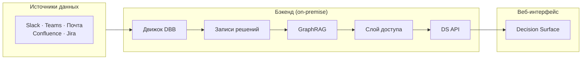

---

## Роли и разрешения

Decision Surface для Enterprise поддерживает три уровня ролей с различными областями видимости.

### Рядовой сотрудник (IC - Middle / Senior)
Персональный дашборд для отслеживания личных решений. Видит свои сигналы (открытые петли, обязательства), дрейф собственных предположений и связанные решения коллег (только там, где он упомянут или есть зависимость).

### Директор / Тимлид
Агрегированный вид «здоровья» решений команды. Видит все, что видит сотрудник, плюс: общее количество сигналов по команде, список сотрудников по уровню нагрузки, граф зависимостей (кто кого блокирует) и оповещения, когда паттерны членов команды указывают на риск. Не видит деталей рассуждений других членов команды без необходимости.

### С-level / Владелец
Стратегический вид состояния решений в организации. Видит все, что видит директор, плюс: агрегаты по всей компании, кросс-командные зависимости, дрейф стратегических тем (ценообразование, найм, инфраструктура) и корреляцию с бизнес-метриками. По умолчанию не видит деталей индивидуальных рассуждений.

---

## Матрица видимости сигналов

| Сигнал | Видит сотрудник | Видит Директор | Видит C-level |
|--------|---------|---------------|--------------|
| Открытые петли | Свои (с деталями) | Команда (кол-во + владельцы) | Компания (кол-во по командам) |
| Обязательства | Свои (весь контекст) | Команда (список без деталей) | Компания (кол-во + просрочки) |
| Ожидающие решения | Свои (весь контекст) | Команда (старейшие, блокирующие) | Кросс-командные блокировки |
| Ранжирование VoI | Приоритет личных петель | Приоритет влияния на команду | **Стратегический рейтинг полезности** |
| Выравнивание (POMDP) | Н/Д | **Оповещения о скрытых расхождениях** | Дрейф выравнивания всей орг-и |
| Рассуждения | ✅ Только свои | ❌ | ❌ (кроме спец. триггеров) |
| Исходы | ✅ Свои | ✅ Команда | ✅ Компания |

---

## Стратегическое выравнивание (трекер POMDP)

Decision Surface использует модель **POMDP (Частично наблюдаемый марковский процесс принятия решений)** для выявления неявных разногласий или «скрытых расхождений» (Hidden Divergence) внутри команд — ситуаций, когда члены команды действуют на основе разных предположений, несмотря на формальный консенсус.

### Как это работает

Система анализирует записи решений членов команды на предмет:
1. **Бимодальности темы** — одна тема, расходящиеся подходы.
2. **Дрейфа предположений** — изменение лексики со временем без нового решения.
3. **Разрыва избыточности рассуждений** — члены команды соглашаются, но используют противоречивую логику.

### Метод обнаружения

**Движок Decision Intelligence** анализирует сигналы в различных доменах:
- **Симметрия задержки ответов** — обнаружение «поверхностного согласия» (слишком быстрые «+1»).
- **Метаданные скептицизма** — подсказки из red-teaming или уклончивых формулировок.
- **Оповещение о скрытом расхождении** генерируется для директора, когда уверенность в консенсусе падает ниже порога.

---

## Резюме

Decision Surface для Enterprise предоставляет:
- **Для сотрудников:** Персональный дашборд решений с полным контекстом.
- **Для директоров:** Мониторинг здоровья команды без микроменеджмента.
- **Для C-level:** Стратегическую видимость с возможностью детального изучения при соблюдении приватности.

Один интерфейс, одни и те же сигналы, разный масштаб — отфильтровано по роли, агрегировано по уровню, приватно по умолчанию.

<!-- END /Users/miguelaprossine/documentation/docs-ru/membria-ee/decision-surface-enterprise.mdx -->
