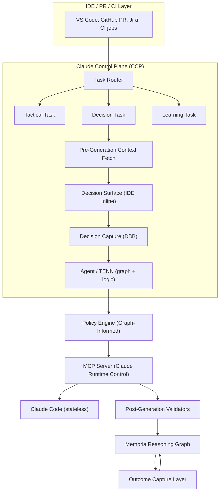
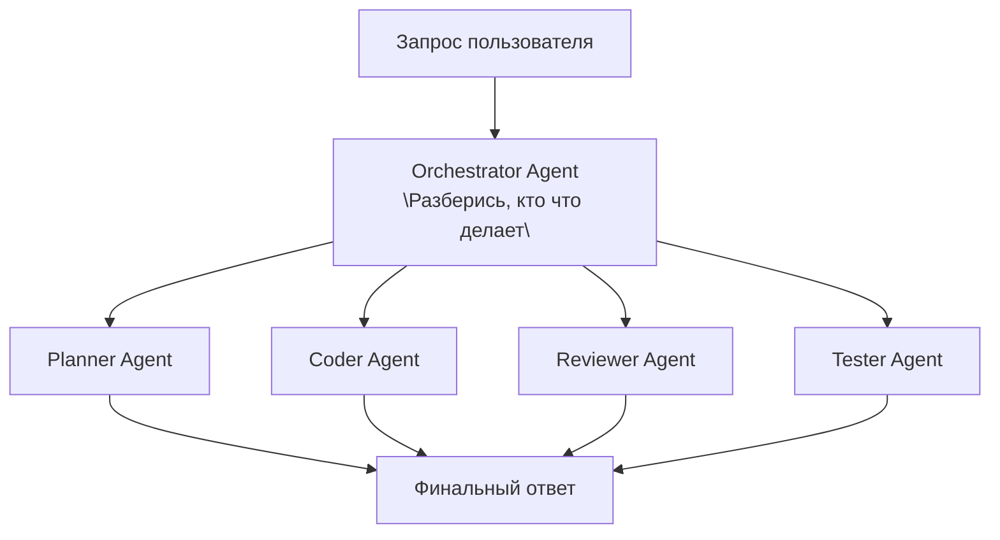
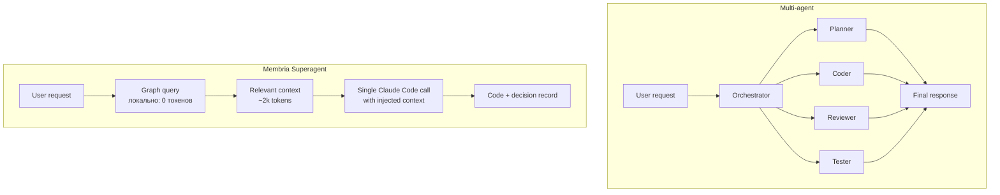
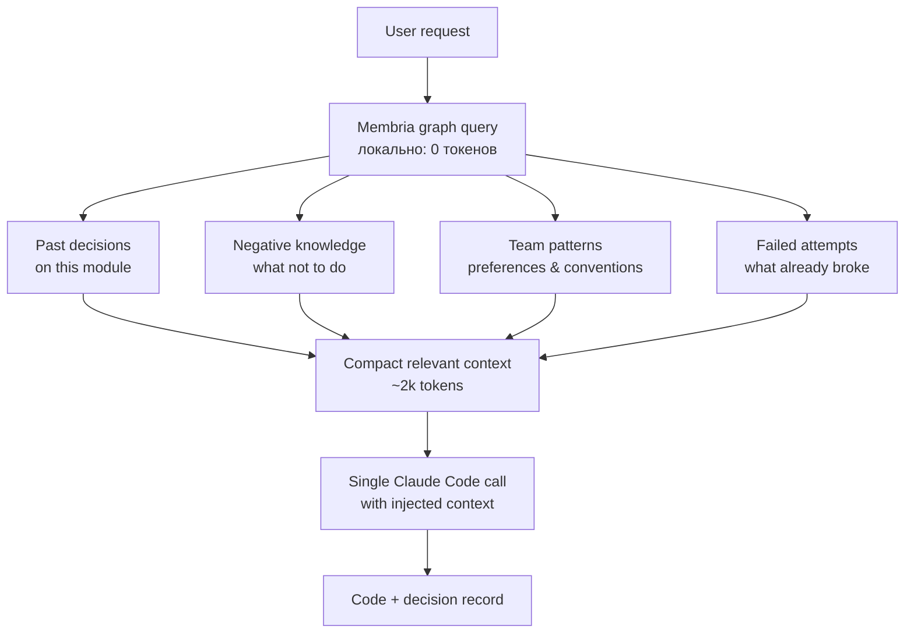

# Кодинг-Суперагент: Интеграция Membria + Claude Code

## Исполнительное резюме

Membria интегрируется с Claude Code для создания **генерации кода с учетом принятых решений** (decision-aware code generation). Это система, которая помнит прошлые архитектурные решения, учится на их исходах и помогает разработчикам избегать повторения ошибок.

**Ключевая идея:** Claude Code без Membria — это генератор кода без состояния (stateless). Claude Code с Membria — это инструмент, который знает историю проекта, понимает, какие решения работали, а какие нет, и предупреждает разработчика о рисках до написания кода.

---

## Проблема: ИИ без состояния в разработке ПО

### Текущее состояние

Современные ИИ-ассистенты для кодинга (включая Claude Code) работают в режиме **stateless**:

- Каждый запрос обрабатывается независимо.
- Нет памяти о прошлых архитектурных решениях.
- Нет знания о том, какие подходы уже пробовались и провалились.
- Нет калибровки — система не знает, насколько точны её рекомендации для конкретной команды.

### Последствия

1.  **Повторение ошибок:** Команда может выбрать библиотеку, которая уже вызывала проблемы 6 месяцев назад.
2.  **Потеря контекста:** Архитектурные решения теряются в чатах Slack и комментариях к PR.
3.  **Ошибка хайндсайта (Hindsight bias):** После инцидента все «знали», что решение было плохим, но никто не зафиксировал сомнения до инцидента.
4.  **Нет петли обучения:** Команда не видит паттерны в своих решениях — в каких типах задач они систематически самоуверенны.

---

## Решение: Генерация кода с учетом решений

### Принцип работы

Membria добавляет три ключевых возможности к Claude Code:

| Возможность | Что делает | Когда срабатывает |
| :--- | :--- | :--- |
| **Контекст до генерации** | Показывает релевантную историю решений до генерации кода | При обнаружении кандидата на решение |
| **Захват решения** | Фиксирует решение с альтернативами и уверенностью до написания кода | Когда разработчик подтверждает выбор |
| **Связывание исходов** | Связывает результаты (PR влит, CI упал, инцидент) с решениями | При наступлении Commitment Events |

### Что НЕ является решением

Важно: не каждый запрос к Claude Code — это решение. Система классифицирует задачи:

| Тип задачи | Примеры | Участие Membria |
| :--- | :--- | :--- |
| **Тактическая** | «Исправь опечатку», «Добавь логгирование», «Отформатируй код» | Минимальное — прямое выполнение |
| **Решение** | «Выбери библиотеку», «Спроектируй API», «Рефакторинг архитектуры» | Полное — контекст, захват, трекинг |
| **Обучение** | «PR влит», «Тесты упали», «Инцидент создан» | Связывание исхода с прошлыми решениями |

---

## Архитектура интеграции



### Классификация Task Router

*   **code_gen** → тактическая (без захвата решения)
*   **architecture** → решение (полный поток Membria)
*   **refactor** → решение (если структурное изменение)
*   **debug** → тактическая (если нет выбора корневой причины)
*   **library_choice** → решение (всегда)

**Сигналы решения:**
*   «выбрать», «решить», «стоит ли нам», «что лучше»
*   Упомянуто несколько альтернатив
*   Архитектурные ключевые слова: «паттерн», «структура», «дизайн»

### Pre-Generation Context Fetch (Запрос к Reasoning Graph)

*   Прошлые решения по этому модулю
*   Проваленные похожие предположения
*   Калибровка команды для этого домена
*   Оповещения о негативных знаниях

### Decision Surface (встроен в IDE)

Показывает разработчику:
*   Прошлые похожие решения
*   Предупреждения о рисках
*   Подсказки по калибровке
*   Предложения альтернатив

Кнопки: `[Продолжить]`, `[Обзор]`, `[Переопределить]`

### Захват решения (DBB)

Записи:
*   Формулировка (Statement)
*   Альтернативы
*   Уровень уверенности
*   Предсказанный исход
*   Контекст (неизменяемый)

### Режимы исполнения Agent / TENN

*   **Tactical:** прямая генерация кода
*   **Decision:** генерация с внедренным захваченным контекстом
*   **Learning:** связывание исхода с историческим решением

### Policy Engine (Информированный графом)

**Статические правила:**
*   Политики безопасности (нет захардкоженных секретов)
*   Требования комплаенса (GDPR, SOC2)
*   Соблюдение стиля кода

**Динамические правила (из Reasoning Graph):**
*   Корректировки калибровки, специфичные для команды
*   Пороги уверенности, специфичные для домена
*   Принудительное применение негативных знаний

**Детекция резонанса:**
*   Проверка совпадения человеческой предвзятости и предвзятости LLM
*   Триггер «трения» (friction), если оба игнорируют один и тот же риск

### MCP Server (Управление рантаймом Claude)

*   **Инъекция контекста:**
    *   Контекст решения из захвата
    *   Негативные знания из Графа
    *   Предпочтения и паттерны команды
*   **Предоставление инструментов:**
    *   Инструменты генерации кода
    *   Инструменты запроса к графу
    *   Инструменты записи решений
*   **Принуждение к режиму:**
    *   Тактический режим: минимальный контекст
    *   Режим решения: полная инъекция контекста
*   **Валидация схемы вывода**

### Валидаторы после генерации (Post-Generation Validators)

**Детекция предвзятости в выводе:**
*   **Якорение:** чрезмерный фокус на первой опции в комментариях кода
*   **Подтверждение:** игнорирование заявленных альтернатив
*   **Сверхуверенность:** слова «определенно», «всегда работает», «без проблем»

**Проверки согласованности:**
*   Сгенерированный код соответствует захваченному решению?
*   Негативные знания соблюдены?
*   Альтернативы действительно рассмотрены в реализации?

**Провалы валидации:**
*   Логировать для калибровки (не блокировать)
*   Оповещать, если критично (безопасность, комплаенс)

### Membria Reasoning Graph (Запись решения)

```
decision_id: dec_142
statement: "Использовать Fastify для REST API"
alternatives: ["Express.js", "Koa", "Custom"]
confidence: 0.60
predicted_outcome: "Стабильный API, хорошая производительность"
assumptions: ["Fastify выдержит нашу нагрузку", "Команда знает его"]
context_hash: "abc123..." (immutable)
status: PENDING_OUTCOME
linked_pr: null -> PR#234 (когда создан)
linked_commit: null -> commit_sha (когда влит)
```

**Связи:**
*   `RELIES_ON`: предположения
*   `BLOCKS`: зависимые решения
*   `SUPERSEDES`: предыдущие решения по той же теме
*   `CAUSED_BY`: родительские архитектурные решения

### Слой захвата исходов (Commitment Events)

| Источник | Событие | Сигнал исхода |
| :--- | :--- | :--- |
| GitHub | PR merged | Решение исполнено |
| GitHub | PR closed (no merge) | Решение отброшено |
| CI/CD | Tests pass | Позитивный сигнал |
| CI/CD | Tests fail | Негативный сигнал |
| CI/CD | Build fail | Негативный сигнал |
| PagerDuty | Incident created | Сильный негатив |
| Jira | Bug linked to PR | Негативный сигнал |
| Time | 30 days stable | Позитивный исход |
| Time | 90 days stable | Сильный позитивный исход |

**Обновление калибровки:**
*   Сравнить `predicted_outcome` vs `actual_outcome`
*   Обновить профиль калибровки команды
*   Обновить калибровку по домену
*   Сгенерировать кандидата LoRA, если обнаружен систематический разрыв

---

## Детальный поток: Решение о выборе библиотеки

### Сценарий

Разработчик в VS Code пишет запрос: «Add REST API for user management, need to choose a framework».

### Шаг 1: Классификация Task Router

```
Вход: "Add REST API for user management, need to choose a framework"

Анализ классификации:
├── Обнаружены ключевые слова: "choose", "framework"
├── Подразумевается несколько альтернатив: да
├── Архитектурное влияние: да (фреймворк API влияет на весь сервис)
└── Тип решения: ВЫБОР_БИБЛИОТЕКИ

Результат: Маршрут в поток DECISION (не тактический)
```

### Шаг 2: Запрос контекста (Pre-Generation)

```
Запрос к Reasoning Graph:

MATCH (d:Decision)-[:ABOUT]->(t:Topic)
WHERE t.name IN ["REST API", "framework", "HTTP server"]
  AND d.repo = "current-repo"
RETURN d, d.outcome, d.assumptions

Результаты:
┌─────────────────────────────────────────────────────────────────────┐
│ Решение #47 (8 месяцев назад)                                      │
│ Формулировка: "Использовать Express.js для API-шлюза"              │
│ Исход: УСПЕХ                                                       │
│ Заметки: "Работало хорошо, команда знакома"                        │
├─────────────────────────────────────────────────────────────────────┤
│ Решение #89 (6 месяцев назад)                                      │
│ Формулировка: "Использовать кастомный middleware для аутентификации"│
│ Исход: ПРОВАЛ                                                      │
│ Заметки: "Найдена уязвимость безопасности, пришлось переписывать"  │
│ Негативное знание: "Избегать кастомных auth middleware"            │
├─────────────────────────────────────────────────────────────────────┤
│ Калибровка команды (выбор библиотек):                              │
│ • Средняя уверенность: 0.78                                        │
│ • Фактическая частота успеха: 0.61                                 │
│ • Разрыв калибровки: +17% (сверхуверенность)                       │
│ • Рекомендация: Снизить заявленную уверенность на ~15%             │
└─────────────────────────────────────────────────────────────────────┘
```

### Шаг 3: Отображение Decision Surface (в IDE)

Разработчик видит встроенную панель **до** того, как Claude что-либо сгенерирует:

```
┌─────────────────────────────────────────────────────────────────────┐
│  🧠 Контекст решения Membria                                        │
│                                                                     │
│  ━━━━━━━━━━━━━━━━━━━━━━━━━━━━━━━━━━━━━━━━━━━━━━━━━━━━━━━━━━━━━━━━  │
│                                                                     │
│  📊 РЕЛЕВАНТНАЯ ИСТОРИЯ                                             │
│                                                                     │
│  ✅ Express.js сработал хорошо (8 месяцев назад)                   │
│     "API-шлюз - команда была знакома, стабилен в проде"            │
│                                                                     │
│  ❌ Кастомный middleware провалился (6 месяцев назад)              │
│     "Уязвимость безопасности, 2 недели на переписывание"           │
│     ⚠️ НЕГАТИВНОЕ ЗНАНИЕ: Избегать кастомных auth решений          │
│                                                                     │
│  ━━━━━━━━━━━━━━━━━━━━━━━━━━━━━━━━━━━━━━━━━━━━━━━━━━━━━━━━━━━━━━━━  │
│                                                                     │
│  📈 КАЛИБРОВКА КОМАНДЫ                                              │
│                                                                     │
│  Ваша команда склонна к сверхуверенности (17%) при выборе библиотек.│
│  Если вы чувствуете уверенность 80%, история подсказывает ~65%.     │
│                                                                     │
│  ━━━━━━━━━━━━━━━━━━━━━━━━━━━━━━━━━━━━━━━━━━━━━━━━━━━━━━━━━━━━━━━━  │
│                                                                     │
│  💡 СООБРАЖЕНИЯ                                                     │
│                                                                     │
│  • Express.js: проверен в этом репо, команда знает его              │
│  • Fastify: быстрее, но у команды нет опыта                         │
│  • Koa: минималистичный, может потребовать больше кастомного кода   │
│                                                                     │
│  ━━━━━━━━━━━━━━━━━━━━━━━━━━━━━━━━━━━━━━━━━━━━━━━━━━━━━━━━━━━━━━━━  │
│                                                                     │
│  Готовы продолжить?                                                 │
│                                                                     │
│  [ Продолжить с Claude ] [ Обзор истории ] [ Я решу сам ]           │
│                                                                     │
└─────────────────────────────────────────────────────────────────────┘
```

### Шаг 4: Взаимодействие разработчика

Разработчик нажимает «Продолжить с Claude» и добавляет: «Давайте выберем Fastify для лучшей производительности».

### Шаг 5: Захват решения (DBB)

Перед генерацией кода система фиксирует:

```json
{
  "decision_id": "dec_142",
  "timestamp": "2025-02-06T14:32:00Z",
  "statement": "Использовать Fastify для REST API в user-service",
  "alternatives_considered": [
    {
      "option": "Express.js",
      "reason_rejected": "Нужна лучшая производительность"
    },
    {
      "option": "Koa",
      "reason_rejected": "Слишком минималистичный"
    },
    {
      "option": "Custom",
      "reason_rejected": "Негативное знание из dec_89"
    }
  ],
  "confidence": {
    "stated": 0.75,
    "calibrated": 0.62,
    "calibration_note": "Скорректировано на +17% сверхуверенности команды"
  },
  "assumptions": [
    "Fastify выдержит ожидаемую нагрузку (10k req/s)",
    "Команда сможет быстро изучить Fastify",
    "В экосистеме Fastify есть нужные плагины"
  ],
  "predicted_outcome": {
    "description": "Стабильный, производительный API готов через 2 недели",
    "success_criteria": [
      "API держит 10k req/s",
      "Нет критических багов в первый месяц",
      "Онбординг команды < 1 недели"
    ]
  },
  "context_hash": "sha256:abc123...",
  "status": "CAPTURED",
  "linked_artifacts": {
    "pr": null,
    "commit": null,
    "jira": "PROJ-456"
  },
  "negative_knowledge_acknowledged": [
    "dec_89: Избегать кастомных auth middleware"
  ]
}
```

### Шаг 6: Инъекция контекста через MCP

Claude Code получает обогащенный контекст:

```
Внедрение системного контекста:
━━━━━━━━━━━━━━━━━━━━━━━━━━━━━━━━━━━━━━━━━━━━━━━━━━━━━━━━━━━━━━━━━━━━

КОНТЕКСТ РЕШЕНИЯ:
Вы реализуете решение, которое было зафиксировано.
Решение: "Использовать Fastify для REST API в user-service"

ОГРАНИЧЕНИЯ ИЗ ИСТОРИИ:
❌ НЕ реализовывать кастомный middleware аутентификации
   (Предыдущая попытка провалилась из-за проблем с безопасностью - см. dec_89)

✅ ИСПОЛЬЗОВАТЬ проверенные библиотеки аутентификации (passport и т.д.)

ПАТТЕРНЫ КОМАНДЫ:
• Эта команда предпочитает явную обработку ошибок, а не магию middleware
• Предыдущие API в этом репо используют последовательный префикс /api/v1/
• Команда использует Zod для валидации (см. dec_98)

ПРЕДПОЛОЖЕНИЯ ДЛЯ ПРОВЕРКИ:
Решение предполагает, что Fastify может обрабатывать 10k req/s.
Включите соображения производительности в реализацию.

━━━━━━━━━━━━━━━━━━━━━━━━━━━━━━━━━━━━━━━━━━━━━━━━━━━━━━━━━━━━━━━━━━━━
```

### Шаг 7: Генерация Claude Code

Claude генерирует код API на Fastify с учетом:
*   Отсутствия кастомного auth middleware (негативное знание соблюдено).
*   Использования passport-jwt для аутентификации.
*   Включения заметок о производительности.
*   Соблюдения конвенции `/api/v1/`.
*   Использования Zod для валидации.

### Шаг 8: Валидация после генерации

```
Результаты валидации:
━━━━━━━━━━━━━━━━━━━━━━━━━━━━━━━━━━━━━━━━━━━━━━━━━━━━━━━━━━━━━━━━━━━━

✅ Согласованность решения: Код использует Fastify (соответствует решению)
✅ Негативные знания: Кастомный auth middleware не обнаружен
✅ Предположения адресованы: Заметки о производительности включены
⚠️ Проверка на предвзятость: Найдено "это определенно будет масштабироваться" - язык сверхуверенности
   (Залогировано для калибровки, не блокирует)

━━━━━━━━━━━━━━━━━━━━━━━━━━━━━━━━━━━━━━━━━━━━━━━━━━━━━━━━━━━━━━━━━━━━
```

### Шаг 9: Создание и связывание PR

Разработчик создает PR. Система автоматически связывает:

```
Решение dec_142 обновлено:
├── linked_pr: PR#234
├── linked_commit: abc123
├── status: PENDING_OUTCOME → EXECUTED
└── execution_date: 2025-02-06T15:45:00Z
```

### Шаг 10: Захват исходов (Асинхронно)

**День 1: PR влит**
```
Событие: PR#234 влит в main
Сигнал: POSITIVE (код принят)
Статус решения: MERGED
```

**День 3: CI прошел**
```
Событие: Все тесты прошли, деплой успешен
Сигнал: POSITIVE (техническая валидация)
```

**День 14: Найден мелкий баг**
```
Событие: Jira баг PROJ-478 связан с PR#234
Сигнал: WEAK_NEGATIVE (мелкая проблема)
Заметка: "Проблема совместимости плагина Fastify, исправлено за 2 часа"
```

**День 30: Проверка стабильности**
```
Событие: 30-дневное окно стабильности прошло
Метрики:
├── Uptime: 99.9%
├── P99 latency: 45ms
├── Throughput: достигнуто 12k req/s (превышает предположение)
└── Bugs: 1 мелкий (решен)

Финальный исход: SUCCESS
```

### Шаг 11: Обновление калибровки

```
Анализ калибровки для dec_142:
━━━━━━━━━━━━━━━━━━━━━━━━━━━━━━━━━━━━━━━━━━━━━━━━━━━━━━━━━━━━━━━━━━━━

Предсказано: "Стабильный, производительный API готов через 2 недели"
Фактически: Доставлено за 2 недели, стабильно, цель по производительности превышена

Уверенность заявленная: 0.75
Уверенность откалиброванная: 0.62
Фактический исход: УСПЕХ

Анализ:
• Исходная уверенность (0.75) была уместной для этого решения
• Корректировка калибровки была немного слишком агрессивной
• Предположение о Fastify подтверждено: держит 12k req/s (цель была 10k)

Обновление калибровки команды:
• Разрыв калибровки по выбору библиотек: +17% → +14%
• Уверенность конкретно по Fastify: может быть выше для этой команды

Обновление предположений:
• "Fastify выдержит нашу нагрузку" → ВАЛИДИРОВАНО
• "Команда сможет быстро изучить Fastify" → ВАЛИДИРОВАНО (нет проблем с онбордингом)
• "В экосистеме Fastify есть нужные плагины" → ЧАСТИЧНО_ВАЛИДИРОВАНО (одна проблема совместимости)

━━━━━━━━━━━━━━━━━━━━━━━━━━━━━━━━━━━━━━━━━━━━━━━━━━━━━━━━━━━━━━━━━━━━
```

---

## Membria (Superagent) vs Multi-Agent Архитектура

### Почему мультиагенты — архитектурный тупик

**Что такое мультиагентная архитектура:**



Каждый агент = отдельный вызов LLM с полным контекстом.

---

### Экономика токенов: мультиагенты vs Membria

**Типичная задача: "Add REST API for user management"**

#### Multi-Agent подход:

| Агент | Входные токены | Выходные токены | Стоимость (Claude Sonnet) |
| :--- | :--- | :--- | :--- |
| Orchestrator | 4,000 | 500 | $0.018 |
| Planner | 6,000 | 1,500 | $0.030 |
| Coder | 8,000 | 3,000 | $0.057 |
| Reviewer | 12,000 | 1,000 | $0.051 |
| Tester | 10,000 | 800 | $0.039 |
| Fixer (итерация 1) | 14,000 | 2,000 | $0.062 |
| Fixer (итерация 2) | 16,000 | 1,500 | $0.066 |
| **ИТОГО за задачу** | **70,000** | **10,300** | **$0.32** |

**В день (20 задач):** $6.40
**В месяц (20 рабочих дней):** $128 на одного разработчика
**Команда 5 человек:** $640/месяц только на токены

И это **без учёта:**
*   Повторов (retry) при сбоях
*   Длинных контекстов в больших проектах
*   Масштабирования при активной разработке

#### Membria подход (Superagent):

| Компонент | Входные токены | Выходные токены | Стоимость |
| :--- | :--- | :--- | :--- |
| Context fetch (Graph query) | 0 | 0 | $0 (локальный) |
| Один вызов Claude + внедренный контекст | 6,000 | 3,000 | $0.033 |
| **ИТОГО за задачу** | **6,000** | **3,000** | **$0.033** |

**В день (20 задач):** $0.66
**В месяц:** $13.20 на разработчика
**Команда 5 человек:** $66/месяц

**Разница: в 10 раз дешевле**

---

### Почему мультиагенты сжигают токены

```
┌─────────────────────────────────────────────────────────────────────┐
│  MULTI-AGENT: Каждый агент получает ВЕСЬ контекст заново           │
│                                                                     │
│  Orchestrator: [system prompt] + [user request] + [project context] │
│                = 4,000 токенов                                      │
│                         ↓                                           │
│  Planner: [system prompt] + [user request] + [project context]      │
│           + [orchestrator output]                                   │
│           = 6,000 токенов (ДУБЛИРОВАНИЕ)                            │
│                         ↓                                           │
│  Coder: [system prompt] + [user request] + [project context]        │
│         + [orch] + [planner]                                        │
│         = 8,000 токенов (ЕЩЕ БОЛЬШЕ ДУБЛИРОВАНИЯ)                   │
│                         ↓                                           │
│  ...каждый агент копирует всё предыдущее                            │
│                                                                     │
│  Рост: O(n²), где n = количество агентов                            │
└─────────────────────────────────────────────────────────────────────┘

┌─────────────────────────────────────────────────────────────────────┐
│  MEMBRIA: Один вызов с умным контекстом                            │
│                                                                     │
│  Graph Query (локально, 0 токенов):                                 │
│  → "Что релевантно для этой задачи?"                                │
│  → Возвращает только нужное: 3 прошлых решения, 2 негативных знания │
│                                                                     │
│  Один вызов LLM:                                                    │
│  [system] + [request] + [ТОЛЬКО релевантный контекст]               │
│  = 6,000 токенов                                                    │
│                                                                     │
│  Рост: O(1) — фиксированный размер независимо от истории проекта    │
└─────────────────────────────────────────────────────────────────────┘
```

### Технические проблемы мультиагентов

1.  **Фрагментация контекста**
    *   Planner Agent думает: «Использовать Redis для кэша»
    *   Coder Agent не получает полный контекст причин
    *   → Реализует in-memory кэш
    *   → Reviewer: «Почему не Redis?»
    *   → Еще 3 итерации

2.  **Размывание ответственности**
    *   Баг в проде. «Какой агент принял это решение?»
    *   Orchestrator: «Я просто раздал задачи»
    *   Planner: «Я дал план, Coder изменил его»
    *   Coder: «Reviewer одобрил»
    *   Reviewer: «Tester пропустил»
    *   → Нет единой записи решения, нет подотчетности

3.  **Несогласованность рассуждений**
    *   Planner (temperature 0.7): креативный план
    *   Coder (temperature 0.2): консервативная реализация
    *   → Несоответствие плана и кода
    *   → Reviewer не понимает замысла

4.  **Экспоненциальные сбои**
    *   5 агентов, каждый 95% надежности
    *   Общая надежность: $0.95^5 = 77\%$
    *   23% задач требуют повтора = еще больше токенов

---

## Сравнение моделей ценообразования

### Вендоры мультиагентов (Usage-Based)

```
Месяц 1:  разгон команды         → $200
Месяц 2:  активная разработка    → $800
Месяц 3:  дедлайн, heavy usage   → $2,400
Месяц 4:  еще один дедлайн       → $3,100

CFO: "Почему счет за ИИ выше, чем за AWS?"
```

### Membria (Подписка)

```
Месяц 1:  $49/seat × 5 = $245
Месяц 2:  $245
Месяц 3:  $245 (дедлайн? та же цена)
Месяц 4:  $245

Предсказуемо. Бюджетируемо. Безлимитно.
```

### Почему подписка работает для Membria

```
Затраты Membria:
├── Хранение графа: $0.001 за решение (ничтожно)
├── Запросы к графу: локально, только CPU
├── Вызовы LLM: пользователь платит за свои токены Claude (BYOK)
└── Наша инфраструктура: фиксирована

Мы НЕ перепродаем токены с наценкой.
Мы продаем КОНТЕКСТ, который делает токены эффективнее.
```

**Стимул вендора мультиагентов:** Вы используете БОЛЬШЕ агентов = они зарабатывают больше.

**Стимул Membria:** Лучший контекст = нужно меньше токенов = клиенты счастливее = больше мест.

---

## Итог

Мультиагентная архитектура решает задачу «как разделить работу», создавая новую проблему: «как синхронизировать контекст между агентами, не разорившись на токенах».

**Membria Superagent** решает коренную проблему: **дать одному агенту правильный контекст** вместо создания толпы агентов с неполным контекстом.

Результат:
*   ИИ, который помнит ваш проект.
*   Решения, которые не теряются.
*   Ошибки, которые не повторяются.
*   Затраты, которые не взрываются.

**Vibe coding перестает быть «генерацией с нуля каждый раз» и становится «генерацией с памятью проекта».**

---

## Membria (Superagent) против мультиагентной архитектуры

### Почему мультиагенты становятся архитектурным тупиком

**Как выглядит мультиагентная архитектура:**
```
User prompt
    ↓
┌─────────────────────────────────────────────┐
│  Orchestrator Agent                         │
│  "Разберись кто что делает"                │
└─────────────────────────────────────────────┘
    ↓           ↓           ↓           ↓
┌───────┐  ┌───────┐  ┌───────┐  ┌───────┐
│Planner│  │Coder  │  │Reviewer│ │Tester │
│Agent  │  │Agent  │  │Agent   │ │Agent  │
└───────┘  └───────┘  └───────┘  └───────┘
    ↓           ↓           ↓           ↓
    └───────────┴───────────┴───────────┘
                    ↓
            Final response
```

Каждый агент — это отдельный вызов LLM с полным контекстом.

---

### Экономика токенов: мультиагенты vs Membria

**Типичная задача: "Add REST API for user management"**

#### Multi-Agent подход

| Агент | Входные токены | Выходные токены | Стоимость (Claude Sonnet) |
|-------|-------------|---------------|---------------------|
| Orchestrator | 4,000 | 500 | $0.018 |
| Planner | 6,000 | 1,500 | $0.030 |
| Coder | 8,000 | 3,000 | $0.057 |
| Reviewer | 12,000 | 1,000 | $0.051 |
| Tester | 10,000 | 800 | $0.039 |
| Fixer (итерация 1) | 14,000 | 2,000 | $0.062 |
| Fixer (итерация 2) | 16,000 | 1,500 | $0.066 |
| **ИТОГО за задачу** | **70,000** | **10,300** | **$0.32** |

**В день (20 задач):** $6.40
**В месяц (20 рабочих дней):** $128 на одного разработчика
**Команда 5 человек:** $640/месяц только на токены

И это **без учета:**
- Повторов (retry) при сбоях
- Длинных контекстов в больших проектах
- Масштабирования при активной разработке

#### Membria подход (Superagent)

| Компонент | Входные токены | Выходные токены | Стоимость |
|-----------|-------------|---------------|------|
| Context fetch (запрос к графу) | 0 | 0 | $0 (локально) |
| Один вызов Claude + внедренный контекст | 6,000 | 3,000 | $0.033 |
| **ИТОГО за задачу** | **6,000** | **3,000** | **$0.033** |

**В день (20 задач):** $0.66
**В месяц:** $13.20 на разработчика
**Команда 5 человек:** $66/месяц

**Разница: в 10 раз дешевле**

---

### Почему мультиагенты сжигают токены



---

### Сравнение архитектур

| Аспект | Multi-Agent | Membria Superagent |
|--------|-------------|-------------------|
| **Токены на задачу** | 70,000+ | 6,000-10,000 |
| **Стоимость/месяц (5 человек)** | $500-1000 | Фиксированная подписка |
| **Latency** | 5-15 секунд (последовательные вызовы) | 1-3 секунды |
| **Failure modes** | Любой агент может сломаться | Одна точка отказа |
| **Контекст между задачами** | Теряется | Сохраняется в графе |
| **Память проекта** | Нет (stateless) | Есть (persistent) |
| **Debugging** | "Какой агент сломался?" | Один trace |
| **Масштабирование** | Линейный рост стоимости | Предсказуемая стоимость |

---

### Модель ценообразования

#### Multi-Agent (usage-based):

```
Месяц 1:  онбординг               → $200
Месяц 2:  активная разработка     → $800
Месяц 3:  дедлайн, heavy usage    → $2,400
Месяц 4:  новый дедлайн           → $3,100

"Why is the AI bill higher than AWS?!"
```

#### Membria (subscription):

```
Месяц 1:  $49/seat × 5 = $245
Месяц 2:  $245
Месяц 3:  $245 (дедлайн? та же цена)
Месяц 4:  $245

Predictable. Budgetable. Uncapped.
```

---

### Технические проблемы мультиагентов

**1. Фрагментация контекста**
```
Planner agent thinks: "Use Redis for caching"
Coder agent doesn't get the full context
→ Implements an in-memory cache
→ Reviewer agent: "Why not Redis?"
→ 3 more iterations
```

**2. Размывание ответственности**
```
Инцидент в проде.
"Which agent made this decision?"
Orchestrator: "I just routed tasks"
Planner: "I made a plan, the coder changed it"
Coder: "Reviewer approved"
Reviewer: "Tester missed it"

→ No single owner, no single decision record
```

**3. Несогласованность рассуждений**
```
Planner (temperature 0.7): creative plan
Coder (temperature 0.2): conservative implementation
→ Mismatch between plan and code
→ Reviewer doesn't understand the intent
```

**4. Экспоненциальные сбои**
```
5 agents, each 95% reliable
Combined reliability: 0.95^5 = 77%

23% of tasks require retries = even more tokens
```

---

### Почему Membria Superagent работает лучше



---

### ROI сравнение (команда 10 человек, 12 месяцев)

#### Multi-agent

| Статья | Стоимость |
|--------|-----------|
| Токены (средняя нагрузка) | $800/mo × 12 = $9,600 |
| Токены (пиковые месяцы ×3) | +$4,800 |
| DevOps на оркестрацию агентов | $2,000 |
| Отладка сбоев агентов | $3,000 (время разработчиков) |
| **ИТОГО** | **$19,400/year** |

#### Membria

| Статья | Стоимость |
|--------|-----------|
| Подписка $49/seat × 10 × 12 | $5,880 |
| Пиковые месяцы | $0 (подписка) |
| Инфраструктура | $0 (managed) |
| **ИТОГО** | **$5,880/year** |

**Экономия: $13,520/year = 70%**

---

### Почему подписка работает для Membria

```
Затраты Membria:
├── Graph storage: $0.001 per decision (negligible)
├── Graph queries: local, CPU only
├── LLM calls: customers pay their own Claude tokens
└── Our infrastructure: fixed

We do not resell tokens with markup.
We sell context that makes tokens more efficient.
```

**Вендоры Multi-Agent:**
```
Их затраты:
├── 5-10x LLM calls per task
├── Resell tokens with margin
└── More usage = higher bill

Их стимул: чтобы вы использовали больше агентов
```

**Наш стимул:**
```
Better context = fewer tokens needed
Better negative knowledge = less rework
Better calibration = fewer errors

Win-win: customers save money, we grow on seats, not usage
```

---

### Итоговая сводка

| | Multi-Agent | Membria Superagent |
|--|-------------|-------------------|
| **Архитектура** | N агентов × полный контекст | 1 агент × умный контекст |
| **Токены** | O(n^2) на задачу | O(1) на задачу |
| **Стоимость** | Usage-based, непредсказуемо | Подписка, предсказуемо |
| **Память** | Нет (каждый раз с нуля) | Есть (graph) |
| **При scale** | Costs растут линейно | Costs предсказуемы |
| **Debugging** | "Какой агент сломался?" | Один trace |
| **Vendor lock-in** | Высокий (их orchestration) | Низкий (стандартный Claude) |

**Bottom line:** Multi-agent пытается решить "как разделить работу", создавая новую проблему: "как синхронизировать контекст между агентами и не разориться на токенах".

Membria решает корневую проблему: **даёт одному агенту правильный контекст**, вместо того чтобы плодить агентов с неполным контекстом.

---

## Membria Graph против Skills/Markdown-хранения контекста

### Что такое подход Skills/MD

```
project/
├── CLAUDE.md              # "Как устроен проект"
├── skills/
│   ├── coding-style.md    # "Пиши код так"
│   ├── architecture.md    # "Обзор архитектуры"
│   └── decisions.md       # "Мы решили X, потому что Y"
└── docs/
    └── adr/               # Architecture Decision Records
        ├── 001-use-fastify.md
        └── 002-auth-strategy.md
```

Claude читает эти файлы → получает контекст → генерирует код.

**Это работает, но у подхода есть фундаментальные ограничения.**

---

### Проблема 1: линейный рост = линейный рост токенов

**Skills/MD:**
```
Месяц 1:   5 MD файлов   →  3,000 токенов контекста
Месяц 6:   25 MD файлов  → 15,000 токенов контекста
Месяц 12:  60 MD файлов  → 40,000 токенов контекста
Год 2:     120 MD файлов → 80,000 токенов контекста

Проблема: Claude читает ВСЁ, включая нерелевантное
```

**Membria Graph:**
```
Месяц 1:   50 decisions   → запрос в граф → 2,000 токенов релевантного контекста
Месяц 6:   300 decisions  → запрос в граф → 2,000 токенов релевантного контекста
Месяц 12:  700 decisions  → запрос в граф → 2,000 токенов релевантного контекста
Год 2:     1500 decisions → запрос в граф → 2,000 токенов релевантного контекста

Граф возвращает ТОЛЬКО то, что относится к текущей задаче
```

| Возраст проекта | Skills/MD токены | Membria токены |
|-----------------|------------------|----------------|
| 1 месяц | 3,000 | 2,000 |
| 6 месяцев | 15,000 | 2,000 |
| 1 год | 40,000 | 2,000 |
| 2 года | 80,000+ | 2,000 |

**Membria: O(1) контекст независимо от размера истории**

---

### Проблема 2: Markdown-файлы не знают, что релевантно

**Skills/MD:**
```
Задача: "Add caching to user service"

Claude получает ВСЁ:
├── coding-style.md (релевантно)
├── architecture.md (частично релевантно)
├── auth-decisions.md (НЕ релевантно)
├── database-schema.md (НЕ релевантно)
├── api-conventions.md (частично релевантно)
├── deployment-guide.md (НЕ релевантно)
└── ...ещё 20 файлов

Результат: 80% контекста — шум
```

**Membria Graph:**
```
Задача: "Add caching to user service"

Graph query:
  "decisions about caching OR user-service
   WITH outcomes
   WHERE relevance > 0.7"

Claude получает ТОЛЬКО:
├── Decision #45: "Redis for session cache" → SUCCESS
├── Decision #67: "In-memory cache for user-service" → FAILURE (OOM)
├── Negative knowledge: "Avoid unbounded in-memory caches"
└── Team pattern: "Cache TTL should be configurable"

Результат: 100% контекста — сигнал
```

---

### Проблема 3: Markdown — это мнение, а не факт

**Skills/MD:**
```markdown
# architecture.md

We use Redis for caching because it's fast and reliable.
```

Вопросы без ответа:
- Когда это решили?
- Кто решил?
- Какие альтернативы рассматривали?
- Это сработало?
- В каком контексте это верно?

**Membria Graph:**
```
Decision #45:
├── statement: "Use Redis for session caching"
├── decided_by: "@john"
├── decided_at: "2024-03-15"
├── alternatives_rejected:
│   ├── "Memcached" — reason: "No persistence"
│   └── "In-memory" — reason: "Won't scale across instances"
├── assumptions:
│   └── "Session load < 10k/sec" — status: VALIDATED
├── outcome: SUCCESS
├── evidence:
│   ├── PR #234 merged
│   ├── 90 days stable
│   └── P99 latency: 2ms
└── context_constraints:
    └── "Valid for session data, NOT for computed caches"
```

**Markdown = утверждение. Graph = верифицированный факт с провенансом.**

---

### Проблема 4: Markdown не обновляется автоматически

**Skills/MD:**
```
Реальность:
├── Март: решили использовать библиотеку X
├── Апрель: написали в decisions.md "we use X"
├── Июль: X сломался, перешли на Y
├── Август: забыли обновить decisions.md
├── Октябрь: новый разработчик читает "we use X"
└── Октябрь: пишет код на X, потому что так написано

Markdown врет, потому что его забывают обновлять
```

**Membria Graph:**
```
├── March: Decision #89 captured: "Use library X"
├── July: PR merged switching to Y
├── July: Outcome recorded: Decision #89 → SUPERSEDED
├── July: Decision #112 captured: "Switch to Y because X failed"
├── October: new dev asks about library choice
└── October: graph returns: "Y (X was tried, failed in July)"

Граф обновляется через Commitment Events, а не через человеческую дисциплину
```

---

### Проблема 5: Markdown не умеет хранить negative knowledge

**Skills/MD:**
```markdown
# decisions.md

We use passport.js for authentication.
```

Чего не хватает:
- Почему не custom middleware?
- Что случилось, когда пробовали custom?
- Какие еще подходы не сработали?

**Типичный сценарий:**
```
Новый разработчик: "Custom middleware будет проще"
Senior: "Мы пробовали, не помню почему не вышло"
Новый разработчик: *делает custom middleware*
*Через месяц: security incident*
```

**Membria Graph:**
```
Negative Knowledge Node:
├── statement: "Custom auth middleware"
├── last_attempted: "2024-06-15"
├── outcome: FAILURE
├── reason: "Security vulnerability CVE-2024-XXXX"
├── incident_link: "INC-456"
├── recommendation: "Use passport.js or auth0"
└── auto_block: true  ← Claude получает предупреждение

При попытке написать custom middleware:
⚠️ "Custom auth middleware failed 6 months ago (security).
    Use passport.js instead. See Decision #89 for details."
```

**Markdown хранит, что делать. Graph хранит, что НЕ делать.**

---

### Проблема 6: Markdown не связывает решения → исходы

**Skills/MD:**
```markdown
# decisions.md

2024-03-15: Decided to use Fastify for performance.
```

Через 6 месяцев:
- Fastify оправдал ожидания? Неизвестно.
- Производительность улучшилась? Неизвестно.
- Были проблемы? Неизвестно.

**Membria Graph:**
```
Decision #142:
├── statement: "Use Fastify for performance"
├── predicted_outcome: "Handle 10k req/s"
├── confidence: 0.75
│
├── [6 months later, auto-linked]
│
├── actual_outcome: SUCCESS
├── measured_performance: "12k req/s achieved"
├── issues_encountered: 1 minor (plugin compatibility)
├── time_to_stable: 18 days
│
└── calibration_delta: +0.03 (prediction was accurate)
```

**Markdown = снимок. Graph = живой документ с feedback loop.**

---

### Проблема 7: Markdown требует человеческой дисциплины

**Skills/MD workflow:**
```
1. Принять решение
2. Не забыть записать в Markdown
3. Записать правильно
4. Не забыть обновить при изменении
5. Не забыть удалить при устаревании
6. Надеяться, что все читают перед работой

Failure rate: high
```

**Membria workflow:**
```
1. Работать как обычно (PR, Slack, code)
2. Membria автоматически детектит решения
3. Разработчик подтверждает (1 клик)
4. Outcomes линкуются автоматически через CI/CD
5. Устаревание детектится через сигналы superseding/outcomes

Failure rate: low (automation)
```

---

### Проблема 8: Markdown не масштабируется на команду

**Skills/MD:**
```
├── Alice пишет в decisions.md
├── Bob не видит изменения (не обновил repo)
├── Carol пишет конфликтующее решение
├── Merge conflict в Markdown-файле
├── Кто-то "resolves" конфликт, удаляя важное
└── Institutional knowledge потеряно
```

**Membria Graph:**
```
├── Alice фиксирует решение → instant sync
├── Bob сразу видит это в Decision Surface
├── Carol пытается зафиксировать конфликтующее решение
├── Graph показывает: "Conflicts with Decision #89 by Alice"
├── Команда обсуждает, явно supersedes или подтверждает
└── Полный audit trail сохранен
```

---

### Сравнительная таблица

| Аспект | Skills/MD | Membria Graph |
|--------|-----------|---------------|
| **Контекст при росте проекта** | O(n) — растет линейно | O(1) — фиксированный |
| **Релевантность** | Всё или ничего | Query по релевантности |
| **Верификация** | Мнение автора | Факт + outcome |
| **Обновление** | Ручное (забывают) | Автоматическое |
| **Negative knowledge** | Обычно отсутствует | First-class citizen |
| **Decision → Outcome** | Не связаны | Автоматическая связка |
| **Дисциплина** | Требуется высокая | Минимальная |
| **Командная работа** | Конфликты, потери | Sync + audit trail |
| **Провенанс** | "Кто-то когда-то решил" | Кто, когда, почему, что вышло |
| **Запросы** | Читать всё | Семантический поиск |

---

### Когда Markdown достаточно

Skills/Markdown подход работает, если:
- Проект < 3 месяцев
- Команда 1-2 человека
- Решений < 20
- Не нужен outcome tracking
- Высокая дисциплина документирования

### Когда нужен Membria Graph

- Проект > 6 месяцев
- Команда > 3 человек
- Решения накапливаются
- Важно не повторять ошибки
- Нужен audit trail
- Нужен онбординг новых людей
- Хочется учиться на outcomes

---

### Bottom Line

**Skills/Markdown** — это "записная книжка проекта". Полезно, но:
- Растет бесконтрольно
- Устаревает
- Не знает, что важно прямо сейчас
- Не связывает решения с результатами

**Membria Graph** — это "институциональная память с верификацией":
- Возвращает только релевантное
- Обновляется автоматически
- Знает, что сработало, а что нет
- Блокирует повторение ошибок

```
MD = static documentation
Graph = queryable, verified, living knowledge
```

---

## Приложение: Целевая аудитория и честные ограничения

# Membria: Target Audience & Honest Limitations

## Для кого Membria (и для кого нет)

---

## Executive Summary

Membria — это **продукт для команд**, а не индивидуальный инструмент. Этот раздел дает честные ориентиры: где Membria дает ценность, а где достаточно более простых альтернатив.

**Ключевой инсайт:** Membria решает проблему **утечки институциональных знаний в командах**. Если у вас нет команды, у вас нет и этой проблемы.

---

## Какую проблему решает Membria

```
Команда из 8 разработчиков, проект идет 18 месяцев:

├── Alice приняла архитектурное решение в марте
├── Alice ушла из компании в июле
├── Bob вышел в сентябре
├── Bob: "Почему это сделано так?"
├── Все: "Исторически так сложилось... Alice знала"
├── Bob пробует другой подход
├── Подход проваливается (Alice уже пробовала, не сработало)
├── Потрачено 2 недели
└── Повторяется десятки раз на разных решениях
```

**Вот проблема.** Знания уходят вместе с людьми. Решения забываются. Ошибки повторяются.

---

## Идеальный профиль клиента

### ✅ Membria ПОДХОДИТ

```
Характеристики команды:
├── Размер: 5-20 разработчиков
├── Длительность проекта: > 12 месяцев
├── Текучка: люди периодически приходят/уходят
├── Сложность: архитектурные решения имеют значение
├── Боль: "Почему так?" — частый вопрос
└── Культура: готовы инвестировать в инструменты

Сигналы отрасли:
├── Регулируемые индустрии (нужен audit trail)
├── Enterprise software (долго живущие кодовые базы)
├── Агентства с долгими отношениями с клиентами
├── Scale-ups с растущей командой разработки
└── Компании с распределенными командами

Бюджетная реальность:
├── $49/seat/month приемлемо
├── Ок горизонт ROI 3-6 месяцев
├── Есть инженерный менеджер, владелец решения по тулингу
└── Ценят снижение времени онбординга
```

### ❌ Membria НЕ ПОДХОДИТ

```
Соло-разработчики:
├── Вы и есть institutional memory
├── Вы помните свои решения
├── README.md на проект достаточно
├── $49/мес за память, которая у вас уже есть = невыгодно
└── Исключение: владелец агентства с 50+ клиентами на 5+ лет

Маленькие команды (2-3 человека):
├── Синхронизация происходит естественно (daily standups)
├── Все знают всё
├── Slack search достаточно
├── Низкий эффект от текучки
└── CLAUDE.md + хорошие доки = достаточно

Короткие проекты (< 6 месяцев):
├── Не успевают накопиться решения
├── Outcomes не проявятся до конца проекта
├── Не сформируется negative knowledge
├── ROI = ноль
└── Стоимость внедрения > польза

Ранние стартапы:
├── Всё постоянно меняется
├── "Решения" отменяются каждую неделю
├── Нужна скорость, а не документация
├── Команда 2-4 человека, которые постоянно общаются
└── Преждевременная оптимизация knowledge management

Контракторы/фрилансеры:
├── Проект заканчивается — отношения заканчиваются
├── Клиент все равно владеет кодовой базой
├── Handoff документа достаточно
├── Нет ответственности за долгую поддержку
└── README на проект достаточно
```

---

## Почему соло-разработчикам не нужна Membria

### Аргумент: "Соло-разработчик с множеством проектов"

```
Тезис:
├── Соло-разработчик ведет 5 проектов
├── Постоянно переключает контекст
├── Membria помнит решения по всем проектам
├── Ценность: межпроектная память

Reality check: ❌
```

### Контраргумент 1: контекст не переносится

```
Решение в проекте A: "Use Redis for caching"
Контекст A: высокая нагрузка, распределенная система, 10k req/s

Проект D: простой CRUD для малого бизнеса
```
