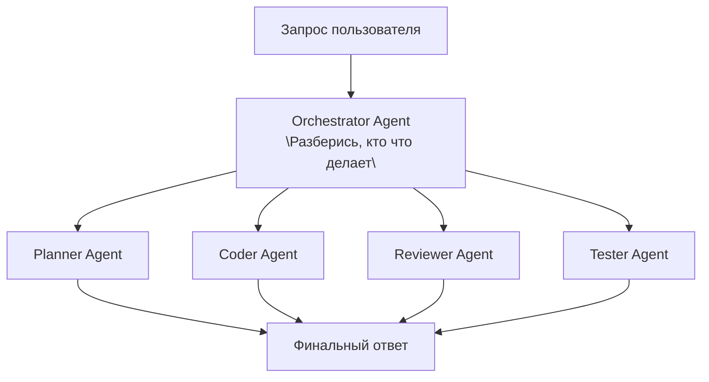
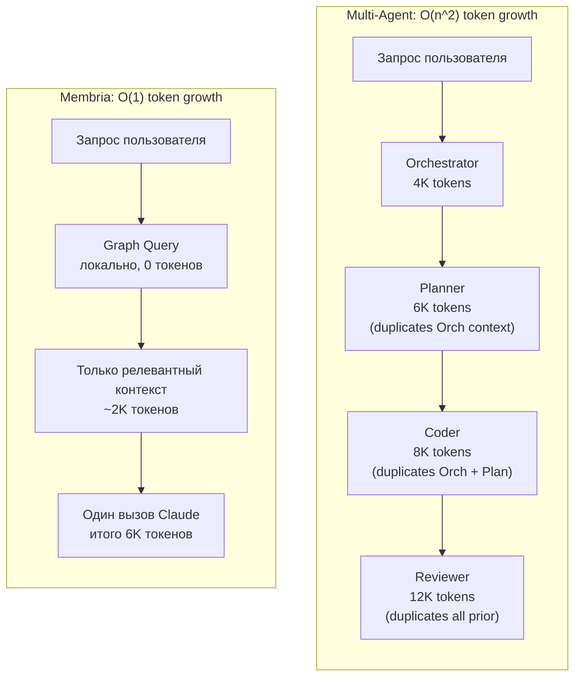

# Coding Superagent: интеграция Membria + Claude Code

## Executive Summary

Membria интегрируется с Claude Code для **генерации кода с учетом решений** (decision-aware code generation) — системы, которая помнит прошлые архитектурные решения, учится на их outcomes и помогает разработчикам не повторять ошибки.

**Ключевая идея:** Claude Code без Membria — это stateless генератор кода. Claude Code с Membria — инструмент, который знает историю проекта, понимает, какие решения сработали, а какие нет, и предупреждает разработчика о рисках до написания кода.

---

## Проблема: stateless ИИ в разработке ПО

### Текущее состояние

Современные AI coding assistants (включая Claude Code) работают в режиме **stateless**:

- Каждый запрос обрабатывается независимо.
- Нет памяти о прошлых архитектурных решениях.
- Нет знания о том, какие подходы уже пробовались и провалились.
- Нет калибровки — система не знает, насколько точны ее рекомендации для конкретной команды.

### Последствия

1. **Повторение ошибок:** команда может выбрать библиотеку, которая уже вызывала проблемы 6 месяцев назад.
2. **Потеря контекста:** архитектурные решения теряются в чатах Slack и комментариях к PR.
3. **Hindsight bias:** после инцидента всем кажется, что они "знали", что решение было плохим, но сомнения до инцидента никто не зафиксировал.
4. **Нет learning loop:** команда не видит паттерны в своих решениях — в каких типах задач она систематически overconfident.

---

## Решение: Decision-Aware Code Generation

### Как это работает

Membria добавляет три ключевые возможности к Claude Code:

| Capability | Что делает | Когда срабатывает |
| :--- | :--- | :--- |
| **Pre-generation Context** | Показывает релевантную историю решений до генерации кода | Когда обнаружен кандидат на решение |
| **Decision Capture** | Фиксирует решение с альтернативами и уверенностью до написания кода | Когда разработчик подтверждает выбор |
| **Outcome Linking** | Связывает результаты (PR merged, CI failed, incident) с решениями | При наступлении Commitment Events |

### Что НЕ является решением

Важно: не каждый запрос к Claude Code — это решение. Система классифицирует задачи:

| Task Type | Примеры | Участие Membria |
| :--- | :--- | :--- |
| **Tactical** | "Fix typo", "Add logging", "Format code" | Минимальное — прямое выполнение |
| **Decision** | "Choose library", "Design API", "Refactor architecture" | Полное — контекст, capture, tracking |
| **Learning** | "PR merged", "Tests failed", "Incident reported" | Linking outcome to past decisions |

---

## Архитектура интеграции

```mermaid
flowchart TD
    subgraph "IDE / PR / CI Layer"
        A[VS Code, GitHub PR, Jira, CI jobs]
    end
    
    A --> CCP[Claude Control Plane (CCP)]

    subgraph CCP
        TR[Task Router]
        T1[Tactical Task]
        T2[Decision Task]
        T3[Learning Task]
        PG[Pre-Generation Context Fetch]
        DS[Decision Surface (IDE Inline)]
        DC[Decision Capture (DBB)]
        AG[Agent / TENN (graph + logic)]
    end

    CCP --> TR
    TR --> T1
    TR --> T2
    TR --> T3
    T2 --> PG
    PG --> DS
    DS --> DC
    DC --> AG

    AG --> PE[Policy Engine (Graph-Informed)]
    PE --> MCP[MCP Server (Claude Runtime Control)]
    MCP --> CC[Claude Code (stateless)]
    MCP --> VG[Post-Generation Validators]
    VG --> RG[Membria Reasoning Graph]
    RG --> OCL[Outcome Capture Layer]
    OCL --> RG
```

### Классификация Task Router

* **code_gen** → tactical (без Decision Capture)
* **architecture** → decision (полный поток Membria)
* **refactor** → decision (если structural change)
* **debug** → tactical (если нет выбора root cause)
* **library_choice** → decision (всегда)

**Decision Signals:**
* "choose", "decide", "should we", "which is better"
* упомянуто несколько альтернатив
* архитектурные ключевые слова: "pattern", "structure", "design"

### Pre-Generation Context Fetch (Query Reasoning Graph)

* прошлые решения по этому модулю
* проваленные похожие assumptions
* калибровка команды для этого домена
* алерты по Negative knowledge

### Decision Surface (IDE Inline)

Показывает разработчику:
* прошлые похожие решения
* предупреждения о рисках
* подсказки по калибровке
* предложения альтернатив

Buttons: `[Proceed]`, `[Review]`, `[Override]`

### Decision Capture (DBB)

Записывает:
* statement
* alternatives
* confidence level
* predicted outcome
* context (immutable)

### Режимы исполнения Agent / TENN

* **Tactical:** прямая генерация кода
* **Decision:** генерация с внедренным захваченным контекстом
* **Learning:** связывание outcome с историческим решением

### Policy Engine (Graph-Informed)

**Static Rules:**
* security policies (no hardcoded secrets)
* compliance requirements (GDPR, SOC2)
* code style enforcement

**Dynamic Rules (from Reasoning Graph):**
* team-specific calibration adjustments
* domain-specific confidence thresholds
* negative knowledge enforcement

**Resonance Detection:**
* check alignment between human bias and LLM bias
* trigger friction if both ignore the same risk

### MCP Server (Claude Runtime Control)

* **Context Injection:**
  * decision context from capture
  * negative knowledge from Graph
  * team preferences and patterns
* **Tool Exposure:**
  * code generation tools
  * graph query tools
  * decision recording tools
* **Mode Enforcement:**
  * tactical mode: minimal context
  * decision mode: full context injection
* **Output Schema Validation**

### Post-Generation Validators

**Bias Detection in Output:**
* **Anchoring:** excessive focus on the first option in code comments
* **Confirmation:** ignoring stated alternatives
* **Overconfidence:** words like "definitely", "always works", "no issues"

**Consistency Checks:**
* does generated code match the captured decision?
* is negative knowledge respected?
* are alternatives actually considered in implementation?

**Validation Failures:**
* log for calibration (do not block)
* alert if critical (security, compliance)

### Membria Reasoning Graph (Decision Record)

```
decision_id: dec_142
statement: "Use Fastify for REST API"
alternatives: ["Express.js", "Koa", "Custom"]
confidence: 0.60
predicted_outcome: "Stable API, good performance"
assumptions: ["Fastify handles our load", "Team knows it"]
context_hash: "abc123..." (immutable)
status: PENDING_OUTCOME
linked_pr: null -> PR#234 (when created)
linked_commit: null -> commit_sha (when merged)
```

**Relationships:**
* `RELIES_ON`: assumptions
* `BLOCKS`: dependent decisions
* `SUPERSEDES`: previous decisions on same topic
* `CAUSED_BY`: parent architectural decisions

### Outcome Capture Layer (Commitment Events)

| Source | Event | Outcome Signal |
| :--- | :--- | :--- |
| GitHub | PR merged | Decision executed |
| GitHub | PR closed (no merge) | Decision abandoned |
| CI/CD | Tests pass | Positive signal |
| CI/CD | Tests fail | Negative signal |
| CI/CD | Build fail | Negative signal |
| PagerDuty | Incident created | Strong negative |
| Jira | Bug linked to PR | Negative signal |
| Time | 30 days stable | Positive outcome |
| Time | 90 days stable | Strong positive outcome |

**Calibration Update:**
* compare `predicted_outcome` vs `actual_outcome`
* update team calibration profile
* update domain-specific calibration
* generate LoRA candidate if systematic gap detected

---

## Detailed Flow: Library Selection Decision

### Scenario

Разработчик в VS Code пишет: "Add REST API for user management, need to choose a framework".

### Step 1: Task Router Classification

```
Input: "Add REST API for user management, need to choose a framework"

Classification Analysis:
├── Keywords detected: "choose", "framework"
├── Multiple alternatives implied: yes
├── Architectural impact: yes (API framework affects whole service)
└── Decision type: LIBRARY_CHOICE

Result: Route to DECISION flow (not tactical)
```

### Step 2: Pre-Generation Context Fetch

```
Запрос к Reasoning Graph:

MATCH (d:Decision)-[:ABOUT]->(t:Topic)
WHERE t.name IN ["REST API", "framework", "HTTP server"]
  AND d.repo = "current-repo"
RETURN d, d.outcome, d.assumptions

Результаты:
┌─────────────────────────────────────────────────────────────────────┐
│ Decision #47 (8 месяцев назад)                                     │
│ Statement: "Use Express.js for API gateway"                        │
│ Outcome: SUCCESS                                                   │
│ Notes: "Worked well, team familiar"                                │
├─────────────────────────────────────────────────────────────────────┤
│ Decision #89 (6 месяцев назад)                                     │
│ Statement: "Use custom middleware for authentication"              │
│ Outcome: FAILURE                                                   │
│ Notes: "Security vulnerability found, had to rewrite"              │
│ Negative knowledge: "Avoid custom auth middleware"                 │
├─────────────────────────────────────────────────────────────────────┤
│ Team Calibration (library choices):                                │
│ • Average confidence: 0.78                                         │
│ • Actual success rate: 0.61                                        │
│ • Calibration gap: +17% (overconfident)                            │
│ • Recommendation: Reduce stated confidence by ~15%                 │
└─────────────────────────────────────────────────────────────────────┘
```

### Step 3: Decision Surface Display (in IDE)

Разработчик видит панель **до** того, как Claude что-либо сгенерирует:

```
┌─────────────────────────────────────────────────────────────────────┐
│  🧠 Membria Decision Context                                        │
│                                                                     │
│  ━━━━━━━━━━━━━━━━━━━━━━━━━━━━━━━━━━━━━━━━━━━━━━━━━━━━━━━━━━━━━━━━  │
│                                                                     │
│  📊 РЕЛЕВАНТНАЯ ИСТОРИЯ                                             │
│                                                                     │
│  ✅ Express.js worked well (8 месяцев назад)                       │
│     "API gateway - team was familiar, stable in prod"              │
│                                                                     │
│  ❌ Custom middleware failed (6 месяцев назад)                     │
│     "Security vulnerability, 2-week rewrite"                       │
│     ⚠️ NEGATIVE KNOWLEDGE: Avoid custom auth solutions             │
│                                                                     │
│  ━━━━━━━━━━━━━━━━━━━━━━━━━━━━━━━━━━━━━━━━━━━━━━━━━━━━━━━━━━━━━━━━  │
│                                                                     │
│  📈 КАЛИБРОВКА КОМАНДЫ                                              │
│                                                                     │
│  Ваша команда склонна к overconfidence (17%) при выборе библиотек.  │
│  Если вы чувствуете уверенность 80%, история подсказывает ~65%.     │
│                                                                     │
│  ━━━━━━━━━━━━━━━━━━━━━━━━━━━━━━━━━━━━━━━━━━━━━━━━━━━━━━━━━━━━━━━━  │
│                                                                     │
│  💡 СООБРАЖЕНИЯ                                                     │
│                                                                     │
│  • Express.js: proven in this repo, team knows it                  │
│  • Fastify: faster, but team has no experience                     │
│  • Koa: minimal, might need more custom code                       │
│                                                                     │
│  ━━━━━━━━━━━━━━━━━━━━━━━━━━━━━━━━━━━━━━━━━━━━━━━━━━━━━━━━━━━━━━━━  │
│                                                                     │
│  Готовы продолжить?                                                 │
│                                                                     │
│  [ Proceed with Claude ] [ Review History ] [ I'll decide myself ] │
│                                                                     │
└─────────────────────────────────────────────────────────────────────┘
```

### Step 4: Developer Interaction

Разработчик нажимает "Proceed with Claude" и добавляет: "Let's go with Fastify for better performance".

### Step 5: Decision Capture (DBB)

До генерации кода система фиксирует:

```json
{
  "decision_id": "dec_142",
  "timestamp": "2025-02-06T14:32:00Z",
  "statement": "Use Fastify for REST API in user-service",
  "alternatives_considered": [
    {
      "option": "Express.js",
      "reason_rejected": "Need better performance"
    },
    {
      "option": "Koa",
      "reason_rejected": "Too minimal"
    },
    {
      "option": "Custom",
      "reason_rejected": "Negative knowledge from dec_89"
    }
  ],
  "confidence": {
    "stated": 0.75,
    "calibrated": 0.62,
    "calibration_note": "Adjusted for team's +17% overconfidence in library choices"
  },
  "assumptions": [
    "Fastify handles our expected load (10k req/s)",
    "Team can learn Fastify quickly",
    "Fastify ecosystem has needed plugins"
  ],
  "predicted_outcome": {
    "description": "Stable, performant API ready in 2 weeks",
    "success_criteria": [
      "API handles 10k req/s",
      "No critical bugs in first month",
      "Team onboarding < 1 week"
    ]
  },
  "context_hash": "sha256:abc123...",
  "status": "CAPTURED",
  "linked_artifacts": {
    "pr": null,
    "commit": null,
    "jira": "PROJ-456"
  },
  "negative_knowledge_acknowledged": [
    "dec_89: Avoid custom auth middleware"
  ]
}
```

### Step 6: MCP Server Context Injection

Claude Code получает обогащенный контекст:

```
Инъекция системного контекста:
━━━━━━━━━━━━━━━━━━━━━━━━━━━━━━━━━━━━━━━━━━━━━━━━━━━━━━━━━━━━━━━━━━━━

КОНТЕКСТ РЕШЕНИЯ:
Вы реализуете решение, которое было зафиксировано.
Decision: "Use Fastify for REST API in user-service"

ОГРАНИЧЕНИЯ ИЗ ИСТОРИИ:
❌ DO NOT implement custom authentication middleware
   (Previous attempt failed with security issues - see dec_89)

✅ DO use established authentication libraries (passport, etc.)

ПАТТЕРНЫ КОМАНДЫ:
• This team prefers explicit error handling over middleware magic
• Previous APIs in this repo use consistent /api/v1/ prefix
• Team uses Zod for validation (see dec_98)

ASSUMPTIONS TO VALIDATE:
Решение предполагает, что Fastify выдержит 10k req/s.
Учитывайте это в реализации.

━━━━━━━━━━━━━━━━━━━━━━━━━━━━━━━━━━━━━━━━━━━━━━━━━━━━━━━━━━━━━━━━━━━━
```

### Step 7: Claude Code Generation

Claude генерирует Fastify API код, при этом:
* no custom auth middleware (negative knowledge respected)
* uses passport-jwt for authentication
* includes performance notes
* follows `/api/v1/` convention
* uses Zod for validation

### Step 8: Post-Generation Validation

```
Результаты валидации:
━━━━━━━━━━━━━━━━━━━━━━━━━━━━━━━━━━━━━━━━━━━━━━━━━━━━━━━━━━━━━━━━━━━━

✅ Decision consistency: Code uses Fastify (matches decision)
✅ Negative knowledge: No custom auth middleware found
✅ Assumptions addressed: Performance notes included
⚠️ Bias check: Found "this will definitely scale" - overconfident language
   (Logged for calibration, not blocking)

━━━━━━━━━━━━━━━━━━━━━━━━━━━━━━━━━━━━━━━━━━━━━━━━━━━━━━━━━━━━━━━━━━━━
```

### Step 9: PR Creation & Linking

Разработчик создает PR. Система автоматически связывает:

```
Decision dec_142 updated:
├── linked_pr: PR#234
├── linked_commit: abc123
├── status: PENDING_OUTCOME → EXECUTED
└── execution_date: 2025-02-06T15:45:00Z
```

### Step 10: Outcome Capture (Async)

**Day 1: PR Merged**
```
Событие: PR#234 merged to main
Сигнал: POSITIVE (code accepted)
Статус решения: MERGED
```

**Day 3: CI Passes**
```
Событие: All tests pass, deployment successful
Сигнал: POSITIVE (technical validation)
```

**Day 14: Minor Bug Found**
```
Событие: Jira bug PROJ-478 linked to PR#234
Сигнал: WEAK_NEGATIVE (minor issue)
Заметка: "Fastify plugin compatibility issue, fixed in 2 hours"
```

**Day 30: Stability Check**
```
Событие: 30-day stability window passed
Метрики:
├── Uptime: 99.9%
├── P99 latency: 45ms
├── Throughput: achieved 12k req/s (exceeds assumption)
└── Bugs: 1 minor (resolved)

Финальный outcome: SUCCESS
```

### Step 11: Calibration Update

```
Анализ калибровки для dec_142:
━━━━━━━━━━━━━━━━━━━━━━━━━━━━━━━━━━━━━━━━━━━━━━━━━━━━━━━━━━━━━━━━━━━━

Предсказание: "Stable, performant API ready in 2 weeks"
Факт: Delivered in 2 weeks, stable, exceeded performance target

Уверенность (stated): 0.75
Уверенность (calibrated): 0.62
Actual outcome: SUCCESS

Анализ:
• Original confidence (0.75) was appropriate for this decision
• Calibration adjustment was slightly too aggressive
• Fastify assumption validated: handles 12k req/s (target was 10k)

Обновление калибровки команды:
• Library choice calibration gap: +17% → +14%
• Fastify-specific confidence: can be higher for this team

Обновление assumptions:
• "Fastify handles our expected load" → VALIDATED
• "Team can learn Fastify quickly" → VALIDATED (no onboarding issues)
• "Fastify ecosystem has needed plugins" → PARTIALLY_VALIDATED (one compat issue)

━━━━━━━━━━━━━━━━━━━━━━━━━━━━━━━━━━━━━━━━━━━━━━━━━━━━━━━━━━━━━━━━━━━━
```

---

## Membria (Superagent) vs Multi-Agent Architecture

### Почему Multi-Agent — архитектурный тупик

**Что такое Multi-Agent архитектура:**



Каждый агент = отдельный вызов LLM с полным контекстом.

---

### Экономика токенов: Multi-Agent vs Membria

**Типичная задача: "Add REST API for user management"**

#### Multi-Agent подход:

| Agent | Input tokens | Output tokens | Стоимость (Claude Sonnet) |
| :--- | :--- | :--- | :--- |
| Orchestrator | 4,000 | 500 | $0.018 |
| Planner | 6,000 | 1,500 | $0.030 |
| Coder | 8,000 | 3,000 | $0.057 |
| Reviewer | 12,000 | 1,000 | $0.051 |
| Tester | 10,000 | 800 | $0.039 |
| Fixer (iteration 1) | 14,000 | 2,000 | $0.062 |
| Fixer (iteration 2) | 16,000 | 1,500 | $0.066 |
| **TOTAL per task** | **70,000** | **10,300** | **$0.32** |

**В день (20 задач):** $6.40
**В месяц (20 рабочих дней):** $128 на разработчика
**Команда 5 человек:** $640/месяц только на токены

И это **не включает:**
* retries на failures
* long contexts в больших проектах
* scaling при активной разработке

#### Membria подход (Superagent):

| Component | Input tokens | Output tokens | Стоимость |
| :--- | :--- | :--- | :--- |
| Context fetch (Graph query) | 0 | 0 | $0 (local) |
| Один вызов Claude + инъекция контекста | 6,000 | 3,000 | $0.033 |
| **TOTAL per task** | **6,000** | **3,000** | **$0.033** |

**В день (20 задач):** $0.66
**В месяц:** $13.20 на разработчика
**Команда 5 человек:** $66/месяц

**Разница: в 10 раз дешевле**

---

### Почему Multi-Agent сжигает токены



### Технические проблемы Multi-Agent

1. **Фрагментация контекста**
   * Planner Agent thinks: "Use Redis for cache"
   * Coder Agent doesn't get full reason context
   * → implements in-memory cache
   * → Reviewer: "Why not Redis?"
   * → 3 more iterations

2. **Размывание ответственности**
   * bug in prod. "Which agent decided this?"
   * Orchestrator: "I just assigned tasks"
   * Planner: "I gave a plan, Coder changed it"
   * Coder: "Reviewer approved it"
   * Reviewer: "Tester missed it"
   * → no single decision record, no accountability

3. **Несогласованность рассуждений**
   * Planner (temperature 0.7): creative plan
   * Coder (temperature 0.2): conservative implementation
   * → mismatch between plan and code
   * → Reviewer doesn't understand intent

4. **Экспоненциальные сбои**
   * 5 agents, each 95% reliable
   * total reliability: $0.95^5 = 77\%$
   * 23% of tasks require retry = even more tokens

---

## Сравнение моделей ценообразования

### Вендоры Multi-Agent (usage-based)

```
Месяц 1:  разгон команды         → $200
Месяц 2:  активная разработка    → $800
Месяц 3:  дедлайн, heavy usage   → $2,400
Месяц 4:  еще один дедлайн       → $3,100

CFO: "Почему счет за ИИ выше, чем за AWS?"
```

### Membria (subscription)

```
Месяц 1:  $49/seat × 5 = $245
Месяц 2:  $245
Месяц 3:  $245 (дедлайн? та же цена)
Месяц 4:  $245

Предсказуемо. Бюджетируемо. Безлимитно.
```

### Почему subscription работает для Membria

```
Затраты Membria:
├── Graph storage: $0.001 per decision (negligible)
├── Graph queries: local, CPU only
├── LLM calls: user pays for their own Claude tokens (BYOK)
└── Our infrastructure: fixed

Мы НЕ перепродаем токены с наценкой.
Мы продаем КОНТЕКСТ, который делает токены эффективнее.
```

**Multi-agent vendor incentive:** вы используете больше агентов = они зарабатывают больше.

**Membria incentive:** лучший контекст = меньше нужных токенов = более довольные клиенты = больше seats.

---

## Итог

Multi-agent архитектура решает задачу "как разделить работу" путем создания новой проблемы: "как синхронизировать контекст между агентами, не разорившись на токенах".

**Membria Superagent** решает корневую проблему: **дать одному агенту правильный контекст** вместо создания толпы агентов с неполным контекстом.

Результат:
* AI, который помнит ваш проект.
* Решения, которые не теряются.
* Ошибки, которые не повторяются.
* Затраты, которые не взрываются.

**Vibe coding перестает быть "генерацией с нуля каждый раз" и становится "генерацией с памятью проекта".**
