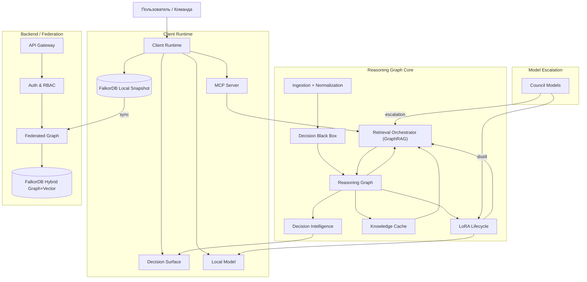

## Обзор системы

Membria — это распределенная, local-first интеллектуальная система для накопления и воспроизводимой работы с решениями. **Базой архитектуры является FalkorDB — гибридная векторно-графовая БД**, где хранятся решения, доказательства, причины, исходы и их связи. Вокруг FalkorDB построен Reasoning Graph, GraphRAG, Decision Intelligence и Superagent-поток для IDE/CLI.

Ключевые принципы:
- **Решения как объекты первого класса** (а не документы).
- **Commitment Events** определяют необратимость.
- **GraphRAG с бюджетами** вместо бесконечного контекста.
- **Local-first** для приватности и задержки.
- **Контролируемое обучение** через LoRA и калибровку.
- **FalkorDB end-to-end** как единая граф/вектор память (локально и в федерации).



---

## Архитектурные слои

### 1) Источники и извлечение
- **Ingestion + Normalization**: сбор событий из Slack, GitHub, Docs, CI/CD.
- **DBB (Decision Black Box)**: извлечение решений, предположений, альтернатив и сигналов из событий.
- **Commitment Events**: фиксируют необратимость (PR merged, контракт подписан, счет выставлен).

### 2) Ядро Reasoning Graph
- **FalkorDB** как единое ядро графа и векторов (локально и в федерации).
- **Graph Memory**: причинность, зависимости, временные диапазоны, provenance.
- **Vector Memory**: семантическая близость внутри того же ядра.
- **Knowledge Cache**: проверенные ответы, паттерны и негативные знания.

### 3) GraphRAG и контекст
- **Retrieval Orchestrator** применяет бюджеты (edge/step/token/risk).
- Сначала подграф по RBAC и области, затем векторный поиск внутри него.
- Контекст собирается итеративно, трейс хранится для аудита.

### 4) Decision Intelligence
- **VoI**: приоритизация решений по ценности информации.
- **Belief State (POMDP)**: детекция скрытых разногласий.
- **Sequencing**: приоритизация зависимых решений через Priority Queue.
- **Calibration**: сопоставление предсказаний и исходов.

### 5) LoRA Lifecycle + Router Policy
- **Источники:** outcomes, distillation Council, доменные пакеты.
- **Governance:** eval dataset, canary, promote/rollback.
- **Router Policy:** применяет LoRA только при доказанном улучшении и без роста галлюцинаций.

### 6) Superagent-поток для IDE/CLI
- **Task Router** определяет: тактическая задача или решение.
- **TENN (Task Execution Neural Network)**: агентный слой выполнения задач и решений, связанный с графом и политиками.
- **Decision Surface** показывает риски, альтернативы, калибровку.
- **Policy Engine** применяет негативные знания и комплаенс.
- **Validators** проверяют согласованность решения и вывода.

---

## Технологический стек

### Слой данных
| Компонент | Технология | Роль |
|-----------|------------|------|
| **Гибридная граф/вектор БД** | **FalkorDB** | Базовое хранилище решений, доказательств и индексов семантики в одном ядре. |
| **Локальное хранилище** | **FalkorDB (embedded/local)** | Офлайн-граф, кэш состояния и клиентских настроек в едином хранилище. |
| **Очереди / события** | **Redis / NATS / Kafka** | Асинхронная обработка: ingestion, outcomes, обновления DI. |

### Сервисы ядра
| Компонент | Технология | Роль |
|-----------|------------|------|
| **Reasoning Graph Engine** | **Julia** | Графовые алгоритмы, VoI, POMDP, sequencing, калибровка. |
| **GraphRAG Orchestrator** | **Julia / Python** | Бюджеты извлечения, сбор контекста, трассировка. |
| **DBB / Ingestion** | **Rust / Python** | Высокоскоростной парсинг событий, нормализация, извлечение решений. |
| **Auth & Policy** | **OIDC / RBAC** | Политики доступа на уровне узлов и доменов. |

### Клиентский рантайм
| Компонент | Технология | Роль |
|-----------|------------|------|
| **MCP Server** | **TypeScript / Python** | Интеграция с Claude Code, IDE и CLI. |
| **Decision Surface** | **Web UI / Desktop** | Визуализация решений, VoI, скрытых разногласий. |
| **Local Model** | **Llama.cpp / ONNX** | Локальный inference для 80-95% запросов. |
| **Local Graph Engine** | **FalkorDB** | Локальный GraphRAG, хранение решений и векторные индексы. |

---

## Потоки данных

### 1) Ingestion и фиксация
```
Источники -> Нормализация -> DBB -> Decision Windows -> Reasoning Graph
```

### 2) Retrieval (GraphRAG)
```
Запрос -> RBAC/Scope -> Подграф (FalkorDB) -> Векторный поиск -> Контекст -> Ответ
```

### 3) Outcome и калибровка
```
Commitment Event -> Outcome -> Calibration -> Обновление уверенности
```

---

## Модель данных (упрощенно)

**Узлы:** Decision, Assumption, Outcome, Evidence, Person, Team, Document, Event.

**Связи:** BASED_ON, DEPENDS_ON, BLOCKS, CAUSED_BY, SUPERSEDES, HAS_OUTCOME, VALID_IN_TIME_RANGE.

**Принцип:** хранится структура рассуждений и provenance, а не полный текстовый лог.

---

## Безопасность и комплаенс

- **RBAC на уровне узлов графа** и по доменам.
- **Неподделываемость**: хэши Evidence, append-only логи, опциональная привязка к неизменяемому хранилищу.
- **Шифрование**: AES-256 at rest, TLS 1.3 in transit.
- **Cognitive Safety Layer**: дебиасинг и детекция резонанса.

---

## Развертывание

1. **SaaS**: управляемая среда.
2. **Enterprise Cloud**: выделенный инстанс в VPC.
3. **On-Prem / Air-Gapped**: полный контроль, локальный Reasoning Graph.

---

## Поверхность интеграции

- **IDE/CLI**: MCP-интеграции (Claude Code, Cursor).
- **CI/CD**: GitHub/GitLab события как Commitment Events.
- **Коммуникации**: Slack/Teams/Email.
- **API**: REST/GraphQL для кастомных интеграций.

[Смотреть полный API Reference →](/api-reference)
