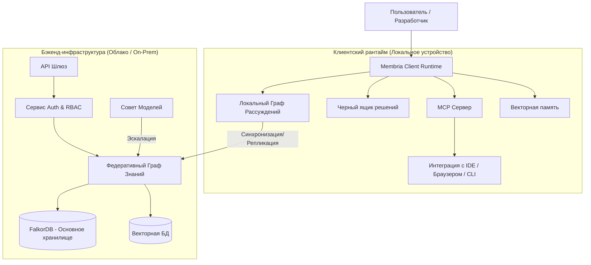

## Обзор системы

Membria — это распределенная, local-first интеллектуальная система, предназначенная для сохранения рассуждений и решений в масштабах организации. Она состоит из **Клиентского рантайма** (локальная память и рассуждения) и **Бэкенд-слоя** (общие знания и федерация).



---

## Технологический стек

### Слой данных (Core Data Layer)
| Компонент | Технология | Роль |
|-----------|------------|------|
| **Графовая БД** | **FalkorDB** | Основное хранилище для деревьев решений, причинности и темпоральных связей. Выбрана за низкую задержку Cypher-запросов и производительность GraphBLAS. |
| **Векторное хранилище** | **Qdrant / pgvector** | Семантический поиск для "похожих случаев" и извлечения доказательств. |
| **Локальное хранилище** | **SQLite** | Локальное кэширование настроек, состояния сессии и офлайн-фрагментов графа. |
| **Очереди** | **Redis / NATS** | Асинхронная обработка событий для ингестии DBB и трекинга исходов. |

### Бэкенд-сервисы
| Компонент | Технология | Роль |
|-----------|------------|------|
| **Core API** | **Julia / Python (FastAPI)** | Высокопроизводительная логика рассуждений и обход графа. Julia используется для сложных графовых алгоритмов. |
| **Ingestion** | **Rust / Python** | Высокоскоростной парсинг логов, экспортов чатов и документов. |
| **Auth** | **OAuth2 / OIDC** | Интеграция с корпоративным SSO (Okta, Azure AD, Google). |

### Клиентский рантайм
| Компонент | Технология | Роль |
|-----------|------------|------|
| **Desktop App** | **Tauri / Electron** | Кроссплатформенный UI для Decision Surface и локального управления. |
| **MCP Server** | **TypeScript / Python** | Реализация Model Context Protocol для интеграции с Claude, Cursor и IDE. |
| **Local Inference** | **Llama.cpp / ONNX** | Запуск SLM (малых языковых моделей) для приватного локального анализа. |

---

## Сетевая архитектура и поток данных

### 1. Пайплайн ингестии (Ingestion)
```
Источники (Slack, GitHub, Docs) 
  → Сервис ингестии (Нормализация) 
  → ThoughtUnits (Канонический формат) 
  → DBB (Извлечение решений) 
  → Граф рассуждений (Запись)
```

### 2. Пайплайн извлечения (GraphRAG)
```
Запрос пользователя 
  → Оркестратор извлечения 
  → Проверка прав (RBAC) 
  → Гибридный поиск (Вектор + Обход графа) 
  → Сборка контекста 
  → Генерация LLM
```

### 3. Синхронизация (Local-First)
- **Офлайн режим:** Клиент читает/пишет в локальный снапшот SQLite/FalkorDB.
- **Синхронизация:** При подключении к сети CRDT-merging или дифференциальная синхронизация отправляет изменения в Федеративный граф.
- **Разрешение конфликтов:** "Last write wins" для метаданных; ручное слияние для конфликтующих рассуждений.

---

## Безопасность и Комплаенс

### Аутентификация и Авторизация
- **RBAC:** Тонкая настройка прав доступа на уровне узлов графа.
- **Тенантность:** Строгая логическая изоляция между командами/проектами в графе.
- **Аудит-лог:** Неизменяемые логи каждого захвата решения, переопределения и обновления исхода.

### Защита данных
- **Шифрование (Rest):** AES-256 для всех томов БД.
- **Шифрование (Transit):** TLS 1.3 для всех клиент-серверных коммуникаций.
- **Очистка PII:** Опциональный пайплайн редактирования для ингестии чувствительных чат-логов.

### Слой когнитивной безопасности
- **Дебиасинг:** Автоматические проверки на паттерны искажений (Якорение, Подтверждение) запускаются *до* коммита.
- **Детекция резонанса:** Мониторинг совпадения предвзятости пользователя и галлюцинаций LLM.

---

## Требования к инфраструктуре (Self-Hosted / Enterprise)

### Минимальные спецификации
- **CPU:** 4+ ядра (8+ рекомендуется для тяжелой ингестии)
- **RAM:** 16GB+ (32GB+ если запускается локальный инференс LLM)
- **Хранилище:** NVMe SSD обязательно для производительности Graph/Vector БД.

### Варианты развертывания
1. **SaaS (Managed):** Полностью хостится Membria. Нулевое обслуживание.
2. **Private Cloud (VPC):** Развертывание в AWS/GCP/Azure аккаунте клиента через Terraform/Helm.
3. **Air-Gapped:** Полностью офлайн развертывание для оборонных/разведывательных кейсов (требует кастомного Enterprise соглашения).

---

## Поверхность интеграции

- **IDE:** Расширение VS Code (через MCP)
- **CI/CD:** GitHub Actions / GitLab CI раннеры
- **Chat:** Боты Slack / Teams
- **API:** REST & GraphQL эндпоинты для кастомных интеграций

[Смотреть полный API Reference →](/api-reference)
