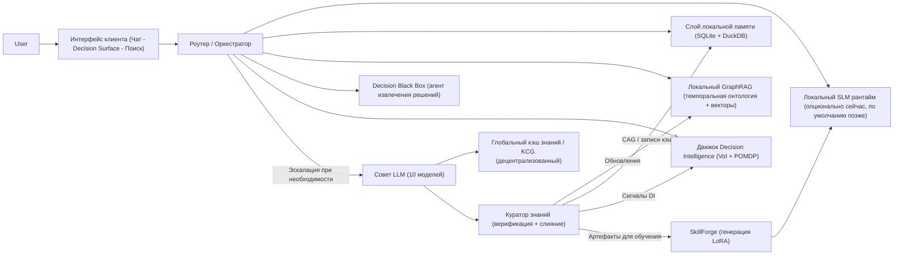

> Клиент Membria CE — это пользовательское приложение, которое превращает просто «наличие модели» в «систему устойчивого интеллекта».
> Сегодня он может работать как **Membria Cloud (управляемый сервис)**, а позже — как **Membria Self-Hosted (локально/на устройстве)**, используя те же основные
> принципы: **рассуждения local-first, где это возможно, явная память, объяснимое извлечение и выборочная эскалация**.
> Этот документ описывает архитектуру клиента и то, как он подключается к децентрализованному бэкенду знаний Membria.

---

## 1) За что отвечает клиент

Клиент — это не просто UI чата. Это полноценный рантайм, который:

- **Запускает локальную малую языковую модель (SLM)**, если она доступна.
- Поддерживает **долгосрочную память** (структурированную и доступную для поиска).
- Выстраивает и опрашивает **GraphRAG** (граф знаний + векторы) для получения обоснованных ответов.
- Детектирует **решения и поворотные моменты** (Decision Black Box -> питает Decision Surface).
- Выполняет **эскалации** к Совету более мощных моделей, когда локальных рассуждений недостаточно.
- **Кэширует** верифицированные ответы и структурированные артефакты рассуждений, благодаря чему интеллект накапливается со временем.
- Обеспечивает **конфиденциальность, права доступа и прозрачность** в отношении источников данных и использования инструментов.

---

## 2) Ментальная модель (что «накапливается»)

Большинство ИИ-инструментов обнуляются: каждый новый чат начинается с чистого листа или с поверхностной «памяти».

Membria накапливает три типа активов:

1. **Рабочий контекст** (непрерывный, на уровне сессии)
2. **Персональный слой знаний** (GraphRAG + структурированная память)
3. **Слой навыков** (LoRA-патчи + доменные адаптеры)

Когда локального ИИ недостаточно, Membria эскалирует запрос, а затем **возвращает** полученные знания в виде обновлений кэша и графа, а также опциональных артефактов для обучения.

---

## 3) Высокоуровневая архитектура

---

## 4) Интерфейсы (Чат, Decision Surface, Поиск)

### 4.1 Чат (привычный режим)
- Полноценный поток в стиле ChatGPT.
- Поддержка нескольких тредов с использованием различных инструментов и моделей.
- Чат — это **входные данные**, а не финальный продукт: Membria извлекает долговечные артефакты (решения, предположения, ссылки, исходы).

### 4.2 Decision Surface (DS)
Ежедневный «главный экран», который суммирует то, что важно, по многим чатам и инструментам:

- **Открытые петли (ранжированные по VoI)**: Нерешенные треды, приоритизированные по ценности информации.
- **Скрытые разногласия**: Сигналы POMDP, обнаруживающие моменты, где поверхностное согласие скрывает реальный скептицизм.
- **Дрифт предположений**: Убеждения, которые изменились со временем или в зависимости от источников.
- **Прецеденты**: Похожие прошлые решения и их исходы.

DS читает данные из **движка Decision Intelligence + графа памяти**, а не из сырой прокрутки чата.

### 4.3 Поиск (редкий, но мощный)
Поиск — это не просто функция «резюмируй мои документы». Это **объяснимое извлечение**:

- Цитирование источников.
- Цепочки связей («почему это следует из того»).
- Контекст с учетом графа (сущности, отношения, метки времени, треды).

---

## 5) Decision Black Box (DBB)

DBB — это агент или процесс, который непрерывно логирует и извлекает «поворотные моменты» из информационных потоков пользователя.
Думайте об этом как о **бортовом самописце для рассуждений**: он фиксирует, *что изменилось*, *что было решено* и *почему*, не прерывая нормальную работу.

### Что хранит DBB (структурированно, а не сырые дампы)
- Кандидаты в решения (предложение -> фиксация -> завершение).
- Предположения и степень уверенности.
- Ссылки на доказательства (сообщения, документы, диффы кода).
- Крючки исходов (что проверить позже и когда).

### Где DBB проявляется в UI
DBB в основном является бэкендом для DS, но он может опционально показывать:
- легкую «ленту активности» (не блокирующую);
- запрос на захват (capture prompt) только тогда, когда уверенность в том, что произошло реальное решение, высока.

DBB не должен быть модальным «синим экраном». Он должен вести себя как инструментарий, а не как принудительный ритуал.

---

## 6) Движок Decision Intelligence (DI)

Движок DI работает поверх DBB и графа памяти для оптимизации совместного обсуждения человека и ИИ.

- **Ценность информации (VoI):** Ранжирует открытые петли по ожидаемой полезности их решения. Он подсказывает вам, *какое* решение требует вашего внимания в первую очередь, исходя из потенциального влияния.
- **Трекинг убеждений POMDP:** Поддерживает вероятностную модель «истинного» состояния консенсуса. Он помечает «Скрытые разногласия», когда явное согласие (например, «+1») сопровождается скептическими метаданными (задержка, противоречивые доказательства, сигналы red-teaming).
- **Последовательность решений:** Рекомендует оптимальный порядок принятия решений для минимизации длительности проекта или риска, выявляя «узкие места» до того, как они заблокируют параллельную работу.

---

## 7) Оркестратор: мозг рантайма

`Роутер / Оркестратор` принимает решения:

- Какая модель запускается (локальная SLM или эскалация).
- Какие слои памяти опрашиваются.
- Является ли цитирование обязательным (в зависимости от контекста).
- Как кэшировать и структурировать выходные данные.

### 7.1 Надежность: Idem-Prompts (вызовы, безопасные для инструментов)
При вызове инструментов, требующих строгого формата (JSON, схемы), оркестратор оборачивает запросы в ограничивающие промпты, чтобы система оставалась детерминированной и безопасной.

### 7.2 Проблема «взрыва контекста»
Membria не держит «всё в промпте».
Вместо этого она использует **динамическую рабочую память** и постоянные хранилища.

---

## 8) Слой локальной памяти (гибридный и иерархичный)

Membria использует гибридный подход — одновременно **встроенный** и **быстрый**:

### 8.1 «Горячая» память (в памяти, на одну задачу)
- черновик сессии;
- активное состояние рассуждений;
- максимально быстрый доступ.

### 8.2 «Теплая» память (персистентность на SQLite)
**SQLite (Транзакционное ядро)**
- метаданные чатов (не обязательно полные сырые логи);
- логи событий (`event_log`);
- настройки пользователя, области источников, права доступа;
- записи Cache-Augmented Generation (CAG), подтянутые из глобального кэша.

Рекомендуемый режим производительности:
- `PRAGMA journal_mode=WAL;`
- хранение JSON через JSON1 для гибких артефактов рассуждений.

### 8.3 «Холодная» память (аналитика DuckDB + векторы)
**DuckDB (Аналитический движок)**
- индекс эмбеддингов для больших наборов документов;
- семантический поиск по фрагментам («ThoughtUnits»);
- аналитика по персональным знаниям и решениям.

Такое разделение позволяет клиенту оставаться легким, обеспечивая при этом быстрый локальный поиск и анализ.

---

## 9) Локальный GraphRAG и «ThoughtUnits»

Клиент нормализует импортированные источники в **ThoughtUnits** (легкий парсинг, а не дорогостоящие рассуждения):

- вопрос;
- решение;
- комментарий;
- обсуждение;
- метка времени, автор, ID треда;
- ссылка на источник.

GraphRAG использует:
- темпоральную онтологию (сущности + отношения во времени);
- векторы для поиска по сходству;
- графовые запросы для построения объяснимых цепочек связей.

---

## 10) Когда локального ИИ недостаточно: Совет + Глобальный кэш

Membria спроектирована так, чтобы большую часть времени работать максимально дешево.
Когда обнаруживается пробел в знаниях, она эскалирует запрос.

### 10.1 Чекпойнт самопознания (Self-knowledge checkpoint)
Локальный эксперт дает ответ, а затем запускает проверку уверенности:
- «Достаточно ли у меня обоснованных доказательств?»
- «Достаточен ли контекст графа?»
- «Не слишком ли высока неопределенность для этого домена?»

Если уверенность низка, оркестратор эскалирует запрос.

### 10.2 Цикл «Совет + кэширование»
- Опрос **Совета LLM** (более мощных моделей).
- Приоритет ответам, уже присутствующим в **Глобальном кэше знаний**.
- Верификация и слияние через **Куратора знаний**.
- Запись обратно:
  - кэшированный ответ + цитаты (CAG);
  - обновления онтологии для GraphRAG;
  - опциональные артефакты обучения для SkillForge (см. следующий раздел).

---

## 11) SkillForge и LoRA-патчи (выборочные, по доменам)

**LoRA-патчи** — это небольшие экспертные адаптеры, которые повышают возможности модели в конкретных областях.
Они не делают модель «умнее в целом», но могут закрыть *повторяющиеся, специфичные для домена* пробелы.

### Важная критика (и правильная постановка задачи)
Велик соблазн сказать: «LoRA накапливаются автоматически на основе выходов системы».
Это может быть правдой **только** при соблюдении строгих критериев качества, потому что:
- ответы Совета могут быть ошибочными или непереносимыми;
- обучение на шумных, ситуативных ответах может закрепить ошибки;
- переобучение на узкий стиль может снизить надежность.

Поэтому генерация LoRA должна быть:
- выборочной (только для повторяющихся пробелов);
- курируемой (данные для обучения берутся из верифицированных, объединенных артефактов);
- ограниченной областью (для конкретного эксперта или домена, а не глобально).

---

## 12) Задержка и «магическая» скорость

RAG по своей природе может быть медленным. Membria смягчает это через:

- **Двухэтапное извлечение:** быстрый поиск кандидатов -> ранжирование с учетом графа.
- **Агрессивное кэширование:** лучший поиск — это тот, которого не было.
- **Адаптивная глубина:** не все вопросы требуют глубокого расширения графа.
- **Оптимистичный UI:** быстрый показ предварительного ответа со статусом «верификация».

---

## 13) Безопасность, конфиденциальность и права доступа

Безопасность обязательна, так как клиент соприкасается со всей вашей рабочей деятельностью.

- **Явный доступ и область видимости** (источники + временные диапазоны).
- **Локальная обработка по умолчанию**, если включен режим self-hosted.
- **Сквозное шифрование (E2EE)** при передаче данных гейтвеям.
- **Модель разрешений для инструментов** (как в мобильных ОС).
- **Песочница** для навыков и агентов.
- **Подпись + репутация** для компонентов маркетплейса (в будущем).

---

## 14) Позиционирование (обновлено)

Membria CE — это не «еще один интерфейс для чат-бота».
Это система, которая позволяет продвинутым пользователям запускать **устойчивый, объяснимый, самосовершенствующийся слой интеллекта** поверх различных инструментов и моделей.

- Для пользователей облака сегодня: вы получаете накапливающийся интеллект без необходимости поддерживать инфраструктуру.
- Для пользователей self-hosted позже: вы получаете ту же систему локально, с возможностью работы офлайн.
- Для всех: **децентрализованный бэкенд знаний** остается общим слоем, который предотвращает «изобретение велосипеда» и обеспечивает верифицированное кэширование.

---

## Приложение: ключевые термины

- **SLM-first:** приоритет малых, дешевых моделей в сочетании с мощной памятью.
- **Council (Совет):** ансамбль эскалации из более мощных моделей.
- **Global Knowledge Cache / KCG:** общие верифицированные артефакты знаний и цитаты.
- **CAG:** генерация с дополнением кэшем (повторное использование верифицированных ответов).
- **GraphRAG:** извлечение данных с использованием графа знаний + векторов + объяснимых цепочек связей.
- **DBB:** Decision Black Box, «бортовой самописец» для решений и поворотных моментов.
- **DS:** Decision Surface, ежедневный обзор, построенный на базе DBB + графа памяти.
- **LoRA:** специализированные адаптеры для повышения экспертизы в конкретных областях.
