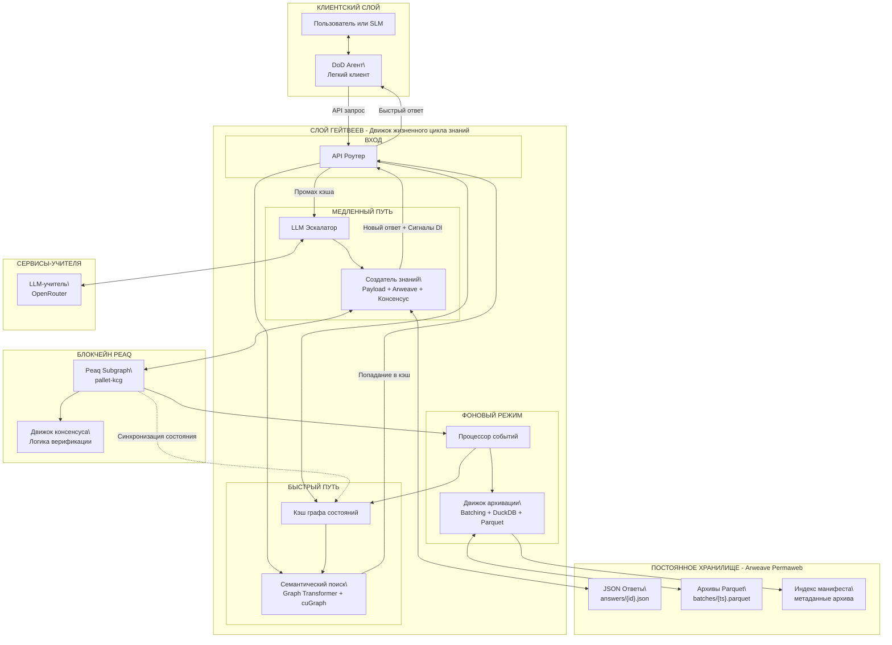

> Membria CE использует децентрализованный бэкенд для верификации, хранения и совместного использования артефактов знаний, которые выходят за рамки локальной уверенности. Этот бэкенд отделен от рантайма клиента и вызывается только при необходимости эскалации.

## Аннотация

Membria использует гибридную блокчейн-архитектуру, которая разделяет графовую логику и постоянное хранение данных. Протокол Peaq управляет транзакционной графовой логикой и консенсусом, в то время как Arweave хранит неизменяемые полезные данные (payloads). Система спроектирована для поддержки дистилляции по требованию (Distillation on Demand, DoD): результаты работы мощных LLM-учителей верифицируются, записываются как неизменяемые события и передаются обратно локальным моделям через генерацию с дополнением кэшем (CAG).

## 1: Ядро архитектуры — симбиотическая гибридная модель

Membria задействует две специализированные сети:

- Протокол Peaq: слой логики и графа.
- Arweave: слой постоянного хранения данных.

### Peaq Protocol — слой логики и графа

Peaq обрабатывает темпоральный семантический граф (Temporal Semantic Graph) как DAG (направленный ациклический граф) неизменяемых событий. Каждое событие подписывается и включает такие поля, как актор, метка времени и причина, создавая проверяемую историю.

### Arweave — слой постоянного хранения

Arweave хранит тяжелые полезные данные (верифицированные ответы, артефакты знаний). Peaq хранит легкие заголовки и ссылки на транзакции Arweave, чтобы операции в чейне оставались быстрыми.

### Общая схема

## 2: Децентрализованный граф знаний (DKG) — слои и компоненты

### Слой онтологии — гибкие словари

- Словари — это многоразовые коллекции концепций и отношений для конкретной области.
- Публичные словари (например, Schema.org) могут быть использованы повторно; поддерживаются приватные словари для кастомных доменов.
- Определения онтологий существуют как генезис-события в Peaq.

### Слой знаний — верифицированные ответы как цепочки событий

- Исполняемые семантические модели (Executable Semantic Models) определяют схему и правила валидации для каждого типа знаний.
- Верифицированные ответы хранятся как цепочки событий, связанных полями причин (cause), создавая полный аудиторский след.

## 3: Жизненный цикл знаний — пошаговый протокол

Система рассматривает эскалацию запроса как намерение «Запрос на дистилляцию знаний» (Knowledge Distillation Request).

### Шаг 1: Определение контракта знаний в Peaq

Эксперты развертывают исполняемую семантическую модель (BSL или эквивалент) как генезис-событие. Это определяет правила для валидных записей знаний.

### Шаг 2: Предложение новых знаний

DoD-агент получает ответ от LLM-учителя, записывает полезную нагрузку в Arweave и предлагает её в Peaq.

### Шаг 3: Консенсус гейтвеев

Гейтвеи проверяют предложение на соответствие контракту и голосуют через транзакции Peaq (пакетно, где это возможно).

### Шаг 4: Финализация результата

Событие валидации записывается в Peaq с финальным статусом и баллом уверенности. Этот результат возвращается клиенту вместе с **сигналами DI** (например, дельтой состояния убеждений для трекера POMDP) для обновления Decision Surface.

## 4: Протокол записи в Arweave

1. Запускается после ответа LLM-учителя и перед предложением в Peaq.
2. Полезная нагрузка собирается в формате JSON-LD для машиночитаемой семантики.
3. Создается и тегируется транзакция Arweave.
4. Транзакция подписывается и транслируется (допускается объединение в бандлы для снижения стоимости).
5. Arweave возвращает ArTxID.

## 10: Заключение

Arweave обеспечивает персистентность, а Peaq — логику и верификацию. Вместе они создают децентрализованный граф знаний, который доступен для аудита, эффективен по стоимости и может использоваться повторно на разных устройствах и разными пользователями.
