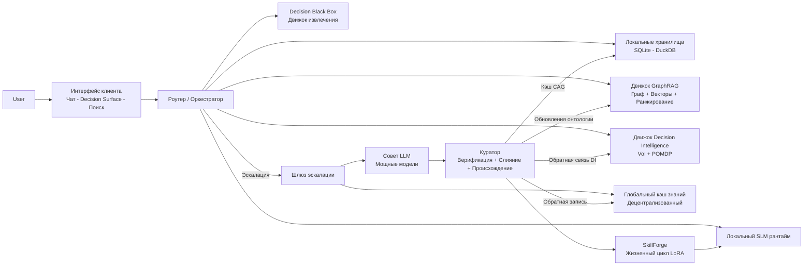
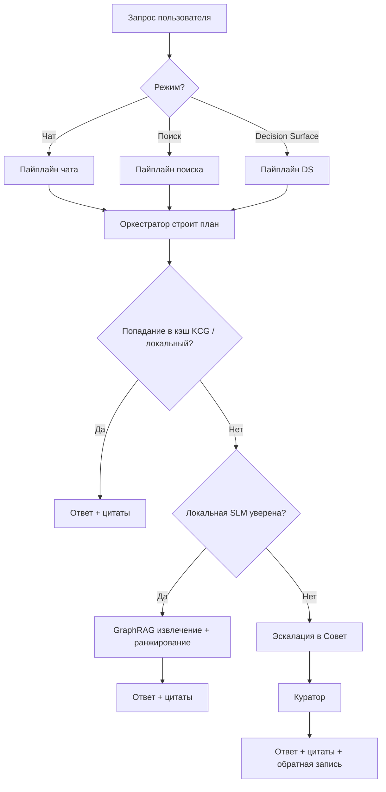
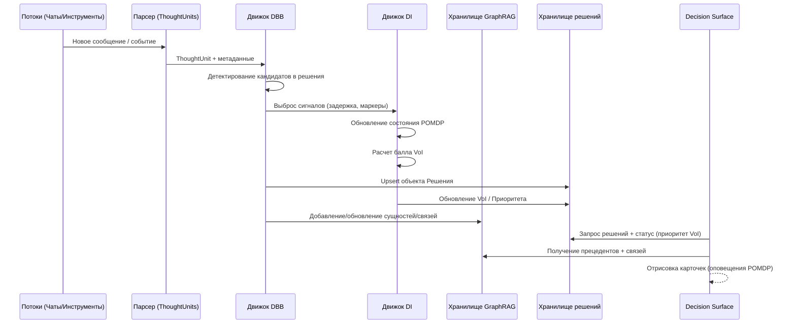
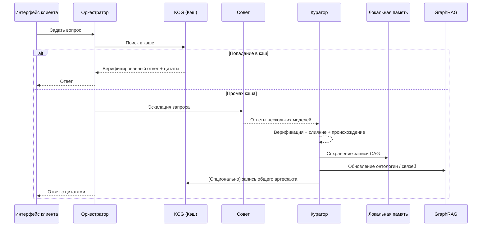
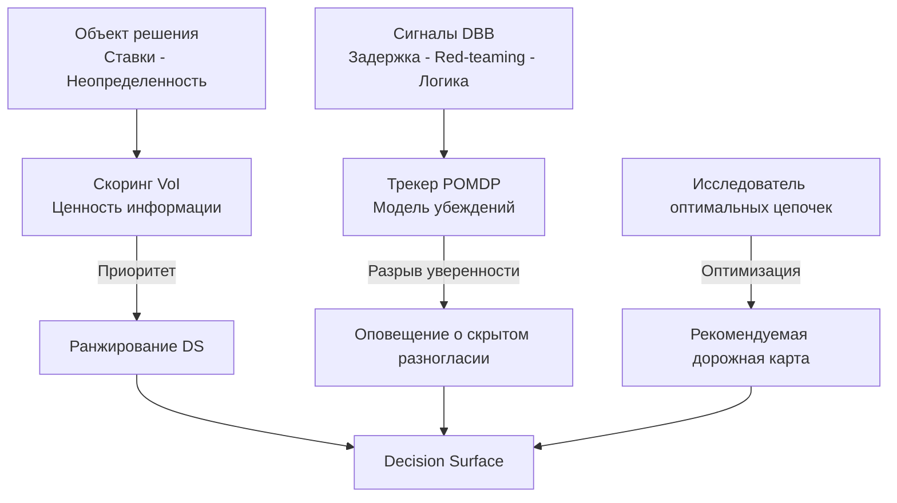

> Этот файл содержит справочные диаграммы для рантайма Membria CE.
> Все диаграммы используют Mermaid, поэтому они могут отображаться в пайплайнах GitHub/GitLab и в документации.

---

## 1) Обзор системы

---

## 2) Дерево принятия решений о маршрутизации запросов

---

## 3) Пайплайн индексации (холодный старт)

```mermaid
flowchart LR
  A["Источники (Drive - Email - Slack - Логи)"] --> B["Структурный парсинг (без тяжелых рассуждений)"]
  B --> C["ThoughtUnits (ts, автор, тред, uri, тип)"]
  C --> D[Дешевые эмбеддинги]
  D --> E[Семантическая кластеризация]
  E --> F["Скелет рассуждений (только форма)"]
  F --> G["Консервативные эвристики (флаги дрифта/стабильности)"]
  G --> H[Кандидаты DBB + обновления графа]
  H --> I[DS готов к отрисовке]
```

---

## 4) Жизненный цикл Decision Black Box (DBB)

---

## 5) Эскалация в Совет + цикл кэширования

---

## 6) Цикл Decision Intelligence

