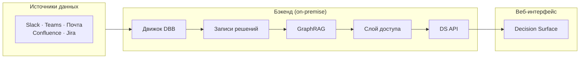

## Обзор

В Membria Enterprise Поверхность решений (Decision Surface) работает как централизованный бэкенд-сервис. Весь захват решений, хранение и рендеринг происходят на стороне сервера. Пользователи получают доступ к Decision Surface через тонкий веб-клиент, который отображает сигналы, отфильтрованные в соответствии с их ролью и областью доступа (scope).

В отличие от версии CE с локальным захватом на стороне клиента, развертывания Enterprise подключаются напрямую к корпоративным системам связи (Slack, Microsoft Teams, почта) и обрабатывают все сигналы решений внутри закрытого периметра (on-premise).

---

## Архитектура

---

## Роли и разрешения

Decision Surface для Enterprise поддерживает три уровня ролей с различными областями видимости.

### Рядовой сотрудник (IC - Middle / Senior)
Персональный дашборд для отслеживания личных решений. Видит свои сигналы (открытые петли, обязательства), дрейф собственных предположений и связанные решения коллег (только там, где он упомянут или есть зависимость).

### Директор / Тимлид
Агрегированный вид «здоровья» решений команды. Видит все, что видит сотрудник, плюс: общее количество сигналов по команде, список сотрудников по уровню нагрузки, граф зависимостей (кто кого блокирует) и оповещения, когда паттерны членов команды указывают на риск. Не видит деталей рассуждений других членов команды без необходимости.

### С-level / Владелец
Стратегический вид состояния решений в организации. Видит все, что видит директор, плюс: агрегаты по всей компании, кросс-командные зависимости, дрейф стратегических тем (ценообразование, найм, инфраструктура) и корреляцию с бизнес-метриками. По умолчанию не видит деталей индивидуальных рассуждений.

---

## Матрица видимости сигналов

| Сигнал | Видит сотрудник | Видит Директор | Видит C-level |
|--------|---------|---------------|--------------|
| Открытые петли | Свои (с деталями) | Команда (кол-во + владельцы) | Компания (кол-во по командам) |
| Обязательства | Свои (весь контекст) | Команда (список без деталей) | Компания (кол-во + просрочки) |
| Ожидающие решения | Свои (весь контекст) | Команда (старейшие, блокирующие) | Кросс-командные блокировки |
| Ранжирование VoI | Приоритет личных петель | Приоритет влияния на команду | **Стратегический рейтинг полезности** |
| Выравнивание (POMDP) | Н/Д | **Оповещения о скрытых расхождениях** | Дрейф выравнивания всей орг-и |
| Рассуждения | ✅ Только свои | ❌ | ❌ (кроме спец. триггеров) |
| Исходы | ✅ Свои | ✅ Команда | ✅ Компания |

---

## Стратегическое выравнивание (трекер POMDP)

Decision Surface использует модель **POMDP (Частично наблюдаемый марковский процесс принятия решений)** для выявления неявных разногласий или «скрытых расхождений» (Hidden Divergence) внутри команд — ситуаций, когда члены команды действуют на основе разных предположений, несмотря на формальный консенсус.

### Как это работает

Система анализирует записи решений членов команды на предмет:
1. **Бимодальности темы** — одна тема, расходящиеся подходы.
2. **Дрейфа предположений** — изменение лексики со временем без нового решения.
3. **Разрыва избыточности рассуждений** — члены команды соглашаются, но используют противоречивую логику.

### Метод обнаружения

**Движок Decision Intelligence** анализирует сигналы в различных доменах:
- **Симметрия задержки ответов** — обнаружение «поверхностного согласия» (слишком быстрые «+1»).
- **Метаданные скептицизма** — подсказки из red-teaming или уклончивых формулировок.
- **Оповещение о скрытом расхождении** генерируется для директора, когда уверенность в консенсусе падает ниже порога.

---

## Резюме

Decision Surface для Enterprise предоставляет:
- **Для сотрудников:** Персональный дашборд решений с полным контекстом.
- **Для директоров:** Мониторинг здоровья команды без микроменеджмента.
- **Для C-level:** Стратегическую видимость с возможностью детального изучения при соблюдении приватности.

Один интерфейс, одни и те же сигналы, разный масштаб — отфильтровано по роли, агрегировано по уровню, приватно по умолчанию.
