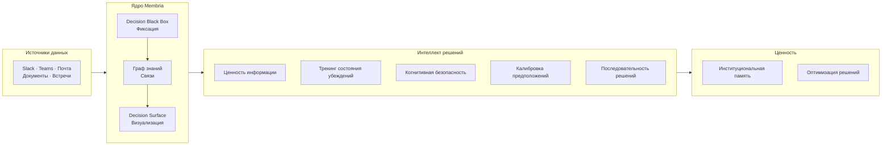

# Обзор технологий Membria (Membria Technology Overview)

> Институциональная память на базе ИИ для принятия более качественных решений.

## Что такое Membria

Membria — это Интеллектуальный слой персистентности (Smart Persistence Layer) для корпоративного ИИ. Она объединяет людей, команды и модели ИИ так, чтобы знания, рассуждения и решения не обнулялись после завершения диалога.

Большинство систем ИИ не имеют состояния (stateless). ИИ отвечает, забывает и начинает заново.

Membria — это недостающий слой: **персистентный интеллект принятия решений (persistent decision intelligence)**.

---

## Основная проблема

### «Черная дыра» решений (The Decision Black Hole)

Ежедневно команды принимают сотни решений в Slack, по электронной почте, на встречах и в документах. Через несколько недель:

- **Никто не помнит**, что именно было решено.
- **Контекст утерян** — почему мы выбрали именно это?
- **Результаты оторваны от реальности** — сработало ли это?
- **Одни и те же дискуссии повторяются**, тратя время и энергию.

Традиционное управление знаниями фиксирует документы, а не решения. Инструменты поиска находят информацию, а не логику рассуждений. ИИ-ассистенты отвечают на вопросы, но мгновенно забывают их.

### Цена проблемы

| Проблема | Влияние на бизнес |
|---------|-----------------|
| Повторное обсуждение решенных вопросов | Трата 15-20% времени совещаний |
| Утерянные обязательства | Нарушение сроков, подрыв доверия |
| Отсутствие отслеживания результатов | Повторение ошибок, отсутствие обучения |
| Потеря контекста при смене сотрудников | 3-6 месяцев на восстановление знаний |

---

## Решение Membria

### Интеллектуальный слой персистентности

Membria находится между вашими инструментами коммуникации и коллективным интеллектом вашей команды:



### Три основных компонента

#### 1. Decision Black Box (DBB)

Движок автоматической фиксации, который отслеживает коммуникации команды и извлекает:

- **Решения (Decisions)** — сделанный явный выбор.
- **Обязательства (Commitments)** — обещания с ответственными и сроками.
- **Предположения (Assumptions)** — основополагающие убеждения, стоящие за решениями.
- **Альтернативы (Alternatives)** — варианты, которые рассматривались и были отклонены.

DBB создает неизменяемые записи: оригинальная логика рассуждений сохраняется до того, как результаты (outcomes) смогут исказить память (предотвращение «искажения задним числом» — hindsight bias).

#### 2. Граф знаний (GraphRAG)

Объединяет решения в персистентную сеть рассуждений:

- **Временные связи** — как решения эволюционировали со временем.
- **Каузальные цепочки** — какие решения привели к каким результатам.
- **Зависимости** — что блокирует что.
- **Паттерны** — повторяющиеся типы решений и их результаты.

В отличие от документоориентированных баз знаний, граф Membria структурирован вокруг решений как объектов первого класса.

#### 3. Decision Surface (DS)

Живой дашборд решений команды, отображающий:

- **Открытые циклы (Open Loops)** — обсуждения без финала.
- **Обязательства (Commitments)** — данные обещания, приближающиеся дедлайны.
- **Решения на паузе (Decisions Pending)** — ожидающие согласования.
- **Дрейф предположений (Assumption Drift)** — контекст изменился, решение может быть неактуальным.
- **Трекинг результатов (Outcome Tracking)** — что сработало, а что нет.

---

## Глубокое погружение в Decision Surface

### Что отображается на дашборде

Decision Surface превращает необработанные данные в действенные сигналы:

| Сигнал | Описание | Пример |
|--------|-------------|---------|
| **Открытые циклы** | Дискуссии без явного финала | «Стратегия ценообразования обсуждалась 3 раза, решение не зафиксировано» |
| **Обязательства** | Обещания с ответственными и сроками | «@sarah: предоставить предложение к пятнице» |
| **Решения на паузе** | Приняты, но ждут одобрения | «Выбран новый вендор, ожидается подпись CFO» |
| **Дрейф предположений** | Тема та же, лексика изменилась | «В январе говорили о 'росте', в марте о 'сокращении затрат' — решения о смене курса нет» |
| **Блокировка** | Решения ждут завершения зависимостей | «Запуск заблокирован юридическим ревью (12 дней)» |
| **Скрытые разногласия** | Поверхностное согласие скрывает неуверенность | «Решение помечено как 'консенсус', но уверенность в убеждениях всего 40%» |

### Как это работает

Decision Surface не читает чаты напрямую. Он визуализирует только структурированные сигналы от Decision Black Box:

1. **Фиксация (Capture)** — DBB извлекает сигналы решений из диалогов.
2. **Структурирование (Structure)** — Сигналы становятся неизменяемыми записями решений.
3. **Связывание (Connect)** — Граф знаний связывает похожие решения.
4. **Отображение (Surface)** — DS показывает, что требует внимания прямо сейчас.

### Взаимодействие с пользователем

Decision Surface — это слой ревью и ориентации, а не менеджер задач:

- **Кликните** на любое решение для получения полного контекста.
- **Добавляйте** исходы, когда результаты становятся известны.
- **Помечайте** решения как замененные или решенные.
- **Связывайте** решения с новыми задачами или продолжением работы.

Обслуживание не требуется. Система обновляется автоматически.

---

## Слой интеллекта решений (Decision Intelligence Layer)

Помимо реактивного мониторинга, Membria добавляет прогностический и оптимизирующий интеллект на базе алгоритмов теории принятия решений.

### 1. Ценность информации (Value of Information, VoI)

**Функция:** Оценка «Открытых циклов» и «Решений на паузе» по степени их влияния в случае разрешения.

```
VoI(Decision D) = E[полезность | решение с доп. информацией]
                - E[полезность | решение без информации]
                - стоимость(сбора информации)
```

**Пример:**
```
Открытый цикл "Ценовая стратегия": VoI = $180k
  → Ошибка в цене: потеря выручки $180k в год
  → Сбор рыночных данных: стоит $5k, занимает 3 дня
  → Рекомендация: ПРИОРИТЕТ (высокое влияние, ясный ROI информации)

Открытый цикл "Формат встреч": VoI = $2k
  → Ошибка в формате: влияние на продуктивность $2k
  → Рекомендация: ОТЛОЖИТЬ (низкое влияние, решить позже)
```

**Преимущество:** Приоритизация решений по их влиянию, а не по срочности или должности. Дашборд говорит лидерам: «Разрешите цикл №7 в первую очередь — он стоит $180 000».

---

### 2. Трекинг состояния убеждений (POMDP)

**Функция:** Детекция «скрытых разногласий» — когда команда кажется согласной, но уверенность системы в этом низка.

**Принцип работы:**
- Извлекает сигналы из всех коммуникаций (явные согласия, молчание, уточняющие вопросы, противоречивые действия после обсуждения).
- Ведет распределение убеждений: P(истинный консенсус | наблюдаемые сигналы).
- Обновляет вероятности по мере поступления новых свидетельств.

**Пример:**
```
Решение: "Нанять 5 инженеров во втором квартале"
Наблюдаемые данные:
  - 3 явных "согласен"
  - 1 человек промолчал
  - 2 скептических уточняющих вопроса
  - 0 созданных вакансий или задач по найму

Распределение убеждений:
  - Истинный консенсус: 40%
  - Только поверхностное согласие: 35%
  - Фундаментальное непонимание: 25%

⚠️ Оповещение: Низкая уверенность в согласии команды (40%)
    Рекомендация: вернуться к явному обсуждению.
```

**Преимущество:** Предотвращение решений, которые *кажутся* принятыми, но провалятся при исполнении. Выявление разногласий до того, как они начнут стоить времени и доверия.

---

### 3. Калибровка предположений

**Функция:** Отслеживание уверенности в предположениях и обновление убеждений на основе реальных результатов.

**Принцип работы:**
- Каждое решение фиксирует уровень уверенности: «Мы на 75% уверены в этом вендоре».
- Позже фиксируется исход: «Вендор справился» или «Вендор подвел».
- Байесовское обновление: уверенность корректируется в соответствии с реальностью.
- Выявление паттернов: «Вы переоцениваете надежность вендоров на 15%».

**Пример:**
```
Предположение: "Вендор X надежен" (уверенность 75%)
Исходы за 12 месяцев:
  - 3 успешных проекта
  - 1 провал (нарушен дедлайн)

Обновленное убеждение: уверенность 76% (Бета-распределение: 4 успеха, 1 провал)
Паттерн: Уверенность была хорошо откалибрована.

vs.

Предположение: "Найм X будет успешным" (уверенность 85%)
Исходы за 12 месяцев:
  - 5 сотрудников уволились в течение 6 месяцев

Обновленное убеждение: уверенность 20%
Паттерн: Команда значительно переоценивает успех в решениях по найму.
```

**Преимущество:** Выявление систематических искажений (biases). Возможность тонкой настройки (LoRA) моделей принятия решений на основе реальных данных калибровки.

---

### [NEW] 4. Cognitive Safety Layer (Слой когнитивной безопасности)

**Функция:** Защита от когнитивных искажений (Bias) и галлюцинаций через "System 2 Thinking".

**Компоненты:**
1.  **Bias Firewall:** Проверка входящих решений на известные искажения (Confirmation Bias, Sunk Cost Fallacy).
2.  **Resonance Detection:** Если ИИ слишком быстро и уверенно соглашается с человеком (Resonance Score > 0.6) — это подозрительно. Система принудительно включает проверки.
3.  **Debiasing Interventions:** Активное вмешательство. Например, если обнаружено "якорение" (Anchoring), система предложит: "Рассмотрите 3 альтернативы перед утверждением".

**Преимущество:** ИИ не просто "кивает" человеку, а выступает в роли "Адвоката дьявола", повышая качество мышления.


---

### 4. Оптимизатор последовательности решений (Priority Queue)

**Функция:** Рекомендация оптимального порядка зависимых решений для минимизации блокировок на основе приоритетов и неопределенности.

**Принцип работы:**
- Анализирует граф зависимостей решений.
- Использует **Очередь с приоритетом (Priority Queue)** вместо MCTS-симуляций по умолчанию.
- Оценивает решения по формуле: `Score = (VoI * Срочность) / Длительность * Множитель_Неопределенности`.
- Рекомендует порядок, который максимизирует ценность (VoI) в единицу времени.

**Пример:**
```
Решения и зависимости:
  D1: Техстек → блокирует D2, D3, D4 (Score: 88)
  D5: Бюджет → блокирует D1, D6 (Score: 95 - Критический путь)
  D7: Выбор вендора → блокирует D8 (Score: 45)

Текущий подход (FIFO):
  D1 → заблокировано в ожидании D5 → общее время: 6 недель

Оптимизированная последовательность (Priority Queue):
  D5 (95) → D1 (88) → [D2, D3, D4, D6, D7 параллельно] → общее время: 3 недели

Рекомендация: Решите вопрос с бюджетом (D5) немедленно — критический блокиратор.
```

**Преимущество:** Быстрое и прозрачное устранение «бутылочных горлышек». Алгоритм понятен человеку и работает мгновенно.

---

### 5. Трекинг результатов и обучение в реальном времени

**Функция:** Связывание исходов с оригинальными решениями и их использование для улучшения будущих прогнозов.

**Принцип работы:**
- Когда исход решения становится известен, система фиксирует: прогноз vs реальность.
- Агрегирует данные калибровки по типам решений.
- Идентифицирует паттерны: какие команды хорошо калиброваны, какие решения систематически проваливаются.
- Настраивает скоринг уверенности на основе эмпирических данных.

**Пример:**
```
База данных решений:
  - Продуктовые решения: калибровка 87% (прогнозы совпадают с реальностью)
  - Решения по найму: калибровка 62% (избыточная уверенность)
  - Решения по вендорам: калибровка 91%

Калибровка команд:
  - Команда А: 84% (хорошая калибровка, их уровню уверенности можно доверять)
  - Команда Б: 71% (переоценивают успех примерно на 15%)

Обучение для будущих решений:
  - Когда Команда Б принимает решение с уверенностью 80%,
    система корректирует её до 65% на основе паттерна калибровки.
```

**Преимущество:** Команда учится на накопленных свидетельствах. Интеллект решений улучшается со временем через циклы обратной связи на основе данных.

---

## Принципы работы ИИ

### Интеллект на основе свидетельств

ИИ Membria следует строгим эпистемическим правилам. Все выводы подкрепляются прослеживаемыми свидетельствами:

**Формат:**
```
[Инсайт] → [Свидетельства: источники, даты, количество]
```

**Правильный пример:**
> «Проект X демонстрирует паттерн риска: 3 нарушенных обязательства, 2 изменения предположений, отсутствие обновленных решений в течение 30 дней».

**Неправильный пример:**
> «Команда не верит в Проект X».

### Чего ИИ никогда не делает
- Психологические догадки («чувствует разочарование», «демонстрирует отчужденность»).
- Личностные оценки («является блокиратором», «токсичный сотрудник»).
- Необоснованные предсказания («проект провалится»).

### Что ИИ делает всегда
- Ссылается на конкретные свидетельства.
- Использует осторожные формулировки («паттерн предполагает», «основываясь на данных за последние 14 дней»).
- Отделяет наблюдения от интерпретации.

---

## Корпоративные возможности

### Видимость на основе ролей

Разные роли видят разный масштаб на Decision Surface:

| Роль | Что видит | Чего не видит |
|------|------|-------------|
| **Рядовой сотрудник** | Свои решения, полный контекст, связанные решения | Логику рассуждений других людей |
| **Директор** | Агрегированные данные команды, паттерны, алерты | Детали рассуждений отдельных сотрудников |
| **C-level** | Метрики компании, зависимости между командами | Детали (кроме случаев активации триггеров) |

### Принципы приватности

1. **Рассуждения приватны** — только владелец решения видит процесс своих размышлений.
2. **Результаты общие** — исходы видны всей команде.
3. **Сигналы видимы** — каждый знает, что решение существует.
4. **Агрегация важнее обнажения** — лидеры видят паттерны, а не подноготную.
5. **Доступ по триггерам** — детальный просмотр требует обоснования.

### Детекция противоречий (Tensions Detection)

Автоматическое выявление скрытых разногласий в команде:

- **Бимодальный анализ** — одна тема, два противоположных подхода.
- **Дрейф предположений** — смена лексики без явного решения.
- **Противоречивые обязательства** — работа в разных направлениях над одной задачей.

Пример оповещения:
```
⚠️ Обнаружено противоречие: "План по найму на Q2"
Команда разделилась в подходах к реализации.
Явного решения, устраняющего разрыв, нет.
Рекомендация: вынести на открытое обсуждение.
```

### Аудит и комплаенс
- Неизменяемые записи решений с временными метками.
- Полная цепочка происхождения данных (источник → фиксация → решение).
- Воспроизводимый анализ (алгоритмы с фиксированным сидом).
- Экспорт данных для регуляторных требований.

---

## Варианты использования (Use Cases)

### Случай 1: Масштабирование стартапа (5 → 50 человек)

**Проблема:**
Ранние решения жили в головах фаундеров. По мере роста команды контекст терялся. Новые сотрудники принимали решения, противоречащие старым, сами того не зная.

**Решение:**
Membria фиксировала решения с первого дня. Когда пришел 30-й сотрудник, он смог увидеть:
- Почему был выбран именно этот техстек.
- Какие модели монетизации были отклонены и почему.
- Какие партнерства уже прорабатывались.

**Результат:**
- Время онбординга сократилось на 40%.
- Ноль моментов в стиле «мы это уже пробовали».
- Согласованность решений во всех командах.

---

### Случай 2: Синхронизация удаленной команды

**Проблема:**
Распределенная команда в 4 часовых поясах. Решения принимались в разных каналах Slack и никогда не консолидировались. Еженедельные планерки уходили на восстановление контекста.

**Решение:**
Decision Surface предоставил единый вид на все решения команды. Открытые циклы видны всем. Обязательства отслеживаются автоматически.

**Результат:**
- Совещания сократились с 60 до 25 минут.
- Показатель выполнения обязательств вырос на 35%.
- Вопросы «на чем мы остановились по X?» исчезли.

---

### Случай 3: Скорость продуктовой команды

**Проблема:**
Продуктовые решения разбросаны по Jira, Slack, Notion и почте. Менеджеры тратили часы на воссоздание истории решений для стейкхолдеров.

**Решение:**
Membria объединила все источники. Каждое решение по фиче связано с оригинальным обсуждением, рассмотренными альтернативами и результатом после релиза.

**Результат:**
- Время на «археологию решений»: с 2 часов до 5 минут.
- Рост доверия стейкхолдеров (прозрачный аудит).
- Ускорение пост-мортемов за счет полного контекста.

---

### Случай 4: Инвестиционный комитет

**Проблема:**
Инвестиционные решения принимались на встречах. Спустя месяцы было неясно, почему сделка была одобрена или отклонена. «Искажение задним числом» мешало обучению.

**Решение:**
DBB фиксировал логику до принятия решения с указанием уровней уверенности. Результаты привязывались позже без изменения оригинального тезиса.

**Результат:**
- Видимость реальной «точности попаданий» (а не воссозданной памяти).
- Детекция паттернов: «Мы переоцениваем родословную фаундеров».
- Точность прогнозов (калибровка) выросла на 20% за 18 месяцев.

---

### Случай 5: Комплаенс и аудит

**Проблема:**
В регулируемой отрасли требовалось документирование решений. Ручной процесс был непоследовательным, неполным и вызывал отвращение у команды.

**Решение:**
Membria автоматически фиксировала решения со всеми источниками. Неизменяемые записи удовлетворили требованиям аудита.

**Результат:**
- Время на подготовку к аудиту сократилось на 80%.
- Ноль пробелов в документации.
- Команда реально пользовалась системой (так как не было лишней работы).

---

### Случай 6: Интеграция при слияниях и поглощениях (M&A)

**Проблема:**
Покупающая компания должна была понять, как целевая компания принимала решения. Различия в культуре и процессах были неясны.

**Решение:**
Граф решений Membria раскрыл:
- Как на самом деле текли решения (в отличие от оргсхемы).
- Где реально находились центры влияния.
- Повторяющиеся противоречия и паттерны.

**Результат:**
- План интеграции на основе реальности, а не предположений.
- Ключевые лица, принимающие решения, идентифицированы и сохранены.
- Культурные разрывы устранены проактивно.

### Сценарий 7: Управление CLI-агентами (Claude Code) через Causal Layer

**Проблема: «Регрессия мудрости» и галлюцинации здравого смысла.**
CLI-агенты, такие как Claude Code, предлагают решения, основываясь на «общем здравом смысле» LLM. Но этот смысл часто противоречит реальному опыту конкретного проекта. Агент может предложить паттерн, который уже был отвергнут из-за сбоев в продакшене, тратя ресурсы на «Регрессию Мудрости».

**Решение: Membria CE как каузальный контроллер.**
Membria CE перехватывает предложения агента и проводит **Causal Conflict Check** (Проверку на каузальный конфликт) через FalkorDB:
1.  **Vector Match:** Сопоставляет вектор рассуждения агента с историческими предположениями в локальном графе.
2.  **Negative Artifact Collision:** Определяет, не совпадает ли предложение с артефактом «Негативного знания» (доказанным провалом).
3.  **Debias Intervention:** Membria выдает системное оповещение: *«Стоп. Твое рассуждение совпадает с гипотезой, которая оказалась ложной в PR #123 (Исход: регрессия производительности). Вес связи: 0.05. Пересмотри решение на основе каузальной памяти».*

**Результат:**
- **Защита от повторных ошибок:** Предотвращает ситуацию «дня сурка», когда агент повторяет прошлые ошибки проекта.
- **Детерминированные ограждения:** Заменяет догадки LLM структурными доказательствами из Графа Рассуждений.
- **Ускорение разработки:** Агенты тратят 0% времени на пути, которые уже были признаны тупиковыми.

---

## Техническая архитектура

Архитектура Membria спроектирована для высокопроизводительных рассуждений с использованием гибридного подхода к хранению.

#### Графовая память: FalkorDB
Ядро Графа рассуждений работает на базе **FalkorDB**, что обеспечивает:
- **Низкозадержечные обходы:** использование GraphBLAS для высокоскоростного анализа связей.
- **Язык запросов Cypher:** стандартизированный, высокопроизводительный доступ к цепочкам решений.
- **Redis-based персистентность:** сочетание скорости оперативной памяти с надежным хранением.

### Варианты развертывания

| Опция | Описание | Кому подходит |
|--------|-------------|----------|
| **SaaS** | Управляемое облако, мультиарендность | Малый бизнес, стартапы, удаленные команды |
| **Enterprise Cloud** | Выделенный инстанс | Средний бизнес, требования к локализации данных |
| **On-Premise** | Self-hosted, полный контроль | Банки, госсектор, регулируемые отрасли |

### Интеграции

**Коммуникации:**
- Slack
- Microsoft Teams
- Почта (Gmail, Outlook)
- Zoom (транскрипты встреч)

**Документация:**
- Notion
- Confluence
- Google Docs
- SharePoint

**Управление задачами:**
- Jira
- Linear
- Asana
- Monday

**Кастомные:**
- REST API
- Webhooks
- SSO (SAML, OIDC)

### Обработка данных

```mermaid
flowchart LR
    input["Сырые данные<br/>Чаты, доки, встречи"] --> extract["Извлечение DBB<br/>Сигналы решений"]
    extract --> structure["Структура<br/>Неизменяемые записи"]
    structure --> graph["GraphRAG<br/>Связи и индексация"]
    graph --> surface["Decision Surface<br/>Визуализация"]

    outcome["Результаты<br/>(добавляются позже)"] --> link["Связь с записью<br/>(только добавление)"]
    link --> graph

    graph --> voi["Ценность информации<br/>Вес влияния"]
    graph --> belief["Состояние убеждений<br/>Уверенность в консенсусе"]
    graph --> calib["Калибровка предположений<br/>Обновление убеждений"]
    graph --> seq["Последовательность решений<br/>Оптимизация порядка"]

    voi --> surface
    belief --> surface
    seq --> surface

    outcome --> calib
    calib --> learn["Модель обучения<br/>Паттерны калибровки"]
```

### Приватность и безопасность

- **Шифрование:** AES-256 при хранении, TLS 1.3 при передаче.
- **Контроль доступа:** На основе ролей (RBAC), логирование аудита.
- **Локализация данных:** Региональные опции (зависит от тарифа).
- **Комплаенс:** Спроектировано для работы в режиме SOC 2/GDPR/HIPAA-aligned (зависит от области внедрения).
- **Хранение:** Настраиваемые сроки хранения с безопасным удалением.

---

## Сравнение

### Membria против традиционных баз знаний (KM)

| Аспект | Традиционные KM | Membria |
|--------|----------------|---------|
| Единица хранения | Документ | Решение |
| Метод фиксации | Ручной | Автоматический |
| Структура | Папки/теги | Граф знаний |
| Трекинг результатов | Нет | Да |
| Защита от hindsight bias | Нет | Да |
| Показ нерешенных вопросов | Нет | Да |

### Membria против ИИ-ассистентов

| Аспект | ChatGPT / Copilot | Membria |
|--------|-------------------|---------|
| Память | В рамках диалога | Персистентная |
| Знает о ваших решениях | Нет | Да |
| Трекинг результатов | Нет | Да |
| На уровне всей команды | Нет | Да |
| На основе свидетельств | Иногда | Всегда |
| Приоритет по влиянию | Нет | Да (VoI) |
| Детекция разногласий | Нет | Да (POMDP) |
| Защита от Bias | Нет | Да (Safety Layer) |
| Обучение на калибровке | Нет | Да |
| Предложение порядка решений| Нет | Да (Priority Queue) |

### Membria против Task-менеджеров

| Аспект | Jira / Asana | Membria |
|--------|--------------|---------|
| Объект трекинга | Задачи | Решения |
| Фиксация логики (reasoning) | Нет | Да |
| Автодетекция из чатов | Нет | Да |
| Дрейф предположений | Нет | Да |
| Измерение качества решений | Нет | Да |
| Приоритет по VoI | Нет | Да |
| Скрытые разногласия | Нет | Да (POMDP) |
| Когнитивная безопасность | Нет | Да (Bias Firewall) |
| Обучение на калибровке | Нет | Да |
| Предложение порядка решений| Нет | Да (Priority Queue) |
| Обучение на данных | Нет | Да |

---

## С чего начать

### SaaS (для команд)

1. Зарегистрируйтесь на membria.ai
2. Подключите Slack или Teams
3. Пригласите членов команды
4. Decision Surface заполнится автоматически

Время до первой ценности: **< 1 часа**

### Enterprise

1. Свяжитесь с отделом продаж для выбора варианта развертывания.
2. Пройдите проверку безопасности и комплаенса.
3. Интегрируйте Membria с существующими инструментами.
4. Настройте роли и проведите обучение.
5. Запустите пилот в одной команде, затем масштабируйте.

Время внедрения: **2–4 недели**

---

## Резюме

**Membria — это институциональная память на базе ИИ, объединенная с интеллектом решений для принятия более качественного выбора.**

**Основные возможности:**
- **Автоматически фиксирует** решения из командных диалогов.
- **Сохраняет** логику до того, как результаты исказят память.
- **Связывает** решения в доступный для поиска граф знаний.
- **Выявляет** то, что требует внимания: открытые циклы, дрейф, блокировки.
- **Отслеживает** результаты для реального обучения команды.

**Слой интеллекта добавляет:**
- **Ценность информации (VoI):** Приоритет решений по влиянию, а не по срочности.
- **Трекинг убеждений:** Выявление скрытых разногласий до начала исполнения.
- **Калибровка предположений:** Определение наиболее точных команд и типов решений.
- **Последовательность решений:** Рекомендация оптимального порядка для снятия блокировок.
- **Обучение на исходах:** Улучшение качества решений через циклы обратной связи.

**Результат:** Команды помнят, что они решили, учатся на результатах, принимают умные решения быстрее и постоянно совершенствуются благодаря калибровке на основе данных.

---

## Узнать больше

- **Документация:** docs.membria.ai
- **API Reference:** api.membria.ai
- **Отдел продаж:** sales@membria.ai
- **Сообщество:** community.membria.ai

---

*Membria от Actiquest Labs — Персистентный интеллект принятия решений*
