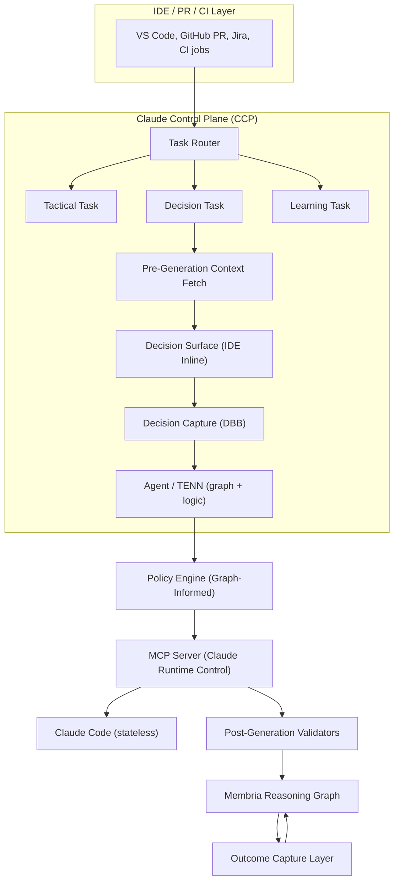

## Исполнительное резюме

Membria представляет **Архитектуру Суперагента**, которая трансформирует безголосовых генераторов кода (например, Claude Code) в **разработчиков с учетом принятых решений**, помнящих историю проекта, обучающихся на исходах и предотвращающих повторение ошибок командой.

**Ключевое ценностное предложение:**
- **Для разработчиков:** ИИ, который помнит, что сработало, а что нет.
- **Для команд:** Общая память, которая сохраняется при смене персонала и переключении контекста.
- **Для бюджетов:** Архитектура, которая минимизирует потребление токенов LLM.

---

## Проблема: ИИ без состояния в Vibe Coding

### Что такое Vibe Coding
Vibe coding — это описание желаемого результата на естественном языке и передача написания кода ИИ. Это отлично работает для разовых скриптов и прототипов, но дает сбой в долгосрочных проектах.

### Где возникают проблемы

| Ситуация | Что происходит |
|-----------|--------------|
| Проект живет > 1 недели | ИИ не помнит вчерашних решений |
| Несколько разработчиков | Нет общего контекста между членами команды |
| Возврат к коду через месяц | «Почему это написано именно так?» — никто не знает |
| Похожая проблема решена ранее | ИИ снова совершает ту же ошибку |
| Плохой подход уже пробовали | Нет памяти → команда пробует его снова |

### Первопричина
Текущие ИИ-помощники по кодингу не имеют состояния (**stateless**): каждый промпт обрабатывается независимо, без памяти о прошлых архитектурных решениях или «негативных знаниях» (том, что провалилось).

---

## Решение: Архитектура Суперагента Membria

### Вместо множества агентов (Multi-Agent)
Типичные мультиагентные системы (Orchestrator → Planner → Coder → Reviewer) сжигают **70 000+ токенов** на задачу, так как каждый агент получает избыточный полный контекст.

### Подход Membria: Один агент + Умный контекст
```
✅ MEMBRIA SUPERAGENT:

Запрос пользователя
    ↓
┌─────────────────────────────────┐
│  Запрос к графу Membria         │  ← Локально, 0 токенов
│  "Что релевантно для этого?"    │
└─────────────────────────────────┘
    ↓
[Только нужный контекст: ~2K токенов]
    ↓
┌─────────────────────────────────┐
│  Один вызов Claude Code         │  ← 6-10K токенов всего
│  С инъекцией контекста          │
└─────────────────────────────────┘
    ↓
Код + Авто-фиксация записи решения
```
**Результат: в 10 раз меньше токенов, персистентная память, предсказуемые затраты.**

---

## Архитектура



### Классификация Task Router

- **code_gen** -> тактическая (без фиксации решения)
- **architecture** -> решение (полный поток Membria)
- **refactor** -> решение (если структурное изменение)
- **debug** -> тактическая (если нет выбора корневой причины)
- **library_choice** -> решение (всегда)

**Decision signals:**
- "choose", "decide", "should we", "which is better"
- Упомянуто несколько альтернатив
- Архитектурные ключевые слова: "pattern", "structure", "design"

### Pre-Generation Context Fetch (Query Reasoning Graph)

- Прошлые решения по этому модулю
- Проваленные похожие предположения
- Калибровка команды по домену
- Оповещения о негативных знаниях

### Decision Surface (inline in IDE)

Показывает разработчику:
- Похожие прошлые решения
- Предупреждения о рисках
- Подсказки по калибровке
- Альтернативные варианты

Кнопки:
- [Proceed]
- [Review]
- [Override]

### Decision Capture (DBB)

Фиксирует:
- Statement
- Alternatives
- Confidence level
- Predicted outcome
- Context (immutable)

### Agent / TENN Execution Modes

- Tactical: прямое генерация кода
- Decision: генерация с внедренным контекстом
- Learning: связывает исход с историческим решением

### Policy Engine (Graph-Informed)

Статические правила:
- Политики безопасности (без хардкода секретов)
- Комплаенс требования (GDPR, SOC2)
- Code style enforcement

Динамические правила (из Reasoning Graph):
- Корректировки калибровки команды
- Порог уверенности по домену
- Применение негативных знаний

Resonance detection:
- Проверка совпадения bias человека и LLM
- Трение, если оба игнорируют один и тот же риск

### MCP Server (Claude Runtime Control)

- Инъекция контекста:
  - Контекст решения из фиксации
  - Негативные знания из графа
  - Предпочтения и паттерны команды
- Tool exposure:
  - Code generation tools
  - Graph query tools
  - Decision recording tools
- Mode enforcement:
  - Tactical mode: минимальный контекст
  - Decision mode: полный контекст
- Output schema validation

### Post-Generation Validators

Bias detection in output:
- Anchoring: чрезмерный фокус на первой опции в комментариях коду
- Confirmation: игнорирование заявленных альтернатив
- Overconfidence: "definitely", "always works", "no issues"

Consistency checks:
- Код соответствует зафиксированному решению?
- Негативные знания соблюдены?
- Альтернативы действительно рассмотрены в реализации?

Validation failures:
- Логировать для калибровки (не блокировать)
- Уведомлять при критичности (security, compliance)

### Membria Reasoning Graph (Decision Record)

```
decision_id: dec_142
statement: "Use Fastify for REST API"
alternatives: ["Express.js", "Koa", "Custom"]
confidence: 0.60
predicted_outcome: "Stable API, good performance"
assumptions: ["Fastify handles our load", "Team knows it"]
context_hash: "abc123..." (immutable)
status: PENDING_OUTCOME
linked_pr: null -> PR#234 (when created)
linked_commit: null -> commit_sha (when merged)
```

Relationships:
- RELIES_ON: assumptions
- BLOCKS: dependent decisions
- SUPERSEDES: previous decisions on same topic
- CAUSED_BY: parent architectural decisions

### Outcome Capture Layer (Commitment Events)

| Source | Event | Outcome Signal |
|--------|-------|----------------|
| GitHub | PR merged | Decision executed |
| GitHub | PR closed (no merge) | Decision abandoned |
| CI/CD | Tests pass | Positive signal |
| CI/CD | Tests fail | Negative signal |
| CI/CD | Build fail | Negative signal |
| PagerDuty | Incident created | Strong negative |
| Jira | Bug linked to PR | Negative signal |
| Time | 30 days stable | Positive outcome |
| Time | 90 days stable | Strong positive outcome |

Calibration update:
- Compare predicted_outcome vs actual_outcome
- Update team calibration profile
- Update domain-specific calibration
- Generate LoRA candidate if systematic gap detected

## Результаты Vibe Coding

### 1. Меньше циклов «Генерация → Ошибка → Переделка»
**Без Membria:** Claude генерирует кастомный middleware → PR проваливает проверку безопасности → Переделка → Потеряно 2 дня.
**С Membria:** Claude получает контекст *"Избегать кастомного auth middleware (Негативное знание)"* → Генерирует правильный код, используя стандартные библиотеки (например, passport.js).
**Итог: Сокращение времени на переделку на 60%.**

### 2. Код остается понятным спустя месяц
Membria связывает выбор кода с конкретными Записями Решений. Вам не нужно гадать, почему был выбран Fastify вместо Express; причина в Графе.
**Итог: Самодокументируемая кодовая база.**

### 3. ИИ перестает повторять ошибки
Когда баг исправлен, Membria записывает его как «Негативное знание». В следующий раз, когда Claude сгенерирует похожий код, он получит контекст, запрещающий этот паттерн.
**Итог: Обучение на ошибках, специфичных для проекта.**

### 4. Никаких больше «А давайте попробуем это» без последствий
Membria проверяет Граф: «Пробовали ли мы эту библиотеку 2 месяца назад? Да. Она провалилась из-за X. **Не повторять.**»
**Итог: Команда помнит, что уже пробовали.**

### 5. Более быстрый онбординг
Новые разработчики мгновенно видят, **почему** архитектура выглядит именно так, просматривая эволюцию Decision Graph, и уменьшают потерю контекста.
**Итог: Время онбординга сокращено на 50%.**

### 6. Уверенность в сгенерированном коде
Membria показывает исторические показатели успеха/провала для похожих паттернов, используемых командой, что повышает уверенность разработчика при принятии сгенерированного кода.

---

## Экономика токенов: Суперагент vs Мультиагент

### Сравнение по задачам

| Аспект | Система Мультиагентов | Суперагент Membria |
|--------|----------------------|-------------------|
| **Архитектура** | N агентов × полный контекст | 1 агент × умный контекст |
| **Токенов на задачу** | 70,000+ | 6,000-10,000 |
| **Рост токенов** | O(n²) | O(1) |
| **Память** | Отсутствует | Персистентная (Граф) |
| **Структура затрат** | Зависит от использования, непредсказуема | Фиксированная подписка |

**Вендоры мультиагентных систем хотят, чтобы вы использовали БОЛЬШЕ агентов. Membria хочет, чтобы вы использовали ЛУЧШИЙ контекст, чтобы сэкономить токены.**

---

## Итог

Архитектура **Мультиагентов** решает задачу «как разделить работу», создавая новую проблему: фрагментацию контекста. **Membria Superagent** решает коренную проблему: **предоставление одному агенту правильного контекста.**

**Vibe coding перестает быть «генерацией с нуля каждый раз» и становится «генерацией с памятью проекта».**
---
